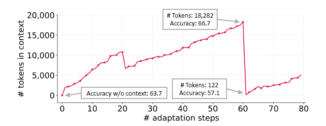
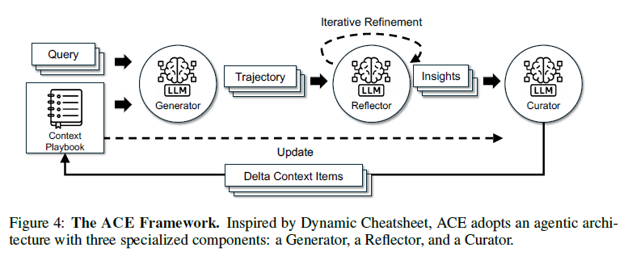

# AGENTIC CONTEXT ENGINEERING

- Self Evolving
- **도메인에 특화된 Agent들은 저장하는 방법을 달리해야한다.**
- Published as a conference paper at ICLR 2026
- 코드 : https://github.com/ace-agent/ace
  - 어쩌면 그냥 성찰할 때 이거 가져다 써도 될라나? 어차피 계속 업데이트도 안될거 같아 보여서 커스텀 해도 될거 같기도 한데..

## 초록

- 간결한 요약을 위해 도메인 통찰을 버리는 간결성 편향 (brevity bias) 발생 
- 반복 재작성에서 시간이 갈수록 세부사항이 침식되는 컨텍스트 붕괴 (context collapse) 발생
- 생성·성찰·큐레이션의 모듈식 과정과 구조화된 점진적 갱신으로 붕괴를 막고, 상세 지식을 보존하며 장문 컨텍스트 모델과 함께 확장
- 에이전트에서 10.6%, 금융에서 8.6% 향상 > 도메인 특화에 최적화가 가능한건가?
  -  (1) 다중 턴 추론·도구 사용·환경 상호작용이 필요하며 축적 전략을 에피소드 간 재사용할 수 있는 에이전트(AppWorld)
  - (2) 금융 분석처럼 특수 전술과 지식이 필요한 도메인 특화 벤치마크
- 적응 지연 시간과 rollout 비용 감소
- 컨텍스트가 짧은 요약이 아니라 상세하고 포괄적이며 도메인 통찰이 풍부한 구조화된 **플레이북(playbook)** 으로 기능해야 한다고 주장
- LLM은 길고 상세한 컨텍스트를 받을 때 더 효과적이며, 추론 시 관련성을 자율적으로 증류가 가능
- 컨텍스트를 압축 요약이 아닌, 시간이 지나며 전략을 축적하고 조직하는 진화하는 플레이북으로 취급

## 내용

### 기존 컨텍스트의 한계

- **간결성 편향**
  - 최적화가 짧고 일반적인 프롬프트로 수렴하는 경향
  -  다양성을 희생하고 도메인 세부사항을 빠뜨리는 현상을 기록
  - 다단계 에이전트, 프로그램 합성, 지식 집약적 추론처럼 과업 특화 통찰을 압축하는 대신 축적해야 하는 영역에서는 특히 성능을 해친다. >> 도메인이 중요한 곳에서는 축적을 해야한다는 뜻 (요약x)
- **컨텍스트 붕괴**
  - 매 적응 단계마다 축적 컨텍스트 전체를 다시 쓰도록 LLM에 요구할 때 발생하는 컨텍스트 붕괴를 관찰
  - 컨텍스트가 커질수록 **모델은 이를 매우 짧고 정보량이 적은 요약으로 압축하는 경향**이 있고, 정보가 극적으로 손실
    - 모든 모델이 그럴까? 일단 DeepSeek v3는 그런듯?
  -  정확도가 57.1로 떨어졌는데, 이는 적응이 없는 baseline 63.7보다 낮다.

### Agentic Context Engineering(ACE)

한 모델에 모든 책임을 과적재하는 병목을 피한다.

- Generator : 추론 궤적 생성 >> 개인적으로 이부분이 어떻게 동작하는지 궁금
- Reflector : 성공, 오류에서 구체적 통찰을 증류
- Curator : 통찰을 구조화된 컨텍스트로 갱신 및 통합

- 아키택처
  -  평가·통찰 추출을 큐레이션과 분리해 컨텍스트 품질과 하류 성능을 높이는 전용 Reflector
  - 비용 큰 단일 전체 재작성 대신 국소 편집을 수행해 지연 시간과 계산 비용을 줄이는 점진적 delta 갱신
  - 안정적 컨텍스트 확장과 중복 제어의 균형을 잡는 grow-and-refine 메커니즘
- 흐름 
  - Query → Generator → Trajectory → Reflector → Insights → Curator → Delta Context Items → Update → Context Playbook

**점진적 delta 갱신**

- 설계 원칙
  - 하나의 단일 프롬프트가 아니라 구조화되고 항목화된 bullet들의 모음으로 나타내는 것
  - 프롬프트 전체를 매번 새로 요약해서 쓰지 말고, 작은 지식 카드 (bullet) 단위로 조금씩 고치자
    - bullet의 크기와 단위가 무엇이지? 
      - **이런 부분들이 정확하지 않고, 애초에 뭐가 도움이 됐고, 도움이 되지 않았는지에 대해서 판단할 수가 없다. 물론 사용자의 다음 답변으로 어느정도 유추는 할 수 있겠지만 살짝 무리일 것으로 보임 (애초에 평가 시스템을 구축하는건 또 다른 문제이기 때문)**
      - **따라서 이부분에선 내가 생각하기엔 쪼개놓은 주제에서 각 sub topic을 쪼개놨고, 필요한 부분만 변경하는 부분만 적용가능하지 않을까 싶고, 이부분이 과연 얼마나 도움이 될지는 판단이 더 필요할 것으로 보임** 
    - 고유 식별자와 helpful/harmful 표시 횟수 같은 메타데이터
    - 재사용 전략·도메인 개념·흔한 실패 양상 같은 작은 내용 단위
  - 새 문제를 풀 때 Generator는 어느 bullet이 유용했거나 오보했는지 표시하고, 이 피드백이 Reflector가 교정 갱신을 제안하도록 안내
    - 일단 이게 유용했는지 아닌지 어떻게 판단해? 이건 사용자가 직접 판단해줘야하는 부분 아냐? 

- 성질
  1. **국소성**: 관련 bullet만 갱신한다.
  2. **세밀한 검색**: Generator가 가장 관련된 지식에 집중
  3. **점진 적응**: 추론 중 효율적 병합·pruning·중복 제거

- Reflector가 증류하고 Curator가 통합하는 작은 후보 bullet 집합인 압축된 delta context를 점진적으로 생성
- 이는 전체 재작성의 계산 비용과 지연 시간을 피하면서 기존 지식 보존과 새 통찰의 안정적 추가를 보장

**Grow-and-refine**

- 지연된 refinement로 컨텍스트를 압축적이고 관련성 있게 유지
- **새로운 내용이면 ADD, 기존 내용은 counting 증가 등**
- **추후에 중복 내용은 삭제하고 통합하는 과정을 거침** >> 핵심 : 요약을 하지 않는다는 점
  - 즉 일단 새로운 곳에서 가져온 내용은 일단 저장하고 나중에 성찰할 때 삭제하든 통합하든 그때 진행함
- 이거 하는 시기는 알아서 해라
- row-and-refine은 적응적으로 확장하면서 해석 가능하고, 단일 컨텍스트 재작성이 일으키는 잠재적 분산을 피하는 컨텍스트를 유지 >> 이게 목표

  “주기적 또는 지연된 refinement”는 정리 시점을 뜻합니다.

  - 선제적 방식: delta 하나를 반영할 때마다 바로 중복을 검사한다.
    → 플레이북이 항상 깔끔하지만, 매번 비교하므로 비용과 지연이 든다.

  - 지연 방식: bullet을 일단 쌓아 두고, 컨텍스트가 너무 길어졌을 때만 한꺼
    번에 정리한다.
    → 당장 빠르지만, 정리 전까지 중복 bullet이 남아 있을 수 있다.

## 결과

- **도메인 특화 벤치마크의 큰 향상**: 복잡한 금융 추론에서 도메인 특화 개념·통찰을 담은 포괄적 플레이북을 구성하여 강한 baseline보다 평균 8.6% 개선

### 4.4 도메인 특화 벤치마크 결과

> 표 2. 금융 분석 벤치마크 결과(`DeepSeek-V3.1-671B` base LLM)

| 설정 / 방법       | GT Labels |      FiNER Acc. |     Formula Acc. |             평균 |
| ----------------- | :-------: | --------------: | ---------------: | ---------------: |
| Base LLM          |     —     |            70.7 |             67.5 |             69.1 |
| **오프라인** ICL  |     ✓     |     72.3 (+1.6) |      67.0 (-0.5) |      69.6 (+0.5) |
| MIPROv2           |     ✓     |     72.4 (+1.7) |      69.5 (+2.0) |      70.9 (+1.8) |
| GEPA              |     ✓     |     73.5 (+2.8) |      71.5 (+4.0) |      72.5 (+3.4) |
| ACE               |     ✓     | **78.3 (+7.6)** | **85.5 (+18.0)** | **81.9 (+12.8)** |
| ACE               |     ✗     |     71.1 (+0.4) |     83.0 (+15.5) |      77.1 (+8.0) |
| **온라인** DC(CU) |     ✓     |     74.2 (+3.5) |      69.5 (+2.0) |      71.8 (+2.7) |
| DC(CU)            |     ✗     |     68.3 (-2.4) |      62.5 (-5.0) |      65.4 (-3.7) |
| ACE               |     ✓     |     76.7 (+6.0) |      76.5 (+9.0) |      76.6 (+7.5) |
| ACE               |     ✗     |     67.3 (-3.4) |     78.5 (+11.0) |      72.9 (+3.8) |

- GT label이 있는 조건: 정확한 정답 비교가 가능하므로, 실패 원인과 새
  bullet을 비교적 신뢰성 있게 만들 수 있다.
  - GT label은 없지만 실행 피드백이 있는 조건: API 오류, 테스트 실패, 환경
    상태처럼 외부 결과를 이용해 어느 정도 학습할 수 있다.

  - 둘 다 없는 조건: ACE가 새 지식을 안전하게 추가할 근거가 약하다. 잘못된
    자기반성을 플레이북에 넣어 오염시킬 수 있다.
    
  - ACE는 코드 실행 결과나 formula 정답처럼 풍부한 피드백에는 좋지만, Reflector와 Curator가 타당한 판단을 내릴 신호가 있어야 한다.
    - **GT label을 애초에 어떻게 구해...?**
    - **애초에 GT label이 없으면 성능이 떨어지는데?**
    - 유지만 할 수 있으면 되는건가? 왜냐하면 사실상 중복 내용을 삭제하고, 기억을 재구성하는 거니깐? 

- 