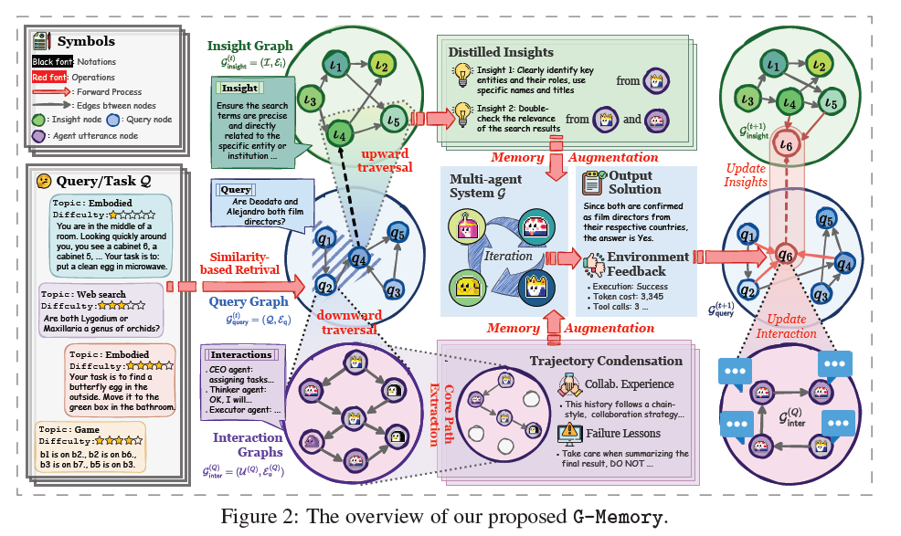

# G-Memory

- MAS : Multi Agent System

- MAS 전용 memory가 필요하다.

- **핵심 질문:** agent team이 간결하고 교훈적인 경험·insight에서 이득을 얻도록, MAS의 길고 복잡한 interaction history를 저장·검색·관리하는 memory mechanism은 어떻게 설계할 수 있는가?

- 근데 왜 굳이....graph를 썼지? graph 안썼을 때는 성능이 안나올까?

  

## 초록

- insight graph, query graph, interaction graph의 3단 graph hierarchy로 관리
- 질의가 오면 memory traversal을 수행 > trial 간 지식을 활용할 수 있는 상위·일반화 가능한 insight와 이전 협업 경험을 압축해 부호화한 세밀한 interaction trajectory를 함께 검색
- 

## 내용

### G-Memory

- 계층
  - **Insight Graph:** 이전의 경험에서 일반화 가능한 insight를 추상화한다.
  - **Query Graph:** task query의 meta-information과 query 간 연결성을 부호화한다.
  - **Interaction Graph:** agent 사이의 세밀한 textual communication log를 저장한다.
- 흐름
  - 새 query가 오면 query graph topology로 관련 query record를 효율적으로 검색
  - query→insight graph : 상위 collective cognitive insight를 얻는다.
  - query→interaction graph 방향으로 내려가 현재 task에 가장 관련 있는 핵심 interaction subgraph를 찾는다
  - 검색한 memory는 분업, task decomposition, 과거 실패의 교훈처럼 MAS에 행동 가능한 지침을 준다
  - task 종료 뒤에는 새로 증류한 insight, 풍부해진 query record, 상세 MAS trajectory 및 계층 간 연결을 모두 agentic하게 갱신

### Coarse-grained Memory Retrieval

- opology로 관련 query record를 효율적으로 검색
- 지식 retrieval은 보통 세밀한 접근보다 폭넓게 관련 있는 schema에서 시작
-  G-Memory는 query graph $G_{query}$ 에서 similarity-based retrieval을 먼저 수행해 query의 sketch set 을 얻는다
- 유사한 역사적 query를 찾지만, 그 유사성은 피상적이거나 noisy할 수 있다. 그래서 G-Memory는 query graph에서 $Q_S$ 의 1-hop neighbor를 더해 관련 집합을 확장
  - vector db 찾고, 한번 더 찾는다는 뜻인듯

### Bi-directional Memory Traversal

> - 비슷한 과거 작업을 찾음
> - 그 작업들에서 교훈?을 찾음
> - 실제 협업 대화 중 중요한 부분을 압축해서 가져옴
> - 각 agent의 역할에 맞춰 다르게 제공

- 양방향으로 값을 꺼낸다는 뜻
  - query→insight graph
    - 이전의 경험에서 일반화 가능한 insight를 추상화
  - query→interaction graph
    - agent들 끼리의 관계 >> 실제 협업 과정 및 내용
  - 이 두가지 기억을 각 agent의 역할에 맞게 나눠준다.
- 즉 과거에 비슷한 작업을 했을 경우
  - **과거에서 뽑힌 일반 원칙 (이전 지시사항) + 다른 agent들끼리 협업을 누구랑 했는지 확인**

  같은 과거 경험이라도 agent마다 필요한 정보가 다르기 때문

  - 계획 agent: “먼저 상태를 확인한 뒤 행동 순서를 세워라”라는 일반 원칙
  - 실행 agent: 실제로 어떤 순서로 도구를 사용했는지
  - 검토 agent: 과거에 어떤 실수를 했고 누가 어떻게 잡아냈는지

### Hierarchy Memory Update

- 이번 작업의 경헙을 다시 G-Memory에 저장하는 과정
- 이것도 성공한 답변인지 실패한 답변인지를 따로 평가를 해줘야함 (흠.....별론데?)
- Interaction level: 원본 협업 기록 저장
  - 이번 문제에서 누가 무엇을 말했고, 어떤 말이 다음 판단에 영향을 주었는가?”라는 협업 로그를 저장
- Query level: 이번 작업을 과거 작업 그래프에 연결
  - 새 query node q_new에는 세 가지를 묶어 저장
    - 사용자 질문, 성공/실패 상태, 실제 협업 내용
- Insight level:
  - 협업 기록을 한 단계 추상화해 새 insight를 만드는 과정
  - 협업 기록과 성공/실패 결과를 요약·해석
  - 새로 만든 일반화된 교훈
  - 그 교훈의 근거가 된 이번 작업

## 결론

- 내가 보기엔 너무 복잡함 > 기억을 세분화하는 건 좋은 접근인거 같은데 그것의 관계까지 가져가게 되면  많이 복잡해짐. 그리고 심지어 동적으로 Agent가 대화한 것으로 가져가자는 뜻인거 같은데 update 한번 잘못되면 각각의 agent의 의존성이 너무 커져서 그냥 되돌릴 수 없으며, 그냥 지우고 다시 만들어야할 듯?
  - 그리고 실제 결과에서  Framework 분석(RQ3)을 보면  과도한 hop expansion은 upward traversal 때 task와 무관한 insight를 넣어 reasoning을 방해할 수 있다고 한거 보면 복잡도가 높아질수록 insigt 부분의 관리가 힘들어진다고 보는게 맞을지도?

### 주요 결과(RQ1)

*표 1. `gpt-4o-mini`에서 5 benchmark 성능 비교.** 수치는 평균±표준편차(%)이며 마지막 열은 평균이다.

| MAS     | Memory       |       ALFWorld |       SciWorld |           PDDL |       HotpotQA |          FEVER |           Avg. |
| ------- | ------------ | -------------: | -------------: | -------------: | -------------: | -------------: | -------------: |
| AutoGen | No-memory    |     77.61±0.00 |     54.49±0.00 |     23.53±0.00 |     28.57±0.00 |     57.13±0.00 |     48.27±0.00 |
|         | Voyager      |     85.07±0.46 |     62.36±0.87 |     24.56±0.03 |     32.32±0.75 |     63.27±0.14 |     53.52±0.25 |
|         | MemoryBank   |     74.96±0.65 |     53.11±0.38 |     20.41±0.12 |     33.67±0.10 |     61.22±0.09 |     48.67±0.40 |
|         | Generative   |     86.36±0.75 |     61.19±0.70 |     25.53±0.00 |     31.63±0.06 |     60.20±0.07 |     52.98±0.71 |
|         | MetaGPT-M    |     81.34±0.73 |     61.91±0.42 |     21.63±0.90 |     32.67±0.10 |     62.67±0.54 |     52.04±0.77 |
|         | ChatDev-M    |     79.85±0.24 |     50.96±0.53 |     16.65±0.88 |     24.49±0.08 |     59.18±0.05 |     46.23±0.04 |
|         | MacNet-M     |     76.55±0.06 |     55.44±0.95 |     22.94±0.59 |     28.36±0.21 |     60.87±0.74 |     48.83±0.56 |
|         | **G-Memory** | **88.81±1.20** | **67.40±2.91** | **27.77±0.24** | **35.67±0.10** | **66.24±0.11** | **57.18±0.91** |
| DyLAN   | No-memory    |          56.72 |          55.38 |          11.62 |          31.69 |          60.20 |          43.12 |
|         | **G-Memory** | **70.90±4.18** | **65.64±0.26** | **18.95±0.33** | **34.69±0.00** | **64.22±0.02** | **50.88±0.76** |
| MacNet  | No-memory    |          51.49 |          57.53 |          12.18 |          28.57 |          60.29 |          42.01 |
|         | **G-Memory** | **67.16±5.67** | **68.11±0.58** | **24.33±2.15** | **35.69±0.12** | **64.44±0.15** | **51.95±0.94** |

비용 분석(RQ2)

- 과도한 token 소비 없이 high-performing collective memory를 달성

 Framework 분석(RQ3)

- 1-hop이 일관되게 최고 또는 근접 최고 성능을 냈다(AutoGen에서 ALFWorld 85.82%, PDDL 55.24%). 2-hop·3-hop은 성능을 낮음.
- 2-hop에서 49.79%로 떨어진다. 과도한 hop expansion은 upward traversal 때 task와 무관한 insight를 넣어 reasoning을 방해할 수 있다. 

