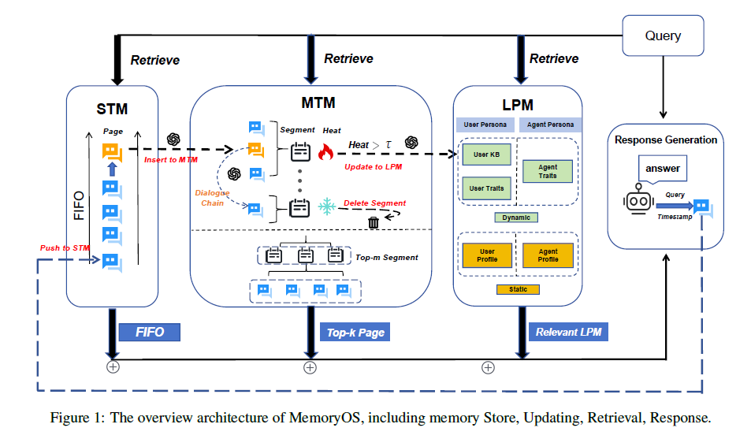

# MemoryOS

## 초록

GPT-4o-mini 기준으로 베이스라인 대비 평균 F1 49.11%, BLEU-1 46.18% 향상을 보여 긴 대화에서의 맥락적 일관성과 개인화된 기억 유지 능력을 입증

- 메모리의 주된 이유 : 개인화
- 계층형 저장 아키택처
  - STM / MTM / LPM >> 나는 이 기준이 궁금함
  - STM > MTM: FIFO 사용
  - MTM > LPM : a segmented page organization strategy 사용 (?? 이게 뭔데?)
- Memory Storage(Save), Updating(Update), Retrieval(Select), Generation(Create)의 네 핵심 모듈로 구성
-  F1은 평균 49.11%, BLEU-1은 평균 46.18% 개선되었으며, 긴 대화에서 맥락 일관성과 개인화된 기억 보존을 보였다. 
- 구현 코드 : https://github.com/BAI-LAB/MemoryOS

## 내용

### 전체 아키택처

- 궁금 한 것
  - FIFO는 몇까지 넣게 되는거지?
- Memory Storage
  - STM : 즉시성 있는 대화
  - MTM : 반복되는 주제의 요약
  - LPM : 사용자 또는 에이전트 선호도
- Memory Updating
  - STM > MTM 
    - 대화 체인 FIFO로 갱신
  - MTM  > LPM 
    -  heat 기반 교체를 갖춘 세그먼트 페이지 전략
- Memory Retrieval
  - MTM : 의미 관련성으로 세그먼트를 식별 + 관련 대화 페이즈를 검색함
  - LPM : 페르소나 속성 + STM의 맥락 정보를 결합
- Response Generation
  - STM, MTM, LPM의 검색 결과를 하나의 일관된 프롬프트에 통합하여, 맥락적으로 일관되고 개인화된 응답 생성

### Memory Storage

- 궁금 
  - 일단 페이지의 정의가 뭐지? 

- **STM**
  - 실시간 대화 데이터를 저장
  - 맥락 일관성을 보장하기 위해 각 페이지에는 대화 체인을 구성 (Dialogue Chain)
  - 메타 정보는 LLM이 두 단계로 생성한다
    1. 새 페이지가 이전 페이지와 맥락상 관련되는지 평가하여 체인 연결 여부를 정하고, 의미적으로 불연속이면 현재 페이지부터 체인을 다시 시작한다. 
    2. 속한 모든 페이지를 요약한다.

- **MTM**
  - 같은 주제의 대화 페이지를 세그먼트로 묶는다.
  - 각 세그먼트는 하나의 고유 주제에 관한 여러 페이지를 담는다.
  - 의미 유사도(Dense Vector)와 키워드 유사도(Sparse Vector)를 모두 바탕으로 대화 페이지와 세그먼트 사이의 유사도를 측정
  
- **LPM**
  - 개인 상세 정보와 특성을 지속적으로 기억하게 해, 장기 상호작용에서도 일관성과 개인화
  - LPM은 User Persona와 AI Agent Persona의 두 구성 요소로 이루어진다.
  - User Persona 
    - **(우리쪽도 이렇게 3가지 카테고리로 크게 구분할 필요있음 (Template을 만들자))**
    - 성별·이름·출생 연도 같은 고정 속성으로 이루어진 **정적 구성 요소**
    - 과거 상호작용에서 **추출한 사실 정보**를 동적으로 저장하고 점진적으로 갱신하는 **User Knowledge Base(User KB)**
    - 시간에 따라 변화하는 **사용자의 관심사·습관·선호**를 담는 **User Traits로 구성**
  - AI Agent Persona
    -  AI 에이전트 보조자가 수행하는 역할이나 성격 특성 같은 고정 설정이 들어가 일관된 자기 설명을 제공 > 우리는 이것이 Skill로 들어가면 된다. (문제는 얘네의 기억이 필요한가?)
    - Agent Traits는 사용자와의 상호작용을 통해 발전하는 동적 속성으로, 대화 중 사용자가 새로 추가한 설정이나 추천 항목 같은 상호작용 이력

### Memory Updating

> STM에서 MTM으로, MTM에서 LPM으로의 갱신 메커니즘이 포함

- STM–MTM 갱신
  - 큐의 최대 용량이 존재
  - 큐의 최대 용량이 넘을 경우 FIFO로 그냥 MTM에 던짐

- MTM–LPM 갱신

  - 세그먼트 길이가 최대 용량을 넘으면 heat가 가장 낮은 세그먼트를 퇴출한다.

  - **세그먼트 : 대화 주제**

  - 세그먼트 삭제

  - 세그먼트에서 LPM으로 갱신

  - Heat 점수를 기반

    - $$
      Heat = \alpha \cdot N_{visit} + \beta \cdot L_{interaction} + \gamma \cdot R_{recency}. \tag{4}
      $$

    - Heat 점수 = a***세그먼트 검색 횟수** + b \* **세그먼트 안의 총 대화 페이지 수** + c \* **현재 세그먼트의 마지막 검색 시점 이후 경과 시간**

    - 세그먼트 안의 총 대화 페이지 수

      - 대화 주제 안에 얼마나 많은 양의 데이터들이 있니?
      - 즉 이 논문에서 한 주제에 많은 양의 데이터가 존재하면 이거 중요한거 아냐? 라는 뜻

$$
R_{recency} = \exp\left(-\frac{\Delta t}{\mu}\right),
$$

- t : 마지막 접근 이후 경과 시간
- mu : 구성 가능한 시간 상수(즉, 1e+7)
  - 즉 시간이 지날수록 중요도가 떨어짐

- LPM 갱신
  - heat 가 임계값을 넘는 세그먼트는 LPM으로 전송
  - 메모리가 전이된 뒤 식 페이지 수 $L_{interaction}$은 0으로 재설정되어 세그먼트 heat 점수가 낮아지며, 중복 없이 페르소나가 계속 발전한다.
  -  User Traits
    - 사용자 특성을 따라, 기본 욕구 및 성격, AI alignment 차원, 콘텐츠 플랫폼 관심 태그의 세 범주에 걸친 90개 차원으로 개인화된 User Traits를 구성
  - User KB
    - 사용자에 관련된 사실 정보를 추출
    - 모두 고정 크기 큐(즉, 100)를 유지하며 FIFO 전략
  -  Agent Traits
    - 에이전트 보조자 관련된 사실 정보를 추출
    - 모두 고정 크기 큐(즉, 100)를 유지하며 FIFO 전략

### Memory Retrieval

- STM 검색
  - 현재 대화의 가장 최근 맥락 메모리를 보유하므로 모든 대화 페이지를 검색
  - 이렇게 되면 queue 사이즈를 어디까지 둬야하는지가 굉장히 중요해짐
- MTM 검색
  - 2단계 검색을 사용
    1. 유사도 검색으로 세그먼트(대화 주제)를 top k 로 검색
    2. 대화 주제안에서 의미 유사도를 기준으로 상위 대화 페이지를 선택
  - 검색 후 : 세그먼트 visit counting과 최근 방문했다는 것을 counting 함
- LPM 검색
  - User KB와 Assistant Traits는 질의 벡터와 의미 관련성이 가장 높은 항목을 각각 상위 10개씩 배경 지식으로 검색

### Response Generation

- STM, MTM, LPM에서 위와 같이 검색한 세 종류의 내용과 사용자 질의를 통합해 최종 프롬프트를 구성하고, 이를 LLM의 최종 응답 생성 입력으로 사용

## 실험

- MemoryBank의 성능이 가장 나쁘다. 이는 메모리 감쇠 메커니즘만 적용해서는 대화 메모리를 효과적으로 관리하기에 부족함을 보여 준다.

**하이퍼 파라미터**

**top k :** 

- $k$가 커질수록 모델 성능이 개선되지만, 임계값을 넘으면 개선 폭이 줄어든다
- 지를 검색하면 모델 성능을 높일 수 있지만, 지나친 내용은 노이즈를 도입해 성능에 악영향을 줄 수 있다.
- **계산 오버헤드를 최소화하면서 비교적 좋은 성능을 얻기 위해 $k=10$으로 설정**

|  $k$ | Single Hop F1 | BLEU-1 | Multi Hop F1 | BLEU-1 |
| ---: | ------------: | -----: | -----------: | -----: |
|    5 |         25.13 |  16.32 |        25.42 |  14.82 |
|   10 |         35.27 |  25.22 |        41.15 |  30.76 |
|   20 |         37.82 |  27.37 |        42.56 |  32.89 |
|   30 |         38.32 |  28.35 |        44.75 |  35.54 |
|   40 |         37.98 |  26.95 |        43.68 |  34.01 |

'

## 결론

- 사용자 특성을 따라, 기본 욕구 및 성격, AI alignment 차원, 콘텐츠 플랫폼 관심 태그의 세 범주에 걸친 90개 차원으로 개인화된 User Traits를 구성
  - Jia-Nan Li, Jian Guan, Songhao Wu, Wei Wu, and Rui
    Yan. 2025. From 1,000,000 users to every user:
    Scaling up personalized preference for user-level
    alignment. Preprint, arXiv:2503.15463.

