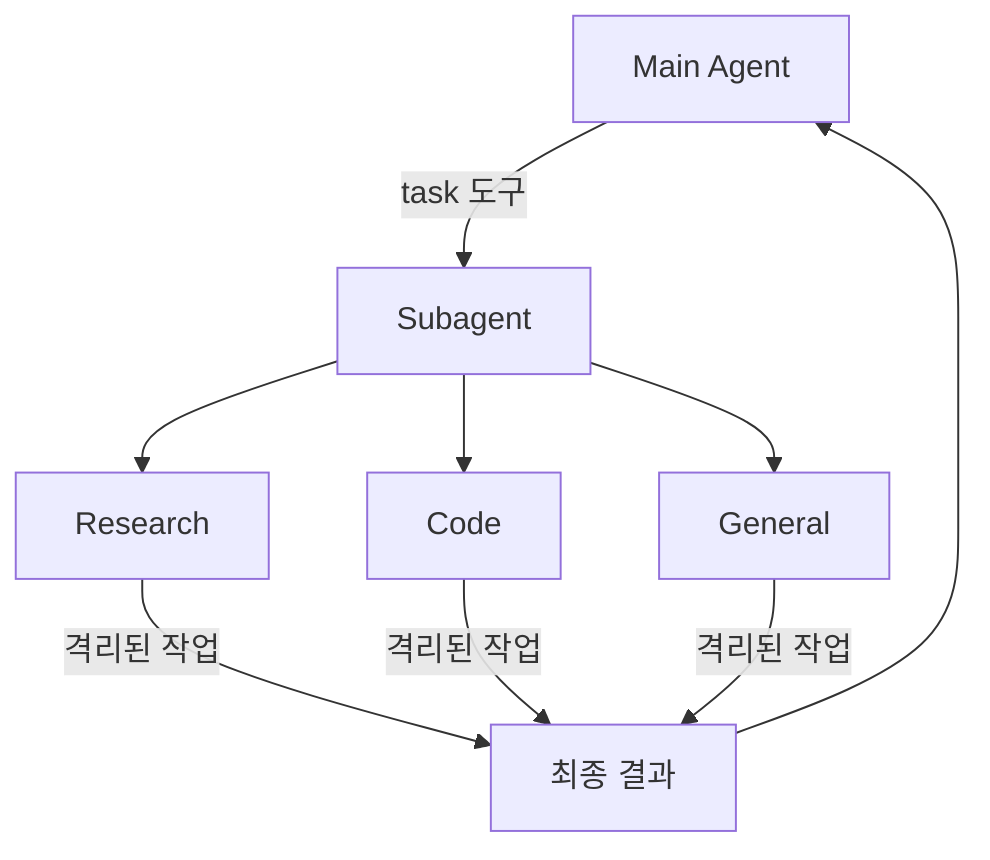

# Deep Agents Subagents: 위임과 Context Quarantine

> 학습 범위: LangChain Deep Agents의 Subagents 문서
>
> 원문: <https://docs.langchain.com/oss/python/deepagents/subagents>
>
> 확인일: 2026-07-26 · 저장 위치: `.codex/research/DeepAgent/Delegation/`

## 원문 충실 번역

### Documentation Index

전체 문서 목록은 <https://docs.langchain.com/llms.txt>에서 가져온다. 추가 탐색 전 이 파일로 가능한 모든 page를 발견한다.

# Subagents

> 작업을 위임하고 context를 깨끗하게 유지하는 subagent 사용법을 배운다.

Deep agent는 작업 위임을 위해 subagent를 만들 수 있다. `subagents` 매개변수에서 custom subagent를 지정한다. Subagent는 [context quarantine](https://www.dbreunig.com/2025/06/26/how-to-fix-your-context.html#context-quarantine), 즉 main agent context를 깨끗하게 유지하는 데, 그리고 전문 지시를 제공하는 데 유용하다.

이 페이지는 supervisor가 subagent가 끝날 때까지 block하는 **동기(synchronous)** subagent를 다룬다. 장기 실행 task, 병렬 workstream, 실행 중 steering·cancellation이 필요한 경우는 [Async subagents](https://docs.langchain.com/oss/python/deepagents/async-subagents)를 본다.



## Subagent를 쓰는 이유

Subagent는 **context bloat 문제**를 해결한다. Agent가 web search, file read, database query처럼 큰 출력을 주는 tool을 사용하면 intermediate result가 context window를 빠르게 채운다. Subagent는 이 상세 작업을 격리한다. Main agent는 그 작업을 만든 수십 번의 tool call 대신 최종 결과만 받는다.

**Subagent를 쓸 때**

- ✅ main context를 어지럽힐 multi-step task
- ✅ custom instruction·tool이 필요한 전문 domain
- ✅ 서로 다른 model capability가 필요한 task
- ✅ main agent가 상위 조정에 집중하게 하고 싶을 때

**Subagent를 쓰지 말아야 할 때**

- ❌ 단순한 single-step task
- ❌ intermediate context를 계속 유지해야 할 때
- ❌ overhead가 이점보다 클 때

## 구성

`subagents`는 dictionary 또는 [`CompiledSubAgent`](https://reference.langchain.com/python/deepagents/middleware/subagents/CompiledSubAgent) object의 list다. 두 종류가 있다.

### 기본 subagent

Deep Agents는 이미 같은 이름의 동기 subagent를 제공하지 않았다면 동기 `general-purpose` subagent를 자동으로 추가한다.

`general-purpose`는 기본으로 filesystem tool을 가지며 additional tool·middleware로 custom할 수 있다.

- 교체하려면 이름이 `general-purpose`인 subagent를 전달한다.
- auto-added version의 이름·prompt를 바꾸려면 active [harness profile](https://docs.langchain.com/oss/python/deepagents/profiles#harness-profiles)의 `general_purpose_subagent=GeneralPurposeSubagentProfile(...)`를 설정한다.
- 비활성화 방법은 아래 [Subagent 없이 실행](#subagent-없이-실행)을 본다.

### Subagent 없이 실행

`task` tool 없이 agent를 실행하려면 두 가지를 한다.

1. active harness profile에서 `general_purpose_subagent=GeneralPurposeSubagentProfile(enabled=False)`를 설정한다.
2. `create_deep_agent(..., subagents=)`에 동기 subagent를 전달하지 않는다.

Deep Agents는 동기 subagent가 하나 이상일 때만 [`SubAgentMiddleware`](https://reference.langchain.com/python/deepagents/middleware/subagents/SubAgentMiddleware)와 `task` tool을 붙인다. default와 caller 제공 subagent가 모두 없으면 delegation 없이 실행한다.

Async subagent는 별도 middleware·tool을 가지므로 영향받지 않는다.

> **팁:** `excluded_middleware`를 쓰지 않는다. `SubAgentMiddleware`는 필수 scaffolding이라 이를 나열하면 `ValueError`가 난다. `general_purpose_subagent.enabled = False`가 지원되는 방법이다.

## Custom subagent

`subagents` 매개변수로 code reviewer, web researcher, test runner 같은 전문 subagent와 특정 tool을 정의할 수 있다. 대부분은 dictionary 기반 `SubAgent`를, 복잡한 workflow에는 `CompiledSubAgent`를 쓴다.

### SubAgent dictionary 기반 spec

| field | 타입 | 번역한 의미 |
| --- | --- | --- |
| `name` | `str` | 필수·고유 identifier. Main agent가 `task()` 호출 시 사용한다. `AIMessage`·streaming metadata의 이름이 되어 agent를 구분한다. |
| `description` | `str` | 필수. subagent가 무엇을 하는지 구체적·행동 지향적으로 쓴다. Main agent가 위임 여부를 판단한다. |
| `system_prompt` | `str` | 필수. custom subagent 자신의 지시다. tool 사용법과 output 형식을 포함한다. Main agent prompt를 상속하지 않는다. |
| `tools` | `list[Callable]` | 선택. 필요한 최소 tool만 준다. 지정하지 않으면 main agent tool을 상속하고, 지정하면 상속 tool 전체를 대체한다. |
| `model` | `str \| BaseChatModel` | 선택. Main model override. 생략하면 상속한다. `'provider:model'` 문자열 또는 `init_chat_model(...)`, `ChatOpenAI(...)` object를 준다. |
| `middleware` | `list[Middleware]` | 선택. custom behavior·logging·rate limit용이다. main middleware는 상속하지 않는다. default stack과 merge하며 같은 `.name`은 in-place replace한다. `FilesystemMiddleware` allowlist로 subagent filesystem tool을 독립 제한할 수 있다. |
| `interrupt_on` | `dict[str, bool \| InterruptOnConfig]` | 선택. 특정 tool의 HITL을 설정한다. `True`, `False`, 또는 `allowed_decisions`가 있는 config를 쓴다. checkpointer가 필요하며 기본값은 main agent에서 상속한다. |
| `skills` | `list[str]` | 선택. skill source path. custom subagent는 자신의 독립 `SkillsMiddleware`와 완전히 격리된 skill state를 가진다. 일반-purpose만 main skill을 상속한다. |
| `response_format` | `ResponseFormat` | 선택. Pydantic, ToolStrategy, ProviderStrategy, raw schema를 쓴다. Parent는 free-form text 대신 JSON을 받는다. |
| `permissions` | `list[FilesystemPermission]` | 선택. 지정하면 parent permission을 **완전히 대체**한다. 지정하지 않으면 상속한다. |

### CompiledSubAgent

복잡한 workflow에는 미리 만든 LangGraph graph를 `CompiledSubAgent`로 쓴다.

| field | 타입 | 의미 |
| --- | --- | --- |
| `name` | `str` | 필수·고유 이름. streaming·AIMessage metadata에 들어간다. |
| `description` | `str` | 필수. 담당 작업 설명이다. |
| `runnable` | `Runnable` | 필수. `.compile()`을 마친 LangGraph graph다. |

## SubAgent 사용

```python
import os
from typing import Literal
from deepagents import create_deep_agent
from tavily import TavilyClient

tavily_client = TavilyClient(api_key=os.environ["TAVILY_API_KEY"])

def internet_search(
    query: str,
    max_results: int = 5,
    topic: Literal["general", "news", "finance"] = "general",
    include_raw_content: bool = False,
):
    """웹 검색을 실행한다."""
    return tavily_client.search(
        query, max_results=max_results,
        include_raw_content=include_raw_content, topic=topic,
    )

research_subagent = {
    "name": "research-agent",
    "description": "심층 조사 질문에 사용한다",
    "system_prompt": "당신은 훌륭한 연구자다.",
    "tools": [internet_search],
    "model": "openai:gpt-5.5",  # 선택 override, 기본은 main agent model
}

agent = create_deep_agent(
    model="google_genai:gemini-3.5-flash",
    subagents=[research_subagent],
)
```

## CompiledSubAgent 사용

custom subagent에는 LangChain `create_agent` 또는 custom LangGraph graph를 제공할 수 있다. Custom graph라면 state key `"messages"`가 있어야 한다.

```python
from deepagents import CompiledSubAgent, create_deep_agent
from langchain.agents import create_agent

def internet_search(query: str) -> str:
    """웹 검색을 실행한다."""
    return f"search results for {query}"

custom_graph = create_agent(
    model="openai:gpt-5.5",
    tools=[],
    system_prompt="당신은 data analysis 전문 agent다.",
)

custom_subagent = CompiledSubAgent(
    name="data-analyzer",
    description="복잡한 data analysis 전문 agent",
    runnable=custom_graph,
)

agent = create_deep_agent(
    model="google_genai:gemini-3.5-flash",
    tools=[internet_search],
    system_prompt="당신은 research coordinator다.",
    subagents=[custom_subagent],
)
```

## Dynamic subagent

기본적으로 main agent는 `task` tool call로 subagent에 위임한다(한 turn에서 여러 call을 내어 병렬 실행할 수 있다). [interpreter](https://docs.langchain.com/oss/python/deepagents/interpreters)가 붙으면 loop·branch·parallel batch로 code 안에서 subagent를 dispatch하여 많은 item에 fan-out하고 programmatically synthesize할 수도 있다. 이를 [dynamic subagents](https://docs.langchain.com/oss/python/deepagents/dynamic-subagents)라 한다.

여러 독립 unit(디렉터리 모든 파일 review, ticket batch triage), multiple perspective, recursive analysis에 dynamic subagent를 쓴다.

> **경고:** dynamic subagent는 beta [interpreter runtime](https://docs.langchain.com/oss/python/versioning)을 사용한다. API·lifecycle이 release마다 바뀔 수 있다.

### 활성화

subagent와 interpreter middleware가 둘 다 있으면 사용할 수 있다. QuickJS를 설치한 뒤 `CodeInterpreterMiddleware`를 추가한다.

```bash
pip install -U "deepagents[quickjs]"
# 또는
uv add "deepagents[quickjs]"
```

```python
from deepagents import create_deep_agent
from langchain_quickjs import CodeInterpreterMiddleware

agent = create_deep_agent(
    model="openai:gpt-5.5",
    subagents=[{
        "name": "reviewer",
        "description": "line·severity를 인용해 code security issue를 review한다",
        "system_prompt": "당신은 security 중심 code reviewer다. line과 severity를 보고한다.",
    }],
    middleware=[CodeInterpreterMiddleware()],
)
```

subagent와 interpreter middleware가 있으면 dynamic dispatch가 기본 on이다. normal `task` path만 강제하려면 `CodeInterpreterMiddleware(subagents=False)`를 쓴다. Interpreter에는 `langchain-quickjs>=0.2.0`, Python `>=3.11`이 필요하다.

### Dynamic orchestration trigger

Dynamic dispatch는 implicit하다. Agent는 call flag가 아니라 task의 형태로 code에서 fan-out할지 결정한다.

> **팁:** “workflow”라는 단어는 유용한 trigger다. Built-in interpreter system prompt는 workflow를 interpreter로 work를 organize하고 code에서 `task()`를 dispatch하라는 신호로 취급한다. 여러 작업을 fan-out하려면 요청에 workflow를 넣고, 하나의 직접 위임은 평문으로 요청한다.

```python
result = agent.invoke({
    "messages": [{
        "role": "user",
        "content": "src/routes/의 모든 파일을 review하고 top risk를 요약하는 workflow를 실행해줘.",
    }]
})
```

### Coding agent와 함께 사용

Deep Agent 위에 만든 LangChain terminal coding agent `dcode`는 code interpreter를 기본 활성화하므로 dynamic subagent가 별도 wiring 없이 동작한다.

```bash
curl -LsSf https://langch.in/dcode | bash
dcode
```

“src/의 모든 파일에서 SQL injection을 review하는 workflow를 실행해줘”처럼 요청하면 native `task` tool을 직접 관리하는 대신 agent가 orchestration script를 작성하고 interpreter에서 built-in `task()` global을 호출한다. Spawn된 subagent는 dcode dynamic subagents panel에서 dispatch phase별로 보인다. ACP를 통해 Zed 같은 다른 coding agent에서도 쓸 수 있다.

## Streaming

Deep Agents는 coordinator와 모든 delegated subagent의 streaming update를 지원한다. [`stream_events`](https://docs.langchain.com/oss/python/deepagents/event-streaming)는 subagent·message·tool call·value의 typed projection을 별도 iterator로 제공한다.

### Subagent 진행률 stream

가장 단순한 pattern은 `stream.subagents`를 순회해 delegated task의 시작·실행·완료를 추적하는 것이다. 각 handle은 `.name`, `.messages`, `.tool_calls`, `.output`을 가진다.

```python
from deepagents import create_deep_agent

agent = create_deep_agent(
    model="openai:gpt-5.5",
    system_prompt=(
        "당신은 research 지식이 없는 project coordinator다. "
        "모든 request에 research-agent type으로 task()를 호출하고 직접 답하지 않는다."
    ),
    subagents=[{
        "name": "research-agent",
        "description": "topic 하나씩 research를 위임한다.",
        "system_prompt": "당신은 훌륭한 researcher다. 짧은 summary를 반환한다.",
    }],
    name="main-agent",
)

stream = agent.stream_events(
    {"messages": [{"role": "user", "content": "quantum computing의 최근 발전 하나를 조사해줘."}]},
    version="v3",
)
for name, item in stream.interleave("messages", "subagents"):
    if name == "messages":
        print("[coordinator]", item.text)
    else:
        print(f"[{item.name}] started")
        for message in item.messages:
            print(f"[{item.name}]", message.text)
        print(f"[{item.name}] status: {item.status}")
```

### LangSmith tracing과 filter

실행 중 coordinator와 subagent의 모든 run은 metadata `lc_agent_name`에 agent 이름을 기록한다. 예: `{'lc_agent_name': 'research-agent'}`. 이를 LangSmith에서 subagent별 identify·filter할 수 있다.

UI에서는 tracing project의 **Runs** view에서 **Add filter → Metadata**, key `lc_agent_name`, value에 `coordinator` 또는 subagent명을 설정한다. 저장한 named view를 재사용할 수 있다.

SDK에서는 filter query language의 `has` comparator를 쓴다.

```python
from langsmith import Client
client = Client()

runs = client.list_runs(
    project_name="<your-project>",
    filter='has(metadata, \'{"lc_agent_name": "research-agent"}\')',
)
for run in runs:
    print(run.name, run.start_time, run.status)
```

main agent를 제외한 모든 named subagent run은 다음으로 가져온다.

```python
runs = client.list_runs(
    project_name="<your-project>",
    filter="has(metadata, 'lc_agent_name')",
)
```

## Structured output

Subagent는 [structured output](https://docs.langchain.com/oss/python/langchain/structured-output)을 지원하므로 parent가 free-form text 대신 예측 가능한 parse 가능한 JSON을 받는다.

> **참고:** subagent structured output에는 `deepagents>=0.5.3`이 필요하다.

subagent config에 `response_format`을 준다. 종료 시 structured response는 JSON serialize되어 parent의 `ToolMessage` content로 돌아온다. `create_agent`가 지원하는 Pydantic model, ToolStrategy, ProviderStrategy, raw schema를 모두 받을 수 있다.

```python
import asyncio
from pydantic import BaseModel, Field
from deepagents import create_deep_agent

def web_search(query: str) -> str:
    """웹을 검색한다."""
    return f"web results for {query}"

class ResearchFindings(BaseModel):
    """조사 task의 구조화 findings."""
    summary: str = Field(description="findings summary")
    confidence: float = Field(description="0~1 confidence")
    sources: list[str] = Field(description="source URL list")

research_subagent = {
    "name": "researcher",
    "description": "topic을 조사하고 structured finding을 반환한다",
    "system_prompt": "주제를 철저히 조사하고 finding을 반환한다.",
    "tools": [web_search],
    "response_format": ResearchFindings,
}
agent = create_deep_agent(model="openai:gpt-5.5", subagents=[research_subagent])

result = asyncio.run(agent.ainvoke({
    "messages": [{"role": "user", "content": "quantum computing의 최근 발전을 조사해줘"}]
}))
# Parent ToolMessage: '{"summary": "...", "confidence": 0.87, "sources": ["https://..."]}'
```

`response_format`이 없으면 parent는 subagent 마지막 message text를 그대로 받는다. 있으면 schema에 맞는 valid JSON을 항상 받으므로 downstream tool 전달·programmatic processing에 유용하다.

## General-purpose subagent

User-defined subagent 외에도 모든 deep agent에는 항상 `general-purpose` subagent가 있다. 이 subagent는:

- profile overlay가 적용된 자신의 [default system prompt](https://docs.langchain.com/oss/python/deepagents/customization#system-prompt)를 쓴다.
- 같은 tool에 접근한다.
- override하지 않으면 같은 model을 쓴다.
- main agent가 skill을 구성했으면 skill을 상속한다.

### Override

`subagents`에 `name="general-purpose"`를 넣으면 default를 완전히 대체한다.

```python
from deepagents import create_deep_agent

def internet_search(query: str) -> str:
    """웹 검색을 실행한다."""
    return f"search results for {query}"

agent = create_deep_agent(
    model="google_genai:gemini-3.5-flash",
    tools=[internet_search],
    subagents=[{
        "name": "general-purpose",
        "description": "research와 multi-step task용 범용 agent",
        "system_prompt": "당신은 범용 assistant다.",
        "tools": [internet_search],
        "model": "openai:gpt-5.5",
    }],
)
```

이 이름의 subagent를 주면 default general-purpose는 추가되지 않는다. 내장 general-purpose를 교체가 아니라 제거하려면 active profile의 `enabled=False`를 설정한다.

**사용 시점:** Specialized behavior 없이 context isolation이 필요할 때 이상적이다. Main agent가 복잡한 multi-step task를 위임하고, intermediate tool output 없이 concise result만 받는다. 예: `task(name="general-purpose", task="Research quantum computing trends")`.

### Skill 상속

`create_deep_agent`로 [skills](https://docs.langchain.com/oss/python/deepagents/skills)를 구성할 때:

- **General-purpose subagent**는 main agent skill을 자동 상속한다.
- **Custom subagent**는 기본 상속하지 않는다. 자신의 `skills` parameter로 별도 skill을 준다.

Skill이 설정된 subagent만 `SkillsMiddleware` instance를 받으며, parent·child skill state는 양방향으로 완전히 격리된다.

```python
research_subagent = {
    "name": "researcher",
    "description": "전문 skill을 가진 research assistant",
    "system_prompt": "당신은 researcher다.",
    "tools": [web_search],
    "skills": ["/skills/research/", "/skills/web-search/"],
}
agent = create_deep_agent(
    model="google_genai:gemini-3.5-flash",
    skills=["/skills/main/"],  # main과 general-purpose만 상속
    subagents=[research_subagent],
)
```

## Best practice

### 명확한 description

Main agent가 description으로 subagent 호출을 고른다.

- ✅ `"confidence score와 함께 financial data를 분석하고 investment insight를 생성한다"`
- ❌ `"finance 일을 한다"`

### 상세 system prompt

Tool 사용과 output을 구체적으로 지시한다.

```python
research_subagent = {
    "name": "research-agent",
    "description": "web search로 심층 research하고 finding을 종합한다",
    "system_prompt": """당신은 철저한 researcher다.
1. 질문을 검색 query로 분해한다.
2. internet_search로 관련 정보를 찾는다.
3. 포괄적이되 concise하게 종합한다.
4. claim마다 source를 인용한다.

출력:
- Summary (2~3 paragraph)
- Key findings (bullet)
- Sources (URL)
Context를 깨끗이 유지하기 위해 500단어 이내로 쓴다.""",
    "tools": [internet_search],
}
```

### Tool set 최소화

필요한 tool만 주면 focus와 security가 좋아진다.

```python
# ✅ 집중된 tool set
email_agent = {"name": "email-sender", "tools": [send_email, validate_email]}

# ❌ 과도하고 목적 없는 tool set
email_agent = {
    "name": "email-sender",
    "tools": [send_email, web_search_tool, database_query, format_document],
}
```

### Task별 model 선택

긴 legal document에는 large context model, numerical analysis에는 해당 task에 강한 model을 subagent `model`로 줄 수 있다. Model capability·가격·latency·data boundary를 함께 평가해야 하며, 예시는 다음과 같다.

```python
subagents = [
    {
        "name": "contract-reviewer",
        "description": "legal document와 contract를 review한다",
        "system_prompt": "당신은 expert legal reviewer다.",
        "tools": [read_document, analyze_contract],
        "model": "google_genai:gemini-3.5-flash",
    },
    {
        "name": "financial-analyst",
        "description": "financial data와 market trend를 분석한다",
        "system_prompt": "당신은 expert financial analyst다.",
        "tools": [get_stock_price, analyze_fundamentals],
        "model": "openai:gpt-5.5",
    },
]
```

### Concise result 반환

Raw data·intermediate calculation·detailed tool output 대신 summary만 반환하도록 지시한다.

```python
data_analyst = {
    "system_prompt": """data를 분석하고 다음만 반환한다.
1. Key insight 3~5개
2. Overall confidence
3. Recommended next action
Raw data, intermediate calculation, detailed tool output은 넣지 않는다.
300단어 이내로 쓴다."""
}
```

## 일반 패턴: 여러 specialized subagent

```python
from deepagents import create_deep_agent

subagents = [
    {
        "name": "data-collector",
        "description": "여러 source에서 raw data를 모은다",
        "system_prompt": "topic의 포괄적인 data를 수집한다",
        "tools": [web_search_tool, api_call, database_query],
    },
    {
        "name": "data-analyzer",
        "description": "수집 data에서 insight를 분석한다",
        "system_prompt": "data를 분석하고 핵심 insight를 추출한다",
        "tools": [statistical_analysis],
    },
    {
        "name": "report-writer",
        "description": "analysis에서 정돈된 report를 작성한다",
        "system_prompt": "insight로 professional report를 만든다",
        "tools": [format_document],
    },
]
agent = create_deep_agent(
    model="openai:gpt-5.5",
    system_prompt="data analysis와 reporting을 조정한다. specialized task는 subagent를 쓴다.",
    subagents=subagents,
)
```

Workflow는 (1) main plan, (2) collector 위임, (3) analyzer에 결과 전달, (4) writer에 insight 전달, (5) final output compile 순서다. 각 subagent는 자기 task만 담긴 깨끗한 context에서 동작한다.

## Context 관리

Parent를 [runtime context](https://docs.langchain.com/oss/python/langchain/runtime)로 invoke하면 이 context는 모든 subagent에 자동 전파된다. 각 subagent run은 parent `invoke`/`ainvoke`에 준 동일한 context를 받으므로, subagent 내부 tool도 같은 context value를 접근한다.

```python
from dataclasses import dataclass
from deepagents import create_deep_agent
from langchain.messages import HumanMessage
from langchain.tools import ToolRuntime, tool

@dataclass
class Context:
    user_id: str
    session_id: str

@tool
def get_user_data(query: str, runtime: ToolRuntime[Context]) -> str:
    """현재 사용자의 data를 가져온다."""
    return f"Data for user {runtime.context.user_id}: {query}"

agent = create_deep_agent(
    model="openai:gpt-5.5",
    subagents=[{
        "name": "researcher",
        "description": "현재 user를 위한 research를 한다",
        "system_prompt": "당신은 research assistant다.",
        "tools": [get_user_data],
    }],
    context_schema=Context,
)
result = agent.invoke(
    {"messages": [HumanMessage("최근 activity를 찾아줘")]},
    context=Context(user_id="user-123", session_id="abc"),
)
```

### Subagent별 context

모든 subagent가 parent context를 받는다. 특정 subagent 전용 config에는 flat context mapping에서 `researcher:max_depth` 같은 **namespace key**를 쓰거나 context type에 별도 field를 둔다.

```python
@dataclass
class Context:
    user_id: str
    researcher_max_depth: int | None = None
    fact_checker_strict_mode: bool | None = None

@tool
def verify_claim(claim: str, runtime: ToolRuntime[Context]) -> str:
    """사실 claim을 검증한다."""
    if runtime.context.fact_checker_strict_mode:
        return strict_verification(claim)
    return basic_verification(claim)
```

같은 tool을 parent·여러 subagent가 공유하면 `runtime.config["metadata"]["lc_agent_name"]`으로 호출 agent를 구분할 수 있다.

```python
@tool
def shared_lookup(query: str, runtime: ToolRuntime) -> str:
    """정보를 찾는다."""
    agent_name = runtime.config.get("metadata", {}).get("lc_agent_name")
    return strict_lookup(query) if agent_name == "fact-checker" else general_lookup(query)
```

## Troubleshooting

### Subagent가 호출되지 않음

**문제:** Main agent가 위임하지 않고 직접 일한다.

**해결:**

1. description을 구체화한다. `research-specialist`에는 “multiple search가 필요한 detailed research에서 사용”처럼 목적·조건을 쓴다. `helper: helps with stuff`는 나쁘다.
2. Main prompt에 “complex task에서는 `task()`로 subagent에 delegate하라. context를 깨끗이 유지하고 result를 개선한다.”고 명시한다.

### Context가 여전히 비대해짐

1. Subagent에 500단어 이하 essential summary만 반환하고 raw data·intermediate search result·tool output을 넣지 말라고 지시한다.
2. 큰 data는 `/data/raw_results.txt`에 저장한 뒤 analysis summary만 반환하도록 filesystem을 쓴다.

### 잘못된 subagent 선택

Description을 명확히 구분한다. 예: `quick-researcher`는 1~2 search의 basic fact·definition, `deep-researcher`는 multiple search·synthesis·analysis가 필요한 comprehensive report를 담당하게 한다.

원문 하단은 MCP로 문서를 Claude·VSCode 등에 연결하는 링크와 GitHub edit·issue 링크를 제공한다.

---

## 조사: 실제 활용 패턴과 해석

### Context quarantine의 실질

Subagent는 “더 많은 agent”가 목적이 아니라 **중간 trace를 main model context에 넣지 않기 위한 boundary**다. 따라서 가장 높은 효과는 웹 조사, 대형 repo 탐색, DB query처럼 tool output이 큰 task에서 난다. 반대로 final answer가 intermediate reasoning을 계속 참조해야 하는 작은 task에는 subagent 호출 비용과 정보 손실이 더 클 수 있다.

### 동기·비동기·동적 위임 선택

| 방식 | Supervisor 동작 | 적합한 경우 | 핵심 trade-off |
| --- | --- | --- | --- |
| 동기 subagent | 결과가 올 때까지 block | 한 번의 깊은 조사·review | 구현 단순, coordinator가 기다림 |
| Async subagent | background work를 계속 관리 | 장기 실행, 중간 steering·cancel | lifecycle·상태 관리가 더 복잡 |
| Dynamic subagent | interpreter code에서 loop/batch fan-out | directory 전체 review, ticket batch | beta API·interpreter 의존성 |

### 실제 사용: dcode와 LangSmith trace

공식 문서는 `dcode`가 interpreter를 기본 포함하는 terminal coding agent라 dynamic subagent를 즉시 시험할 수 있다고 소개한다. 위임 진행은 dynamic panel에서 phase별로 보이고, LangSmith에서는 `lc_agent_name` metadata로 coordinator와 subagent trace를 분리한다. 이는 운영에서 “어떤 agent가 tool을 몇 번 호출했는가”를 비용·품질·안전 책임 단위로 보는 실제 관측 방식이다.

### 권한 설계 원칙

Subagent의 `tools` 지정은 parent tool 상속을 **완전히 override**하고, `permissions`도 지정 시 parent rule을 **완전히 replace**한다. 전문 subagent일수록 “도구를 추가”하기보다 필요한 tool만 명시하고, permission replacement로 인해 parent protection을 잃지 않는지 테스트해야 한다.

---

## 보강 실습: 구조화된 security review delegation

다음 구성은 main agent의 context를 보호하면서, reviewer가 읽기 전용 tool만 쓰고 line·severity·fix를 JSON으로 반환하게 한다.

```python
from pydantic import BaseModel, Field
from deepagents import create_deep_agent

class Finding(BaseModel):
    file: str
    line: int | None = None
    severity: str
    issue: str
    recommendation: str

class ReviewResult(BaseModel):
    findings: list[Finding]
    summary: str

reviewer = {
    "name": "security-reviewer",
    "description": "소스 코드의 security vulnerability를 read-only로 review한다.",
    "system_prompt": """당신은 security code reviewer다.
- 제공된 파일을 읽고 severity를 high/medium/low로 분류한다.
- 추정은 추정이라고 표시한다.
- raw file 전체나 tool output을 반환하지 않는다.""",
    "tools": [read_file, grep],
    "response_format": ReviewResult,
    # 실제 배포에서는 이 subagent 전용 read-only FilesystemPermission을 명시한다.
}

agent = create_deep_agent(
    model="openai:gpt-5.5",
    subagents=[reviewer],
    system_prompt=(
        "복잡한 security review는 security-reviewer에 한 번에 하나의 scope로 위임하고, "
        "JSON finding을 종합해서만 사용자에게 답한다."
    ),
)
```

## 운영 체크리스트

- 위임 전 “이 task가 main context에 large intermediate output을 남기는가?”를 판단한다.
- `description`에는 역할뿐 아니라 **언제 호출할지**를 쓴다.
- custom subagent는 main system prompt·skill을 기본 상속하지 않으므로 필요한 instruction·skill을 명시한다.
- `tools`, `permissions`를 지정하면 상속이 replace된다는 점을 test한다.
- Parent가 downstream action을 해야 하면 `response_format`으로 JSON contract를 만든다.
- Sync task에는 timeout·HITL·concise output limit을 둔다. 긴 작업에는 async subagent를 검토한다.
- Dynamic subagent는 beta이므로 QuickJS·Python version pinning, fan-out 상한, cancellation 관측을 포함한다.
- LangSmith에서 `lc_agent_name`으로 agent별 tool usage·latency·error·cost를 filter한다.

## 참고 자료와 신뢰도

| 자료 | 확인일 | 신뢰도 | 사용한 내용 |
| --- | --- | --- | --- |
| [Subagents 공식 문서](https://docs.langchain.com/oss/python/deepagents/subagents) | 2026-07-26 | 1차 공식 문서 | 동기 subagent, config, dynamic, streaming, structured output, context |
| [문서 인덱스](https://docs.langchain.com/llms.txt) | 2026-07-26 | 1차 공식 문서 | 관련 page 발견 |
| [Async subagents](https://docs.langchain.com/oss/python/deepagents/async-subagents) | 2026-07-26 | 1차 공식 문서 | 동기 위임과 async 위임의 구분 |
| [Dynamic subagents](https://docs.langchain.com/oss/python/deepagents/dynamic-subagents) | 2026-07-26 | 1차 공식 문서 | interpreter·fan-out·beta 경계 |
| [Context quarantine 글](https://www.dbreunig.com/2025/06/26/how-to-fix-your-context.html#context-quarantine) | 2026-07-26 | 외부 기술 해설 | context quarantine 용어의 배경 |

## 다음 학습 질문

1. Async subagent의 queue·cancel·result lifecycle은 sync `task`와 어떻게 다른가?
2. Dynamic subagent fan-out에 concurrency·budget·permission ceiling을 어떻게 적용하는가?
3. Parent와 child가 shared runtime context를 받을 때 tenant isolation과 tool authorization은 어떻게 설계해야 하는가?

