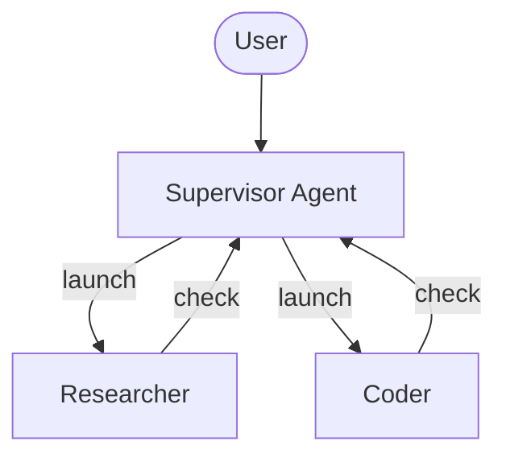
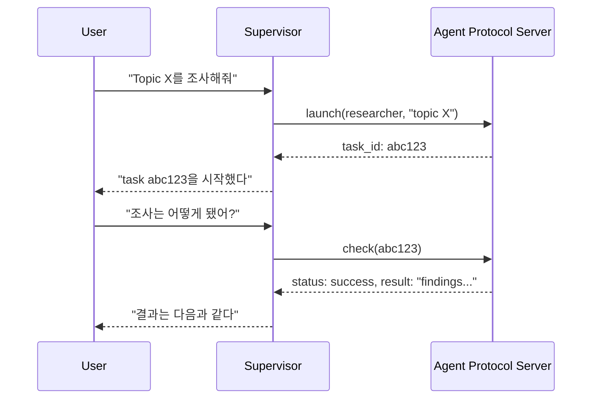

# Deep Agents Async Subagents: Background Delegation

> 원문: <https://docs.langchain.com/oss/python/deepagents/async-subagents>
>
> 확인일: 2026-07-26 · 이 노트는 원문 번역 후 조사·보강 코드를 배치한다.

## 원문 충실 번역

### Documentation Index

전체 문서 인덱스는 <https://docs.langchain.com/llms.txt>에서 가져오며, 추가 탐색 전 가능한 모든 page를 이 파일로 발견한다.

# Async subagents

> Supervisor가 사용자와 계속 상호작용하는 동안 background subagent를 concurrent하게 실행한다.

Async subagent는 supervisor agent가 background task를 시작하고 즉시 반환하게 하므로, subagent가 동시 실행되는 동안 supervisor는 사용자와 계속 상호작용할 수 있다. Supervisor는 어느 시점에든 progress를 확인하고 follow-up instruction을 보내거나 task를 cancel할 수 있다.

이는 supervisor가 완료까지 block하는 [동기 subagent](https://docs.langchain.com/oss/python/deepagents/subagents)를 기반으로 한다. Task가 long-running, parallelizable하거나 실행 중 steering이 필요하면 async subagent를 쓴다.

> **참고:** Async subagent는 `deepagents 0.5.0`에서 쓸 수 있는 preview feature다. active development 중이므로 API가 바뀔 수 있다.



Async subagent는 [Agent Protocol](https://github.com/langchain-ai/agent-protocol)을 구현한 모든 server와 통신한다. LangSmith Deployment를 쓰거나 Agent Protocol-compatible server를 self-host할 수 있다. 각 subagent는 supervisor와 독립 실행되고, supervisor는 SDK로 launch·check·update·cancel한다.

## 언제 async subagent를 쓰는가

| 차원 | Sync subagent | Async subagent |
| --- | --- | --- |
| 실행 모델 | supervisor가 완료까지 block | 즉시 job ID를 받고 supervisor는 계속 진행 |
| concurrency | 병렬일 수 있지만 blocking | 병렬·non-blocking |
| 실행 중 update | 불가 | `update_async_task`로 follow-up 가능 |
| 취소 | 불가 | `cancel_async_task`로 실행 task 취소 |
| state | invocation 사이 persistent state 없음 | 자기 thread에서 interaction 간 state 유지 |
| 적합한 경우 | 결과 전에 agent가 기다려야 하는 task | chat에서 interactive하게 관리하는 long-running complex task |

## 먼저 이해할 아키텍처: 왜 `url`이 필요한가

동기 subagent는 parent graph 안에서 `task` 도구가 child agent를 실행하고, parent가 child의 최종 결과를 받을 때까지 기다리는 구조다. 따라서 “child가 있는 서버의 주소”를 별도로 지정할 필요가 없다.

반면 async subagent는 supervisor가 task를 시작한 뒤 곧바로 사용자에게 돌아가야 한다. 작업 중인 subagent는 supervisor의 현재 model call과 독립된 **별도 LangGraph thread와 run**으로 살아 있어야 하며, 나중에 supervisor가 그 작업의 상태를 조회·갱신·취소할 수 있어야 한다. 그래서 async 방식은 subagent graph를 실행하고 thread/run API를 제공하는 **Agent Protocol server**를 전제로 한다.

```text
동기 subagent

사용자 → Supervisor graph ── task() ──► Child graph
                       ◄── 최종 결과 ──┘
                       (Supervisor는 여기서 기다림)


비동기 subagent

사용자 → Supervisor graph ── start_async_task() ──► Agent Protocol server
        ◄── task_id 즉시 반환 ─────────────────────┘
        │                                             │
        └─ 사용자와 다음 대화 계속                    └─ Researcher graph의 별도 thread/run 실행

다음 turn: Supervisor ── check/update/cancel(task_id) ──► 같은 server의 같은 thread/run
```

즉 `url`은 “LLM API endpoint”가 아니다. **subagent graph를 호스팅하고 Agent Protocol(thread 생성, run 시작, 상태 조회, 취소)을 제공하는 서버의 주소**다. LangSmith Deployment를 사용할 수도 있고, 같은 protocol을 구현한 자체 서버를 둘 수도 있다.

### `name`, `graph_id`, `url`, `task_id`를 분리해서 보기

비슷한 이름이 여러 개라 처음에는 혼동하기 쉽다.

| 값 | 누가 쓰는가 | 뜻 | 예시 |
| --- | --- | --- | --- |
| `name` | supervisor LLM | 위임 대상을 고를 때 보이는 별칭 | `"researcher"` |
| `graph_id` | Agent Protocol server | 서버 안에서 실행할 graph/assistant의 식별자 | `"researcher"` |
| `url` | SDK transport | **어느 server**에 `graph_id`를 찾으러 갈지 | `https://research.example.com` |
| `task_id` | supervisor와 사용자 | 특정 background 작업의 실행 단위. 보통 생성된 subagent thread ID | `"abc123..."` |

주소로 건물을 고르고(`url`), 그 건물 안의 담당 팀을 고른 뒤(`graph_id`), 실제 접수 건마다 접수 번호를 받는 것(`task_id`)에 비유할 수 있다. `name`은 supervisor가 LLM에게 노출하는 “이 업무는 researcher에게 맡겨라”라는 친화적인 메뉴 이름이다.

### `url` 생략: 같은 deployment에 함께 올린 경우(ASGI transport)

supervisor와 researcher/coder graph를 하나의 LangGraph deployment에 함께 등록했다면 모두 같은 server 안에 있다. 이때 `url`을 생략하면 SDK가 HTTP 요청을 만들지 않고 **ASGI in-process transport**로 그 deployment의 Agent Protocol API를 호출한다.

```text
하나의 deployment / 하나의 Agent Protocol server

┌───────────────────────────────────────────────────────────┐
│ langgraph.json                                             │
│   supervisor   → ./src/supervisor.py:graph                 │
│   researcher   → ./src/researcher.py:graph                 │
│   coder        → ./src/coder.py:graph                      │
│                                                           │
│ Supervisor run ── ASGI 호출 ──► Researcher의 별도 thread/run │
└───────────────────────────────────────────────────────────┘
```

```json
{
  "graphs": {
    "supervisor": "./src/supervisor.py:graph",
    "researcher": "./src/researcher.py:graph",
    "coder": "./src/coder.py:graph"
  }
}
```

```python
from deepagents import AsyncSubAgent, create_deep_agent

supervisor = create_deep_agent(
    model="openai:gpt-5.5",
    subagents=[
        AsyncSubAgent(
            name="researcher",       # supervisor LLM이 보는 위임 이름
            description="여러 출처를 조사하고 근거를 요약한다.",
            graph_id="researcher",   # 같은 langgraph.json의 graph key
            # url 없음: 같은 deployment 안이므로 ASGI transport
        ),
    ],
)
```

여기서 **in-process**는 transport가 네트워크를 타지 않는다는 뜻이다. researcher가 supervisor의 Python 함수 호출 스택 안에서 실행되어 state를 공유한다는 뜻은 아니다. 여전히 researcher는 자기 thread·자기 message history·자기 run을 가진 독립 작업이다. 단지 두 graph가 같은 server에 있으므로 server 바깥으로 HTTP 요청을 보낼 필요가 없다.

이 방식은 네트워크 지연과 별도 인증 설정이 없고 서버를 하나만 운영하면 되므로 공식 문서의 권장 시작점이다.

### `url` 지정: 다른 deployment에 있는 경우(HTTP transport)

researcher가 CPU/메모리를 많이 쓰거나, 별도 팀이 운영하거나, 독립적으로 scale해야 한다면 supervisor와 다른 server에 둔다. 이때 supervisor는 `url`로 remote Agent Protocol server를 지정한다.

```text
Supervisor deployment                         Research deployment
┌──────────────────────────┐                 ┌──────────────────────────┐
│ supervisor graph          │ -- HTTPS ----► │ Agent Protocol server    │
│ start/check/update/cancel │                 │ researcher graph         │
└──────────────────────────┘                 │ researcher thread abc123 │
                                             └──────────────────────────┘
```

```python
from deepagents import AsyncSubAgent, create_deep_agent

supervisor = create_deep_agent(
    model="openai:gpt-5.5",
    subagents=[
        AsyncSubAgent(
            name="researcher",
            description="장시간 웹 조사와 근거 합성을 수행한다.",
            graph_id="researcher",  # remote server에 등록된 graph key
            url="https://research-deployment.langsmith.dev",
            # self-hosted server가 별도 인증을 요구하면 headers를 추가할 수 있다.
            # headers={"X-Service-Token": "..."},
        ),
    ],
)
```

LangGraph Deployment의 HTTP transport 인증은 보통 환경 변수의 `LANGSMITH_API_KEY` 또는 `LANGGRAPH_API_KEY`를 LangGraph SDK가 사용한다. 자체 Agent Protocol 서버는 그 서버의 인증 방식에 맞춰 `headers` 등을 전달한다.

### task가 실제로 시작되고 나중에 다시 연결되는 과정

사용자가 “경쟁사 20곳을 조사해줘”라고 말했을 때를 단계로 보면 다음과 같다.

1. Supervisor가 `start_async_task(subagent_type="researcher", task="...")`를 호출한다.
2. middleware가 지정한 transport(ASGI 또는 HTTP)를 통해 target Agent Protocol server에 **새 thread**를 만든다.
3. 해당 thread에서 `graph_id="researcher"` run을 시작한다.
4. server는 새 thread ID를 task ID로 즉시 반환한다. Supervisor는 연구가 끝날 때까지 기다리지 않고 사용자에게 시작 사실을 알린다.
5. 사용자가 나중에 “진행 상황은?”이라고 물으면 Supervisor가 `check_async_task(task_id)`로 **같은 server의 같은 thread/run** 상태를 조회한다.
6. 사용자가 범위를 바꾸면 `update_async_task`가 같은 thread에 새 instruction을 보낸다. 문서의 interrupt multitask 전략에서는 진행 중 run을 interrupt하고, 누적 대화 이력과 새 지시로 다시 실행한다.
7. 필요 없으면 `cancel_async_task`가 server의 `runs.cancel()`을 호출한다.

그래서 `task_id`를 대화 메시지에만 두지 않고 supervisor state의 `async_tasks` 채널에도 보관한다. 오래된 메시지가 요약되어도 어느 server의 어떤 background thread를 다시 조회할지 잃지 않기 위해서다.

### 언제 어떤 topology를 고르는가

| 상황 | topology | `url` | 이유 |
| --- | --- | --- | --- |
| 처음 만들고 agent 수가 적음 | Single deployment | 생략 | ASGI, 낮은 지연, 운영할 server 하나 |
| researcher만 GPU/대용량 worker가 필요 | Split deployment | researcher URL 지정 | 독립 자원·독립 scaling |
| 내부 coder는 가깝게, 외부 research는 별도 운영 | Hybrid | coder는 생략, researcher만 지정 | 성격에 따라 transport 혼합 |
| 팀/보안 경계가 다름 | Split deployment | 대상 팀 server URL | 배포·권한·감사 경계를 분리 |

### 혼동하기 쉬운 점

* `url`을 쓰는 것은 **동기 subagent를 원격 함수로 만드는 옵션**이 아니다. async subagent 전용의 background thread/run 관리 연결이다.
* `url`이 없다고 subagent가 동기적으로 실행되는 것은 아니다. ASGI transport에서도 start는 즉시 task ID를 반환하며 subagent는 독립적으로 계속 실행된다.
* `graph_id`는 Python module path가 아니라 Agent Protocol server가 알고 있는 graph/assistant ID다. LangGraph deployment에서는 `langgraph.json`의 key와 맞춘다.
* supervisor가 start 직후 계속 `check`를 호출하면 non-blocking 이점을 잃고 사실상 polling 기반 blocking이 된다. 시작 후에는 사용자에게 control을 돌려주고, 다음 요청에서 check/list하도록 설계한다.

## Async subagent 구성

Async subagent는 각각 Agent Protocol server를 가리키는 [`AsyncSubAgent`](https://reference.langchain.com/python/deepagents/middleware/async_subagents/AsyncSubAgent) spec list로 정의한다.

```python
from deepagents import AsyncSubAgent, create_deep_agent

async_subagents = [
    AsyncSubAgent(
        name="researcher",
        description="정보 수집과 synthesis용 research agent",
        graph_id="researcher",
        # url 없음 → 같은 deployment의 ASGI transport
    ),
    AsyncSubAgent(
        name="coder",
        description="code generation·review용 coding agent",
        graph_id="coder",
        # url="https://coder-deployment.langsmith.dev" → remote HTTP 가능
    ),
]

agent = create_deep_agent(
    model="google_genai:gemini-3.5-flash",
    subagents=async_subagents,
)
```

| field | 타입 | 의미 |
| --- | --- | --- |
| `name` | `str` | 필수·고유 identifier. supervisor가 task launch에 쓴다. |
| `description` | `str` | 필수. 담당 작업. supervisor가 위임 대상을 고른다. |
| `graph_id` | `str` | 필수. Agent Protocol server의 graph ID 또는 assistant ID. LangGraph deployment면 `langgraph.json` 등록 graph와 일치해야 한다. |
| `url` | `str` | 선택. 없으면 ASGI in-process, 있으면 remote server HTTP transport다. |
| `headers` | `dict[str, str]` | 선택. self-host Agent Protocol server custom auth 같은 remote request header다. |

co-deployed LangGraph deployment에서는 모든 graph를 같은 `langgraph.json`에 등록한다.

```json
{
  "graphs": {
    "supervisor": "./src/supervisor.py:graph",
    "researcher": "./src/researcher.py:graph",
    "coder": "./src/coder.py:graph"
  }
}
```

## Async subagent tool

Async subagent를 구성하면 default middleware stack의 [`AsyncSubAgentMiddleware`](https://reference.langchain.com/python/deepagents/middleware/async_subagents/AsyncSubAgentMiddleware)가 supervisor에 다섯 tool을 준다.

| 도구 | 목적 | 반환 |
| --- | --- | --- |
| `start_async_task` | 새 background task 시작 | 즉시 Task ID |
| `check_async_task` | 현재 status와 완료 시 result 조회 | status + result |
| `update_async_task` | 실행 task에 새 instruction 전송 | confirmation + 갱신 status |
| `cancel_async_task` | 실행 task 중지 | confirmation |
| `list_async_tasks` | 모든 추적 task와 live status 나열 | 전체 summary |

Supervisor LLM은 이 도구들을 일반 tool처럼 호출한다. Middleware가 thread 생성, run 관리, state persistence를 자동 처리한다.

### Lifecycle 이해



- **Launch:** server에 새 thread를 만들고 task description input으로 run을 시작하며 thread ID를 task ID로 반환한다. Supervisor는 이 ID를 사용자에게 알리고 completion을 poll하지 않는다.
- **Check:** run status를 가져온다. 성공이면 thread state를 가져와 final output을 추출한다. 아직 running이면 그 상태를 보고한다.
- **Update:** 같은 thread에서 interrupt multitask strategy로 새 run을 만든다. 이전 run은 interrupt되고 subagent는 full conversation history와 새 instruction으로 restart한다. task ID는 같다.
- **Cancel:** server의 `runs.cancel()`을 호출하고 task를 `"cancelled"`로 표시한다.
- **List:** 모든 tracked task를 순회한다. non-terminal task는 server에서 병렬로 live status를 가져오고, terminal `success`·`error`·`cancelled`는 cache에서 반환한다.

## State 관리

Task metadata는 message history와 분리된 supervisor graph의 dedicated state channel `async_tasks`에 저장된다. Deep agent는 context window가 차면 [message history를 compact](https://docs.langchain.com/oss/python/deepagents/context-engineering#summarization)하므로, task ID가 tool message에만 있으면 compaction에서 사라질 수 있다. Dedicated channel 덕분에 여러 번 요약된 뒤에도 supervisor는 `list_async_tasks`로 task를 기억한다.

추적 task에는 task ID, agent name, thread ID, run ID, status, `created_at`, `last_checked_at`, `last_updated_at`이 기록된다.

## Transport 선택

### ASGI transport (co-deployed)

`url`을 생략하면 LangGraph SDK는 HTTP 대신 in-process function call로 routing하는 ASGI transport를 쓴다. LangGraph deployment는 두 graph가 같은 `langgraph.json`에 있어야 한다. Network latency가 없고 추가 auth 설정도 필요 없지만, subagent는 별도 thread·state로 실행된다. **권장 기본값**이다.

### HTTP transport (remote)

`url`을 주면 network를 거쳐 remote Agent Protocol server에 SDK call을 보낸다.

```python
from deepagents import AsyncSubAgent
AsyncSubAgent(
    name="researcher",
    description="research agent",
    graph_id="researcher",
    url="https://my-research-deployment.langsmith.dev",
)
```

LangGraph deployment는 `LANGSMITH_API_KEY` 또는 `LANGGRAPH_API_KEY`를 SDK auth에 쓴다. Self-host server는 다른 auth를 쓸 수 있다. Independent scaling, 다른 resource profile, 다른 team이 관리하는 subagent에는 HTTP를 쓴다.

## Deployment topology

- **Single deployment:** 모든 agent를 한 server에 co-deploy하고 ASGI 사용. 관리할 server 하나, agent 간 latency 0이라 추천 시작점이다.
- **Split deployment:** supervisor와 subagent를 다른 server에 두고 HTTP 사용. compute profile 또는 scaling을 독립시키려 할 때 쓴다.
- **Hybrid:** 일부는 ASGI, 일부는 HTTP로 둔다.

```python
async_subagents = [
    AsyncSubAgent(name="researcher", description="Research agent", graph_id="researcher"),
    AsyncSubAgent(
        name="coder", description="Coding agent", graph_id="coder",
        url="https://coder-deployment.langsmith.dev",
    ),
]
```

## Best practice

### Local worker pool 크기

`langgraph dev`에서는 concurrent subagent run을 수용하도록 worker pool을 늘린다. Active run 하나가 worker slot 하나를 차지한다. Supervisor + concurrent subagent 3개면 4 slot이 필요하다. 부족하면 launch가 queue에 들어간다.

```bash
langgraph dev --n-jobs-per-worker 10
```

Description은 “multiple search와 synthesis가 필요한 question에 쓴다”처럼 구체적·action-oriented이어야 한다. `helper: helps with stuff`는 좋지 않다.

### Thread ID tracing

LangGraph deployment에서는 모든 async subagent run이 standard LangGraph run이고 LangSmith에서 보인다. Supervisor trace에는 launch/check/update/cancel/list tool call이, subagent에는 별도 trace가 thread ID로 연결되어 나타난다. Task ID=thread ID로 orchestration과 execution trace를 correlate한다.

## Troubleshooting

- **Launch 직후 polling:** async를 blocking으로 바꾸는 오류다. Middleware가 막는 prompt rule을 주입하지만 계속되면 “launch 뒤 항상 user에게 control을 돌리고 즉시 `check_async_task`를 호출하지 않는다”를 supervisor prompt에 추가한다.
- **오래된 status 보고:** conversation history status는 항상 stale이다. 보고 전에 `check` 또는 `list`를 호출하라고 명시한다.
- **Task ID lookup 실패:** full task ID를 그대로 써야 한다. truncate·abbreviate 금지 prompt를 추가하거나 model을 바꾼다.
- **Launch가 queue에서 멈춤:** worker pool exhaustion이다. `--n-jobs-per-worker`를 높인다.

원문은 working Python/TypeScript LangSmith Deployment example을 담은 [async-deep-agents repository](https://github.com/langchain-ai/async-deep-agents)를 reference implementation으로 안내한다.

---

## 조사: 실제 활용과 설계 해석

### 실제 reference implementation

공식 [async-deep-agents](https://github.com/langchain-ai/async-deep-agents) repository는 researcher·coder subagent를 background task로 운용하는 supervisor를 Python·TypeScript에서 제공하고 LangSmith Deployment에 배포한다. 즉 이 기능은 local thread spawn이 아니라 Agent Protocol·thread/run API를 이용한 deployment-level orchestration 예제다.

### 핵심 설계: task ID를 message에만 두지 않는 이유

Async task ID가 `async_tasks` channel에 저장되는 이유는 context compaction 때문이다. 이는 long-running agent에서 작업 추적 정보를 채팅 문맥이 아닌 durable workflow state에 두는 일반 원칙이다. 사용자 대화가 길어져도 task cancel·update 권한을 잃지 않게 한다.

### Sync/Async 결정 기준

| 상황 | 선택 |
| --- | --- |
| 결과를 기다린 뒤 다음 reasoning을 해야 함 | sync subagent |
| 사용자와 대화하면서 수 분 이상 걸릴 research·build를 관리 | async subagent |
| 수백 파일·ticket fan-out을 interpreter가 batch 처리 | dynamic subagent |
| 단순 즉시 answer | 위임하지 않음 |

## 보강 코드: user steering을 허용하는 async supervisor prompt

```python
from deepagents import AsyncSubAgent, create_deep_agent

agent = create_deep_agent(
    model="openai:gpt-5.5",
    subagents=[
        AsyncSubAgent(
            name="researcher",
            description="여러 search와 source synthesis가 필요한 긴 조사에 사용한다.",
            graph_id="researcher",
        )
    ],
    system_prompt="""당신은 background task coordinator다.
- 긴 조사에는 start_async_task를 호출하고 full task ID를 사용자에게 알린다.
- launch 직후 check하지 말고 사용자의 다음 요청을 받는다.
- 상태를 보고하기 직전에는 항상 check_async_task 또는 list_async_tasks로 fresh status를 확인한다.
- update 요청은 같은 task ID에 전달하고, cancel 요청은 confirmation을 반환한다.""",
)
```

## 운영 체크리스트

- preview API version을 pinning하고 upgrade 전 lifecycle regression test를 둔다.
- task ID·thread ID를 message가 아닌 `async_tasks` state로 유지한다.
- local worker slot은 supervisor + 최대 concurrency 이상으로 provision한다.
- default는 ASGI single deployment로 시작하고, resource isolation·independent scale이 필요할 때 HTTP split으로 이동한다.
- HTTP remote server에는 auth header, timeout, retry, server identity 검증을 적용한다.
- Check/status report에는 stale conversation text 대신 fresh server query를 사용한다.
- Update는 기존 run을 interrupt하고 full history로 restart한다는 점을 사용자 경험·idempotency 설계에 반영한다.
- Task ID를 사용자 입력으로 재구성하지 말고 server가 반환한 canonical full ID를 보존한다.

## 참고 자료와 신뢰도

| 자료 | 확인일 | 신뢰도 | 사용한 내용 |
| --- | --- | --- | --- |
| [Async subagents 공식 문서](https://docs.langchain.com/oss/python/deepagents/async-subagents) | 2026-07-26 | 1차 공식 문서 | API, lifecycle, state, transport, topology, 운영 |
| [문서 인덱스](https://docs.langchain.com/llms.txt) | 2026-07-26 | 1차 공식 문서 | 문서 탐색 |
| [async-deep-agents](https://github.com/langchain-ai/async-deep-agents) | 2026-07-26 | 공식 유지보수 예제 | Python·TypeScript deployment reference |
| [Subagents](https://docs.langchain.com/oss/python/deepagents/subagents) | 2026-07-26 | 1차 공식 문서 | sync와 async의 경계 |

## 다음 학습 질문

1. Async task의 remote HTTP timeout·retry·idempotency를 Agent Protocol server에서 어떻게 보장하는가?
2. Update가 interrupt/restart하는 모델에서 partial artifact와 checkpoint를 어떻게 다루는가?
3. Async subagent별 auth·resource quota·tenant boundary를 split deployment에서 어떻게 분리하는가?
