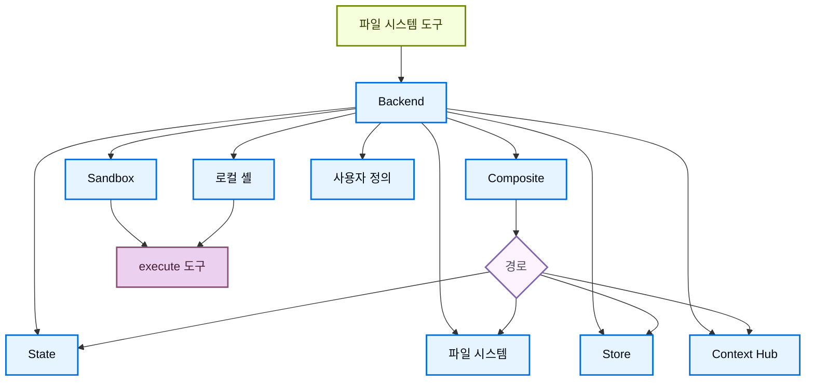

# Deep Agents Backends: 파일 시스템 표면과 실행 환경 경계

> 학습 범위: LangChain Deep Agents의 Backends 문서
>
> 원문: <https://docs.langchain.com/oss/python/deepagents/backends>
>
> 원문·관련 공식 문서 확인일: 2026-07-26 · 이 노트는 번역을 먼저 제시하고, 뒤에 조사와 실습을 분리한다.

## 원문 충실 번역

### Documentation Index

전체 문서 인덱스는 <https://docs.langchain.com/llms.txt>에서 가져온다. 추가 탐색 전에 이 파일을 사용하여 이용 가능한 모든 페이지를 발견한다.

# Backends

> Deep Agents용 파일 시스템 backend를 선택하고 구성한다. 서로 다른 backend로의 경로 라우팅, 가상 파일 시스템 구현, 정책 강제를 지원한다.

Deep Agents는 `ls`, `read_file`, `write_file`, `edit_file`, `delete`, `glob`, `grep` 같은 도구를 통해 에이전트에 파일 시스템 표면을 노출한다. 이 도구들은 교체 가능한 backend를 거쳐 동작한다. `read_file` 도구는 모든 backend에서 이미지 파일(`.png`, `.jpg`, `.jpeg`, `.gif`, `.webp`)을 기본 지원하며, 이미지를 멀티모달 content block으로 반환한다.

Sandbox와 [`LocalShellBackend`](https://reference.langchain.com/python/deepagents/backends/local_shell/LocalShellBackend)는 셸 명령을 실행하는 `execute` 도구도 제공한다.

이 페이지가 설명하는 내용은 다음과 같다.

- [backend 선택](#backend-지정)
- [서로 다른 backend로 경로 라우팅](#서로-다른-backend로-라우팅)
- [사용자 정의 backend 구현](#사용자-정의-backend)
- 파일 시스템 접근 [권한 설정](#권한)
- [backend protocol 준수](#protocol-참조)

> **팁 — LangSmith Deployment**
>
> [LangSmith Deployment](https://docs.langchain.com/langsmith/deployment)에 배포하면 store가 자동으로 프로비저닝된다. [LangSmith tracing](https://docs.langchain.com/langsmith/observability)을 사용하여 파일 경로, 권한 거부, thread 간 저장소를 디버깅한다. 시작 방법은 [observability quickstart](https://docs.langchain.com/langsmith/observability-quickstart)를 따른다.
>
> trace를 모니터링하고 문제를 감지하며 수정안을 제시하는 [LangSmith Engine](https://docs.langchain.com/langsmith/engine)도 설정하는 것을 권장한다.

## Quickstart

몇 가지 사전 구성 파일 시스템 backend를 Deep Agent에서 빠르게 사용할 수 있다.

| 내장 backend | 설명 |
| --- | --- |
| [기본값](#statebackend) | `agent = create_deep_agent(model="google_genai:gemini-3.5-flash")` — thread 범위다. 기본 backend는 `langgraph` state에 저장된다. checkpoint를 통해 같은 thread의 여러 turn에 걸쳐 파일이 유지되며, 서로 다른 thread와 공유하지 않는다. |
| [로컬 파일 시스템 영속성](#filesystembackend-local-disk) | `FilesystemBackend(root_dir="/Users/nh/Desktop/")`를 지정한다. Deep Agent에 로컬 머신 파일 시스템 접근권을 준다. `root_dir`는 절대 경로여야 한다. 보통은 프로젝트 파일과 내부 에이전트 데이터(오프로드한 도구 결과, 대화 이력)를 분리하려 `CompositeBackend`로 감싼다. |
| [Durable store (LangGraph store)](#storebackend-langgraph-store) | `StoreBackend()`를 사용한다. thread 간에도 유지되는 장기 저장소를 제공하므로 여러 실행에 적용되는 장기 기억·지시를 저장하기 좋다. |
| [Context Hub](#contexthubbackend) | `ContextHubBackend("my-agent")`를 쓴다. 별도 LangGraph store를 직접 준비하지 않고 LangSmith Hub repo에 파일을 내구성 있게 저장한다. |
| [Sandbox](https://docs.langchain.com/oss/python/deepagents/sandboxes) | 격리 환경에서 코드를 실행한다. 파일 시스템 도구와 셸 명령용 `execute`를 제공한다. LangSmith, AgentCore, Daytona, Deno, E2B, Modal, Runloop, local VFS 중에서 고를 수 있다. |
| [로컬 셸](#localshellbackend-local-shell) | `LocalShellBackend(root_dir=".", env={"PATH": "/usr/bin:/bin"})`를 쓴다. 호스트에서 파일 시스템과 셸을 직접 실행한다. 격리가 없으므로 통제된 개발 환경에서만 사용한다. |
| [Composite](#compositebackend-router) | 기본은 thread 범위이고 `/memories/`는 thread 간 유지한다. 가장 유연한 backend로, 파일 시스템의 서로 다른 경로를 서로 다른 backend로 보낼 수 있다. |



## 내장 backend

### StateBackend


#### StateBackend — 제공자별 원문 코드 전수 번역

##### Google

```python
from deepagents import create_deep_agent
from deepagents.backends import StateBackend

# 기본값으로 StateBackend가 제공된다.
agent = create_deep_agent(model="google_genai:gemini-3.5-flash")

# 내부적으로는 다음과 같다.
agent2 = create_deep_agent(
    model="openai:gpt-5.5",
    backend=StateBackend(),
)
```

##### OpenAI

```python
from deepagents import create_deep_agent
from deepagents.backends import StateBackend

# 기본값으로 StateBackend가 제공된다.
agent = create_deep_agent(model="openai:gpt-5.5")

# 내부적으로는 다음과 같다.
agent2 = create_deep_agent(
    model="openai:gpt-5.5",
    backend=StateBackend(),
)
```

##### Anthropic

```python
from deepagents import create_deep_agent
from deepagents.backends import StateBackend

# 기본값으로 StateBackend가 제공된다.
agent = create_deep_agent(model="anthropic:claude-sonnet-4-6")

# 내부적으로는 다음과 같다.
agent2 = create_deep_agent(
    model="openai:gpt-5.5",
    backend=StateBackend(),
)
```

##### OpenRouter

```python
from deepagents import create_deep_agent
from deepagents.backends import StateBackend

# 기본값으로 StateBackend가 제공된다.
agent = create_deep_agent(model="openrouter:z-ai/glm-5.2")

# 내부적으로는 다음과 같다.
agent2 = create_deep_agent(
    model="openai:gpt-5.5",
    backend=StateBackend(),
)
```

##### Fireworks

```python
from deepagents import create_deep_agent
from deepagents.backends import StateBackend

# 기본값으로 StateBackend가 제공된다.
agent = create_deep_agent(model="fireworks:accounts/fireworks/models/glm-5p2")

# 내부적으로는 다음과 같다.
agent2 = create_deep_agent(
    model="openai:gpt-5.5",
    backend=StateBackend(),
)
```

##### Baseten

```python
from deepagents import create_deep_agent
from deepagents.backends import StateBackend

# 기본값으로 StateBackend가 제공된다.
agent = create_deep_agent(model="baseten:zai-org/GLM-5.2")

# 내부적으로는 다음과 같다.
agent2 = create_deep_agent(
    model="openai:gpt-5.5",
    backend=StateBackend(),
)
```

##### Ollama

```python
from deepagents import create_deep_agent
from deepagents.backends import StateBackend

# 기본값으로 StateBackend가 제공된다.
agent = create_deep_agent(model="ollama:north-mini-code-1.0")

# 내부적으로는 다음과 같다.
agent2 = create_deep_agent(
    model="openai:gpt-5.5",
    backend=StateBackend(),
)
```

**동작 방식**

- [`StateBackend`](https://reference.langchain.com/python/deepagents/backends/state/StateBackend)를 통해 현재 thread의 LangGraph agent state에 파일을 저장한다.
- checkpoint를 거쳐 같은 thread의 여러 agent turn에 유지된다. 파일은 thread 간 공유되지 않는다.

> **경고:** graph 내부에서 사용하도록 설계됐다. graph run 바깥에서 backend 메서드(예: `state_backend.upload_files(...)`)를 호출하면 graph가 실행될 때까지 효과가 반영되지 않는다.

**가장 적합한 경우**

- 에이전트가 중간 결과를 쓰는 스크래치패드
- 에이전트가 큰 도구 출력을 자동 축출한 뒤, 필요할 때 조금씩 다시 읽어야 할 때

이 backend는 supervisor agent와 subagent가 함께 사용한다. subagent가 쓴 파일은 subagent 실행이 끝난 뒤에도 LangGraph agent state에 남아 supervisor와 다른 subagent가 계속 사용할 수 있다.

### FilesystemBackend (로컬 디스크)

[`FilesystemBackend`](https://reference.langchain.com/python/deepagents/backends/filesystem/FilesystemBackend)는 구성 가능한 root directory 아래의 실제 파일을 읽고 쓴다.

> **경고 — 직접 파일 시스템 권한**
>
> 이 backend는 agent에 직접적인 파일 시스템 읽기/쓰기 권한을 부여한다. 주의해서 적절한 환경에서만 사용한다.
>
> **적절한 사용 사례**
>
> - 로컬 개발 CLI(코딩 assistant, 개발 도구)
> - CI/CD pipeline(아래 보안 고려 사항 참조)
>
> **부적절한 사용 사례**
>
> - Web server 또는 HTTP API: 대신 `StateBackend`, `StoreBackend`, sandbox backend를 사용한다.
>
> **보안 위험**
>
> - agent는 API key, credential, `.env`를 포함하여 접근 가능한 모든 파일을 읽을 수 있다.
> - network 도구와 결합하면 SSRF 공격을 통해 secret이 유출될 수 있다.
> - 파일 수정은 영구적이며 되돌릴 수 없다.
>
> **권장 안전장치**
>
> 1. 민감 작업을 검토할 [Human-in-the-Loop(HITL) middleware](https://docs.langchain.com/oss/python/deepagents/human-in-the-loop)를 활성화한다.
> 2. 접근 가능한 파일 경로, 특히 CI/CD에서 secret을 제외한다.
> 3. 파일 상호작용이 필요한 production 환경에서는 sandbox backend를 쓴다.
> 4. 경로 기반 접근 제한을 활성화하려면 `root_dir`와 함께 **반드시** `virtual_mode=True`를 쓴다. 이는 `..`, `~`, root 밖의 절대 경로를 막는다.
>
> `root_dir`를 설정해도 기본값 `virtual_mode=False`는 보안을 제공하지 않는다.


#### FilesystemBackend — 제공자별 원문 코드 전수 번역

##### Google

```python
from deepagents import create_deep_agent
from deepagents.backends import FilesystemBackend

agent = create_deep_agent(
    model="google_genai:gemini-3.5-flash",
    backend=FilesystemBackend(root_dir=".", virtual_mode=True),
)
```

##### OpenAI

```python
from deepagents import create_deep_agent
from deepagents.backends import FilesystemBackend

agent = create_deep_agent(
    model="openai:gpt-5.5",
    backend=FilesystemBackend(root_dir=".", virtual_mode=True),
)
```

##### Anthropic

```python
from deepagents import create_deep_agent
from deepagents.backends import FilesystemBackend

agent = create_deep_agent(
    model="anthropic:claude-sonnet-4-6",
    backend=FilesystemBackend(root_dir=".", virtual_mode=True),
)
```

##### OpenRouter

```python
from deepagents import create_deep_agent
from deepagents.backends import FilesystemBackend

agent = create_deep_agent(
    model="openrouter:z-ai/glm-5.2",
    backend=FilesystemBackend(root_dir=".", virtual_mode=True),
)
```

##### Fireworks

```python
from deepagents import create_deep_agent
from deepagents.backends import FilesystemBackend

agent = create_deep_agent(
    model="fireworks:accounts/fireworks/models/glm-5p2",
    backend=FilesystemBackend(root_dir=".", virtual_mode=True),
)
```

##### Baseten

```python
from deepagents import create_deep_agent
from deepagents.backends import FilesystemBackend

agent = create_deep_agent(
    model="baseten:zai-org/GLM-5.2",
    backend=FilesystemBackend(root_dir=".", virtual_mode=True),
)
```

##### Ollama

```python
from deepagents import create_deep_agent
from deepagents.backends import FilesystemBackend

agent = create_deep_agent(
    model="ollama:north-mini-code-1.0",
    backend=FilesystemBackend(root_dir=".", virtual_mode=True),
)
```

**동작 방식**

- 구성 가능한 `root_dir` 아래의 실제 파일을 읽고 쓴다.
- 선택적으로 `virtual_mode=True`를 설정하면 `root_dir` 아래에서 경로를 sandbox·정규화한다.
- 안전한 경로 해석을 사용하고 가능한 경우 안전하지 않은 symlink traversal을 막으며, 빠른 `grep`에 ripgrep를 사용할 수 있다.

**가장 적합한 경우**

- 로컬 머신의 프로젝트
- CI sandbox
- mount된 persistent volume

> **팁 — 대부분의 경우 `CompositeBackend`로 감싸기**
>
> Deep Agents는 오프로드한 큰 도구 결과(`/large_tool_results/`)와 대화 이력(`/conversation_history/`)을 포함한 내부 데이터를 backend에 자동 기록한다. `FilesystemBackend`만 사용하면 이 내부 파일도 `root_dir` 아래 실제 디스크에 기록되어 프로젝트 파일과 섞인다.
>
> `CompositeBackend`로 프로젝트 디렉터리만 `FilesystemBackend`에 route하고 내부 경로는 일시적인 `StateBackend`에 유지한다.
>
> ```python
> from deepagents import create_deep_agent
> from deepagents.backends import CompositeBackend, StateBackend, FilesystemBackend
>
> agent = create_deep_agent(
>     backend=CompositeBackend(
>         default=StateBackend(),
>         routes={
>             "/workspace/": FilesystemBackend(root_dir="/path/to/project", virtual_mode=True),
>         },
>     )
> )
> ```
>
> 이렇게 하면 `/workspace/` 아래의 agent 읽기·쓰기는 실제 디스크로 가고, 오프로드된 도구 결과와 다른 내부 데이터는 일시적 state에 남는다.

### LocalShellBackend (로컬 셸)

> **경고 — 호스트 셸을 무제한 실행**
>
> 이 backend는 agent에 직접 파일 시스템 읽기/쓰기 권한과 호스트에서의 제한 없는 셸 실행을 준다. 극도로 주의해서 적절한 환경에서만 사용한다.
>
> **적절한 사용 사례**
>
> - 로컬 개발 CLI(코딩 assistant, 개발 도구)
> - agent의 코드를 신뢰하는 개인 개발 환경
> - 올바른 secret 관리가 된 CI/CD pipeline
>
> **부적절한 사용 사례**
>
> - production 환경(web server, API, multi-tenant system)
> - 신뢰할 수 없는 사용자 입력 처리 또는 신뢰할 수 없는 코드 실행
>
> **보안 위험**
>
> - agent가 사용자 권한으로 임의의 셸 명령을 실행할 수 있다.
> - API key, credential, `.env`를 포함해 접근 가능한 모든 파일을 읽을 수 있다.
> - secret이 노출될 수 있다.
> - 파일 수정과 명령 실행은 영구적이며 되돌릴 수 없다.
> - 명령은 호스트 시스템에서 직접 실행된다.
> - 명령이 CPU, memory, disk를 제한 없이 소비할 수 있다.
>
> **권장 안전장치**
>
> 1. 실행 전 작업을 검토·승인할 HITL middleware를 활성화한다. **강력히 권장**한다.
> 2. 전용 개발 환경에서만 실행하고 shared·production system에서는 절대 사용하지 않는다.
> 3. production에서 셸 실행이 필요하면 sandbox backend를 쓴다.
>
> **주의:** 셸 접근이 활성화되면 명령이 시스템의 어느 경로든 접근할 수 있으므로 `virtual_mode=True`는 보안을 제공하지 않는다.


#### LocalShellBackend — 제공자별 원문 코드 전수 번역

##### Google

```python
from deepagents import create_deep_agent
from deepagents.backends import LocalShellBackend

agent = create_deep_agent(
    model="google_genai:gemini-3.5-flash",
    backend=LocalShellBackend(root_dir=".", virtual_mode=True, env={"PATH": "/usr/bin:/bin"}),
)
```

##### OpenAI

```python
from deepagents import create_deep_agent
from deepagents.backends import LocalShellBackend

agent = create_deep_agent(
    model="openai:gpt-5.5",
    backend=LocalShellBackend(root_dir=".", virtual_mode=True, env={"PATH": "/usr/bin:/bin"}),
)
```

##### Anthropic

```python
from deepagents import create_deep_agent
from deepagents.backends import LocalShellBackend

agent = create_deep_agent(
    model="anthropic:claude-sonnet-4-6",
    backend=LocalShellBackend(root_dir=".", virtual_mode=True, env={"PATH": "/usr/bin:/bin"}),
)
```

##### OpenRouter

```python
from deepagents import create_deep_agent
from deepagents.backends import LocalShellBackend

agent = create_deep_agent(
    model="openrouter:z-ai/glm-5.2",
    backend=LocalShellBackend(root_dir=".", virtual_mode=True, env={"PATH": "/usr/bin:/bin"}),
)
```

##### Fireworks

```python
from deepagents import create_deep_agent
from deepagents.backends import LocalShellBackend

agent = create_deep_agent(
    model="fireworks:accounts/fireworks/models/glm-5p2",
    backend=LocalShellBackend(root_dir=".", virtual_mode=True, env={"PATH": "/usr/bin:/bin"}),
)
```

##### Baseten

```python
from deepagents import create_deep_agent
from deepagents.backends import LocalShellBackend

agent = create_deep_agent(
    model="baseten:zai-org/GLM-5.2",
    backend=LocalShellBackend(root_dir=".", virtual_mode=True, env={"PATH": "/usr/bin:/bin"}),
)
```

##### Ollama

```python
from deepagents import create_deep_agent
from deepagents.backends import LocalShellBackend

agent = create_deep_agent(
    model="ollama:north-mini-code-1.0",
    backend=LocalShellBackend(root_dir=".", virtual_mode=True, env={"PATH": "/usr/bin:/bin"}),
)
```

**동작 방식**

- `FilesystemBackend`를 확장해 호스트 셸 명령 실행용 `execute` 도구를 제공한다.
- sandbox 없이 `subprocess.run(shell=True)`로 머신에서 직접 실행한다.
- `timeout`(기본 120초), `max_output_bytes`(기본 100,000), 환경 변수용 `env`와 `inherit_env`를 지원한다.
- 셸 명령의 working directory는 `root_dir`지만 시스템의 어느 경로든 접근할 수 있다.

**가장 적합한 경우**

- 로컬 코딩 assistant·개발 도구
- agent를 신뢰하고 빠르게 반복하는 개발 중 작업

### StoreBackend (LangGraph store)


#### StoreBackend — 제공자별 원문 코드 전수 번역

##### Google

```python
from deepagents import create_deep_agent
from deepagents.backends import StoreBackend
from langgraph.store.memory import InMemoryStore

agent = create_deep_agent(
    model="google_genai:gemini-3.5-flash",
    backend=StoreBackend(
        namespace=lambda rt: (rt.server_info.user.identity,),
    ),
    store=InMemoryStore(),  # 로컬 개발에는 적합. LangSmith Deployment에서는 생략한다.
)
```

##### OpenAI

```python
from deepagents import create_deep_agent
from deepagents.backends import StoreBackend
from langgraph.store.memory import InMemoryStore

agent = create_deep_agent(
    model="openai:gpt-5.5",
    backend=StoreBackend(
        namespace=lambda rt: (rt.server_info.user.identity,),
    ),
    store=InMemoryStore(),  # 로컬 개발에는 적합. LangSmith Deployment에서는 생략한다.
)
```

##### Anthropic

```python
from deepagents import create_deep_agent
from deepagents.backends import StoreBackend
from langgraph.store.memory import InMemoryStore

agent = create_deep_agent(
    model="anthropic:claude-sonnet-4-6",
    backend=StoreBackend(
        namespace=lambda rt: (rt.server_info.user.identity,),
    ),
    store=InMemoryStore(),  # 로컬 개발에는 적합. LangSmith Deployment에서는 생략한다.
)
```

##### OpenRouter

```python
from deepagents import create_deep_agent
from deepagents.backends import StoreBackend
from langgraph.store.memory import InMemoryStore

agent = create_deep_agent(
    model="openrouter:z-ai/glm-5.2",
    backend=StoreBackend(
        namespace=lambda rt: (rt.server_info.user.identity,),
    ),
    store=InMemoryStore(),  # 로컬 개발에는 적합. LangSmith Deployment에서는 생략한다.
)
```

##### Fireworks

```python
from deepagents import create_deep_agent
from deepagents.backends import StoreBackend
from langgraph.store.memory import InMemoryStore

agent = create_deep_agent(
    model="fireworks:accounts/fireworks/models/glm-5p2",
    backend=StoreBackend(
        namespace=lambda rt: (rt.server_info.user.identity,),
    ),
    store=InMemoryStore(),  # 로컬 개발에는 적합. LangSmith Deployment에서는 생략한다.
)
```

##### Baseten

```python
from deepagents import create_deep_agent
from deepagents.backends import StoreBackend
from langgraph.store.memory import InMemoryStore

agent = create_deep_agent(
    model="baseten:zai-org/GLM-5.2",
    backend=StoreBackend(
        namespace=lambda rt: (rt.server_info.user.identity,),
    ),
    store=InMemoryStore(),  # 로컬 개발에는 적합. LangSmith Deployment에서는 생략한다.
)
```

##### Ollama

```python
from deepagents import create_deep_agent
from deepagents.backends import StoreBackend
from langgraph.store.memory import InMemoryStore

agent = create_deep_agent(
    model="ollama:north-mini-code-1.0",
    backend=StoreBackend(
        namespace=lambda rt: (rt.server_info.user.identity,),
    ),
    store=InMemoryStore(),  # 로컬 개발에는 적합. LangSmith Deployment에서는 생략한다.
)
```

> **참고:** [LangSmith Deployment](https://docs.langchain.com/langsmith/deployment)에 배포할 때는 `store` 매개변수를 생략한다. 플랫폼이 agent의 store를 자동으로 준비한다.
>
> **팁:** `namespace` 매개변수는 데이터 격리를 제어한다. multi-user 배포에서는 사용자·tenant별 격리를 위해 항상 [namespace factory](#namespace-factory)를 설정한다.

**동작 방식**

- [`StoreBackend`](https://reference.langchain.com/python/deepagents/backends/store/StoreBackend)는 runtime이 제공한 LangGraph [`BaseStore`](https://reference.langchain.com/python/langchain-core/stores/BaseStore)에 파일을 저장하여 thread 간 durable storage를 만든다.

**가장 적합한 경우**

- 이미 Redis, Postgres, cloud 구현 등 `BaseStore` 뒤의 LangGraph store를 구성해 실행할 때
- LangSmith Deployment로 agent를 배포할 때(자동으로 store가 제공됨)

#### Namespace factory

namespace factory는 `StoreBackend`의 읽기·쓰기 위치를 제어한다. LangGraph [`Runtime`](https://reference.langchain.com/python/langgraph/runtime/Runtime)을 받아 store namespace로 쓰는 문자열 tuple을 반환한다. 사용자·tenant·assistant 간 데이터를 격리하려면 namespace factory를 사용한다.

`StoreBackend`를 만들 때 `namespace` 매개변수에 전달한다.

```python
NamespaceFactory = Callable[[Runtime], tuple[str, ...]]
```

`Runtime`은 다음을 제공한다.

- `rt.context` — LangGraph [context schema](https://langchain-ai.github.io/langgraph/concepts/runtime/)로 전달한 사용자 제공 context(예: `user_id`)
- `rt.server_info` — LangGraph Server 실행 시의 server별 metadata(assistant ID, graph ID, 인증 사용자)
- `rt.execution_info` — thread ID, run ID, checkpoint ID 같은 execution identity 정보

> **참고:** `Runtime` 인수는 `deepagents>=0.5.2`에서 이용 가능하다. 그보다 이른 0.5.x는 대신 `BackendContext`를 전달했으며, 아래 [BackendContext 마이그레이션](#backendcontext에서-마이그레이션)을 참고한다. `rt.server_info`와 `rt.execution_info`에는 `deepagents>=0.5.0`이 필요하다.

**일반적인 namespace 패턴**

```python
from deepagents.backends import StoreBackend

# 사용자별: 각 사용자가 격리된 저장소를 가진다.
backend = StoreBackend(
    namespace=lambda rt: (rt.server_info.user.identity,),
)

# assistant별: 같은 assistant의 모든 사용자가 저장소를 공유한다.
backend = StoreBackend(
    namespace=lambda rt: (
        rt.server_info.assistant_id,
    ),
)

# thread별: 하나의 대화에만 범위를 제한한다.
backend = StoreBackend(
    namespace=lambda rt: (
        rt.execution_info.thread_id,
    ),
)
```

여러 component를 합쳐 더 구체적인 범위를 만들 수 있다. 예를 들어 `(user_id, thread_id)`는 사용자별·대화별 격리이고, 같은 범위에서 여러 store namespace를 쓸 때는 `"filesystem"` 같은 suffix를 붙여 구분한다.

namespace component에는 영숫자, hyphen, underscore, dot, `@`, `+`, colon, tilde만 들어갈 수 있다. glob injection을 막기 위해 wildcard(`*`, `?`)는 거부된다.

> **경고:** `namespace` 매개변수는 v0.5.0에서 **필수**가 된다. 새 코드는 항상 명시적으로 설정한다.
>
> **참고:** namespace factory가 없으면 legacy 기본값은 LangGraph config metadata의 `assistant_id`를 쓴다. 즉 같은 [assistant](https://docs.langchain.com/langsmith/assistants)의 모든 사용자가 같은 저장소를 공유한다. multi-user [production 배포](https://docs.langchain.com/oss/python/deepagents/going-to-production)에서는 항상 namespace factory를 제공한다.

### ContextHubBackend

> **시작 전:** `ContextHubBackend`에는 LangSmith에 설정한 Context Hub repo가 필요하다. agent repo와 skill repo가 익숙하지 않다면 먼저 [Context Hub concepts](https://docs.langchain.com/langsmith/context-engineering-concepts)를 읽는다.

`ContextHubBackend`는 agent의 파일 시스템을 LangSmith Context Hub repo에 저장한다. 독립 repo 또는 skill repo를 연결한 agent repo를 사용할 수 있다.

**repo 구조:** Context Hub에서 *agent repo*는 agent의 최상위 지시·구성(예: `AGENTS.md`, `tools.json`)을 가진다. 하나 이상의 *skill repo*를 연결할 수 있으며, 각각은 재사용 가능한 기능(예: 이메일 서식 또는 코드 리뷰 지시가 있는 `SKILL.md`)으로 패키징된다. `ContextHubBackend("my-agent")`를 전달하면 agent repo를 파일 시스템 root에 mount하고, 연결된 skill repo는 `/skills/` 아래 subdirectory로 나타난다.

즉 agent context는 의도적으로 repo들에 걸쳐 분산된다. agent당 한 repo, skill당 별도 repo 구조라 skill을 독립적으로 versioning·공유·재사용할 수 있다. 이것이 분절적으로 느껴진다면 [Linked repos](https://docs.langchain.com/langsmith/context-engineering-concepts#linked-repos)의 근거를 참고한다.


#### ContextHubBackend — 제공자별 원문 코드 전수 번역

##### Google

```python
from deepagents import create_deep_agent
from deepagents.backends import ContextHubBackend

agent = create_deep_agent(
    model="google_genai:gemini-3.5-flash",
    backend=ContextHubBackend("my-agent"),
)
```

##### OpenAI

```python
from deepagents import create_deep_agent
from deepagents.backends import ContextHubBackend

agent = create_deep_agent(
    model="openai:gpt-5.5",
    backend=ContextHubBackend("my-agent"),
)
```

##### Anthropic

```python
from deepagents import create_deep_agent
from deepagents.backends import ContextHubBackend

agent = create_deep_agent(
    model="anthropic:claude-sonnet-4-6",
    backend=ContextHubBackend("my-agent"),
)
```

##### OpenRouter

```python
from deepagents import create_deep_agent
from deepagents.backends import ContextHubBackend

agent = create_deep_agent(
    model="openrouter:z-ai/glm-5.2",
    backend=ContextHubBackend("my-agent"),
)
```

##### Fireworks

```python
from deepagents import create_deep_agent
from deepagents.backends import ContextHubBackend

agent = create_deep_agent(
    model="fireworks:accounts/fireworks/models/glm-5p2",
    backend=ContextHubBackend("my-agent"),
)
```

##### Baseten

```python
from deepagents import create_deep_agent
from deepagents.backends import ContextHubBackend

agent = create_deep_agent(
    model="baseten:zai-org/GLM-5.2",
    backend=ContextHubBackend("my-agent"),
)
```

##### Ollama

```python
from deepagents import create_deep_agent
from deepagents.backends import ContextHubBackend

agent = create_deep_agent(
    model="ollama:north-mini-code-1.0",
    backend=ContextHubBackend("my-agent"),
)
```

repo identifier는 `owner/name` 또는 `name` 형식으로 생성한다.

> **참고:** `ContextHubBackend` 사용 전에 `LANGSMITH_API_KEY`를 설정한다.

**동작 방식**

- 첫 사용 시 Hub repo tree를 lazy pull한 뒤 in-memory cache에서 읽기를 제공한다.
- write·edit를 Hub commit으로 영속화하고 commit이 성공하면 cache를 갱신한다.
- optimistic parent-commit write(`parent_commit`)를 사용한다. 각 push는 가장 최근에 알고 있는 commit hash를 대상으로 한다.

**동작과 제한**

- repo가 없으면 첫 pull은 빈 것으로 처리한다. 첫 write가 성공하면 repo를 만들 수 있다.
- 다른 writer가 먼저 repo를 전진시키면 오래된 parent-commit write는 실패할 수 있다. 충돌 시 다시 pull하고 retry한다.
- `upload_files()`는 UTF-8 text를 받는다. UTF-8이 아닌 파일은 path별 `invalid_path`로 거부된다.

**가장 적합한 경우**

- 별도 LangGraph `BaseStore`를 직접 연결하지 않는 LangSmith-native durable filesystem persistence
- 파일 시스템 변경의 Hub commit 이력이 유용한 workflow

### CompositeBackend (router)


#### CompositeBackend — 제공자별 원문 코드 전수 번역

##### Google

```python
from deepagents import create_deep_agent
from deepagents.backends import CompositeBackend, StateBackend, StoreBackend
from langgraph.store.memory import InMemoryStore

agent = create_deep_agent(
    model="google_genai:gemini-3.5-flash",
    backend=CompositeBackend(
        default=StateBackend(),
        routes={
            "/memories/": StoreBackend(namespace=lambda _rt: ("memories",)),
        },
    ),
    store=InMemoryStore(),  # Store는 backend가 아니라 create_deep_agent에 전달한다.
)
```

##### OpenAI

```python
from deepagents import create_deep_agent
from deepagents.backends import CompositeBackend, StateBackend, StoreBackend
from langgraph.store.memory import InMemoryStore

agent = create_deep_agent(
    model="openai:gpt-5.5",
    backend=CompositeBackend(
        default=StateBackend(),
        routes={
            "/memories/": StoreBackend(namespace=lambda _rt: ("memories",)),
        },
    ),
    store=InMemoryStore(),  # Store는 backend가 아니라 create_deep_agent에 전달한다.
)
```

##### Anthropic

```python
from deepagents import create_deep_agent
from deepagents.backends import CompositeBackend, StateBackend, StoreBackend
from langgraph.store.memory import InMemoryStore

agent = create_deep_agent(
    model="anthropic:claude-sonnet-4-6",
    backend=CompositeBackend(
        default=StateBackend(),
        routes={
            "/memories/": StoreBackend(namespace=lambda _rt: ("memories",)),
        },
    ),
    store=InMemoryStore(),  # Store는 backend가 아니라 create_deep_agent에 전달한다.
)
```

##### OpenRouter

```python
from deepagents import create_deep_agent
from deepagents.backends import CompositeBackend, StateBackend, StoreBackend
from langgraph.store.memory import InMemoryStore

agent = create_deep_agent(
    model="openrouter:z-ai/glm-5.2",
    backend=CompositeBackend(
        default=StateBackend(),
        routes={
            "/memories/": StoreBackend(namespace=lambda _rt: ("memories",)),
        },
    ),
    store=InMemoryStore(),  # Store는 backend가 아니라 create_deep_agent에 전달한다.
)
```

##### Fireworks

```python
from deepagents import create_deep_agent
from deepagents.backends import CompositeBackend, StateBackend, StoreBackend
from langgraph.store.memory import InMemoryStore

agent = create_deep_agent(
    model="fireworks:accounts/fireworks/models/glm-5p2",
    backend=CompositeBackend(
        default=StateBackend(),
        routes={
            "/memories/": StoreBackend(namespace=lambda _rt: ("memories",)),
        },
    ),
    store=InMemoryStore(),  # Store는 backend가 아니라 create_deep_agent에 전달한다.
)
```

##### Baseten

```python
from deepagents import create_deep_agent
from deepagents.backends import CompositeBackend, StateBackend, StoreBackend
from langgraph.store.memory import InMemoryStore

agent = create_deep_agent(
    model="baseten:zai-org/GLM-5.2",
    backend=CompositeBackend(
        default=StateBackend(),
        routes={
            "/memories/": StoreBackend(namespace=lambda _rt: ("memories",)),
        },
    ),
    store=InMemoryStore(),  # Store는 backend가 아니라 create_deep_agent에 전달한다.
)
```

##### Ollama

```python
from deepagents import create_deep_agent
from deepagents.backends import CompositeBackend, StateBackend, StoreBackend
from langgraph.store.memory import InMemoryStore

agent = create_deep_agent(
    model="ollama:north-mini-code-1.0",
    backend=CompositeBackend(
        default=StateBackend(),
        routes={
            "/memories/": StoreBackend(namespace=lambda _rt: ("memories",)),
        },
    ),
    store=InMemoryStore(),  # Store는 backend가 아니라 create_deep_agent에 전달한다.
)
```

**동작 방식**

- [`CompositeBackend`](https://reference.langchain.com/python/deepagents/backends/composite/CompositeBackend)는 path prefix에 따라 파일 작업을 서로 다른 backend로 route한다.
- listing·search 결과에는 원래 path prefix를 보존한다.

**가장 적합한 경우**

- agent에 thread 범위와 thread 간 저장소를 함께 주고 싶을 때. `StateBackend`와 `StoreBackend`를 함께 제공할 수 있다.
- 하나의 파일 시스템으로 여러 정보원을 제공할 때. 예를 들어 한 Store의 `/memories/`에는 장기 기억을, custom backend의 `/docs/`에는 문서를 둘 수 있다.

### 이해를 위한 보강: StateBackend, StoreBackend, CompositeBackend

세 backend의 차이는 “파일 API가 다르다”가 아니라 **같은 경로가 어느 범위까지 살아남고, 누구와 공유되는가**에 있다. 세 경우 모두 agent는 `read_file`, `write_file`, `edit_file`, `ls`처럼 같은 도구를 사용한다. 달라지는 것은 그 도구가 실제로 닿는 저장소다.

```text
사용자 A, thread-1                       사용자 A, thread-2
──────────────────                       ──────────────────
StateBackend                             StateBackend
/workspace/plan.md                       /workspace/plan.md
  └─ thread-1 안에서만 보임                  └─ 별도의 빈 작업 공간

StoreBackend (namespace = ("user", "A"))
/memories/preferences.md
  └─ thread-1, thread-2 모두에서 읽을 수 있음

CompositeBackend
/workspace/**  ──► StateBackend  : 이번 대화의 scratch/workspace
/memories/**   ──► StoreBackend  : 사용자 A의 장기 기억
```

#### 1) StateBackend: “이번 작업 폴더”

`StateBackend`는 LangGraph **현재 thread의 graph state**에 파일을 둔다. checkpointer가 있으면 같은 `thread_id`의 다음 turn에서도 파일이 남는다. 그러나 다른 `thread_id`는 다른 state를 보므로 같은 path를 써도 파일을 공유하지 않는다.

이를 IDE의 임시 작업 폴더에 비유할 수 있다. 에이전트가 긴 조사 중에 `/workspace/raw-search-results.md`, `/workspace/outline.md`, `/workspace/draft.md`를 만든다면, 현재 대화를 계속하는 동안에는 필요하지만 새로운 고객 대화나 새 세션에 자동으로 넘기고 싶지는 않은 데이터다.

| 질문 | StateBackend의 답 |
| --- | --- |
| 같은 대화의 다음 메시지에서도 파일이 보이는가? | 예. 같은 `thread_id`이고 checkpointer가 상태를 보존하면 된다. |
| 새 대화(`thread_id`가 다름)에서도 보이는가? | 아니오. 새 thread에는 별도 작업 공간이 있다. |
| 서브에이전트도 파일을 볼 수 있는가? | 예. 같은 graph run 안의 supervisor와 subagent는 이 state filesystem을 공유한다. |
| 무엇을 넣는가? | 중간 검색 결과, 실행 계획, 큰 도구 출력, 일회성 초안. |
| 무엇을 넣지 않는가? | 사용자 장기 선호, tenant 공통 정책처럼 다른 대화에도 필요한 정보. |

```python
from deepagents import create_deep_agent
from deepagents.backends import StateBackend
from langgraph.checkpoint.memory import MemorySaver

agent = create_deep_agent(
    model="openai:gpt-5.5",
    backend=StateBackend(),  # 생략해도 기본값은 StateBackend()
    checkpointer=MemorySaver(),
)

thread_1 = {"configurable": {"thread_id": "research-user-a-001"}}

# 첫 turn: agent는 /workspace/outline.md 같은 작업 파일을 쓸 수 있다.
agent.invoke(
    {"messages": [{"role": "user", "content": "조사 계획을 /workspace/outline.md에 작성해줘."}]},
    config=thread_1,
)

# 같은 thread_id: 앞 turn에서 쓴 파일을 계속 읽고 수정할 수 있다.
agent.invoke(
    {"messages": [{"role": "user", "content": "/workspace/outline.md를 읽고 다음 단계를 진행해줘."}]},
    config=thread_1,
)

# thread_id가 달라지면 /workspace/outline.md는 자동 공유되지 않는다.
thread_2 = {"configurable": {"thread_id": "research-user-a-002"}}
```

> `StateBackend`의 backend method를 graph 실행 밖에서 직접 호출해 파일을 미리 넣어도, 실제 state 변경은 graph가 실행될 때 반영된다. 초기 파일을 제공해야 하면 `invoke()` 입력의 `files` state를 사용한다.

#### 2) StoreBackend: “대화가 바뀌어도 남는 기억 파일함”

`StoreBackend`는 LangGraph `BaseStore`를 file-like API로 노출한다. 파일은 thread state가 아니라 store에 저장되므로 **서로 다른 thread 사이에도 지속**된다. 하지만 “모든 사용자가 같은 파일을 읽는다”는 뜻은 아니다. `namespace`가 저장소의 격리 키다.

예를 들어 고객 지원 agent라면 사용자의 언어·알림 선호·승인된 프로젝트 목록을 `/memories/preferences.md`에 보관할 수 있다. 다음 날 사용자가 새 thread를 열어도 같은 `user_id` namespace를 쓰면 그 파일을 다시 읽는다. 반대로 namespace를 고정된 `("memories",)`로 하면 모든 사용자가 같은 파일을 보게 되므로, 다중 사용자 환경에서는 보통 위험하다.

| 질문 | StoreBackend의 답 |
| --- | --- |
| 다른 thread에서도 파일이 보이는가? | 예. 같은 `BaseStore`와 같은 namespace를 선택하면 된다. |
| 사용자 A와 B의 파일을 분리하는가? | `namespace`를 user/tenant ID로 만들면 분리한다. 자동 분리는 아니다. |
| 무엇을 넣는가? | 장기 선호, 반복 업무 지침, 사용자별 기억, 조직 정책. |
| 로컬 개발에서는 무엇을 쓰는가? | 예제는 `InMemoryStore()`를 쓴다. 프로세스 종료 뒤에도 보존해야 하면 durable store를 구성한다. |
| LangSmith Deployment에서는? | platform이 store를 provision하므로 일반적으로 `store=`를 직접 넘기지 않는다. |

```python
from dataclasses import dataclass

from deepagents import create_deep_agent
from deepagents.backends import StoreBackend
from langgraph.store.memory import InMemoryStore


@dataclass
class RequestContext:
    tenant_id: str
    user_id: str


agent = create_deep_agent(
    model="openai:gpt-5.5",
    backend=StoreBackend(
        # 같은 tenant와 user는 어느 thread에서나 같은 파일 공간을 사용한다.
        namespace=lambda rt: ("user-memory", rt.context.tenant_id, rt.context.user_id),
    ),
    store=InMemoryStore(),  # 로컬 개발용. 배포 환경은 durable store/platform store를 쓴다.
    context_schema=RequestContext,
)

user_a = RequestContext(tenant_id="acme", user_id="user-a")

# 첫 대화: /preferences.md에 “한국어로 답변”을 저장한다.
agent.invoke(
    {"messages": [{"role": "user", "content": "내 응답 언어를 한국어로 기억해줘. /preferences.md에 저장해."}]},
    config={"configurable": {"thread_id": "a-thread-1"}},
    context=user_a,
)

# 새 대화: thread_id는 다르지만 namespace가 같으므로 같은 파일을 읽을 수 있다.
agent.invoke(
    {"messages": [{"role": "user", "content": "/preferences.md를 읽고 내 선호를 적용해줘."}]},
    config={"configurable": {"thread_id": "a-thread-2"}},
    context=user_a,
)
```

#### 3) CompositeBackend: “경로로 수명을 선택하는 라우터”

`CompositeBackend`는 새로운 저장소가 아니라 **경로 prefix를 보고 backend를 고르는 router**다. agent 입장에서는 하나의 파일시스템처럼 보이지만, `/workspace/`와 `/memories/`가 실제로는 서로 다른 수명·격리 정책을 갖는다.

가장 흔한 패턴은 다음이다.

```text
default = StateBackend()
  └─ route에 맞지 않는 모든 경로
     ├─ /workspace/      : 현재 대화의 계획·초안
     ├─ /tool-results/   : 큰 도구 출력의 offload
     └─ Deep Agents 내부 artifact

routes["/memories/"] = StoreBackend(...)
  └─ /memories/**       : thread를 넘어 남길 파일
```

`default`를 `StateBackend()`로 두는 이유가 중요하다. Deep Agents는 offload된 tool result나 대화 이력 같은 내부 artifact도 default backend에 쓸 수 있다. default를 `FilesystemBackend`나 `StoreBackend`로 두면 이 내부 파일까지 디스크/장기 저장소로 나갈 수 있다. 보통은 scratch와 internal data를 state에 두고, **명시적으로 `/memories/` 아래에 쓴 파일만** 장기화하는 편이 안전하다.

```python
from dataclasses import dataclass

from deepagents import create_deep_agent
from deepagents.backends import CompositeBackend, StateBackend, StoreBackend
from langgraph.checkpoint.memory import MemorySaver
from langgraph.store.memory import InMemoryStore


@dataclass
class RequestContext:
    tenant_id: str
    user_id: str


backend = CompositeBackend(
    # 1. 기본 경로: 이번 thread의 임시 작업과 Deep Agents 내부 파일
    default=StateBackend(),
    # 2. /memories/로 시작하는 경로만 장기 store에 보낸다.
    routes={
        "/memories/": StoreBackend(
            namespace=lambda rt: ("user-memory", rt.context.tenant_id, rt.context.user_id),
        ),
    },
)

agent = create_deep_agent(
    model="openai:gpt-5.5",
    backend=backend,
    store=InMemoryStore(),
    checkpointer=MemorySaver(),
    context_schema=RequestContext,
)
```

이 agent에 대해 경로마다 실제 의도가 이렇게 달라진다.

| agent가 쓰는 논리 경로 | 선택되는 backend | 보존 범위 | 예시 내용 |
| --- | --- | --- | --- |
| `/workspace/plan.md` | `StateBackend` | 현재 `thread_id` | 이번 질의의 계획 |
| `/workspace/raw.md` | `StateBackend` | 현재 `thread_id` | 큰 검색 결과·중간 계산 |
| `/memories/preferences.md` | `StoreBackend` | 같은 namespace의 모든 thread | 언어·형식 선호 |
| `/memories/projects/acme.md` | `StoreBackend` | 같은 namespace의 모든 thread | 사용자별 프로젝트 맥락 |

#### 4) Composite에서 실제로 agent에게 지시하는 방법

Composite는 path로 route할 뿐, **어떤 파일을 장기로 볼지 모델이 저절로 아는 것은 아니다.** 시스템 프롬프트에 저장 규칙을 넣어야 한다.

```python
agent = create_deep_agent(
    model="openai:gpt-5.5",
    backend=backend,
    store=InMemoryStore(),
    checkpointer=MemorySaver(),
    context_schema=RequestContext,
    system_prompt="""
    Use /workspace/ for work that is useful only in the current conversation:
    research notes, drafts, raw tool output, and temporary plans.

    Use /memories/ only for information that the user explicitly asked to retain
    across future conversations, such as stable preferences or approved project facts.
    Never save secrets, access tokens, or raw private documents to /memories/.
    """,
)
```

권한 규칙도 prefix와 함께 설계한다. 예를 들어 조직 정책은 읽기 전용이고, user memory만 쓰도록 제한할 수 있다.

```python
from deepagents import FilesystemPermission

permissions = [
    FilesystemPermission(operations=["read"], paths=["/policies/**"], mode="allow"),
    FilesystemPermission(operations=["write", "edit"], paths=["/policies/**"], mode="deny"),
    FilesystemPermission(operations=["write", "edit"], paths=["/memories/**"], mode="allow"),
]
```

#### 5) 선택 기준 한 줄 요약

* “다음 메시지에서만 다시 써야 한다” → `StateBackend`
* “새 대화에서도 같은 사용자/조직이 다시 써야 한다” → `StoreBackend` + 올바른 `namespace`
* “둘 다 필요하다” → `CompositeBackend(default=StateBackend(), routes={"/memories/": StoreBackend(...)})`

가장 먼저 정할 것은 backend 종류가 아니라 다음 두 질문이다: **이 파일은 언제 잊어도 되는가?** 그리고 **누가 공유해야 하는가?** 답이 각각 “thread가 끝나면”과 “현재 대화만”이면 State, “thread가 바뀌어도”와 “같은 user/tenant”이면 Store를 선택한다.

## Backend 지정

- `create_deep_agent(model=..., backend=...)`에 backend instance를 전달한다. filesystem middleware가 모든 파일 도구에 사용한다.
- backend는 `BackendProtocol`을 구현해야 한다(예: `StateBackend()`, `FilesystemBackend(root_dir=".")`, `StoreBackend()`, `ContextHubBackend("my-agent")`).
- 생략하면 기본값은 `StateBackend()`다.

## 서로 다른 backend로 라우팅

namespace의 일부를 서로 다른 backend로 route한다. 보통 `/memories/*`는 thread 간 유지하고 나머지는 thread 범위로 유지한다.

```python
from deepagents import create_deep_agent
from deepagents.backends import CompositeBackend, StateBackend, FilesystemBackend

agent = create_deep_agent(
    model="google_genai:gemini-3.5-flash",
    backend=CompositeBackend(
        default=StateBackend(),
        routes={
            "/memories/": FilesystemBackend(root_dir="/deepagents/myagent", virtual_mode=True),
        },
    )
)
```

동작:

- `/workspace/plan.md` → `StateBackend` (thread 범위)
- `/memories/agent.md` → `/deepagents/myagent` 아래의 `FilesystemBackend`
- `ls`, `glob`, `grep`는 결과를 합쳐 원래 path prefix로 보여 준다.

참고:

- 더 긴 prefix가 이긴다. 예를 들어 `"/memories/projects/"` route가 `"/memories/"`를 override할 수 있다.
- `StoreBackend` routing에는 `create_deep_agent(model=..., store=...)`로 store를 주거나 platform이 store를 provision해야 한다.
- Deep Agents는 오프로드된 도구 결과와 대화 이력 같은 내부 데이터를 default backend에 쓴다. 이런 artifact가 disk나 persistent store로 가지 않게 하려면 `StateBackend`를 default로 쓴다.

## 사용자 정의 backend

database, object store, remote filesystem 같은 저장 시스템에 Deep Agents를 연결하려면 custom backend를 구현한다. 예시는 [community-built backends](https://docs.langchain.com/oss/python/integrations/backends)를 본다.

### Backend protocol 구현

[`BackendProtocol`](https://reference.langchain.com/python/deepagents/backends/protocol/BackendProtocol)을 subclass하고 다음 method를 구현한다.

| 메서드 | 시그니처 | 역할 |
| --- | --- | --- |
| `ls` | `(path: str) -> LsResult` | 해당 경로의 파일·디렉터리를 나열한다. |
| `read` | `(file_path: str, offset: int, limit: int) -> ReadResult` | 선택적으로 페이지를 나누어 파일 내용을 반환한다. |
| `write` | `(file_path: str, content: str) -> WriteResult` | 파일을 만들거나 덮어쓴다. |
| `edit` | `(file_path: str, old_string: str, new_string: str, replace_all: bool) -> EditResult` | 기존 파일에서 find-and-replace를 수행한다. |
| `glob` | `(pattern: str, path: str | None) -> GlobResult` | glob pattern과 일치하는 path를 반환한다. |
| `grep` | `(pattern: str, path: str | None, glob: str | None) -> GrepResult` | 파일 내용에서 literal string을 검색한다. |
| `delete` | `(file_path: str) -> DeleteResult` | 선택 사항. 파일 또는 재귀적으로 디렉터리를 지운다. backend가 delete를 지원하지 않으면 request 시 model에게 이 도구를 자동으로 숨긴다. |

셸 명령 실행용 `execute`도 지원하려면 `BackendProtocol` 대신 `execute` method를 추가한 [`SandboxBackendProtocol`](https://reference.langchain.com/python/deepagents/backends/protocol/SandboxBackendProtocol)을 구현한다.

실패에는 항상 `error` field가 있는 structured result type을 반환한다. exception을 raise하지 않는다.

#### 예: S3 스타일 backend skeleton

이 skeleton은 파일 시스템 path를 object key에 매핑한다. 각 method는 storage client의 list, read, search, upload, read-modify-write 작업으로 채운다.

```python
from deepagents.backends.protocol import (
    BackendProtocol,
    EditResult,
    GlobResult,
    GrepResult,
    LsResult,
    ReadResult,
    WriteResult,
)

class S3Backend(BackendProtocol):
    def __init__(self, bucket: str, prefix: str = ""):
        self.bucket = bucket
        self.prefix = prefix.rstrip("/")

    def _key(self, path: str) -> str:
        return f"{self.prefix}{path}"

    def ls(self, path: str) -> LsResult:
        ...

    def read(self, file_path: str, offset: int = 0, limit: int = 2000) -> ReadResult:
        ...

    def grep(self, pattern: str, path: str | None = None, glob: str | None = None) -> GrepResult:
        ...

    def glob(self, pattern: str, path: str | None = None) -> GlobResult:
        ...

    def write(self, file_path: str, content: str) -> WriteResult:
        ...

    def edit(self, file_path: str, old_string: str, new_string: str, replace_all: bool = False) -> EditResult:
        ...
```

## 권한

[permissions](https://docs.langchain.com/oss/python/deepagents/permissions)을 사용하면 agent가 어떤 파일·디렉터리를 읽거나 쓸지 선언적으로 제어할 수 있다. 권한은 내장 파일 시스템 도구에 적용되고 backend 호출 전에 평가된다.

```python
from deepagents import create_deep_agent, FilesystemPermission
from deepagents.backends import CompositeBackend, StateBackend, StoreBackend

agent = create_deep_agent(
    model="google_genai:gemini-3.5-flash",
    backend=CompositeBackend(
        default=StateBackend(),
        routes={
            "/memories/": StoreBackend(
                namespace=lambda rt: (rt.server_info.user.identity,),
            ),
            "/policies/": StoreBackend(
                namespace=lambda rt: (rt.context.org_id,),
            ),
        },
    ),
    permissions=[
        FilesystemPermission(
            operations=["write"],
            paths=["/policies/**"],
            mode="deny",
        ),
    ],
)
```

rule ordering, subagent permission, composite backend interaction을 포함한 전체 옵션은 [permissions guide](https://docs.langchain.com/oss/python/deepagents/permissions)를 참고한다.

## Policy hook 추가

경로 기반 allow/deny를 넘어 rate limiting, audit logging, content inspection 같은 custom validation이 필요하면 backend를 subclass 또는 wrap하여 enterprise rule을 강제한다.

선택한 prefix 아래의 write/edit 막기(subclass):

```python
from deepagents.backends.filesystem import FilesystemBackend
from deepagents.backends.protocol import WriteResult, EditResult

class GuardedBackend(FilesystemBackend):
    def __init__(self, *, deny_prefixes: list[str], **kwargs):
        super().__init__(**kwargs)
        self.deny_prefixes = [p if p.endswith("/") else p + "/" for p in deny_prefixes]

    def write(self, file_path: str, content: str) -> WriteResult:
        if any(file_path.startswith(p) for p in self.deny_prefixes):
            return WriteResult(error=f"Writes are not allowed under {file_path}")
        return super().write(file_path, content)

    def edit(self, file_path: str, old_string: str, new_string: str, replace_all: bool = False) -> EditResult:
        if any(file_path.startswith(p) for p in self.deny_prefixes):
            return EditResult(error=f"Edits are not allowed under {file_path}")
        return super().edit(file_path, old_string, new_string, replace_all)
```

모든 backend에 쓸 수 있는 일반 wrapper:

```python
from deepagents.backends.protocol import (
    BackendProtocol, WriteResult, EditResult, LsResult, ReadResult, GrepResult, GlobResult,
)

class PolicyWrapper(BackendProtocol):
    def __init__(self, inner: BackendProtocol, deny_prefixes: list[str] | None = None):
        self.inner = inner
        self.deny_prefixes = [p if p.endswith("/") else p + "/" for p in (deny_prefixes or [])]

    def _deny(self, path: str) -> bool:
        return any(path.startswith(p) for p in self.deny_prefixes)

    def ls(self, path: str) -> LsResult:
        return self.inner.ls(path)

    def read(self, file_path: str, offset: int = 0, limit: int = 2000) -> ReadResult:
        return self.inner.read(file_path, offset=offset, limit=limit)

    def grep(self, pattern: str, path: str | None = None, glob: str | None = None) -> GrepResult:
        return self.inner.grep(pattern, path, glob)

    def glob(self, pattern: str, path: str | None = None) -> GlobResult:
        return self.inner.glob(pattern, path)

    def write(self, file_path: str, content: str) -> WriteResult:
        if self._deny(file_path):
            return WriteResult(error=f"Writes are not allowed under {file_path}")
        return self.inner.write(file_path, content)

    def edit(self, file_path: str, old_string: str, new_string: str, replace_all: bool = False) -> EditResult:
        if self._deny(file_path):
            return EditResult(error=f"Edits are not allowed under {file_path}")
        return self.inner.edit(file_path, old_string, new_string, replace_all)
```

## Backend factory에서 마이그레이션

> **경고:** backend factory pattern은 `deepagents` 0.5.0부터 **deprecated**다. factory function 대신 미리 만든 backend instance를 직접 전달한다.

이전에는 `StateBackend`, `StoreBackend`가 작동에 필요한 runtime context(state, store)를 받아야 해서 runtime object를 받는 factory function이 필요했다. 이제 backend가 LangGraph의 `get_config()`, `get_store()`, `get_runtime()` helper로 context를 내부에서 해석하므로 instance를 바로 전달할 수 있다.

### 바뀐 점

| 이전(deprecated) | 이후 |
| --- | --- |
| `backend=lambda rt: StateBackend(rt)` | `backend=StateBackend()` |
| `backend=lambda rt: StoreBackend(rt)` | `backend=StoreBackend()` |
| `backend=lambda rt: CompositeBackend(default=StateBackend(rt), ...)` | `backend=CompositeBackend(default=StateBackend(), ...)` |
| `backend: (config) => new StateBackend(config)` | `backend: new StateBackend()` |
| `backend: (config) => new StoreBackend(config)` | `backend: new StoreBackend()` |

### Deprecated API

| deprecated 항목 | 대체 항목 |
| --- | --- |
| `create_deep_agent`의 `backend=`에 callable 전달 | backend instance를 직접 전달 |
| `StateBackend(runtime)`의 `runtime` constructor argument | 인수 없는 `StateBackend()` |
| `StoreBackend(runtime)`의 `runtime` constructor argument | `StoreBackend()` 또는 `StoreBackend(namespace=..., store=...)` |
| `WriteResult`, `EditResult`의 `files_update` field | state write는 이제 backend가 내부 처리 |
| middleware write/edit tool의 `Command` wrapping | tool은 `Command(update=...)` 없이 plain string 반환 |

> **참고:** factory pattern은 runtime에서 여전히 동작하며 deprecation warning을 낸다. 다음 major version 전에 직접 instance 방식으로 고친다.

### 마이그레이션 예제

```python
# 이전(deprecated)
from deepagents import create_deep_agent
from deepagents.backends import CompositeBackend, StateBackend, StoreBackend

agent = create_deep_agent(
    model="google_genai:gemini-3.5-flash",
    backend=lambda rt: CompositeBackend(
        default=StateBackend(rt),
        routes={"/memories/": StoreBackend(rt, namespace=lambda rt: (rt.server_info.user.identity,))},
    ),
)

# 이후
agent = create_deep_agent(
    model="google_genai:gemini-3.5-flash",
    backend=CompositeBackend(
        default=StateBackend(),
        routes={"/memories/": StoreBackend(namespace=lambda rt: (rt.server_info.user.identity,))},
    ),
)
```

### BackendContext에서 마이그레이션

`deepagents>=0.5.2`(Python)와 `deepagents>=1.9.1`(TypeScript)에서는 namespace factory가 `BackendContext` wrapper 대신 LangGraph [`Runtime`](https://reference.langchain.com/python/langgraph/runtime/Runtime)을 직접 받는다. 이전 `BackendContext` 형식은 하위 호환되는 `.runtime`·`.state` accessor로 계속 동작하지만 warning을 내며 `deepagents>=0.7`에서 제거된다.

**바뀐 점**

- factory 인수는 `BackendContext`가 아니라 `Runtime`이다.
- `.runtime` accessor를 없앤다. 예: `ctx.runtime.context.user_id`는 `rt.server_info.user.identity`가 된다.
- `ctx.state`에는 직접 대체가 없다. namespace 정보는 run 수명 동안 read-only·stable해야 하는 반면 state는 step마다 변경되는 mutable 값이라, state로 namespace를 만들면 데이터가 일관되지 않은 key 아래에 들어갈 위험이 있다. agent state를 읽어야 하는 사례가 있다면 [issue를 연다](https://github.com/langchain-ai/deepagents/issues).

```python
# 이전(deprecated, v0.7에서 제거)
StoreBackend(
    namespace=lambda ctx: (ctx.runtime.context.user_id,),
)

# 이후
StoreBackend(
    namespace=lambda rt: (rt.server_info.user.identity,),
)
```

## Protocol 참조

backend는 [`BackendProtocol`](https://reference.langchain.com/python/deepagents/backends/protocol/BackendProtocol)을 구현해야 한다.

필수 method:

- `ls(path: str) -> LsResult`
  - 최소한 `path`가 있는 entry를 반환한다. 가능하면 `is_dir`, `size`, `modified_at`을 포함한다. 결정적인 출력을 위해 `path`로 정렬한다.
- `read(file_path: str, offset: int = 0, limit: int = 2000) -> ReadResult`
  - 성공 시 file data를 반환한다. 파일이 없으면 `ReadResult(error="Error: File '/x' not found")`를 반환한다.
- `grep(pattern: str, path: Optional[str] = None, glob: Optional[str] = None) -> GrepResult`
  - structured match를 반환한다. 오류에는 raise하지 말고 `GrepResult(error="...")`를 반환한다.
- `glob(pattern: str, path: Optional[str] = None) -> GlobResult`
  - 일치한 file을 `FileInfo` entry로 반환한다. 일치가 없으면 빈 list다.
- `write(file_path: str, content: str) -> WriteResult`
  - create-only다. conflict면 `WriteResult(error=...)`를 반환한다. 성공하면 `path`를 설정하고 state backend는 `files_update={...}`를, external backend는 `files_update=None`을 설정한다.
- `edit(file_path: str, old_string: str, new_string: str, replace_all: bool = False) -> EditResult`
  - `replace_all=True`이 아니면 `old_string`의 유일성을 강제한다. 찾지 못하면 error를 반환한다. 성공에는 `occurrences`를 포함한다.

지원 type:

- `LsResult(error, entries)` — 성공 시 `entries`는 `list[FileInfo]`, 실패 시 `None`
- `ReadResult(error, file_data)` — 성공 시 `file_data`는 `FileData` dict, 실패 시 `None`
- `GrepResult(error, matches)` — 성공 시 `matches`는 `list[GrepMatch]`, 실패 시 `None`
- `GlobResult(error, matches)` — 성공 시 `matches`는 `list[FileInfo]`, 실패 시 `None`
- `WriteResult(error, path, files_update)`
- `EditResult(error, path, files_update, occurrences)`
- `FileInfo`: `path`(필수), 선택적으로 `is_dir`, `size`, `modified_at`
- `GrepMatch`: `path`, `line`, `text`
- `FileData`: `content`(str), `encoding`(`"utf-8"` 또는 `"base64"`), `created_at`, `modified_at`

원문 하단은 이 문서를 MCP로 Claude·VSCode 등에 연결해 실시간 답변에 쓰는 링크와, GitHub 문서 수정·이슈 생성 링크를 제공한다.

---

## 조사: 실제 적용 패턴과 해석

### Backend 선택은 “저장 위치”가 아니라 권한·수명·격리의 설계다

| 요구 사항 | 권장 backend | 이유 |
| --- | --- | --- |
| 한 대화 안의 계획·큰 결과 임시 저장 | `StateBackend` | checkpoint로 같은 thread turn 간 유지되고 다른 thread에 노출되지 않는다. |
| 사용자의 장기 기억 | `StoreBackend` + 사용자별 namespace | thread를 넘어 유지하면서 사용자·tenant 격리를 강제할 수 있다. |
| 프로젝트 파일을 수정하는 로컬 CLI | `CompositeBackend(State + Filesystem)` | 내부 artifact와 실제 프로젝트 파일을 분리하고 `virtual_mode=True`를 쓸 수 있다. |
| 코드 생성·테스트 실행 | sandbox backend | 파일 및 `execute`를 격리한다. 호스트 셸을 agent에 주지 않는다. |
| versioned agent 지시·skill | `ContextHubBackend` | Hub commit history와 repo/skill repo 구조를 이용한다. |
| 여러 저장소를 하나의 파일 시스템처럼 노출 | `CompositeBackend` | path prefix가 저장소와 권한 경계를 표현한다. |

### 실제 사례 1: OpenShell sandbox 코딩 agent

LangChain이 공개한 [openshell-deepagent](https://github.com/langchain-ai/openshell-deepagent)는 NVIDIA OpenShell sandbox 안에서 Deep Agents가 코드를 작성·실행하는 구현이다. agent는 `/sandbox/`에 `write_file`로 script를 만들고, `execute`는 sandbox session 안에서 실행한다. 반면 장기 지시·skill은 별도 `FilesystemBackend`에 둔다. 즉 **실행 가능한 작업물은 격리**, **재사용할 context는 분리·지속**하는 Composite 설계를 실제로 보여 준다.

### 실제 사례 2: 공식 Deep Agents filesystem middleware의 hybrid 패턴

공식 repository의 [FilesystemMiddleware 구현](https://github.com/langchain-ai/deepagents/blob/master/libs/deepagents/deepagents/middleware/filesystem.py)은 기본 `StateBackend`, `/memories/`를 `StoreBackend`로 route하는 `CompositeBackend`, sandbox backend의 세 가지 예를 함께 제시한다. 또한 큰 tool result를 filesystem으로 축출해 context window 포화를 피하는 middleware다. 이는 연구 agent·장기 작업 agent에서 state와 durable memory를 섞는 공식 권장 패턴이다.

### 실제 사례 3: LangSmith Deployment의 thread 간 memory

공식 문서는 LangSmith Deployment에 store가 자동 provision된다고 명시한다. 따라서 deployment에서 user/tenant를 namespace로 삼은 `StoreBackend`는 thread가 달라도 적용되는 기억·지시를 저장하는 용도다. 단, assistant ID만 legacy default로 쓸 경우 같은 assistant의 모든 사용자가 저장소를 공유할 수 있으므로 multi-user 배포의 실제 안전 조건은 namespace factory다.

### 보안상 가장 중요한 결론

`FilesystemBackend(root_dir=...)`의 `root_dir`는 보안 경계가 아니다. `virtual_mode=False`라면 root 밖 absolute path와 traversal을 막지 못한다. 반대로 `LocalShellBackend`는 `virtual_mode=True`여도 `execute`가 시스템 전체에 접근할 수 있으므로 격리를 제공하지 않는다. production의 실행 권한은 sandbox·권한 middleware·HITL·secret 분리로 구성해야 한다.

---

## 보강 실습 코드 1: multi-user agent의 안전한 memory routing

이 예시는 원문의 Composite pattern을 production 관점으로 보강한다. 임시 계획과 내부 artifact는 thread 범위 state에 남고, 사용자별 장기 기억만 durable store에 남는다. `/policies/` write는 backend 호출 전 permission에서 막는다.

```python
from dataclasses import dataclass

from deepagents import FilesystemPermission, create_deep_agent
from deepagents.backends import CompositeBackend, StateBackend, StoreBackend
from langgraph.store.memory import InMemoryStore

@dataclass
class AgentContext:
    org_id: str

backend = CompositeBackend(
    default=StateBackend(),
    routes={
        "/memories/": StoreBackend(
            # Runtime context가 신뢰할 수 있는 인증 계층에서 공급된다는 전제다.
            namespace=lambda rt: (
                rt.server_info.user.identity,
                "deep-agent-memory",
            ),
        ),
        "/policies/": StoreBackend(
            namespace=lambda rt: (rt.context.org_id, "policies"),
        ),
    },
)

agent = create_deep_agent(
    model="openai:gpt-5.5",
    backend=backend,
    store=InMemoryStore(),  # 로컬 실습용. 배포에서는 platform store를 쓴다.
    context_schema=AgentContext,
    permissions=[
        FilesystemPermission(
            operations=["write", "edit", "delete"],
            paths=["/policies/**"],
            mode="deny",
        )
    ],
)
```

### 보강 실습 코드 2: backend wrapper로 감사 로그와 쓰기 금지 동시 강제

prompt의 “수정하지 마라”는 보안 통제가 아니다. 아래 wrapper는 어떤 agent·subagent가 호출하든 `/reference/` 아래 mutation을 structured error로 거부하고, 허용된 쓰기는 audit log hook으로 넘기는 자리를 만든다.

```python
from deepagents.backends import FilesystemBackend
from deepagents.backends.protocol import EditResult, WriteResult

class AuditedReadMostlyBackend(FilesystemBackend):
    def __init__(self, *, audit, **kwargs):
        super().__init__(virtual_mode=True, **kwargs)
        self.audit = audit

    def _protected(self, path: str) -> bool:
        return path.startswith("/reference/")

    def write(self, file_path: str, content: str) -> WriteResult:
        if self._protected(file_path):
            self.audit("write_denied", file_path)
            return WriteResult(error=f"Read-only path: {file_path}")
        result = super().write(file_path, content)
        self.audit("write", file_path, error=result.error)
        return result

    def edit(
        self,
        file_path: str,
        old_string: str,
        new_string: str,
        replace_all: bool = False,
    ) -> EditResult:
        if self._protected(file_path):
            self.audit("edit_denied", file_path)
            return EditResult(error=f"Read-only path: {file_path}")
        result = super().edit(file_path, old_string, new_string, replace_all)
        self.audit("edit", file_path, error=result.error)
        return result
```

> 실습 주의: 이 wrapper도 호스트 파일 시스템을 쓴다. 외부 사용자가 입력한 요청을 처리하거나 코드를 실행해야 한다면 `LocalShellBackend` 대신 sandbox backend를 사용하고, resource limit·network egress·secret injection 범위를 sandbox provider에서 제한한다.

---

## 운영 체크리스트

- 장기 기억은 `StoreBackend` 한 줄로 끝나지 않는다. 인증된 user/tenant ID에서 만든 namespace factory가 필수다.
- `StateBackend`를 Composite의 default로 두면 `/large_tool_results/`, `/conversation_history/` 같은 내부 artifact를 durable store와 프로젝트 disk에서 분리할 수 있다.
- `FilesystemBackend`를 로컬 project에 쓸 때는 `root_dir`를 절대 경로로 정하고 `virtual_mode=True`를 설정한다. 이 설정만으로 shell 실행까지 보호하지는 않는다.
- `LocalShellBackend`는 shared server, HTTP API, multi-tenant 환경에서 사용하지 않는다. `subprocess.run(shell=True)`와 같은 권한이 model tool call에 직접 연결된다.
- write/edit/delete에는 path permission, backend policy hook, HITL 중 하나만 두지 말고 고위험 작업일수록 겹쳐 둔다.
- custom backend는 exception을 agent loop에 전파하지 말고 `Result(error=...)`로 반환한다. 안정적인 오류 형식이 재시도·모델 추론·관측을 가능하게 한다.
- `ContextHubBackend`의 optimistic commit 충돌은 정상적인 동시성 결과다. re-pull 후 retry 정책을 둔다.
- `deepagents>=0.5` code에서는 factory 대신 backend instance를 사용하고, `BackendContext` accessor 의존성은 0.7 제거 전에 없앤다.

---

## 참고 자료와 신뢰도

| 자료 | 확인일 | 신뢰도 | 사용한 내용 |
| --- | --- | --- | --- |
| [Backends 공식 문서](https://docs.langchain.com/oss/python/deepagents/backends) | 2026-07-26 | 1차 공식 문서 | backend 종류, routing, protocol, permission, migration |
| [문서 인덱스 `llms.txt`](https://docs.langchain.com/llms.txt) | 2026-07-26 | 1차 공식 문서 | 후속 탐색 가능한 문서 목록 |
| [Sandboxes 공식 문서](https://docs.langchain.com/oss/python/deepagents/sandboxes) | 2026-07-26 | 1차 공식 문서 | sandbox가 파일 도구와 `execute`를 제공하는 실행 격리 수단 |
| [Permissions 공식 문서](https://docs.langchain.com/oss/python/deepagents/permissions) | 2026-07-26 | 1차 공식 문서 | backend 호출 전 파일 작업 권한을 평가하는 방식 |
| [FilesystemMiddleware 소스](https://github.com/langchain-ai/deepagents/blob/master/libs/deepagents/deepagents/middleware/filesystem.py) | 2026-07-26 | 1차 소스 | State/Store/Composite 및 큰 결과 축출 패턴 |
| [openshell-deepagent](https://github.com/langchain-ai/openshell-deepagent) | 2026-07-26 | 공식 유지보수 예제 | 격리 sandbox 실행과 지속 context 분리 사례 |

## 다음에 이어서 볼 질문

1. Sandboxes의 provider마다 filesystem 수명·network egress·secret injection이 어떻게 다른가?
2. Permissions는 Composite route와 subagent 권한을 어떤 순서로 평가하는가?
3. BackendProtocol로 S3·database backend를 구현할 때 page, atomic edit, concurrent write를 어떻게 설계하는가?
