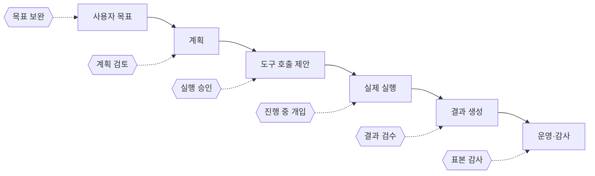
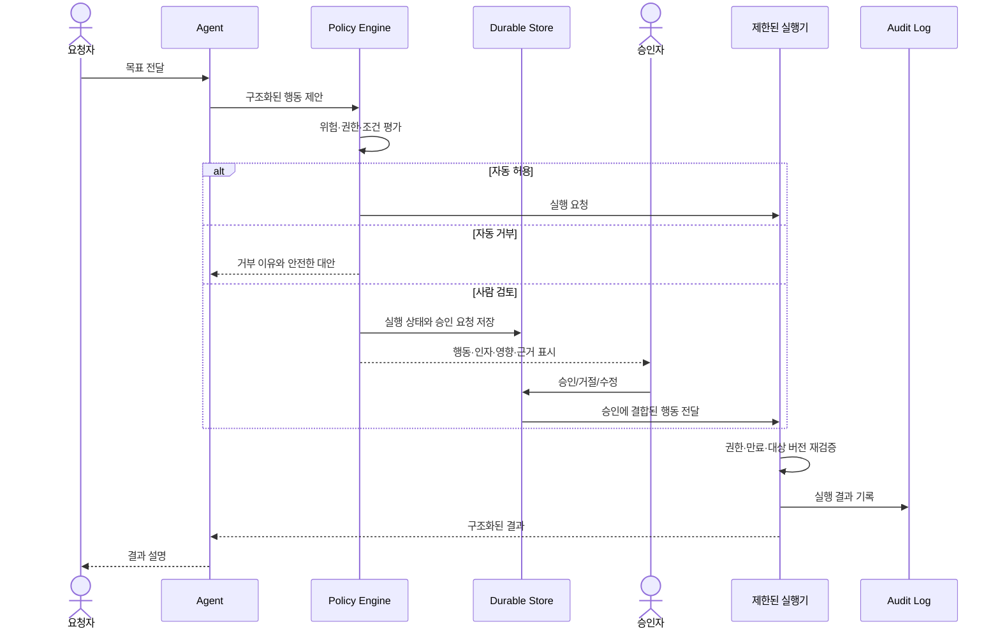

# Agentic AI의 Human-in-the-Loop 전체 조사 지도

> 조사 기준일: 2026-09-13  
> 조사 범위: LLM 기반 에이전트의 실행 중 인간 개입(HITL)  
> 이 문서의 역할: 개별 기술을 깊게 설명하기 전에 전체 방법, 구현 사례, 적용 사례와 비교 기준을 확정한다.

## 먼저 이해할 핵심

HITL은 에이전트가 위험한 행동을 하기 직전에 사람에게 `승인/거절`을 묻는 기능만 뜻하지 않는다. 사람은 목표를 보완하고, 계획을 수정하고, 부족한 정보를 제공하고, 도구 호출을 승인하고, 결과를 검수하고, 실행 후 표본을 감사할 수 있다.

따라서 HITL을 설계할 때는 다음 여섯 질문에 답해야 한다.

1. **왜 개입하는가?** 안전, 정확성, 권한, 책임, 학습 중 무엇을 위한 것인가?
2. **언제 개입하는가?** 계획 전, 실행 전, 실행 중, 결과 제출 전, 실행 후 중 어느 시점인가?
3. **무엇을 판단하는가?** 자연어 설명, 계획, 도구 이름, 실제 인자, 변경 diff, 결과 중 무엇인가?
4. **어떻게 멈추고 다시 시작하는가?** 프로세스를 붙잡아 두는가, 상태를 저장하고 종료하는가?
5. **사람에게 무엇을 보여주는가?** 행동·대상·영향·근거·되돌리기 방법이 보이는가?
6. **효과를 어떻게 평가하는가?** 승인률만 보는가, 사고 감소·오탐·대기시간·번복률까지 보는가?

## HITL과 비슷하지만 구분해야 하는 개념

| 개념 | 사람이 관여하는 시점 | 에이전트 실행을 직접 막는가? | 예시 |
| --- | --- | --- | --- |
| Human-in-the-loop | 실행 과정 안 | 보통 그렇다 | 송금 직전 승인 |
| Human-on-the-loop | 실행 중 감독 | 필요할 때만 | 관제 화면에서 중지 |
| Human-over-the-loop | 정책·감사 수준 | 보통 아니다 | 주간 표본 감사와 정책 조정 |
| Human-out-of-the-loop | 실행 중 관여 없음 | 아니다 | 저위험 읽기 작업 자동 실행 |
| Guardrail | 자동 정책 검사 | 자동으로 차단 가능 | 금액 한도 초과 거부 |
| 권한 통제 | 실행 주체의 기술적 권한 제한 | 권한 밖 행동을 차단 | 읽기 전용 DB 계정 |

HITL은 guardrail이나 최소 권한을 대신하지 않는다. OWASP는 과도한 기능·권한·자율성을 `Excessive Agency`의 원인으로 보고, 고위험 행동에 사용자 승인을 요구하는 동시에 도구와 권한 자체도 최소화하도록 권고한다.[^owasp-agency] 사람의 승인은 여러 방어선 중 하나다.

## 개입 목적에 따른 전체 분류

### 1. 정보 보충

에이전트가 작업을 계속하려면 사람만 알고 있는 정보가 필요할 때 사용한다. 배송 주소 확인, 모호한 요구사항 선택, 누락된 업무 규칙 입력이 이에 해당한다.

- 대표 결정: 자유 텍스트 응답, 선택지 선택
- 장점: 잘못된 가정을 줄인다.
- 약점: 에이전트가 질문 시점을 스스로 정하면 불필요한 질문이 늘거나 필요한 질문을 건너뛸 수 있다.

### 2. 방향 수정과 steering

사람이 목표, 계획 또는 중간 산출물을 보고 다음 행동을 바꾼다. 승인보다 범위가 넓으며 `계속`, `수정 후 계속`, `다른 경로로 전환`, `중단`이 필요하다.

- 대표 결정: 계획 편집, 피드백 후 재계획, 특정 단계로 되돌리기
- 장점: 긴 작업의 방향 오류를 초기에 잡는다.
- 약점: 재계획 후 과거 승인이 여전히 유효한지 판단하기 어렵다.

### 3. 실행 전 승인

에이전트가 외부 세계를 바꾸는 도구를 호출하기 직전에 멈춘다. 파일 삭제, 이메일 발송, 배포, 결제, 환불, 데이터 변경이 대표적이다.

- 대표 결정: 승인, 거절, 인자 수정
- 장점: 부작용이 생기기 전에 차단한다.
- 약점: 승인 피로, 형식적인 클릭, 설명과 실제 실행 내용의 불일치가 발생할 수 있다.

### 4. 결과 검수

에이전트가 초안을 완성한 뒤 사람이 공개·전달·확정 여부를 판단한다. 콘텐츠, 보고서, 의료 데이터 비식별화 결과처럼 전체 결과를 보아야 판단 가능한 작업에 적합하다. Google Cloud는 민감 문서 요약, 큰 금융 거래, 환자 데이터 공개 전 검수를 사례로 제시한다.[^google-pattern]

- 대표 결정: 확정, 수정 요청, 폐기
- 장점: 전체 맥락을 보고 품질을 판단할 수 있다.
- 약점: 이미 수행된 중간 부작용은 되돌리지 못한다.

### 5. 예외 에스컬레이션

정책 범위 안에서는 자동 실행하고, 금액·대상·신뢰도·정책 위반 가능성이 임계치를 넘을 때만 사람에게 보낸다.

- 대표 결정: 예외 승인, 안전한 대안 선택, 상급자 전달
- 장점: 처리량을 유지하면서 중요한 사례에 사람의 시간을 집중한다.
- 약점: 위험 분류기가 틀리면 필요한 개입이 발생하지 않는다.

### 6. 실행 중 감독과 중지

긴 작업을 사람이 관찰하다가 중지하거나 방향을 바꾼다. 브라우저 조작, 코딩 에이전트, 장기 데이터 처리처럼 행동이 연속적으로 발생하는 환경에서 필요하다.

- 대표 결정: 일시정지, 즉시 취소, 범위 축소, 롤백
- 장점: 사전에 모두 예측하지 못한 위험에 대응한다.
- 약점: 취소 신호가 이미 시작된 외부 작업까지 원자적으로 멈추지는 못할 수 있다.

### 7. 실행 후 감사와 학습

모든 작업을 막지 않고 일부 결과를 표본 검토하거나 사고·사용자 불만이 발생한 사례를 재검토한다. 검토 결과는 정책, 평가 데이터, 프롬프트와 자동 승인 기준 개선에 사용한다.

- 대표 결정: 적합/부적합 판정, 오류 유형 라벨, 정책 수정 제안
- 장점: 대량 저위험 작업의 속도를 유지한다.
- 약점: 피해가 발생하기 전에는 막지 못한다.

## 개입 시점에 따른 구조

| 시점 | 사람이 보는 대상 | 적합한 상황 | 놓칠 수 있는 위험 |
| --- | --- | --- | --- |
| 목표 입력 직후 | 의도·범위·제약 | 모호한 장기 과업 | 이후 계획 변질 |
| 계획 생성 후 | 단계·도구·예상 영향 | 고비용·긴 작업 | 실행 인자 변경 |
| 도구 호출 전 | 도구·인자·대상 | 외부 부작용 | 설명과 실제 실행 불일치 |
| 단계 완료 후 | 중간 결과·상태 | 단계별 품질 검수 | 이미 발생한 부작용 |
| 최종 제출 전 | 전체 결과 | 공개·전달·의사결정 | 숨은 중간 부작용 |
| 실행 중 | 이벤트·진행 상태 | 장기 실행·computer use | 중지 지연 |
| 실행 후 | 로그·결과 표본 | 저위험 대량 처리 | 사전 예방 불가 |

## 사람이 내릴 수 있는 결정

HITL 구현을 `예/아니오`로 제한하면 실제 업무를 충분히 표현하지 못한다.

| 결정 | 의미 | 구현 시 주의점 |
| --- | --- | --- |
| Approve | 제안된 행동을 그대로 허용 | 승인 대상을 정확한 인자와 결합해야 한다. |
| Reject | 실행하지 않고 이유를 돌려준다 | 모델이 같은 행동을 반복하지 않도록 명확한 피드백이 필요하다. |
| Edit | 인자나 산출물을 수정한 뒤 실행 | 큰 변경은 새 제안으로 보고 재검토할 수 있다. |
| Respond | 도구 실행 대신 사람의 답을 반환 | 질문 도구에 적합하며 부작용 도구에는 성공 결과처럼 오해될 수 있다. |
| Retry | 추가 지침과 함께 다시 계획한다 | 무한 재시도를 제한해야 한다. |
| Delegate | 다른 담당자나 전문 검토자에게 넘긴다 | 소유권과 만료 시간을 기록해야 한다. |
| Abort | 전체 작업을 종료한다 | 예약·부분 실행에 대한 보상 처리가 필요하다. |
| Trust temporarily | 일정 범위에서 다시 묻지 않는다 | 범위·도구·인자·세션·만료 시간을 제한해야 한다. |

## 구현 방법의 전체 분류

### A. 동기식 입력 대기

CLI의 `input()`이나 열린 HTTP 연결에서 사람이 답할 때까지 프로세스가 기다린다.

- 구현 난이도: 낮음
- 적합: 로컬 실험, 짧은 대기
- 한계: 서버 재시작, 긴 대기, 다중 사용자, 취소 처리에 약함

### B. 상태 저장 후 interrupt/resume

실행 상태를 체크포인트나 직렬화된 run state로 저장하고 프로세스는 반환한다. 사람이 나중에 응답하면 같은 실행 식별자로 복원한다. LangGraph는 checkpointer와 `thread_id`, `interrupt()`, `Command(resume=...)`를 사용하며, 재개 시 interrupt가 있던 노드를 처음부터 다시 실행한다.[^langgraph-interrupt] OpenAI Agents SDK는 `RunState`를 직렬화해 장기 승인 대기를 지원한다.[^openai-hitl]

- 구현 난이도: 중간
- 적합: 웹/API, 장기 대기, 운영 환경
- 한계: 코드·프롬프트·도구 버전 변경, 중복 resume, 재실행 안전성을 별도로 다뤄야 함

### C. 워크플로 엔진의 외부 이벤트 대기

승인 요청을 durable workflow의 외부 이벤트로 모델링한다. Microsoft Agent Framework는 `RequestPort`와 request/response event로 외부 시스템의 응답을 해당 executor에 돌려준다.[^ms-hitl] Temporal에서는 Signal·Update 같은 메시지 전달을 사용해 장기 워크플로에 외부 입력을 제공할 수 있다.[^temporal-message]

- 구현 난이도: 높음
- 적합: 수시간~수일 대기, 재시작 복구, 업무 프로세스
- 한계: 인프라와 상태 모델이 무거우며 에이전트 상태와 워크플로 상태를 맞춰야 함

### D. 도구 middleware·hook·intervention

모든 도구 호출 앞에 공통 정책 계층을 둔다. Deep Agents의 `interrupt_on`, Strands의 `HumanInTheLoop` intervention, OpenAI Agents SDK의 `needs_approval`이 여기에 속한다.[^deepagents-hitl][^strands-hitl][^openai-hitl]

- 구현 난이도: 낮음~중간
- 적합: 여러 도구에 일관된 정책 적용
- 한계: 도구 밖에서 생기는 모델 응답·계획·내부 상태 변경은 포착하지 못할 수 있음

### E. 명시적 human node·user proxy

사람을 그래프의 노드 또는 대화 참여자로 모델링한다. AutoGen의 `UserProxyAgent`는 팀 실행 중 사람의 피드백을 받는 참여자 역할을 한다.[^autogen-hitl] CrewAI의 기본 `human_input`은 작업의 최종 답변을 내기 전에 사용자 입력을 요청한다.[^crewai-human-input]

- 구현 난이도: 낮음~중간
- 적합: 협업, 검수, 자유 형식 피드백
- 한계: 권한 통제보다 대화 흐름에 가깝기 때문에 고위험 실행 차단에는 별도 통제가 필요함

### F. 정책 엔진 + 조건부 에스컬레이션

규칙 또는 위험 분류기가 `허용/거부/사람 검토`를 결정한다. Strands는 allow-list, 세션 trust, 사용자 정의 또는 LLM 기반 위험 분류를 제공한다.[^strands-api] 조건은 도구 이름뿐 아니라 금액, 대상, 경로, 데이터 민감도, 사용자 역할을 포함할 수 있다.

- 구현 난이도: 중간~높음
- 적합: 처리량이 많고 위험 수준이 다양한 환경
- 한계: LLM이 위험 분류까지 담당하면 동일한 오류·공격에 함께 취약해질 수 있음

### G. 외부 승인 서비스

에이전트 런타임과 별도의 control plane이 승인 요청, 담당자 배정, 만료, 다중 승인, 감사 로그를 관리한다. Slack·웹·모바일 등 여러 채널을 연결할 때 유리하다.

- 구현 난이도: 높음
- 적합: 조직 단위 승인, 규제·감사, 여러 에이전트 통합
- 한계: 승인 서비스가 허가한 내용과 실행기가 실제 수행하는 내용을 구조적으로 결합하지 않으면 우회 가능

## 운영 패턴

| 패턴 | 동작 | 적합한 위험 수준 | 주요 장점 | 주요 약점 |
| --- | --- | --- | --- | --- |
| 모든 행동 사전 검토 | 매번 사람 승인 | 매우 높음 | 단순하고 보수적 | 병목과 승인 피로 |
| 위험 도구만 승인 | 도구별 allow/deny | 중~높음 | 구현이 쉬움 | 같은 도구 안의 위험 차이를 놓침 |
| 조건부 승인 | 인자·정책으로 선별 | 혼합 | 사람 시간을 집중 | 정책 오류가 곧 누락 |
| 예외 에스컬레이션 | 자동 처리 후 예외만 전달 | 중간 | 높은 처리량 | 예외 탐지 품질 의존 |
| 이중 승인 | 두 사람이 승인 | 치명적 | 내부자·실수 위험 감소 | 느리고 운영 비용 큼 |
| 시간 제한 승인 | 만료 전 응답 필요 | 시급한 업무 | 정체 상태 관리 | timeout 기본값 설계가 어려움 |
| 표본 감사 | 일부 완료 건만 검토 | 낮음 | 처리량 유지 | 사후 대응만 가능 |
| Shadow mode | 실행 없이 제안만 기록 | 도입 초기 | 안전한 성능 측정 | 실제 실행 조건과 차이 가능 |
| 점진적 자율성 | 성능에 따라 승인 범위 축소 | 성숙 과정 | 데이터 기반 확장 | trust 범위가 누적될 위험 |

## 구현 사례 후보군

이 목록은 우열 순위가 아니라 상세 조사해야 할 대표 구현군이다.

| 구현군 | 대표 기술 | 조사할 핵심 |
| --- | --- | --- |
| 그래프 checkpoint형 | LangGraph, Deep Agents | interrupt, checkpointer, thread, 재실행 의미론 |
| 직렬화 run-state형 | OpenAI Agents SDK | interruption, `RunState`, nested agent, sticky approval |
| workflow request/response형 | Microsoft Agent Framework | RequestPort, checkpoint, 외부 event routing |
| intervention middleware형 | Strands Agents | allow-list, trust, classifier, fail-closed |
| 대화 참여자형 | AutoGen | UserProxyAgent, 실행 중/실행 사이 피드백 |
| task/flow feedback형 | CrewAI | task final review와 flow-level HITL 차이 |
| action confirmation형 | Google ADK | tool confirmation, graph human input, session/resume |
| durable workflow 결합형 | Temporal, DBOS, Restate | signal/event, 장기 대기, idempotency, compensation |
| 외부 approval control plane형 | HumanLayer류와 자체 승인 서비스 | 채널, 담당자, SLA, 감사, 실행 결합 |
| 제품 내 권한 승인형 | 코딩·브라우저·업무 자동화 에이전트 | command/file/network scope, session trust, UX |

## 적용 사례 후보군

- **소프트웨어 개발과 운영:** 파일 수정·삭제, shell 명령, production 배포, 인프라 변경, PR 생성·병합
- **고객 지원과 커뮤니케이션:** 환불·쿠폰·계정 정지, 이메일·메신저·SNS 발송, 답변 검수
- **금융과 구매:** 결제, 송금, 주문, 계약, 금액별 조건부 승인과 이중 승인
- **데이터와 개인정보:** 데이터 삭제·갱신, 개인정보 반출, 비식별화 결과 공개
- **의료·법률·채용:** AI 결과 해석과 최종 의사결정, 결정권자와 운영자 역할 분리
- **장기 연구와 콘텐츠:** 조사 계획 승인, 중간 방향 수정, 인용·근거·최종 산출물 검수

## 모든 구현에 적용할 비교 기준

| 영역 | 확인할 질문 |
| --- | --- |
| 개입 범위 | 목표·계획·도구·결과 중 어디서 멈출 수 있는가? |
| 정책 표현력 | 도구 이름뿐 아니라 인자, 사용자, 자원, 누적 영향으로 결정할 수 있는가? |
| 결정 종류 | 승인·거절·수정·응답·재시도·중단을 지원하는가? |
| 상태 내구성 | 프로세스·서버 재시작 뒤에도 재개할 수 있는가? |
| 재실행 의미론 | resume 시 어떤 코드가 다시 실행되며 부작용 중복을 어떻게 막는가? |
| 동시성 | 중복 응답, 여러 승인자, 먼저 도착한 응답을 어떻게 처리하는가? |
| 승인 결합 | 승인한 정확한 도구와 인자가 실행되는가? 실행 전 대상 상태가 바뀌면 무효화하는가? |
| 권한 | 승인과 별개로 실행 주체가 최소 권한을 가지는가? |
| UI 품질 | 실제 행동, 대상, diff, 영향, 출처와 되돌리기 방법이 보이는가? |
| 감사 가능성 | 제안·정책 판정·승인자·실행 결과·버전을 연결해 기록하는가? |
| 실패 정책 | 승인 서비스 오류·timeout·취소 시 fail closed인가? |
| 운영 비용 | 승인 빈도, 대기시간, 담당자 부하, 알림 채널은 감당 가능한가? |
| 평가 | 사고 감소, precision/recall, 번복률, 승인 피로를 측정하는가? |
| 통합성 | API·streaming·subagent·MCP·background worker와 결합되는가? |

## 공통 실패 양상

### 승인한 설명과 실행할 행동이 다르다

사람이 모델의 자연어 요약만 보고 승인하면 실제 도구 이름과 인자를 검증하지 못한다. 승인 레코드는 정규화된 행동과 정확한 인자, 대상 자원의 현재 버전에 결합해야 한다.

### resume 이후 같은 코드가 다시 실행된다

LangGraph를 포함한 interrupt 기반 시스템은 중단 지점이 포함된 node나 tool을 처음부터 다시 실행할 수 있다.[^langgraph-interrupt] interrupt 앞에서 외부 부작용을 수행하면 재개 시 중복된다. 승인 전 단계는 순수 계산으로 두고 부작용은 승인 이후 별도 idempotent executor에서 수행해야 한다.

### 승인이 세션 전체 권한으로 커진다

`항상 허용`은 편리하지만 도구 이름만으로 trust를 저장하면 다음 호출의 대상과 인자가 달라져도 실행될 수 있다. 범위, 사용자, 자원, 최대 금액, 만료, 정책 버전을 함께 제한해야 한다.

### 사람이 자동화 편향에 빠진다

EU AI Act Article 14는 고위험 AI를 효과적으로 감독할 수 있는 인터페이스와 함께, 사용자가 자동으로 AI 출력을 신뢰하는 경향을 인식하고 결과를 올바르게 해석할 수 있어야 한다고 규정한다.[^eu-ai-act] 승인 버튼의 존재만으로 효과적인 감독이 되는 것은 아니다.

### 승인 요청이 너무 많다

모든 행동을 묻는 정책은 사람이 내용을 읽지 않고 승인하게 만든다. 위험 기반 선별, 요청 batch, 표본 감사, shadow mode를 조합해야 한다. 동시에 분류기가 놓친 위험을 측정해야 한다.

### 승인 UI 자체가 공격 표면이 된다

OWASP는 외부 문서나 도구 결과의 공격자 제어 텍스트가 승인 대화상자의 Markdown·HTML·공백을 조작해 사람을 속일 수 있다고 설명한다.[^owasp-litl] 승인 UI는 신뢰할 수 없는 콘텐츠와 시스템이 생성한 행동 정보를 시각적으로 분리하고 렌더링을 제한해야 한다.

## 전체 시스템의 기준 흐름

이 흐름에서 중요한 점은 에이전트가 승인 후 직접 임의의 행동을 만드는 것이 아니라, 승인된 구조화 행동을 제한된 실행기가 다시 검증하고 실행하는 것이다.

## 조사에서 확인된 합의와 긴장 관계

### 강한 합의

- 고위험·비가역·외부 공개 행동에는 실행 전 개입이 필요하다.
- HITL만으로는 충분하지 않으며 최소 권한, 자동 정책, sandbox, 감사 로그가 함께 필요하다.
- 장기 대기에는 프로세스를 붙잡는 방식보다 durable state와 resume 식별자가 필요하다.
- 사람에게 실제 행동과 영향을 이해할 정보를 제공해야 한다.
- 위험이 다른 모든 행동에 같은 승인 정책을 적용하면 운영 품질이 떨어진다.

### 해결해야 할 긴장

- **안전 대 처리량:** 많이 물을수록 안전해 보이지만 승인 피로가 커진다.
- **규칙 대 LLM 분류:** 규칙은 예측 가능하지만 유연하지 않고, LLM 분류는 유연하지만 공격과 오판에 취약하다.
- **도구 단위 대 workflow 단위:** 도구 gate는 구체적이지만 전체 의도를 놓치고, 계획 검토는 맥락이 넓지만 실제 인자 변경을 놓친다.
- **수정 허용 대 재검토:** 사람이 인자를 바로 수정하면 빠르지만 변경이 크면 기존 계획의 안전성 분석이 무효가 된다.
- **재개 편의 대 버전 안정성:** 오래 저장한 상태를 쉽게 재개할수록 그 사이 바뀐 코드·도구·정책과 충돌할 가능성이 커진다.

## 아직 답이 필요한 조사 질문

1. 각 프레임워크는 resume 시 정확히 어느 범위를 재실행하는가?
2. 여러 tool call이 동시에 승인 대기일 때 부분 승인과 순서를 어떻게 처리하는가?
3. 중복 또는 경쟁 resume 요청을 원자적으로 차단하는가?
4. 승인한 인자와 실제 실행 인자를 실행기가 검증하는가?
5. 승인 대기 중 코드·프롬프트·tool schema가 바뀌면 어떤 호환성 보장이 있는가?
6. 취소·timeout·담당자 부재의 기본 동작은 무엇인가?
7. subagent의 interrupt가 최상위 실행과 어떻게 연결되는가?
8. 승인 UI에 신뢰할 수 없는 텍스트가 섞이는 것을 어떻게 방지하는가?
9. 외부 부작용에 idempotency key나 compensation을 어떻게 적용하는가?
10. 실제 운영 사례에서 승인 피로와 위험 누락을 어떤 지표로 측정하는가?

## 다음 상세 조사 순서

전체 지도에 따라 다음 문서를 하나씩 작성한다. 각 문서는 **쉬운 설명 → 적용 상황 → 작동 흐름 → 코드 수준 구현 → 상태와 실패 처리 → 장점 → 단점 → DeepAgent 적용 가능성** 순서로 통일한다.

1. `01_HITL_개념과_개입_패턴.md`
2. `02_LangGraph_DeepAgents_interrupt_resume.md`
3. `03_OpenAI_Agents_SDK_RunState_approval.md`
4. `04_Microsoft_Agent_Framework_RequestPort.md`
5. `05_Strands_intervention_HITL.md`
6. `06_AutoGen_CrewAI_ADK_인간_개입.md`
7. `07_Durable_Workflow와_외부_승인_서비스.md`
8. `08_HITL_UI_보안_감사_평가.md`
9. `09_방법별_비교와_선택_가이드.md`
10. 사용자 환경 확인 후 `10_DeepAgent_HITL_적용_설계.md`

## 현재 단계의 결론

현재는 특정 구현을 선택할 단계가 아니다. 먼저 위 후보군을 같은 기준으로 상세 조사해야 한다. 현재 DeepAgent 서비스가 `deepagents==0.7.11`, `langgraph==1.2.11`, FastAPI, `MemorySaver`를 사용한다는 사실은 이후 적합성 평가의 기준점이 된다. 운영 구현에서는 in-memory checkpointer를 durable store로 바꾸는 문제와 API가 interrupt 상태를 응답으로 표현하는 문제가 핵심 후보가 될 가능성이 높다. 이것은 아직 추천이 아니라 이후 검증할 가설이다.

## 출처와 신뢰도

| 출처 | 사용한 내용 | 신뢰도 |
| --- | --- | --- |
| [LangGraph Interrupts](https://langchain-ai.github.io/langgraph/how-tos/human_in_the_loop/wait-user-input/) | checkpoint, thread, interrupt/resume, node 재실행 | 강함: 공식 기술 문서 |
| [Deep Agents HITL](https://docs.langchain.com/oss/python/deepagents/human-in-the-loop) | tool middleware와 decision 유형 | 강함: 공식 기술 문서 |
| [OpenAI Agents SDK HITL](https://openai.github.io/openai-agents-python/human_in_the_loop/) | RunState, 승인, 직렬화, nested agent | 강함: 공식 기술 문서 |
| [Microsoft Agent Framework HITL](https://learn.microsoft.com/en-us/agent-framework/workflows/human-in-the-loop) | workflow request/response 구조 | 강함: 공식 기술 문서 |
| [Strands Agents HITL](https://strandsagents.com/docs/user-guide/concepts/agents/interventions/human-in-the-loop/) | intervention, allow-list, trust, classifier | 강함: 공식 기술 문서 |
| [AutoGen HITL](https://microsoft.github.io/autogen/stable/user-guide/agentchat-user-guide/tutorial/human-in-the-loop.html) | UserProxyAgent와 run 사이 피드백 | 강함: 공식 기술 문서 |
| [CrewAI Human Input](https://docs.crewai.com/en/learn/human-input-on-execution) | task 종료 전 human input | 강함: 공식 기술 문서 |
| [Google Cloud Agentic AI patterns](https://docs.cloud.google.com/architecture/choose-design-pattern-agentic-ai-system) | HITL 적용 사례와 복잡성 | 강함: 공식 아키텍처 지침 |
| [Google ADK 문서 인덱스](https://adk.dev/llms.txt) | graph human input, action confirmation, resume 기능의 존재 | 강함: 공식 인덱스, 세부 검증 필요 |
| [Temporal Workflow message passing](https://docs.temporal.io/develop/python/workflows/message-passing) | 장기 workflow의 외부 입력 수단 | 강함: 공식 기술 문서 |
| [OWASP Excessive Agency](https://genai.owasp.org/llmrisk/llm062025-excessive-agency/) | 최소 기능·권한·자율성과 HITL | 강함: 공개 보안 지침 |
| [OWASP AI Agent Security Cheat Sheet](https://cheatsheetseries.owasp.org/cheatsheets/AI_Agent_Security_Cheat_Sheet.html) | 위험 분류, preview, audit metadata | 강함: 공개 보안 지침 |
| [OWASP Lies-in-the-Loop](https://owasp.org/www-community/attacks/Lies_in_the_Loop) | 승인 UI 조작 공격 | 중간: OWASP community 문서, 구현별 검증 필요 |
| [NIST AI RMF Core](https://airc.nist.gov/airmf-resources/airmf/5-sec-core/) | 감독 역할·절차 정의와 문서화 | 강함: 공식 위험관리 프레임워크 |
| [EU AI Act Article 14](https://eur-lex.europa.eu/eli/reg/2024/1689/oj) | 효과적 감독, 해석 가능성, 자동화 편향 | 강함: 법령 원문; 구체적 적용에는 법률 검토 필요 |
| [Human-LLM interaction taxonomy](https://arxiv.org/abs/2404.00405) | 인간-LLM 상호작용 단계 분류 참고 | 중간: 연구 논문 |
| [Survey on feedback mechanisms of LLM agents](https://www.ijcai.org/proceedings/2025/1175.pdf) | human feedback를 포함한 feedback taxonomy | 강함: peer-reviewed survey |

[^langgraph-interrupt]: LangChain, [Interrupts](https://langchain-ai.github.io/langgraph/how-tos/human_in_the_loop/wait-user-input/), 확인일 2026-09-13.
[^deepagents-hitl]: LangChain, [Deep Agents Human-in-the-loop](https://docs.langchain.com/oss/python/deepagents/human-in-the-loop), 확인일 2026-09-13.
[^openai-hitl]: OpenAI, [Agents SDK Human-in-the-loop](https://openai.github.io/openai-agents-python/human_in_the_loop/), 확인일 2026-09-13.
[^ms-hitl]: Microsoft, [Agent Framework Human-in-the-loop](https://learn.microsoft.com/en-us/agent-framework/workflows/human-in-the-loop), 확인일 2026-09-13.
[^strands-hitl]: Strands Agents, [Human in the Loop](https://strandsagents.com/docs/user-guide/concepts/agents/interventions/human-in-the-loop/), 확인일 2026-09-13.
[^strands-api]: Strands Agents, [HumanInTheLoop API](https://strandsagents.com/docs/api/python/strands.vended_interventions.hitl.hitl/), 확인일 2026-09-13.
[^autogen-hitl]: Microsoft, [AutoGen Human-in-the-Loop](https://microsoft.github.io/autogen/stable/user-guide/agentchat-user-guide/tutorial/human-in-the-loop.html), 확인일 2026-09-13.
[^crewai-human-input]: CrewAI, [Human Input on Execution](https://docs.crewai.com/en/learn/human-input-on-execution), v1.15.21, 확인일 2026-09-13.
[^google-pattern]: Google Cloud, [Choose a design pattern for your agentic AI system](https://docs.cloud.google.com/architecture/choose-design-pattern-agentic-ai-system), 확인일 2026-09-13.
[^temporal-message]: Temporal, [Workflow message passing - Python SDK](https://docs.temporal.io/develop/python/workflows/message-passing), 확인일 2026-09-13.
[^owasp-agency]: OWASP, [LLM06:2025 Excessive Agency](https://genai.owasp.org/llmrisk/llm062025-excessive-agency/), 확인일 2026-09-13.
[^owasp-litl]: OWASP, [HITL Dialog Forging](https://owasp.org/www-community/attacks/Lies_in_the_Loop), 확인일 2026-09-13.
[^eu-ai-act]: European Union, [Regulation (EU) 2024/1689, Article 14](https://eur-lex.europa.eu/eli/reg/2024/1689/oj), 2026-07-27 consolidated version, 확인일 2026-09-13.
