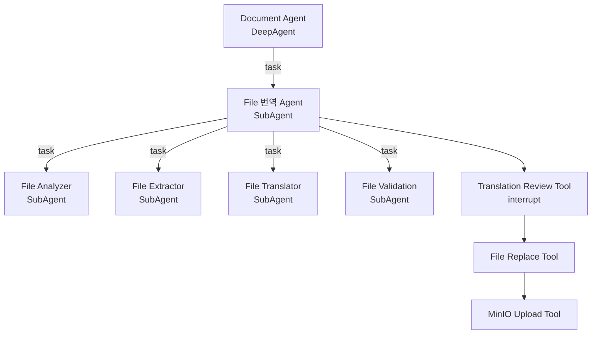
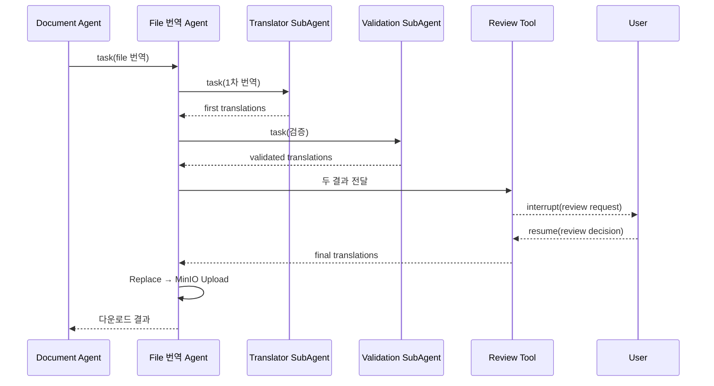
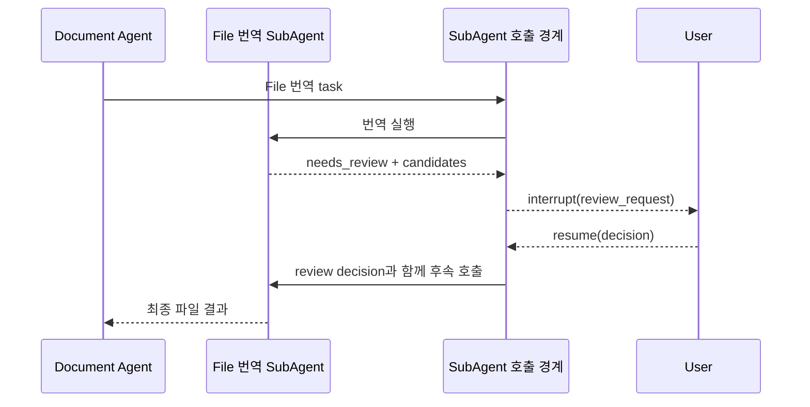
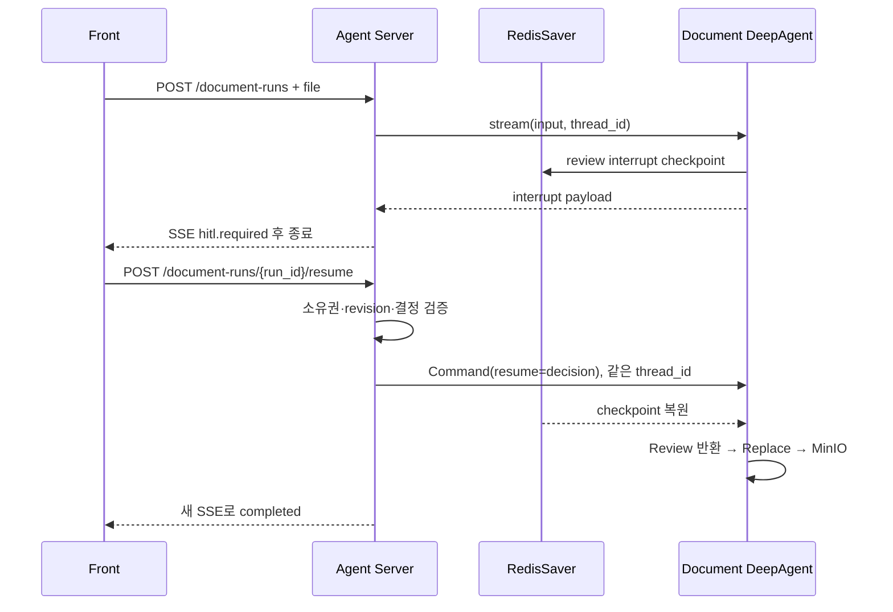
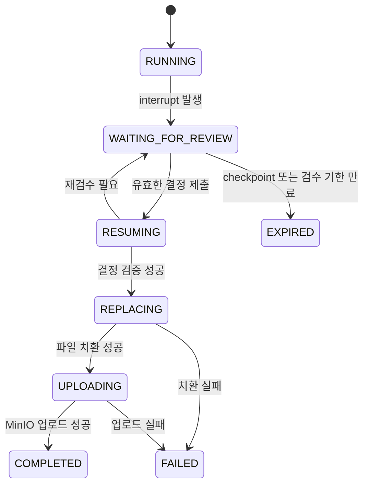

# DeepAgent SubAgent 구조의 File 번역 HITL 적용 후보 조사

> 작성일: 2026-09-13  
> 조사 단계: 후보 수집과 비교 기준 정리. 최종 방식은 아직 선택하지 않음.  
> 전제 환경: DeepAgent SubAgent 호출 구조, RedisSaver, HTTPS, SSE, MinIO  
> 범위: LangGraph는 DeepAgent 내부 실행 기반으로만 사용하며 별도 Graph Workflow를 직접 설계하지 않는다.

## 1. 적용할 Agent 구조



DeepAgent가 내부적으로 LangGraph 위에서 작동하는 것과 애플리케이션을 직접 Graph Workflow로 설계하는 것은 다른 문제다. 여기서는 Document Agent와 File 번역 Agent가 DeepAgent 방식으로 SubAgent와 도구를 호출한다. RedisSaver와 `interrupt()`는 실행을 멈추고 복원하는 내부 기반으로만 사용한다.

## 2. 이번 HITL의 종류

사용자는 위험한 실행을 단순 승인하지 않는다. 다음 셋 중 최종 번역을 결정하는 **결과 검수자이자 편집자**다.

1. File Translator의 1차 번역 선택
2. File Validation의 검증 번역 선택
3. 사용자가 직접 수정한 번역 제출

따라서 `approve / reject`만으로는 부족하다.

```text
검수 요청
├─ review_request_id와 revision
├─ 원문과 segment_id
├─ 1차 번역
├─ 검증 번역
└─ 검증 사유

검수 결정
├─ segment_id
├─ selected: first | validated | custom
└─ custom_text: selected=custom일 때 필수
```

## 3. 구현 후보

### 후보 A — File 번역 Agent의 전용 검수 도구에서 `interrupt()` 호출

File 번역 Agent가 Translator와 Validation SubAgent의 결과를 받은 뒤 `request_translation_review` 도구를 호출한다. 이 도구가 두 결과를 `interrupt()`로 프런트에 보내고, 재개되면 사용자 결정을 최종 번역으로 정규화해 File 번역 Agent에 반환한다. Deep Agents 공식 문서가 설명하는 SubAgent 도구 내부 interrupt 방식이다.[^deepagents-hitl]



장점:

- 요구한 DeepAgent와 SubAgent 계층을 유지한다.
- `first / validated / custom` 결정을 그대로 표현한다.
- 검수 요청 생성과 응답 검증을 전용 도구에 모은다.
- RedisSaver의 pause/resume를 직접 활용한다.

단점:

- SubAgent와 도구 호출 순서를 LLM이 결정한다.
- 검수 도구를 건너뛰고 Replace를 호출하지 못하게 서버 측 방어가 필요하다.
- 중첩 interrupt의 전파와 재개를 실제 선택 버전으로 검증해야 한다.

적합성 가설: 번역 전용 결정을 표현하기 좋다. 다만 LLM이 검수 도구를 반드시 호출하도록 보장하는 방법과 중첩 interrupt의 안정성을 확인해야 한다.

### 후보 B — Replace 도구에 `interrupt_on` 적용

File 번역 Agent가 `replace_file`을 호출하기 직전에 HITL middleware가 멈춘다. 사용자는 표준 `approve`, `edit`, `reject` 중 하나를 고른다.[^deepagents-hitl]

장점:

- Deep Agents의 표준 도구 승인 기능이다.
- 실제 파일 변경 직전에 반드시 중단한다.
- `edit`으로 도구 인자를 수정할 수 있다.

단점:

- 두 번역을 비교해 고른다는 업무 의미가 약하다.
- 후보와 검증 설명을 Replace 인자에 실어야 한다.
- `edit`은 번역 검수 전용 계약이 아니다.

적합성 가설: 파일 변경 직전 승인에는 강하지만, 두 번역을 비교하는 결과 검수 요구를 얼마나 자연스럽게 표현할 수 있는지 확인해야 한다.

### 후보 C — File 번역 Agent가 결과를 반환하고 상위에서 중단

File 번역 Agent가 `needs_review` 결과를 Document Agent에 돌려주고, 상위 호출 도구가 `interrupt()`한다.

장점:

- Agent Server에서 interrupt를 발견하기 쉽다.
- 깊은 중첩 interrupt를 피한다.

단점:

- 번역 검수 책임이 File 번역 Agent 밖으로 나온다.
- 사용자 결정이 Document Agent를 거쳐 다시 전달된다.
- 상위 LLM이 중간 값 전달에 개입할 수 있다.

적합성 가설: interrupt 전달 경계를 단순화할 수 있지만 번역 업무 책임이 상위 Agent로 이동하는 비용이 있다.

### 후보 D — Agent 밖의 Review Job 서비스

두 결과를 별도 review job에 저장하고 사용자 결정 뒤 후속 Agent 실행을 시작한다. 여러 검수자, 배정, 알림, 승인 기한에는 유리하지만 현재 요구에는 무겁다.

## 4. 1차 비교표

| 기준 | A. 전용 검수 도구 | B. `interrupt_on` | C. 상위에서 중단 | D. Review Job |
| --- | --- | --- | --- | --- |
| SubAgent 구조 유지 | 매우 높음 | 매우 높음 | 높음 | 중간 |
| 두 결과 비교 표현력 | 매우 높음 | 중간 | 높음 | 매우 높음 |
| 직접 수정 | 자연스러움 | tool args 편집 | 자연스러움 | 자연스러움 |
| 업무 책임 위치 | File 번역 Agent | Replace 도구 | Document Agent | 외부 서비스 |
| 구현량 | 작음~중간 | 작음 | 중간 | 큼 |
| 현재 확인할 핵심 | 호출 강제와 중첩 재개 | 결정 표현력 | 책임 이동과 값 전달 | 운영 복잡도 |

이 표는 순위를 확정하기 위한 결과가 아니다. 각 후보가 해결하는 문제의 위치가 다르므로 아래의 구현 흐름과 실패 조건을 확인한 뒤 선택해야 한다.

### 4.1 이후 선택에 사용할 공통 기준

각 후보를 같은 질문으로 검증해야 한다.

1. **구조 적합성**: Document → File 번역 → 하위 SubAgent 구조를 유지하는가
2. **결정 표현력**: 1차 선택, 검증본 선택, 직접 수정을 손실 없이 표현하는가
3. **중단 위치**: 실제로 1~4단계 이후이면서 Replace 이전에 멈추는가
4. **결정 무결성**: 사용자의 선택이 LLM에 의해 다시 작성되지 않고 Replace까지 전달되는가
5. **지속성**: 서버 재시작 뒤 RedisSaver에서 복원되는가
6. **전송 적합성**: 첫 SSE 종료와 새 HTTPS resume 요청이 자연스러운가
7. **멱등성**: 중복 resume, Replace, Upload를 막을 수 있는가
8. **관찰성**: 현재 어느 SubAgent와 검수 요청에서 멈췄는지 조회할 수 있는가
9. **확장성**: 파일 전체, batch, segment 검수로 바꿀 수 있는가
10. **운영 복잡도**: 별도 DB, 상태 머신, 복구 로직이 얼마나 필요한가

최종 선택 문서에서는 추측으로 점수를 매기지 않고 작은 spike와 요구사항 확인 결과를 이 기준에 대입한다.

## 5. 후보 A의 개념 구현: 전용 검수 도구

### 5.1 SubAgent 결과 계약

자연어 메시지만으로 두 결과를 결합하지 말고 구조화된 출력을 사용한다.

```python
class TranslationCandidate(TypedDict):
    segment_id: str
    original_text: str
    translated_text: str


class ValidatedTranslation(TypedDict):
    segment_id: str
    first_translation: str
    validated_translation: str
    validation_note: str
```

`segment_id`는 배열 순서가 아니라 원본 위치를 식별하는 안정적인 키다. 사용자 결정과 File Replace도 이 키로 연결한다.

### 5.2 전용 검수 도구

```python
from langchain.tools import tool
from langgraph.types import interrupt


@tool
def request_translation_review(
    review_request_id: str,
    revision: int,
    candidates: list[dict],
) -> dict:
    """두 번역 후보를 사용자에게 보여주고 최종 결정을 받는다."""
    request = {
        "type": "translation_review_required",
        "review_request_id": review_request_id,
        "revision": revision,
        "segments": candidates,
    }
    decision = interrupt(request)
    return validate_and_resolve_decision(request, decision)
```

재개 시 도구를 포함한 노드가 다시 실행될 수 있다. 따라서 `interrupt()` 앞에는 파일 쓰기, DB insert, MinIO 업로드, LLM 호출 같은 부수 효과를 두지 않는다.[^langgraph-interrupt]

### 5.3 File 번역 Agent의 호출 규칙

```text
1. Analyzer → Extractor → Translator → Validation 순서로 호출한다.
2. 두 번역 결과를 받은 뒤 request_translation_review를 반드시 호출한다.
3. review tool이 반환한 final_translations만 Replace에 전달한다.
4. review 전에는 Replace와 MinIO Upload를 호출하지 않는다.
5. Replace 성공 뒤에만 MinIO Upload를 호출한다.
```

프롬프트만으로 중요한 순서를 보호하면 안 된다. Replace 도구는 `review_request_id`와 `revision`을 필수로 받고 서버에서 검수 완료 여부를 검사해야 한다. Agent가 실수로 먼저 호출해도 실제 파일 변경이 거절된다.

### 5.4 후보 A의 재개 이후 흐름

재개 값은 검수 도구의 반환값이 된다. File 번역 Agent는 이 도구 결과에서 `final_translations`를 읽고 Replace 도구를 호출한다. 이 과정에서 LLM이 사용자 결정을 다시 요약하거나 번역하지 않도록, 검수 도구 결과를 구조화하고 Replace 도구가 같은 구조를 직접 받게 해야 한다.

```text
Command(resume=review_decision)
  → interrupt()의 반환값
  → validate_and_resolve_decision()
  → {final_translations, review_receipt}
  → File 번역 Agent의 tool result
  → replace_file(final_translations, review_receipt)
```

여기서 `review_receipt`는 검수가 완료됐다는 서버 측 증거다. 단순 문자열을 Agent가 만들어낼 수 없도록 서버가 검수 레코드와 대조한다.

### 5.5 후보 A에서 조사할 위험

- File 번역 Agent가 Validation 결과 일부를 누락하고 검수 도구를 호출할 수 있다.
- 검수 도구가 반환한 텍스트를 LLM이 다시 고쳐 Replace에 전달할 수 있다.
- 재개 시 같은 검수 도구 호출이 다시 평가되는 과정에서 인자가 달라질 수 있다.
- 한 File 번역 실행 안에서 두 번째 interrupt가 필요하면 중첩 재개 동작이 더 복잡해질 수 있다.
- Document Agent가 File 번역 SubAgent의 interrupt를 최종 응답으로 오해하거나 가공할 수 있다.

따라서 후보 A의 평가는 “코드가 가장 간단한가”보다 “검수 요청과 결정이 LLM을 거치며 변형되지 않는가”를 중심으로 해야 한다.

## 6. 후보 B의 개념 구현: `interrupt_on`

### 6.1 어디에서 멈추는가

이 방식은 결과를 보여주는 전용 도구가 아니라 **실제 파일을 변경하려는 도구 호출**에서 멈춘다.

```text
File 번역 Agent
  → replace_file 제안
      args:
        source_file_key
        translations
  → HumanInTheLoopMiddleware가 tool call 차단
  → approve | edit | reject
  → 허용된 경우 replace_file 실행
```

`interrupt_on`은 도구 이름을 기준으로 동작하며 표준 결정은 승인, 인자 수정, 거절이다. 따라서 사용자에게 1차 번역과 검증 번역을 모두 보여주려면 두 후보를 Replace 인자 또는 별도 표시 데이터에 포함해야 한다.[^deepagents-hitl]

### 6.2 우리 환경에 대입하는 두 가지 변형

변형 B1은 `replace_file` 자체를 검수 대상으로 삼는다.

```text
replace_file(
  source_file_key,
  selected_translations,
  first_candidates,
  validated_candidates
)
```

사용자가 approve하면 Agent가 미리 고른 번역을 사용한다. edit하면 `selected_translations`를 수정한다. 하지만 두 후보는 실행에 필요하지 않은 UI 데이터가 되어 도구 계약이 비대해진다.

변형 B2는 실행하지 않는 `finalize_translation` 도구를 별도로 만들고 여기에 `interrupt_on`을 적용한다.

```text
finalize_translation(candidates, proposed_final)
  → interrupt_on
  → approve/edit/reject
  → 승인된 결과를 Replace에 전달
```

B2는 Replace와 검수를 분리하지만, 사실상 후보 A와 비슷한 전용 검수 도구를 표준 middleware 결정 형식으로 구현한 것이다.

### 6.3 장점과 한계

장점:

- Deep Agents의 표준 HITL middleware와 decision 형식을 사용한다.
- 실제 tool call과 사용자가 승인한 인자를 가깝게 결합한다.
- reject 피드백을 Agent가 받아 대안을 다시 만들게 할 수 있다.

한계:

- `first / validated / custom`이 `approve / edit / reject`로 번역되어 업무 의미가 흐려진다.
- 전체 파일의 여러 segment 중 서로 다른 후보를 선택하는 UI와 decision 매핑이 복잡하다.
- reject 후 재번역까지 허용하면 한 번의 검수에서 여러 번의 interrupt가 생길 수 있다.
- Replace를 승인하는 것과 번역 품질을 선택하는 것은 서로 다른 결정이다.

## 7. 후보 C의 개념 구현: 상위 경계에서 interrupt

### 7.1 작동 방식

File 번역 SubAgent는 사람을 직접 호출하지 않고 다음 구조화 결과를 반환한다.

```json
{
  "status": "needs_review",
  "review_request": {
    "review_request_id": "review-123",
    "revision": 1,
    "segments": []
  }
}
```

Document Agent에서 File 번역 SubAgent를 호출하는 `task` 경계 또는 이를 감싼 도구가 이 결과를 보고 `interrupt(review_request)`를 호출한다. 사용자가 결정하면 상위 경계가 File 번역 Agent를 다시 호출하면서 검수 결정을 명시적 입력으로 전달한다.



### 7.2 확인할 문제

- 첫 번째 File 번역 호출에서 만든 Analyzer와 Extractor 결과를 두 번째 호출이 어떻게 재사용하는가
- 상위 Agent LLM을 거치지 않고 결정 데이터를 File 번역 Agent에 전달할 수 있는가
- File 번역 Agent가 새 실행으로 시작되면서 1~4단계를 반복하지 않는가
- 검수 책임이 Document Agent의 다른 업무와 섞이지 않는가

후보 C는 interrupt 관찰성이 좋아지는 대신, 동일한 SubAgent 실행을 그대로 재개하는 후보 A보다 상태 전달을 명시적으로 설계해야 한다.

## 8. 후보 D의 개념 구현: 외부 Review Job

### 8.1 작동 방식

File 번역 Agent가 두 후보를 만들면 Agent Server가 이를 review 저장소에 기록하고 `WAITING_FOR_REVIEW`로 전환한다. 사용자 결정 후 후속 요청이 File 번역 Agent에 승인된 결과를 새 입력으로 제공한다.

```text
Agent 실행 1
  → 분석·추출·번역·검증
  → Review Job 저장
  → 종료

사용자 검수
  → Review Job 결정 저장

Agent 실행 2
  → 승인된 최종 번역 입력
  → Replace
  → MinIO Upload
```

### 8.2 RedisSaver와의 관계

두 가지로 나뉜다.

1. Review Job을 저장하면서 DeepAgent도 interrupt 상태로 둔다. 결정 후 같은 실행을 resume한다.
2. 첫 Agent 실행은 완전히 종료하고, 결정 후 새로운 실행을 시작한다.

1번은 checkpoint와 review DB의 상태를 함께 맞춰야 한다. 2번은 재개가 단순하지만 첫 실행의 문맥을 새 입력으로 복원해야 한다.

### 8.3 언제 필요한가

- 검수 담당자가 원래 요청자와 다르다.
- 검수 작업함, 배정, 재배정, 알림이 필요하다.
- 승인 기한과 에스컬레이션이 있다.
- 한 파일을 여러 사람이 나눠 검수한다.
- Agent checkpoint보다 긴 기간 동안 검수 기록을 보존해야 한다.

현재 정보만으로 이런 요구가 있는지는 알 수 없으므로 후보에서 제거하지 않고 확장형으로 남긴다.

## 9. 모든 후보에 공통인 RedisSaver와 SSE 재개

`interrupt()` 시 DeepAgent 실행 상태가 RedisSaver에 저장된다. 사용자가 결정하면 서버가 같은 `thread_id`로 `Command(resume=decision)`을 전달한다. 다른 `thread_id`면 중단된 실행을 찾지 못한다.[^langgraph-interrupt]



SSE는 단방향이므로 사용자의 선택은 별도 HTTPS Resume Endpoint로 받는다. Resume 응답을 새 SSE로 열어 이후 진행률을 전송한다.

```http
POST /document-runs
Accept: text/event-stream

POST /document-runs/{run_id}/resume
Accept: text/event-stream
Content-Type: application/json

GET /document-runs/{run_id}
```

프런트가 `thread_id`를 선택하게 하지 않는다. 서버가 `run_id`와 연결된 내부 `thread_id`를 조회하고 사용자 소유권, 현재 검수 상태, `review_request_id`, `revision`, segment 목록을 검증한다.

### 9.1 검수 단위에 따른 차이

구현 후보와 별개로 검수 단위를 선택해야 한다.

| 검수 단위 | 흐름 | 장점 | 단점 |
| --- | --- | --- | --- |
| 파일 전체 1회 | 모든 segment를 한 interrupt에 전달 | 재개가 한 번이고 구현이 단순 | 큰 파일 UI가 무겁고 일부만 임시 확정하기 어려움 |
| segment별 연속 검수 | segment마다 interrupt/resume | 사용자가 작은 단위에 집중 | interrupt 횟수와 중첩 재개 위험이 큼 |
| batch 검수 | 일정 개수씩 묶어 반복 | 크기와 횟수의 균형 | batch 진행 상태와 부분 완료 관리 필요 |
| 차이 있는 항목만 | 두 후보가 다른 segment만 검수 | 검수량 감소 | 두 결과가 같아도 둘 다 틀릴 수 있음 |

이 결정은 후보의 적합도를 바꾼다. 파일 전체 1회 검수라면 후보 A의 단일 interrupt가 단순하다. 여러 batch에 걸쳐 반복 검수한다면 중첩 SubAgent 안에서 여러 번 재개하는 안정성과 부분 결정 저장이 더 중요해진다. 외부 Review Job의 가치도 커질 수 있다.

### 9.2 식별자와 역할

| 식별자 | 역할 |
| --- | --- |
| `run_id` | 프런트가 보는 한 번의 파일 번역 작업 |
| `thread_id` | RedisSaver가 중단된 DeepAgent 실행을 찾는 내부 키 |
| `review_request_id` | 사용자가 본 후보 snapshot과 결정을 결합하는 키 |
| `revision` | 오래된 화면의 지연·중복 제출을 거르는 버전 |
| `segment_id` | 원문 위치, 두 후보, 최종 번역을 결합하는 키 |

`thread_id`와 `review_request_id`는 같은 개념이 아니다. 하나의 Agent 실행이 여러 검수 요청을 만들 수 있고, 업무 감사에서는 사용자가 어떤 후보의 몇 번째 revision을 보고 결정했는지가 필요하다.

### 9.3 실행 상태와 업무 상태



DeepAgent checkpoint 상태와 서비스가 프런트에 노출하는 run 상태가 항상 자동으로 같아지는 것은 아니다. Agent Server는 interrupt 감지 시 `WAITING_FOR_REVIEW`, resume 수락 시 `RESUMING`, 완료 시 `COMPLETED`처럼 외부 상태를 갱신해야 한다.

### 9.4 부수 효과와 재실행

LangGraph interrupt가 있는 노드는 재개할 때 처음부터 다시 실행될 수 있다.[^langgraph-interrupt] 따라서 다음 경계를 지킨다.

```text
안전한 검수 도구
  순수한 request 구성
  → interrupt
  → decision 검증
  → 결과 반환

위험한 검수 도구
  review DB insert
  → 임시 파일 생성
  → interrupt
  → 재개 시 insert와 파일 생성을 다시 수행
```

검수 이력 저장이 필요하면 멱등 키를 사용해 중복 insert를 막거나 interrupt를 호출하는 코드 밖의 서비스 계층에서 저장한다. Replace와 MinIO Upload도 `run_id + revision` 기반 멱등 처리가 필요하다.

### 9.5 공통 실패 시나리오

| 상황 | 필요한 처리 |
| --- | --- |
| 첫 SSE가 검수 이벤트 전에 끊김 | 상태 조회 API에서 같은 review request 반환 |
| 검수 대기 중 Agent Server 재시작 | RedisSaver에서 같은 thread 재개 |
| 같은 결정을 두 번 제출 | 동일 결과를 반환하고 한 번만 resume |
| 서로 다른 두 번째 결정 제출 | conflict로 거절 |
| 오래된 revision 제출 | stale review로 거절하고 현재 요청 반환 |
| 잘못된 segment ID | Agent resume 전에 입력 거절 |
| 사용자 수정문 누락 | 유효성 오류 반환, 대기 상태 유지 |
| Replace 성공 후 응답 유실 | 멱등 키로 중복 치환 방지 |
| Replace 성공 후 Upload 실패 | 번역과 검수를 반복하지 않고 Upload 재시도 |
| checkpoint 만료 | `EXPIRED` 처리 후 새 번역 실행 필요 여부 안내 |

### 9.6 감사 기록

최소한 다음 내용을 남겨야 나중에 “어떤 번역을 사용자가 승인했는가”를 재구성할 수 있다.

- 사용자와 문서 식별자
- 검수 요청 시각과 결정 시각
- 원문 및 두 후보의 hash 또는 보관 위치
- 사용자에게 실제 표시한 revision
- segment별 선택 종류와 직접 수정문
- 최종 Replace에 전달한 번역의 hash
- 출력 파일의 MinIO object key와 checksum

이 기록은 Redis checkpoint의 내부 직렬화 구조에만 의존하지 않는 편이 좋다. checkpoint는 실행 복구가 목적이고 감사 레코드는 업무 설명과 장기 조회가 목적이기 때문이다.

## 10. 후보를 비교하려면 먼저 검증할 기술 가정

작은 spike에서 다음 흐름을 확인한다.

1. Document DeepAgent가 File 번역 SubAgent를 호출한다.
2. File 번역 SubAgent의 도구가 `interrupt()`한다.
3. interrupt가 최상위 호출과 SSE까지 전파된다.
4. Agent Server를 종료하고 다시 시작한다.
5. RedisSaver와 같은 `thread_id`로 재개한다.
6. 결정이 검수 도구의 반환값이 된다.
7. File 번역 Agent가 Replace를 한 번만 호출한다.

이 실험은 후보 A의 가능성을 확인한다. 실패 원인을 기록한 뒤 후보 C처럼 interrupt 경계를 한 단계 위로 올렸을 때 해결되는지도 별도로 비교한다.

## 11. 아직 선택하지 않은 후보군

```text
Document DeepAgent
  → File 번역 SubAgent
      → Analyzer SubAgent
      → Extractor SubAgent
      → Translator SubAgent
      → Validation SubAgent
      → request_translation_review tool에서 interrupt
      → 사용자 결정으로 resume
      → Replace tool
      → MinIO Upload tool
```

위 흐름은 후보 A를 적용했을 때의 모습이며 아직 최종 설계가 아니다. 현재 남겨 둘 후보는 다음과 같다.

1. **전용 검수 도구의 직접 interrupt**: 번역 전용 결정 표현과 중첩 재개를 평가한다.
2. **`interrupt_on` 기반 tool-call 검수**: 표준 기능의 단순성과 도메인 표현력의 차이를 평가한다.
3. **상위 SubAgent 호출 경계의 interrupt**: 상태 재사용과 책임 이동 비용을 평가한다.
4. **외부 Review Job**: 운영 요구가 커질 때 필요한 복잡도와 이점을 평가한다.

LangGraph는 네 후보 모두에서 직접 작성하는 업무 workflow로 취급하지 않는다. DeepAgent의 중단 위치와 실행 상태를 RedisSaver에 저장하고 이어 주는 내부 기반이다.

## 자료 신뢰도와 한계

| 자료 | 확인일 | 신뢰도 | 사용 범위 |
| --- | --- | --- | --- |
| LangGraph 공식 Interrupt 문서 | 2026-09-13 | 높음 | 중단·재개·동일 thread ID·노드 재실행 |
| Deep Agents 공식 HITL 문서 | 2026-09-13 | 높음 | SubAgent 도구 내부 interrupt와 resume |
| LangChain 공식 SubAgent 문서 | 2026-09-13 | 높음 | 중첩 SubAgent 상태 특성 |

새 프로젝트에서 버전을 선택한 뒤 중첩 SubAgent interrupt와 프로세스 재시작 후 resume를 통합 테스트해야 한다.

후속 상세 비교: [11_A_검수호출강제_Middleware_vs_Wrapper.md](./11_A_검수호출강제_Middleware_vs_Wrapper.md)

[^langgraph-interrupt]: [LangGraph 공식 문서 — Interrupts](https://docs.langchain.com/oss/python/langgraph/interrupts)
[^deepagents-hitl]: [Deep Agents 공식 문서 — Human-in-the-loop](https://docs.langchain.com/oss/python/deepagents/human-in-the-loop)
