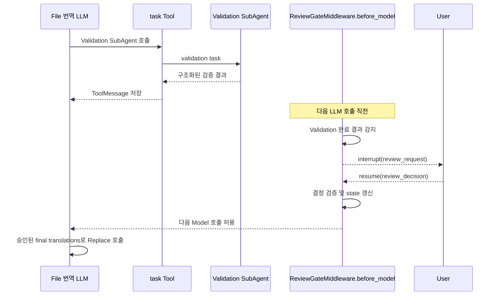
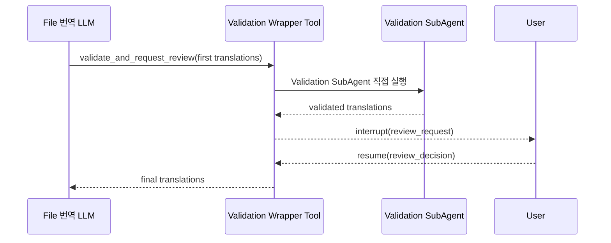

# A안 보완 조사: Middleware 검수 게이트 vs Validation Wrapper Tool

> 작성일: 2026-09-13  
> 목적: A안의 “LLM이 검수 Tool을 호출하지 않을 수 있다”는 문제를 제거할 구현 방식 결정  
> 전제: Document DeepAgent → File 번역 SubAgent → Analyzer/Extractor/Translator/Validation SubAgent  
> 범위: 별도의 수동 Graph Workflow를 작성하지 않고 DeepAgent의 SubAgent 및 Middleware 구조 안에서 해결  

## 1. 해결해야 할 문제

기존 A안은 File 번역 Agent가 다음 순서로 행동한다고 가정했다.

```text
Translator SubAgent 호출
→ Validation SubAgent 호출
→ LLM이 request_translation_review Tool 호출
→ interrupt
→ 사용자 결정
→ Replace
```

문제는 `request_translation_review`도 LLM이 선택하는 Tool이라는 점이다. 프롬프트에 “반드시 호출하라”고 적어도 LLM이 다음과 같이 행동할 가능성을 완전히 제거할 수 없다.

- 검수 Tool을 건너뛰고 Replace를 호출한다.
- 검수 Tool을 호출하지 않고 완료 메시지를 반환한다.
- Validation보다 먼저 검수 Tool을 호출한다.
- 불완전한 후보만 검수 Tool에 전달한다.

이번 조사의 목표는 A안의 장점인 번역 전용 검수 payload와 `first / validated / custom` 결정을 유지하면서, **Validation 완료 후 검수 interrupt가 시스템에 의해 자동으로 발생하도록 만드는 것**이다.

## 2. 비교할 두 방식

### 방식 M — File 번역 Agent의 Custom Middleware가 자동 interrupt

Validation SubAgent의 `task` Tool 결과가 File 번역 Agent 상태에 들어오면 Custom Middleware가 이를 감지한다. 다음 LLM 호출 전에 middleware가 `interrupt()`하여 사용자의 결정을 받는다.

### 방식 W — Validation SubAgent 호출을 감싼 Wrapper Tool이 자동 interrupt

File 번역 Agent가 `validate_and_request_review` Tool을 호출한다. 이 Tool이 Validation SubAgent를 실행하고, 결과를 받자마자 같은 Tool 안에서 `interrupt()`한다.

두 방식 모두 별도의 검수 Tool 호출을 LLM에 맡기지 않는다. 차이는 검수 게이트가 **이미 완료된 Tool 결과 다음 실행 지점**에 있는지, **Validation을 수행하는 Tool 내부**에 있는지다.

## 3. DeepAgent Middleware 실행 시점

LangChain의 Custom Middleware에는 다음 hook이 있다.[^custom-middleware]

| Hook | 실행 시점 | 이번 문제와의 관계 |
| --- | --- | --- |
| `before_agent` | Agent 실행 시작 전 | Validation 결과가 아직 없어 부적합 |
| `before_model` | 각 Model 호출 전 | 완료된 Validation 결과를 보고 다음 LLM 호출 전에 중단 가능 |
| `after_model` | Model 응답 후 | 아직 Tool이 실행되기 전이므로 Validation 결과가 없음 |
| `after_agent` | Agent 실행 종료 후 | Replace까지 실행된 뒤일 수 있어 너무 늦음 |
| `wrap_tool_call` | Tool 실행 전후 | 결과를 볼 수 있지만 실행 후 interrupt하면 재개 시 Tool 재실행 위험 |

표준 `HumanInTheLoopMiddleware`는 `after_model`에서 LLM이 만든 Tool Call을 검사한 다음 Tool이 실행되기 전에 interrupt한다.[^hitl-source] 이 방식이 재실행에 비교적 안전한 이유는 interrupt 전에 실제 Tool을 아직 실행하지 않았기 때문이다.

그러나 우리는 Validation 결과를 사용자에게 보여줘야 한다. Tool 실행 전에는 결과가 없으므로 표준 `after_model` 방식만으로는 현재 요구를 충족할 수 없다.

## 4. 방식 M: `before_model` Middleware 검수 게이트

### 4.1 작동 원리

Agent loop는 일반적으로 Model이 Tool Call을 만들고, Tool이 실행된 후 그 Tool 결과를 포함해 다시 Model을 호출한다. `before_model`은 바로 이 다음 Model 호출 직전에 실행된다.



Validation Tool 호출은 interrupt보다 앞선 Tool node에서 이미 완료됐다. `before_model` hook은 별도의 middleware node이므로 재개 시 검수 hook이 다시 시작되더라도 Validation Tool 자체를 다시 호출하지 않는 구조를 기대할 수 있다. 다만 이 checkpoint 경계는 선택한 실제 버전의 실행 trace로 반드시 검증해야 한다.

### 4.2 필요한 Custom State

Middleware가 같은 Validation 결과에서 반복 interrupt하지 않도록 검수 상태를 보관해야 한다.

```python
class FileTranslationState(AgentState):
    validation_result: NotRequired[dict]
    review_status: NotRequired[
        Literal["not_ready", "pending", "completed"]
    ]
    review_request_id: NotRequired[str]
    review_revision: NotRequired[int]
    final_translations: NotRequired[list[dict]]
```

공식 Custom Middleware 문서는 state schema를 확장하여 hook 사이에서 값을 공유하고 지속적인 상태를 추적할 수 있다고 설명한다.[^custom-middleware]

### 4.3 Validation 완료를 감지하는 방법

단순히 마지막 메시지의 문자열을 검색하면 안 된다. 최소한 다음 두 정보를 결합한다.

1. Tool Call이 `task`였고 대상 SubAgent 이름이 `file-validation`인지 확인한다.
2. 대응하는 `ToolMessage` 결과가 명시된 구조화 schema를 만족하는지 확인한다.

```json
{
  "result_type": "translation_validation_completed",
  "validation_run_id": "validation-123",
  "first_translations": [],
  "validated_translations": [],
  "validation_notes": []
}
```

`task`는 여러 SubAgent가 함께 사용하는 Tool 이름이므로 `tool_name == "task"`만 검사하면 Analyzer나 Translator 결과에서도 잘못 중단할 수 있다. 이전 AIMessage의 Tool Call 인자와 같은 `tool_call_id`의 ToolMessage를 연결해야 한다.

### 4.4 개념 코드

실제 타입과 state update 방식은 선택한 버전에서 확인해야 하지만 책임 구조는 다음과 같다.

```python
class TranslationReviewGateMiddleware(AgentMiddleware):
    state_schema = FileTranslationState

    def before_model(self, state, runtime):
        if state.get("review_status") == "completed":
            return None

        validation = find_completed_validation_result(state["messages"])
        if validation is None:
            return None

        # 재개 시 before_model이 다시 시작되므로 매번 임의 UUID를 만들면 안 된다.
        # Validation 결과에 이미 있는 안정적인 ID로 같은 요청을 재구성한다.
        request = build_review_request(
            validation,
            review_request_id=f"review:{validation['validation_run_id']}",
            revision=validation["revision"],
        )
        decision = interrupt(request)
        final_translations = validate_and_resolve(request, decision)

        return {
            "review_status": "completed",
            "review_request_id": request["review_request_id"],
            "review_revision": request["revision"],
            "final_translations": final_translations,
        }
```

### 4.5 `interrupt()`가 이 코드에서 실제로 하는 일

최초 실행에서는 `decision = interrupt(request)`가 일반 함수처럼 즉시 값을 반환하지 않는다.

```text
첫 실행
before_model 시작
→ Validation 결과 탐색
→ 같은 review request 구성
→ interrupt(request)
→ RedisSaver에 checkpoint 저장
→ 현재 agent stream/invoke가 interrupt 결과를 반환하고 종료
```

Agent Server는 interrupt payload를 SSE의 `hitl.required` 이벤트로 프런트에 보낸 뒤 해당 SSE를 종료할 수 있다. 이때 종료되는 것은 **이번 HTTP/SSE 실행 연결**이다. 다음 항목은 계속 유지할 수 있다.

- 사용자의 로그인 session 또는 access token
- 프런트가 보관한 `run_id`
- 서버의 `run_id → thread_id` 연결 정보
- RedisSaver에 저장된 DeepAgent checkpoint
- 별도로 저장한 review request와 업무 상태

사용자가 선택한 뒤 새 HTTPS 요청을 보낸다.

```python
config = {"configurable": {"thread_id": saved_thread_id}}

result = agent.stream(
    Command(resume=review_decision),
    config=config,
    version="v2",
)
```

재개 시에는 checkpoint에 기록된 `before_model` 실행 지점으로 돌아온다. LangGraph는 interrupt가 포함된 node를 처음부터 다시 실행하므로 `find_completed_validation_result()`와 `build_review_request()`도 다시 실행된다. 같은 실행 안에서 같은 순서의 `interrupt()`에 도달하면 `Command(resume=...)`의 값이 이번에는 반환값이 된다.[^interrupt-docs]

```text
재개 실행
before_model 처음부터 다시 시작
→ 저장돼 있던 Validation 결과 탐색
→ 동일한 review request 재구성
→ interrupt(request)가 review_decision 반환
→ validate_and_resolve 실행
→ review_status=completed와 final_translations 반환
→ 다음 LLM 호출로 진행
```

따라서 다음 코드부터 실행이 이어지는 것처럼 보이지만, 실제로는 함수 중간의 Python stack frame이 Redis에 저장되는 것이 아니다.

```python
decision = interrupt(request)
final_translations = validate_and_resolve(request, decision)
```

node가 처음부터 다시 실행된 뒤 LangGraph가 같은 interrupt 호출에 resume 값을 공급하는 방식이다. 이 때문에 interrupt 전에 수행하는 계산은 결정적이어야 하고 외부 부수 효과가 없어야 한다.

### 4.6 요청 ID를 결정적으로 만들어야 하는 이유

다음 코드는 안전하지 않다.

```python
request = {
    "review_request_id": str(uuid.uuid4()),
    "segments": validation["segments"],
}
decision = interrupt(request)
```

재개 시 node가 다시 시작되면 UUID가 달라질 수 있다. 프런트가 본 요청과 재개 과정에서 구성된 요청의 ID가 달라지며 감사와 중복 제출 검사가 깨진다.

다음 중 하나를 사용해야 한다.

1. Validation 결과를 만들 때 `validation_run_id`와 `revision`을 함께 확정한다.
2. `run_id + validation_run_id + revision`으로 결정적인 review ID를 만든다.
3. 별도 저장소에 review request를 `put_if_absent`하고 재실행 시 같은 레코드를 읽는다.

첫 구현에서는 1번과 2번의 조합이 가장 단순하다.

### 4.7 어떻게 Replace에 강제하는가

Middleware가 state에 `final_translations`를 넣어도 LLM이 이를 무시할 수 있다. 따라서 Replace Tool 도구는 다음 값을 요구하고 runtime state와 대조해야 한다.

```text
replace_file(
    source_file_key,
    review_request_id,
    review_revision
)
```

실제 번역 본문을 LLM이 다시 인자로 복사하게 하지 않고 Tool이 runtime state 또는 검수 저장소에서 `final_translations`를 읽는 편이 안전하다.

```text
LLM이 전달하는 것: review_request_id와 revision
Tool이 읽는 것: 검증 완료된 final_translations
```

이렇게 하면 사용자가 고친 번역이 LLM을 한 번 더 지나며 변형되는 것을 막을 수 있다.

### 4.8 장점

- 기존 Analyzer/Extractor/Translator/Validation SubAgent 호출 구조를 그대로 유지한다.
- 별도 검수 Tool을 LLM이 호출할 필요가 없다.
- Validation이 완료된 뒤 다음 LLM 호출보다 먼저 중단한다.
- 완료된 Validation Tool node와 interrupt node가 분리되어 재개 시 Validation 반복 가능성이 낮다.
- 검수 정책을 File 번역 Agent middleware에 집중시킬 수 있다.
- Replace 도구가 middleware state를 검사하여 검수 우회를 차단할 수 있다.

### 4.9 단점

- `task` ToolMessage에서 어떤 SubAgent 결과인지 정확히 식별해야 한다.
- 큰 번역 결과가 message state에 들어가면 context와 checkpoint 크기가 커질 수 있다.
- Custom state와 middleware 순서가 DeepAgent의 기본 middleware stack과 어떻게 합쳐지는지 알아야 한다.
- Middleware가 업무 orchestration 일부를 담당하므로 처음 읽는 개발자에게 흐름이 숨겨져 보일 수 있다.
- File 번역 Agent가 Validation을 한 호출에서 여러 번 수행하면 어느 결과에 대해 검수할지 revision 규칙이 필요하다.

## 5. 방식 W: Validation Wrapper Tool

### 5.1 작동 원리

File 번역 Agent에는 Validation SubAgent와 검수 Tool을 따로 노출하지 않고 하나의 `validate_and_request_review` Tool을 제공한다.



LLM은 wrapper 호출까지만 선택한다. Wrapper가 시작되면 Validation과 interrupt는 한 코드 경로에서 연속으로 실행되므로 검수 단계를 별도로 건너뛸 수 없다.

### 5.2 개념 코드

```python
@tool
async def validate_and_request_review(
    first_translations: list[dict],
    runtime: ToolRuntime,
) -> dict:
    validated = await validation_subagent.ainvoke(
        build_validation_input(first_translations),
        config=runtime.config,
    )

    request = build_review_request(first_translations, validated)
    decision = interrupt(request)
    return validate_and_resolve(request, decision)
```

### 5.3 가장 큰 문제: 재개 시 Validation 반복

LangGraph는 interrupt가 있는 node를 재개할 때 그 node의 처음부터 다시 실행한다.[^interrupt-docs] 위 코드에서는 Validation SubAgent 호출과 interrupt가 같은 Tool node 안에 있다.

```text
최초 실행
Validation SubAgent 실행
→ interrupt

재개
Tool 처음부터 재실행
→ Validation SubAgent 다시 실행 가능
→ interrupt 위치 도달
```

Validation은 외부 쓰기 작업이 아닐 수 있지만 다음 문제가 생긴다.

- LLM 호출 비용이 중복된다.
- 비결정적인 새 검증 결과가 만들어질 수 있다.
- 사용자가 본 후보와 재개 시 생성된 후보가 달라질 수 있다.
- 여러 Tool이 같은 ToolNode에서 실행됐다면 다른 Tool도 함께 반복될 위험이 있다.

Deep Agents의 중첩 SubAgent interrupt에서 상위 ToolNode가 재실행돼 다른 도구까지 반복된다는 공개 논의도 있다. 이는 공식 보장 문서가 아닌 사용자 보고이므로 신뢰도는 중간이지만, 반드시 재현 시험에 포함해야 한다.[^subagent-replay-discussion]

### 5.4 반복 실행을 막는 보완책

Wrapper가 `validation_run_id`를 기준으로 Validation 결과를 멱등 저장소에서 읽고 쓰도록 할 수 있다.

```python
cached = validation_result_store.get(validation_run_id)
if cached is None:
    cached = await validation_subagent.ainvoke(...)
    validation_result_store.put_if_absent(validation_run_id, cached)

decision = interrupt(build_review_request(cached))
```

이 경우 재개 시 Tool이 다시 실행되어도 Validation SubAgent를 다시 호출하지 않고 같은 snapshot을 사용한다.

그러나 다음 복잡성이 추가된다.

- checkpoint 외부에 Validation 결과 저장소가 필요하다.
- 동시 호출에서 `put_if_absent` 같은 원자적 처리가 필요하다.
- 저장 성공 후 interrupt 전 장애가 발생했을 때 복구 규칙이 필요하다.
- checkpoint TTL과 Validation 결과 TTL을 맞춰야 한다.

### 5.5 DeepAgent SubAgent 구조에 미치는 영향

원래 구조에서는 File 번역 Agent가 `task` Tool을 통해 Validation SubAgent를 호출한다. Wrapper 방식에서는 Wrapper 함수가 Validation Agent의 runnable을 직접 호출한다.

```text
원래 구조
File 번역 LLM → task → Validation SubAgent

Wrapper 구조
File 번역 LLM → wrapper Tool → Validation SubAgent runnable
```

기능적으로 SubAgent는 유지되지만 표준 `task` 기반 위임 경로와 달라진다. SubAgent에 적용되는 config, middleware, streaming, checkpoint namespace가 wrapper 내부 호출에도 동일하게 전달되는지 직접 책임져야 한다.

### 5.6 장점

- Validation이 실행되면 검수 interrupt도 반드시 이어진다.
- Validation과 검수의 입력 계약을 하나의 함수 안에서 명확히 통제한다.
- Tool 결과가 곧 사용자 승인된 final translations이므로 File 번역 Agent가 이해하기 쉽다.
- Middleware에서 메시지 기록을 역추적할 필요가 없다.

### 5.7 단점

- interrupt 이전의 Validation 호출이 재개 시 반복될 수 있다.
- 반복을 막으려면 별도 결과 cache와 멱등 처리 설계가 필요하다.
- 표준 DeepAgent `task` 호출 경로를 우회할 수 있다.
- runtime config와 중첩 checkpoint 전파를 wrapper가 책임져야 한다.
- Validation과 HITL이라는 서로 다른 책임이 한 Tool에 결합된다.

## 6. 핵심 비교

| 기준 | M. `before_model` Middleware | W. Validation Wrapper Tool |
| --- | --- | --- |
| 검수 호출을 LLM에 맡기는가 | 아니오 | 아니오 |
| Validation SubAgent 호출 방식 | 기존 `task` 호출 유지 | Wrapper가 직접 호출 |
| interrupt 위치 | 완료된 Tool 결과 다음 node | Validation과 같은 Tool node 내부 |
| 재개 시 Validation 반복 위험 | 낮음 | 높음, cache로 보완 가능 |
| 결과 식별 난이도 | ToolMessage 연결 필요 | 함수 지역값으로 단순 |
| DeepAgent 표준 구조 보존 | 높음 | 중간 |
| 별도 결과 저장소 | 선택 사항 | 반복 방지를 위해 사실상 필요 |
| 로직 가시성 | Middleware에 숨을 수 있음 | Wrapper 코드에 명시적 |
| 데이터 무결성 | Custom state와 Replace 검증 필요 | Wrapper 반환과 Replace 검증 필요 |
| 구현 난이도 | Middleware/state 이해 필요 | 처음은 단순하나 복구 로직이 복잡 |
| 다중 Validation revision | state 규칙 필요 | cache key 규칙 필요 |

## 7. 실패 시나리오 비교

| 상황 | Middleware | Wrapper Tool |
| --- | --- | --- |
| Validation 완료 직후 서버 종료 | 완료 ToolMessage checkpoint에서 검수 감지 기대 | wrapper Tool 전체 재실행 가능 |
| interrupt 후 서버 재시작 | `before_model` 검수 node부터 재개 기대 | wrapper 시작부터 재개 가능 |
| Validation 결과가 비결정적 | 사용자가 본 완료 결과 유지 가능 | cache 없으면 다른 결과 생성 가능 |
| 같은 resume 두 번 전송 | review revision으로 차단 | review revision과 cache key로 차단 |
| LLM이 Replace를 먼저 호출 | Replace가 review state 검사해 거절 | Wrapper 결과 receipt 없으면 거절 |
| 여러 task Tool이 병렬 실행 | 완료 결과 식별과 순서 규칙 필요 | ToolNode replay 시 다른 Tool 반복 위험 확인 필요 |
| 대용량 결과 | state/message 외부화 필요 | cache/object storage 외부화 필요 |

## 8. 결정

현재 조건에서는 **방식 M의 `before_model` Custom Middleware 검수 게이트가 더 적합하다.**

결정 이유는 다음과 같다.

1. 사용자가 요구한 DeepAgent의 표준 SubAgent `task` 호출 구조를 유지한다.
2. Validation 완료 결과가 state에 반영된 다음 별도 실행 지점에서 interrupt한다.
3. 재개 시 Validation LLM 호출이 반복되어 사용자가 본 후보가 바뀌는 위험이 Wrapper보다 작다.
4. Wrapper 방식처럼 중첩 runnable config 전달과 별도 Validation cache를 처음부터 직접 구현할 필요가 없다.
5. Replace Tool이 middleware state의 검수 완료 정보를 검사하면 LLM의 우회 호출도 차단할 수 있다.

이 결정은 Custom Middleware를 막연하게 사용하는 것을 뜻하지 않는다. hook은 반드시 **File 번역 Agent의 `before_model`**이어야 한다. `wrap_tool_call`에서 handler 실행 후 interrupt하는 방식은 Wrapper와 같은 재실행 문제를 만들 수 있으므로 제외한다.

Wrapper Tool은 다음 조건에서 대안이 된다.

- `task` ToolMessage에서 Validation 결과를 안정적으로 식별할 수 없다.
- Middleware custom state가 선택한 Deep Agents 버전에서 SubAgent에 정상 적용되지 않는다.
- Validation 결과를 이미 멱등 저장하고 있어 replay 비용이 없다.
- 표준 `task` 경로보다 명시적인 직접 runnable 호출을 팀이 의도적으로 선택한다.

## 9. 권장 적용 흐름

```text
Document DeepAgent
  → File 번역 SubAgent
      → Analyzer SubAgent (`task`)
      → Extractor SubAgent (`task`)
      → Translator SubAgent (`task`)
      → Validation SubAgent (`task`)
      → Validation ToolMessage가 state에 저장됨
      → TranslationReviewGateMiddleware.before_model
          → 결과 schema 확인
          → interrupt(review_request)
          → 사용자 결정 검증
          → final_translations와 review receipt를 state에 저장
      → File 번역 LLM의 다음 호출
      → Replace Tool
          → review receipt와 state 확인
          → final_translations 직접 조회
      → MinIO Upload Tool
```

## 10. 구현 전에 수행할 Spike

결정을 실제 구현안으로 확정하려면 다음 최소 실험이 필요하다.

1. File 번역 Agent에 Custom state schema와 `before_model` middleware를 설치한다.
2. 가짜 Validation SubAgent가 고정된 구조화 결과를 반환하게 한다.
3. Middleware가 정확히 Validation 결과에서만 한 번 interrupt하는지 확인한다.
4. interrupt 직후 프로세스를 종료한다.
5. RedisSaver와 같은 `thread_id`로 재개한다.
6. Validation SubAgent 호출 횟수가 여전히 1회인지 확인한다.
7. 사용자 결정이 state에 저장되고 다음 LLM 호출에 전달되는지 확인한다.
8. LLM이 검수 전 Replace를 호출했을 때 Tool이 거절하는지 확인한다.
9. resume를 두 번 보내도 Replace가 한 번만 실행되는지 확인한다.
10. 같은 실험을 Wrapper Tool로 실행해 Validation 호출 횟수와 trace를 비교한다.

Spike에서 Middleware 재개 시 Validation이 다시 실행되거나 SubAgent interrupt가 상위까지 전파되지 않는다면 결정을 재검토한다. 문서상 추론보다 실제 선택 버전의 실행 trace를 우선한다.

## 자료와 신뢰도

| 자료 | 확인일 | 신뢰도 | 확인 내용 |
| --- | --- | --- | --- |
| LangChain Custom Middleware 공식 문서 | 2026-09-13 | 높음 | hook 종류, 실행 시점, custom state, middleware 순서 |
| LangChain `wrap_tool_call` 공식 Reference | 2026-09-13 | 높음 | Tool 실행을 감싸는 handler와 반환 형태 |
| HumanInTheLoopMiddleware 공식 소스 | 2026-09-13 | 높음 | `after_model`에서 Tool Call을 interrupt하는 실제 구조 |
| LangGraph Interrupt 공식 문서 | 2026-09-13 | 높음 | node 재실행, checkpoint, 같은 thread ID 재개 |
| Deep Agents Subagents 공식 문서 | 2026-09-13 | 높음 | `task` 기반 SubAgent 호출과 SubAgent별 middleware |
| Deep Agents Discussion #2777 | 2026-09-13 | 중간 | 중첩 SubAgent interrupt에서 ToolNode replay가 발생했다는 사용자 보고 |

[^custom-middleware]: [LangChain 공식 문서 — Custom middleware](https://docs.langchain.com/oss/python/langchain/middleware/custom)
[^hitl-source]: [LangChain 공식 소스 — HumanInTheLoopMiddleware](https://github.com/langchain-ai/langchain/blob/master/libs/langchain_v1/langchain/agents/middleware/human_in_the_loop.py)
[^interrupt-docs]: [LangGraph 공식 문서 — Interrupts](https://docs.langchain.com/oss/python/langgraph/interrupts)
[^subagent-replay-discussion]: [Deep Agents Discussion #2777 — How to process interrupts inside a subagent](https://github.com/langchain-ai/deepagents/discussions/2777)
