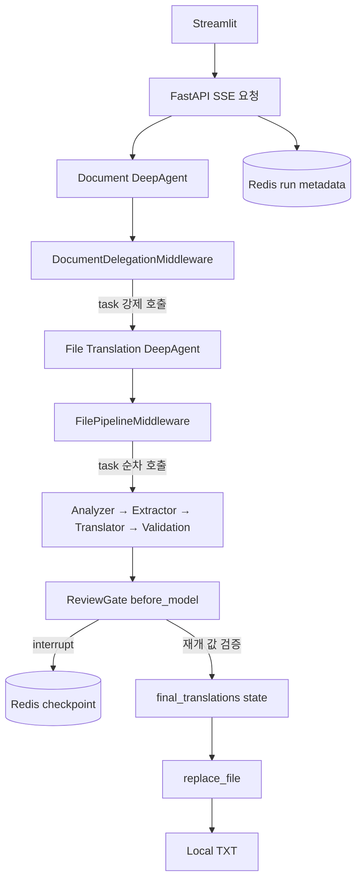

# DeepAgent HITL 설계 및 구현 재검토

검토일: 2026-09-13. 대상: 조사 문서 10·11, PoC 설계서·구현 계획서, 현재 애플리케이션·테스트·실행 스크립트.

## 1. 결론

**번역 전용 검수 계약을 유지하면서 Middleware가 자동 interrupt하는 선택은 현재 요구에 적합하다. 그러나 전체 설계와 구현을 최선이거나 완료된 상태라고 평가할 근거는 부족하다.**

선택한 HITL 방식을 바꾸는 것보다 데이터 원본 관리, 검수 제출의 원자성, 장애 복구, 완료 조건을 먼저 보강하는 편이 타당하다. 수동 StateGraph로 전환할 필요는 없다.

현재 결과를 세 층으로 구분한다.

| 평가 대상 | 판단 | 이유 |
| --- | --- | --- |
| HITL 위치와 업무 계약 | 유지 권장 | Validation 이후, Replace 이전에서 두 후보와 직접 수정 지원 |
| DeepAgent 구성과 실행 제어 | 조건부 유지 | SubAgent 계층은 유지하나 Middleware가 전체 순서를 강제하는 구조로 확대됨 |
| API·저장·복구·검증 완성도 | 보강 필요 | 동시 제출, 잘못된 결정, 연결 종료, 저장 경계 장애에 빈틈 |

이전의 정상 실행 및 다운로드 성공은 유효한 증거다. 다만 그것만으로 계획에 있던 재시작·동시성·한 번만 실행 보장까지 완료했다고 판단한 것은 과도했다.

## 2. 현재 구조가 실제로 의미하는 것

수동 Graph Workflow를 작성한 것은 아니다. `create_deep_agent()`와 `task`로 중첩 SubAgent를 호출한다. 다만 **업무 순서는 코드가 결정하는 고정 파이프라인**이다. Graph API를 직접 사용하지 않는 것과 자유로운 Agent 위임을 사용하는 것은 별개의 문제다.

고정된 1~7단계가 요구라면 코드로 순서를 보장하는 것은 합리적이다. 반면 Document Agent가 향후 여러 문서 업무를 판단해 위임해야 한다면 현재의 무조건 번역 위임은 전용 PoC에만 적합하다.

## 3. 유지할 설계와 그 한계

### 번역 전용 계약 + 자동 검수

사용자는 도구 실행 허가보다 최종 번역을 결정한다. `first / validated / custom`을 직접 표현하는 계약이 자연스럽다. 별도 검수 Tool 호출을 LLM에 맡기지 않는 현재 방식은 A의 문제를 해결하려던 의도와 일치한다.

이는 A와 B의 목적을 결합한 Custom Middleware 방식이며, 표준 `interrupt_on`을 그대로 설치한 구현은 아니다.

### Validation 이후의 before_model

완료된 Validation 결과 다음 실행 지점에서 interrupt하므로 같은 함수 안에 Validation 호출과 interrupt를 함께 두는 단순 Wrapper보다 재실행 범위를 줄이기 쉽다. 공식 문서는 interrupt를 포함한 노드의 처음부터 재실행한다고 설명한다. 중첩 호출에서는 부모의 호출 지점도 함께 고려해야 하므로 “Validation은 절대 재실행되지 않는다”는 보장으로 확대하면 안 된다. [공식 Interrupt 문서](https://docs.langchain.com/oss/python/langgraph/interrupts)

Wrapper도 결과를 안전하게 재사용하도록 구현하면 가능하다. 따라서 기존 비교 문서의 “hook은 반드시 before_model”이라는 표현은 **현재 선택한 task 결과 감지 구조에서 권장**으로 좁히는 것이 정확하다. Replace 제안 시점의 표준 승인이나 영속 결과를 재사용하는 Wrapper까지 원리적으로 배제할 근거는 없다.

### 서버 state에서 최종 번역 읽기

Replace Tool이 인자를 받지 않고 검수된 state를 읽는 것은 좋은 선택이다. 사용자가 고친 번역을 LLM이 Tool 인자로 다시 작성할 필요가 없다. 다만 검수 완료 플래그만으로 충분하지는 않으며, 해당 입력 파일·후보 버전·최종 결과의 연결도 확인해야 한다.

### RedisSaver와 SSE

검수 대기 중 SSE를 종료하고 새 POST 요청으로 같은 thread를 재개하는 방식은 적합하다. 사람을 기다리는 동안 HTTP 연결을 유지할 필요가 없다.

반면 RedisSaver는 HTTP 연결, run metadata, 파일 쓰기까지 하나의 트랜잭션으로 묶어주지 않는다. 검수 대기 상태 복원과 실행 중 장애 복구는 별도 검증 대상이다.

## 4. 중요한 발견 사항

### P1. 검수 결정 수락이 원자적이지 않다

근거: `app/runs/repository.py:50`, `app/service/runner.py:53`.

`accept_decision()`은 GET으로 조회하고 검사한 후 SET한다. 두 요청이 동시에 기존 상태를 읽으면 둘 다 수락되어 같은 thread를 재개할 수 있다. 현재 상태가 WAITING_FOR_REVIEW인지도 검사하지 않는다.

재현: 비동기 GET/SET 사이에 실행권을 양보하는 메모리 Redis 대역에 실제 Repository를 연결해 같은 결정을 동시에 제출한 결과 `[True, True]`가 나왔다. 실제 Redis 부하 시험은 아니지만 허용되는 실행 순서에서 경쟁 조건이 발생함을 보여준다.

권장: 현재 상태·review ID·revision을 원자적으로 비교하고 결정을 수락한다. Redis WATCH/MULTI 또는 Lua 등이 후보이다. 수락 이후에는 같은 thread에 동시 실행자가 생기지 않도록 실행 소유권과 장애 후 인계 규칙도 필요하다. 단순 잠금 하나로 모든 장애를 해결했다고 간주하면 안 된다.

### P1. 잘못된 입력이 검수 요청을 소비한다

근거: `accept_decision()`과 `TranslationReviewGateMiddleware.before_model()`의 검증 순서.

현재는 review ID와 revision만 확인하고 hash를 저장한 뒤 Agent를 재개한다. segment 누락·중복·빈 custom은 그 뒤 `resolve_review()`에서 거절한다. 실패해도 hash는 남는다. 같은 요청은 재실행되지 않고, 수정한 요청은 다른 결정이라는 이유로 거절될 수 있다.

재현 결과: 항목이 없는 결정은 Repository에서 `True`, 도메인 검증에서는 거절, 같은 요청 재수락은 `False`였다.

권장: 저장된 review snapshot으로 전체 결정을 검증한 후 원자적으로 수락한다. 수락 시 다시 revision을 비교한다. 수락한 결정 본문도 저장해야 실행 전 장애에서 복구할 수 있다. hash만으로는 결정을 복원할 수 없다.

### P1. “1차 번역”과 원문의 출처가 보장되지 않는다

근거: `app/agents/subagents.py`, `find_validation_result()`, `app/agents/tools.py`.

현재 UI에 표시하는 원문과 first_translation은 Validation LLM이 반환한 값이다. 실제 입력과 Translator 결과를 서버가 대조하지 않는다. Extractor LLM이 만든 segment ID도 마지막 파일 교체에서 `parse_txt()`가 다시 만든 ID와 일치한다고 가정한다.

예를 들어 Extractor가 두 줄을 한 항목으로 합치거나 Validation이 초안을 고쳐 first_translation에 넣어도 구조화 schema만으로는 잡지 못한다. 사용자는 실제 초안과 다른 내용을 1차 번역으로 볼 수 있다.

권장: 원문·위치·segment ID는 결정적인 파일 파서가 소유한다. Translator 결과를 고정하고 Validation은 검증본과 사유를 반환하게 한다. 서버가 같은 ID로 결합하고 누락·중복·원문 불일치를 검사한다. Analyzer/Extractor SubAgent 역할을 유지하더라도 정확한 추출은 그 내부의 결정적인 Tool이 담당할 수 있다.

### P1. checkpoint와 업무 상태 사이의 장애 복구가 없다

근거: `app/service/runner.py`, `app/runs/repository.py`.

발생 가능한 두 경계:

1. interrupt checkpoint 저장 후 `set_review()` 전에 프로세스 종료: Agent는 검수 대기지만 metadata는 RUNNING일 수 있다.
2. 결정 hash 저장 후 `ainvoke(Command(resume=...))` 전에 종료: metadata는 RESUMING이지만 실행은 시작하지 않았을 수 있다. 재제출은 hash 때문에 실행을 건너뛴다.

권장: metadata와 checkpoint가 불일치할 때 복구하는 경로, 결정 본문 저장, 실행 소유권 만료 후 복구 정책을 정의한다. 두 저장소의 모든 상태를 항상 동일하게 유지한다는 가정보다, 불일치를 감지하고 정해진 방식으로 수렴시키는 설계가 필요하다.

### P1. 파일 쓰기의 원자성과 멱등성이 혼동됐다

근거: `app/storage/files.py:60`, `app/agents/tools.py:19`, `app/service/runner.py:93`.

임시 파일 후 rename은 부분 파일 노출을 줄이지만 호출 한 번을 보장하지 않는다. 현재 매번 덮어쓰고 임시 파일명도 동일해 동시 실행에 취약하다. Replace는 review revision을 검사하지 않으며 Runner는 output.txt 존재만으로 완료를 판단한다.

권장: 입력 식별자·review revision·결정 hash에 연결된 결과 기록을 둔다. 같은 결정의 재실행은 기존 결과를 재사용하고, 다른 결정과 기존 파일이 섞이지 않게 한다. “도구 호출이 정확히 한 번”보다 “재실행돼도 동일한 승인 결과를 제공”하는 것을 핵심 보장으로 삼는다.

### P2. Resume API의 404/409 처리가 실행 위치와 맞지 않는다

근거: `app/api/routes.py:27`.

async generator를 생성하는 시점에는 `resume()` 본문이 실행되지 않는다. route의 try/except는 이후 SSE 순회 중 발생하는 RunNotFound와 ReviewConflict를 잡지 못한다.

권장: 조회·입력 검증·결정 수락을 await하는 일반 비동기 함수와, 수락된 실행의 이벤트 generator를 분리한다. HTTP 오류는 SSE 헤더 전송 전에 확정한다.

### P2. SSE 연결 유실 후 상태 조회만으로는 실행이 복구되지 않는다

근거: `AgentRunner.start/resume`, 설치된 `sse_starlette/sse.py:494` 이후의 취소 처리.

현재 Agent 실행을 SSE generator 안에서 await한다. 설치된 EventSourceResponse는 연결 종료 시 task group을 취소하므로 진행 중 호출도 취소될 수 있다. `except Exception`만으로 비동기 취소를 FAILED 상태로 바꾸는 것도 보장되지 않는다. 상태 조회 API는 저장된 metadata만 읽는다.

권장: PoC에서는 취소된 실행을 어떻게 재시도할지 명시하고 구현한다. 운영에서 브라우저 연결과 무관한 진행이 필요하면 지속 가능한 worker와 이벤트 구독을 분리한다. FastAPI BackgroundTasks만으로 프로세스 장애 내구성이 생기지는 않는다. 외부 검수 서비스 D를 도입해야만 실행과 전송을 분리할 수 있는 것은 아니다.

### P2. 단계 완료를 ToolMessage 존재로 판단한다

근거: `completed_subagents()`, `find_validation_result()`, `FilePipelineMiddleware`.

오류 ToolMessage도 완료 집합에 들어간다. 잘못된 Validation JSON은 “결과 없음”으로 넘어간다. 이 경우 Replace gate는 쓰기를 막더라도, 명확한 실패 처리 대신 LLM 호출로 흐름이 넘어갈 수 있다. 교체 오류 메시지도 이름만 맞으면 이미 시도한 것으로 취급한다.

권장: 메시지는 결과 수신 경계로 쓰되, schema 검증과 성공 여부 확인 후 명시적인 단계 상태와 결과를 기록한다. 현재 검증 결과가 잘못됐을 때 과거 유효 결과로 되돌아가 검수를 열지 않도록 한다. 오류·미완료·완료를 구분한다.

### P2. Streamlit 복구와 상태 격리가 미완성이다

근거: `streamlit_app/main.py`, `client.py`.

상태 조회 메서드는 있지만 UI에서 사용하지 않는다. 새 브라우저 세션에서도 찾을 수 있는 run ID 복구 수단이 없고, 위젯 key는 segment ID만 사용해 서로 다른 파일의 선택이나 수정문이 섞일 여지가 있다.

권장: URL 또는 명시적 run ID 입력을 통해 조회·복구하고 widget key에 run ID와 review revision을 포함한다. 진행 중 중복 제출에는 빈 SSE보다 현재 실행 상태를 명확히 반환한다.

## 5. 설계 선택을 다시 비교하면

| 선택 | 장점 | 비용·한계 | 현재 권고 |
| --- | --- | --- | --- |
| before_model 자동 검수 | 전용 계약, task 구조 유지, Validation 이후 경계 | 결과 식별과 middleware 순서 관리 | 유지 |
| Wrapper 안에서 Validation 후 interrupt | 입력·출력 흐름이 한 함수에 명시됨 | 재개 시 결과 재사용과 중첩 checkpoint 관리 | 현재 변경 이익 부족 |
| 표준 interrupt_on | 도구 실행 전 승인 계약 활용 | 번역 선택 UI와 승인 인자 간 변환 필요 | 대안으로 유효하나 현재 전환 불필요 |
| 전체 순서 Middleware 강제 | 고정 단계와 모델 도구 선택 문제 해결 | orchestration이 hook에 숨고 범용 Document 역할 축소 | 번역 전용 범위로 한정하고 별도 결정으로 문서화 |
| 모든 세부 역할을 LLM 처리 | SubAgent 구조 실험 가능 | TXT 분석·추출에서 비용과 오류 추가 | 역할 유지, 정확한 파싱은 코드로 |
| HTTP 요청 안에서 실행 | 빠른 PoC와 단순한 배포 | 연결·프로세스 종료 복구를 직접 설계 | PoC 조건부 유지 |
| 실행 worker와 SSE 구독 분리 | 연결 수명과 실행 수명 분리 | 작업 저장·재시도·구독 관리 추가 | 운영 요구 확인 후 채택 |

현재 모든 단계 강제 호출은 모델 도구 선택 문제에 대한 실용적인 대응이다. 그러나 기존 설계에서 더 커진 결정이므로 HITL Middleware 선택과 별도로 장단점·적용 범위를 기록했어야 한다.

## 6. 계획 대비 구현과 검증

| 계획 항목 | 현재 확인 |
| --- | --- |
| DeepAgent 중첩 task와 검수 중단·재개 | 구현 및 이전 live smoke/resume 성공 기록 |
| first/validated/custom 도메인 처리 | 순수 함수 및 단위 테스트 |
| Redis compare-and-set | 미구현: GET/SET |
| 상태 전이 제한 | 미구현 |
| 단계별 Agent streaming | ainvoke 사용, starting/resuming과 최종 이벤트만 노출 |
| Validation 호출 수·Replace 호출 수 | 필드는 있으나 증가 계측 없음 |
| Replace 검수 우회·revision·멱등 테스트 | 현재 테스트는 Tool 인자가 없는지만 검사 |
| 재시작·중복 resume 자동 통합 시험 | 계획된 tests/integration 파일 없음 |
| Streamlit 새로고침 복구 | UI에서 status 조회 사용 안 함 |
| 모델 연결 오류 구분 | 현재 AGENT_ERROR로 일괄 처리 |
| 기존 Docker Redis 사용 | 사용자 후속 지시에 맞음. 계획의 새 Redis Stack 부분은 낡은 내용 |
| MinIO·복합 문서·인증 | 합의된 PoC 제외 범위. 누락 결함으로 판정하지 않음 |

이번 재검토에서 단위 테스트를 다시 실행했고 **19 passed (8.31s)**였다. 위 두 Repository 문제는 별도 메모리 대역 실험으로 재현했다. 실제 Redis 동시성, 서버 강제 종료, 브라우저 연결 유실, Wrapper 비교 실험은 이번에 실행하지 않았다.

기존 live 스크립트는 시작과 재개를 서로 다른 TestClient 실행으로 수행할 수 있어 재초기화 검증에 유용하다. 그러나 호출 횟수 assertion이나 장애 주입이 없는 출력 중심 스크립트이므로 전체 내구성의 자동 검증으로 볼 수 없다.

## 7. 수정 순서와 완료 판단

1. 입력 파서·Translator·Validation 결과의 출처를 고정하고 서버가 review snapshot을 결합한다.
2. 결정 전체를 사전 검증하고 원자적으로 수락한다. 결정 본문과 실행 소유권을 저장한다.
3. 승인된 snapshot과 결과 파일을 연결하고 멱등하게 적용한다.
4. metadata/checkpoint 불일치 및 SSE 취소의 복구 경로를 만든다.
5. API 상태 코드와 UI 복구를 연결한다.
6. 아래 실패 시나리오를 자동 시험하고 설계·계획 문서를 실제 상태로 갱신한다.

필수 검증 시나리오:

- 같은 결정 동시 제출: 하나의 실행만 재개하고 나머지는 현재 결과/상태 반환.
- 누락·중복·빈 custom: 실행 전에 거절하고 수정 제출 허용.
- 수락 직후 프로세스 종료: 저장된 결정으로 복구.
- interrupt 저장과 metadata 기록 사이 종료: 대기 검수 복구.
- nested Agent 재생성 후 resume: 사용자가 본 후보 유지, Validation 호출 계측.
- 파일 저장 직후 종료: 승인 결과 재사용, 충돌 없는 다운로드.
- 최초 실행/재개 중 SSE 종료: 정의된 상태와 복구 동작 확인.
- 서로 다른 run의 같은 segment ID: UI 선택·수정문 격리.
- 원문·초안·검증본 누락/변조: 검수 snapshot 생성 전에 차단.

## 8. 출처와 신뢰도

- 로컬 설계·코드·테스트: 해당 구현에 대한 1차 근거. 검토일 2026-09-13.
- 프로젝트 명시 버전: deepagents 0.7.13, langgraph-checkpoint-redis 0.5.2. 다른 의존성은 uv.lock 기준이다.
- [LangGraph Interrupts](https://docs.langchain.com/oss/python/langgraph/interrupts): 공식 문서, 신뢰도 높음. 노드 재실행·동일 thread 재개 원칙 확인.
- [LangChain Custom middleware](https://docs.langchain.com/oss/python/langchain/middleware/custom): 공식 문서, 신뢰도 높음. hook 및 custom state 설계 참고.
- [Deep Agents Subagents](https://docs.langchain.com/oss/python/deepagents/subagents): 공식 문서, 신뢰도 높음. SubAgent 구성 참고.

공식 웹 문서는 계속 갱신되므로 설치 버전과 API 예제가 다를 수 있다. 최신 문서의 streaming API로 현재 구현을 무조건 교체해야 한다는 결론은 내리지 않았다. 로컬 코드의 결함과 프레임워크 일반 동작, 아직 재현하지 않은 장애 가설을 구분했다.
