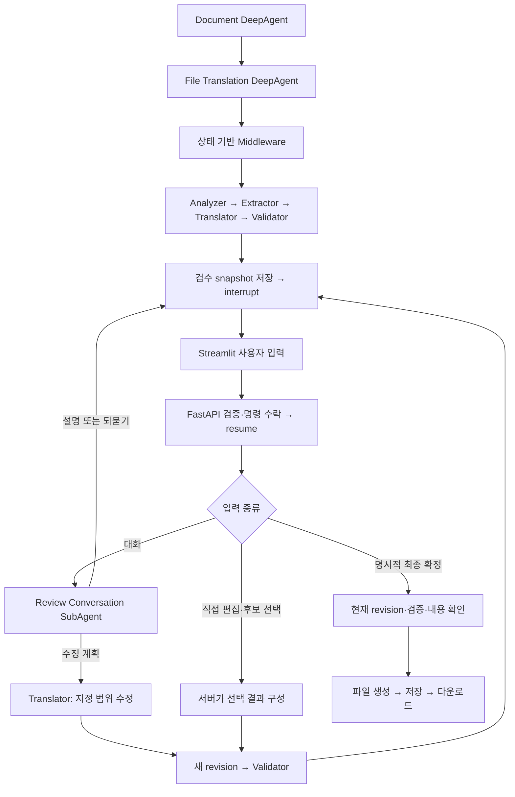

# DeepAgent 대화형 번역 검수 설계와 구현 계획

> 실행 시 `superpowers:executing-plans`를 사용해 아래 작업을 순서대로 진행한다. 이 문서는 검토할 계획이며 애플리케이션 구현 변경은 포함하지 않는다. Git 작업은 별도 요청이 있을 때만 수행한다.

**목표:** 초기 번역 순서를 보장하면서 사용자가 설명을 듣고 부분·전체 번역을 수정한 뒤, 현재 검수 버전을 확정하여 파일을 받을 수 있게 한다.

**구조:** Document DeepAgent → File Translation DeepAgent → 작업별 SubAgent 계층을 유지한다. Middleware는 상태에 따라 허용된 작업을 호출하고, Agent는 자연어 의도와 수정 범위를 해석한다. 검수 대기는 Middleware의 `interrupt()`로 처리한다.

**기술:** 기존 FastAPI, Streamlit, Redis checkpoint, DeepAgents, Ollama 모델 설정을 유지한다. 확인일 2026-09-13. 프로젝트 명시 버전은 deepagents 0.7.13, langgraph-checkpoint-redis 0.5.2다.

## 1. 이번에 결정할 구조

사용자가 제시한 흐름을 구현 대상으로 삼는다. 수동 StateGraph로 번역 워크플로를 다시 작성하지 않는다.

| 방법 | 구현 방식 | 장점 | 비용·한계 | 판단 |
| --- | --- | --- | --- | --- |
| 상태 기반 Middleware + 검수 대화 SubAgent | 기존 계층 안에서 대화 해석을 task로 호출하고 코드가 다음 작업을 제한 | 기존 구현을 확장하며 순서와 유연성을 함께 제공 | 상태 전이와 task 결과 수집을 명확히 분리해야 함 | 권장 |
| 대화 Agent + 별도 고정 번역 Graph | 대화 Agent가 초기 번역·수정 Graph를 호출 | 작업 경로가 명시적 | 현재 구현의 실행 구조가 크게 바뀜 | 향후 복잡도 증가 시 비교 |
| Skill·프롬프트 중심 | Agent가 지침을 읽고 다음 작업을 선택 | 구현이 간단하고 자유로운 위임 | 단계 누락·승인 우회를 코드로 보장하지 못함 | 보조 지침으로만 사용 |

여기서 유연성은 사용자의 말에 맞춰 설명하거나 수정 범위와 방법을 바꾸는 능력이다. 검증 없이 파일을 생성하거나 초기 단계를 임의로 생략하는 자유까지 부여하지 않는다.

## 2. 현재 코드에서 바뀌는 부분

| 현재 구현 | 변경 계획 |
| --- | --- |
| `completed_subagents()`가 과거 ToolMessage 존재를 검사 | 성공 결과와 task ID, 대상 revision을 검증한 명시적 작업 기록 사용 |
| 검수 응답은 모두 `ReviewDecision` | 대화, 후보 선택·직접 편집, 최종 승인 명령으로 구분 |
| Gate가 응답을 받으면 바로 completed | 명령을 state에 저장하고 종료, 다음 실행에서 명령별 처리 |
| Validator 프롬프트의 revision이 1로 고정 | 서버가 revision·작업 ID를 부여하고 결과를 연결 |
| 검증 결과에 원문·초안까지 의존 | 서버가 보관한 원문·초안에 Validator 결과를 결합 |
| Runner가 interrupt 아니면 결과 파일을 기대 | 여러 차례 interrupt와 설명 메시지를 처리 |
| run마다 decision_hash 하나 | 검수 회차별 command ID와 본문·실행 상태 저장 |
| Streamlit에서 선택 후 즉시 재개 | 채팅, 수정 적용, 명시적 최종 확정 분리 |

## 3. Agent와 코드의 역할



`Review Conversation SubAgent`를 File Translation Agent 밑에 추가한다. 설명·수정·되묻기 중 하나를 구조화된 결과로 반환한다. 파일 생성 Tool은 제공하지 않는다.

예를 들어 “왜 이렇게 번역했어?”는 저장된 원문·번역·검증 사유를 근거로 설명한다. “전체를 존댓말로 바꿔줘”는 `scope=all`과 수정 지시를 반환한다. “이 부분 바꿔줘”처럼 대상이 불명확하면 질문하고 번역은 유지한다.

설명은 관찰 가능한 번역 표현과 검증 사유를 설명하는 것이다. 저장하지 않은 모델의 내부 추론을 실제 기록처럼 제시하지 않는다.

첫 버전에서는 자유 대화의 “좋아”를 자동 승인으로 해석하지 않는다. 대화로 확정 의사를 표현하면 현재 버전의 확정 버튼을 안내한다. 이후 자연어 확정도 지원하려면 동일한 명시적 확인 절차에 연결한다.

## 4. 상태와 revision의 의미

`run_id`는 파일 작업, `revision`은 불변인 번역 검수 snapshot, `review_request_id`는 사용자 입력을 기다리는 회차다. 설명을 여러 번 요청하면 revision은 그대로이고 검수 회차만 바뀐다.

| 필드 | 의미 |
| --- | --- |
| `phase` | INITIAL, WAITING_REVIEW, INTERPRETING, EXPLAINING, REVISING, VALIDATING, FINALIZING, COMPLETED, FAILED |
| `source_segments` | 파서가 확정한 ID·위치·원문. 수정 시 재사용 |
| `initial_translations` | 최초 번역 결과. 과거 비교용으로 보존 |
| `current_revision` | 현재 검수 대상 버전 |
| `current_translations` | 현재 편집 기준 번역 |
| `validation` | 입력 번역 hash, revision, 검증 후보·사유 |
| `review_request_id` | 현재 대기 회차 ID |
| `review_snapshot_hash` | 원문 식별자·후보·revision을 묶는 서버 생성 hash |
| `pending_command` | 수락된 사용자 입력과 command_id |
| `active_task` / `task_results` | 역할·task ID·revision·결과·성공 여부 |
| `approved_revision` / `approved_content_hash` | 명시적으로 확정한 버전과 정확한 최종 문자열 |
| `review_history` | 질문·설명·수정 요청·확정 기록 |

원문과 위치는 기존 `parse_txt()` 결과를 기준으로 고정한다. Extractor SubAgent의 역할은 유지하되 결정적 추출 Tool 결과를 사용한다. LLM이 ID나 원문을 바꾼 결과는 수락하지 않는다.

번역 수정이 성공하면 전체 번역 snapshot을 복사한 새 revision을 만든다. 부분 수정은 지정한 ID만 바꾸며, 수정하지 않은 항목은 그대로 복사한다. 동시에 기존 승인을 제거한다. 수정 실패 시 기존 snapshot을 보존하고 오류를 표시하며 자동 확정하지 않는다.

검증 실패 시 새 revision은 검증 미완료 상태다. 과거 revision 검증으로 대체하지 않으며 같은 입력의 검증 재시도만 허용한다.

### 후보 선택과 직접 편집의 차이

초기 화면은 원문·1차 번역·검증본을 보여준다. 이후 화면은 원문·현재 수정본·이번 검증본을 보여주고 최초 초안은 별도 비교 정보로 남긴다.

승인은 현재 검수 snapshot 안의 후보별 선택과 최종 문자열 hash를 함께 기록한다. 화면에 이미 포함된 후보 선택 자체는 새로운 LLM 번역 생성으로 보지 않는다. 검증된 snapshot의 선택을 확정한다는 의미이며, 혼합 선택한 문서 전체가 다시 검증됐다는 의미는 아니다.

직접 입력한 문자열은 기존 후보 밖의 새로운 내용이므로 **수정 적용 → 새 revision → 재검증 → 다시 확정**을 거친다. 최종 확정 요청에 임의 custom 문자열을 끼워 넣어 이 과정을 건너뛰지 못하게 한다.

문서 전체 일관성까지 보장하려는 경우, 후보 혼합 선택도 먼저 “선택 적용”하여 새 revision으로 재검증하는 엄격한 정책으로 확장할 수 있다. 이번 권장 기본값은 기존의 두 후보 선택 경험을 유지하고 직접 편집·Agent 수정만 재검증하는 정책이다.

## 5. interrupt를 반복하는 방법

Gate 안에서 설명 LLM 호출, 번역 수정, 파일 생성을 한꺼번에 수행하지 않는다. Gate는 이미 저장된 검수 요청을 보여주고, 재개 입력을 다음 단계의 명령으로 넘기는 책임만 가진다.

아래는 상태 경계를 보여주는 개념 코드이며 그대로 붙여 넣는 완성 구현은 아니다.

```python
def before_model(self, state, runtime):
    if state["phase"] != "WAITING_REVIEW":
        return None

    command = interrupt(state["review_request"])
    return {
        "pending_command": command,
        "phase": "INTERPRETING",
    }
```

그 다음 실행에서 Middleware가 저장된 명령을 처리하고 필요한 SubAgent를 호출한다. 설명 결과를 저장하거나 수정·검증을 마치면 새 review_request_id를 만들고 WAITING_REVIEW로 돌아간다. 새로운 Gate 실행이 다시 interrupt한다.

**중요:** 같은 hook에서 state를 바꾼 직후 다시 interrupt하면 그 변경이 checkpoint에 반영되기 전 중단될 수 있다. 결과 수집 → 상태 반환·저장 → 다음 Gate 실행이라는 경계를 유지한다. resume은 중단 함수의 처음부터 재실행되므로 interrupt 앞에는 LLM 호출이나 임의 ID 생성을 넣지 않는다. [공식 Interrupts 문서](https://docs.langchain.com/oss/python/langgraph/interrupts)

권장 Middleware 책임 순서는 `결과 수집 → 검수 Gate → 다음 작업 배정`이다. 다만 jump와 hook 재진입 동작은 설치 버전의 실제 중첩 DeepAgent 통합 시험으로 먼저 확인한다. 단순 배열 순서만으로 보장됐다고 판단하지 않는다.

Document가 file-translation task를 호출한 상태에서 검수 루프를 유지하고 최종 파일 완성 후에만 그 task가 반환하도록 한다. 외부 API는 같은 부모 thread_id와 현재 interrupt ID로 재개한다. 자식의 상태를 별도 root thread에 임의로 복사하지 않는다.

## 6. API와 Streamlit

기존 파일 시작·상태 조회·다운로드 API는 유지하고 검수 입력용 `POST /runs/{run_id}/review-actions`를 추가한다.

```json
{
  "command_id": "클라이언트가 생성한 UUID",
  "review_request_id": "현재 검수 회차",
  "revision": 2,
  "snapshot_hash": "화면에 제공된 snapshot hash",
  "action": "message",
  "message": "전체를 존댓말로 바꿔줘"
}
```

`action`은 `message`, `edit`, `approve`다. edit에는 대상 segment ID와 수정문을, approve에는 후보 선택 목록을 보낸다. 메시지·편집·승인 payload는 Pydantic discriminated union으로 분리하고 다른 action의 필드는 거절한다.

기존 `/resume`은 전환 기간에 승인 명령으로 변환하는 호환 경로로 둔다. 기존 custom 입력은 edit로 변환하므로 바로 파일이 완성되지 않고 재검수가 열린다. 이 변경을 README에 명시한다.

HTTP 응답 시작 전에 요청 전체를 검증한다. 없는 run은 404, 오래된 회차·revision·처리 중 충돌은 409, 잘못된 segment·빈 편집은 422로 반환한다. 잘못된 요청은 검수 회차를 소비하지 않는다.

SSE는 `progress`, `review.message`, `hitl.required`, `completed`, `failed`를 제공한다. 설명 메시지는 저장 후 전달하고 이어서 새 검수 요청을 전송한다. 이 PoC에서는 설명 완성본 이벤트부터 지원하며 토큰 단위 스트리밍은 별도 기능이다.

검수 대기 시 SSE를 종료한다. 다음 입력은 새로운 HTTPS 요청으로 같은 작업을 재개한다. 브라우저 연결을 계속 유지해야 하는 설계가 아니다.

Streamlit에는 채팅 입력과 기록, 현재 revision, 수정 적용 버튼, 최종 확정 버튼을 둔다. 위젯 key는 `run_id:revision:segment_id:field`로 구성한다. 설명 이후 같은 revision의 편집 초안은 유지하고, 새 revision이 도착하면 서버 상태를 기준으로 갱신한다. 미제출 편집이 있으면 이를 적용하거나 취소한 후 확정하게 한다.

## 7. 중복 제출과 복구

반복 대화에서는 기존 run 단위 decision_hash를 재사용할 수 없다. `run_id + command_id`에 요청 본문 hash·본문·접수 상태·결과를 저장한다.

1. 저장된 snapshot으로 전체 payload를 검증한다.
2. Redis WATCH/MULTI로 현재 회차·revision·상태를 다시 확인하며 명령을 원자적으로 수락한다.
3. 같은 ID와 같은 본문의 재전송은 기존 처리 상태를 돌려준다. 같은 ID와 다른 본문은 409다.
4. 한 run에는 한 실행자만 허용한다. 명령 수락은 실행 소유권과 연결한다.
5. 새 검수 회차에서는 새로운 명령을 받을 수 있다. 이전 회차의 명령을 새 interrupt에 재사용하지 않는다.

checkpoint는 Agent의 진행 위치를, run metadata는 조회와 명령 처리를 담당한다. 두 저장이 하나의 트랜잭션이라고 가정하지 않는다. 재시작 시 중첩 checkpoint와 pending interrupt를 조회하여 metadata를 복구한다. 명령이 이미 반영됐는지는 checkpoint의 command_id와 대기 회차로 판별하고, 불명확하면 자동 재적용하지 않고 복구 필요 상태를 표시한다.

첫 구현은 단일 FastAPI 프로세스 범위로 한정한다. 실행 task를 SSE generator와 분리하여 브라우저가 끊겨도 서버 프로세스가 살아 있는 동안 실행을 유지한다. 결과와 대화 기록은 GET으로 다시 조회한다. 프로세스 종료 후 자동 worker 인계와 이벤트 전량 재생까지 완료했다고 주장하지 않는다.

파일 생성은 승인 revision·최종 문자열 hash·입력 파일 hash를 확인한다. 결과 파일명 또는 manifest에 이를 연결하고 같은 승인 재실행에는 기존 결과를 재사용한다. 단순 output.txt 존재만으로 완료 판정하지 않는다.

현재 PoC는 로컬 TXT 저장이다. MinIO 업로드는 별도 후속 작업으로 분리하되 같은 승인 식별자를 object key에 연결한다. 이번 대화형 검수 완료의 기준은 승인된 TXT의 정확한 다운로드까지다.

## 8. 구현 순서와 파일

아래 경로는 `AI/agent_hitl/` 기준이다. 각 단계에서 의미 있는 실패 테스트를 먼저 추가하고 구현 후 해당 테스트를 실행한다.

### 1단계: 중첩 resume와 반복 Gate 기술 검증

- [ ] `tests/integration/test_review_loop.py`를 추가한다. 가짜 모델로 초기 검수 → 설명 → 재검수 → 수정 → 재검수 → 확정을 구성한다.
- [ ] 실제 `create_deep_agent` 계층과 RedisSaver를 사용해 부모 thread 재개·서버 Agent 재생성·Middleware 실행 순서를 확인한다.
- [ ] 검증 결과 수집과 Gate를 서로 다른 저장 경계로 나눌 수 있음을 확인한 후 아래 구현을 진행한다.
- [ ] 기대 결과: 설명 때 번역/검증 호출이 늘지 않고 수정 때 분석/추출 호출이 늘지 않는다. 최종 확정 전 파일은 없다.

### 2단계: 명령과 버전 계약

- [ ] `app/domain/models.py`, `app/agents/schemas.py`에 명령 union, revision snapshot, 작업 기록, 승인 정보를 정의한다.
- [ ] `app/domain/review.py`에 edit와 approve의 사전 검증을 분리한다.
- [ ] `app/domain/revisions.py`를 추가해 부분 수정 병합·새 버전 생성·승인 무효화를 순수 함수로 구현한다.
- [ ] `tests/unit/test_revisions.py`, `test_review.py`에서 원문 불변·누락/중복 ID·오래된 버전·직접 편집 승인 우회를 검사한다.

### 3단계: 결과 수집과 초기 순서 보강

- [ ] `app/agents/result_collector.py`를 추가해 task_call_id와 active_task를 대조하고 schema가 유효한 성공 결과만 저장한다.
- [ ] `app/agents/middleware.py`의 과거 메시지 기반 완료 판단을 명시적 단계 상태로 교체한다.
- [ ] `app/agents/subagents.py`, `tools.py`에서 결정적 TXT 추출 결과를 사용하고 Validator의 revision=1 지시를 제거한다.
- [ ] `tests/unit/test_middleware.py`에서 오류 ToolMessage, 이전 revision 결과, 중복 결과가 다음 단계를 열지 못함을 확인한다.

### 4단계: 대화 해석과 수정 루프

- [ ] `app/agents/review_conversation.py`에 설명·수정·되묻기 결과 schema와 SubAgent 정의를 추가한다.
- [ ] `subagents.py`에 등록하고 Translator가 원문·현재 번역·대상 ID·수정 지시를 받아 지정 항목만 반환하도록 확장한다.
- [ ] `middleware.py`를 결과 수집, Gate, 다음 작업 배정 책임으로 분리한다. Gate는 명령 저장 후 반환한다.
- [ ] 새 수정본은 첫 버전에서 문서 전체 재검증한다. 부분 수정이라도 문맥 영향이 있으므로 부분 검증 최적화는 제외한다.
- [ ] `tests/unit/test_review_conversation.py`에서 모호한 대상은 되묻기, 명시적 전체 수정은 all, 설명은 버전 유지인지 검사한다.

### 5단계: 명령 수락·API·복구

- [ ] `app/runs/repository.py`에 명령 단위 원자적 수락과 처리 상태를 구현한다.
- [ ] `app/service/runner.py`에서 HTTP 사전 검증, 실행 task, 이벤트 전달을 분리한다. 같은 run 동시 실행을 막는다.
- [ ] `app/service/recovery.py`에 checkpoint와 metadata 대조 및 현재 검수 복원 경로를 구현한다.
- [ ] `app/api/routes.py`, `schemas.py`에 review-actions와 복원용 조회 필드를 추가한다.
- [ ] `tests/integration/test_review_api.py`에서 동시 제출·잘못된 요청 후 정상 재제출·설명 후 새 명령·수락 후 재시작을 시험한다.

### 6단계: 승인 결과 파일

- [ ] `app/agents/tools.py`, `app/storage/files.py`에 승인 버전/hash 검사와 결과 manifest를 추가한다.
- [ ] `tests/unit/test_replace_tool.py`에 미승인·과거 승인·내용 변조·동일 승인 재실행을 검증하는 실제 Tool 실행 테스트를 추가한다.
- [ ] 결과 파일과 manifest 저장 사이 장애에서도 결과 hash 확인 후 수렴하도록 구현한다.

### 7단계: 검수 화면과 실제 모델 검증

- [ ] `streamlit_app/client.py`, `main.py`에 채팅, 수정 적용, 확정, run ID 복원과 위젯 격리를 구현한다.
- [ ] `tests/unit/test_streamlit_client.py`에서 메시지와 edit/approve payload 및 SSE 이벤트 처리를 검증한다.
- [ ] `tests/integration/test_review_loop.py`에서 전체 흐름과 호출 횟수를 assertion한다.
- [ ] 기존 Ollama 설정으로 “왜 이렇게 번역했어?”, “두 번째 줄만 수정”, “전체 존댓말”, 직접 편집, 최종 확정을 수동 확인한다.
- [ ] `README.md`에 동작·실행·복구·PoC 범위와 `/resume` 호환 변경을 기록한다.

검증 명령은 프로젝트 디렉터리에서 실행한다.

```powershell
uv run ruff check app tests streamlit_app
uv run pytest tests/unit -q
uv run pytest tests/integration/test_review_loop.py tests/integration/test_review_api.py -q
```

기대 결과는 각 단계의 관련 테스트 통과와 아래 인수 조건 충족이다. 이 계획 작성 단계에서는 테스트를 실행하거나 통과를 확인하지 않았다.

## 9. 인수 조건

| 사용자 행동·상황 | 확인할 결과 |
| --- | --- |
| 초기 번역 | 분석 → 추출 → 번역 → 검증 순서, 성공 결과만 다음 단계로 전달 |
| 설명 두 번 요청 | 답변 두 개 저장, revision 유지, 번역·검증 추가 호출 없음 |
| 두 번째 줄 수정 | 해당 줄만 변경, 원문·다른 번역 유지, 새 revision 후 재검증 |
| 전체 존댓말 요청 | 모든 항목 수정 대상으로 전달, 재검증 후 검수 |
| 모호한 수정 요청 | 대상 질문, 번역과 revision 유지 |
| 직접 편집 | 새 revision·재검증, 파일 생성 없음 |
| 현재 후보 선택 후 확정 | 선택 문자열 그대로 결과 파일에 반영 |
| 이전 화면에서 확정 | 409, 현재 검수 유지 |
| 동시·중복 제출 | 단일 실행, 같은 명령 재전송은 기존 상태 반환 |
| 검증 실패 | 현재 버전 승인 불가, 과거 검증으로 대체 안 함 |
| 대기 중 서버 재시작 | 동일 thread의 현재 후보·회차·대화 복원 |
| SSE 연결 종료 | 살아 있는 단일 서버 실행은 지속, GET으로 결과 복원 |
| 승인 결과 쓰기 재실행 | 동일 승인 결과 재사용, 다른 revision 결과 혼입 없음 |

## 10. 근거와 아직 확인할 사항

- 로컬 근거: `app/agents/middleware.py`, `subagents.py`, `schemas.py`, `domain/review.py`, `service/runner.py`, `runs/repository.py`, `api/routes.py`, `streamlit_app/main.py`를 확인했다. 현재 구현 분석의 1차 자료다.
- 이전 분석: `12_DeepAgent_HITL_설계와_구현_재검토.md`. 이번 계획에는 반복 검수에 직접 영향을 주는 데이터 출처·원자적 수락·복구·파일 승인 연결 문제를 포함했다.
- [LangGraph Interrupts](https://docs.langchain.com/oss/python/langgraph/interrupts), [Subgraphs](https://docs.langchain.com/oss/python/langgraph/use-subgraphs): 공식 문서, 신뢰도 높음. 참조일 2026-09-13. 재개 시 재실행과 중첩 checkpoint 원칙의 근거다. 지속 갱신 문서이므로 설치 버전 호환성은 1단계 통합 시험으로 확인한다.
- 이 문서의 상태명·명령 계약·후보 승인 정책은 제안 설계다. 공식 프레임워크가 그대로 제공하는 기능이라고 해석하지 않는다.
- 중첩 DeepAgent의 여러 차례 검수와 설명 반환을 실제로 검증한 결과는 아직 없다. 따라서 1단계 기술 검증을 가장 먼저 둔다.
