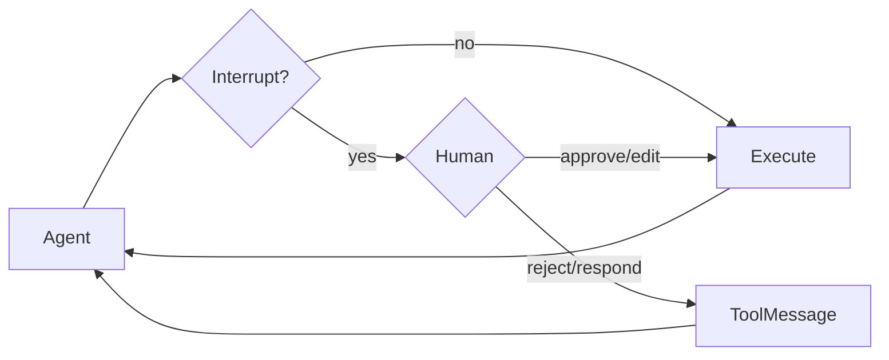

# Deep Agents Human-in-the-loop: 승인·중단·재개

> 원문: <https://docs.langchain.com/oss/python/deepagents/human-in-the-loop>  
> 확인일: 2026-07-26

## 원문 충실 번역

### Documentation Index
전체 문서 목록은 <https://docs.langchain.com/llms.txt>에서 가져오며, 탐색 전에 이 파일로 이용 가능한 page를 발견한다.

# Human-in-the-loop
> 민감한 tool 작업에 사람의 승인을 구성하는 방법을 배운다.

일부 tool 작업은 민감하므로 실행 전 사람 승인이 필요하다. Deep Agents는 LangGraph interrupt capability로 HITL workflow를 지원한다. `interrupt_on`으로 승인할 tool을 구성한다. 이를 설정하면 default middleware stack에 `HumanInTheLoopMiddleware`가 추가된다. Tool이 result를 반환하기 전 run이 cancel·interrupt되면 같은 stack의 [`PatchToolCallsMiddleware`](https://reference.langchain.com/python/deepagents/middleware/patch_tool_calls/PatchToolCallsMiddleware)가 message history를 자동 복구한다.



## 기본 구성

`interrupt_on`은 tool name에서 interrupt config로 mapping하는 dictionary다.

- `True`: 기본 동작(approve, edit, reject, respond 허용)으로 interrupt
- `False`: 그 tool은 interrupt 안 함
- `InterruptOnConfig`: `allowed_decisions`로 review option을 제한한다. Python에서는 `when` predicate로 일부 call만 interrupt할 수 있다.

```python
from langchain.tools import tool
from deepagents import create_deep_agent
from langgraph.checkpoint.memory import MemorySaver

@tool
def remove_file(path: str) -> str:
    """파일 시스템에서 파일을 삭제한다."""
    return f"Deleted {path}"

@tool
def fetch_file(path: str) -> str:
    """파일을 읽는다."""
    return f"Contents of {path}"

@tool
def notify_email(to: str, subject: str, body: str) -> str:
    """이메일을 보낸다."""
    return f"Sent email to {to}"

# HITL에는 checkpointer가 필수다.
agent = create_deep_agent(
    model="openai:gpt-5.5",
    tools=[remove_file, fetch_file, notify_email],
    interrupt_on={
        "remove_file": True,
        "fetch_file": False,
        "notify_email": {"allowed_decisions": ["approve", "reject"]},
    },
    checkpointer=MemorySaver(),
)
```

모델 제공자별 원문 코드의 차이는 `model` 값뿐이다: Google `google_genai:gemini-3.5-flash`, OpenAI `openai:gpt-5.5`, Anthropic `anthropic:claude-sonnet-4-6`, OpenRouter `openrouter:z-ai/glm-5.2`, Fireworks `fireworks:accounts/fireworks/models/glm-5p2`, Baseten `baseten:zai-org/GLM-5.2`, Ollama `ollama:north-mini-code-1.0`.

## Decision type

| 결정 | 의미 | 사례 |
| --- | --- | --- |
| `approve` | agent가 제안한 original argument로 실행 | 작성된 email을 그대로 발송 |
| `edit` | 실행 전 argument 수정 | 수신자 변경 |
| `reject` | 실행을 건너뛰고 거절 feedback을 agent에게 반환 | 파일 삭제 거부 |
| `respond` | 실행 없이 human message를 synthetic tool result로 반환 | `ask_user` 질문 답변 |

Side-effect tool을 거부할 때 `respond`를 쓰지 않는다. Model이 이를 성공 tool result로 해석할 수 있다. `reject`를 쓴다. Edit는 보수적으로 한다. 큰 argument 변경은 model이 접근법을 다시 평가하여 tool을 반복·예상 밖으로 실행할 수 있다.

```python
interrupt_on = {
    "delete_file": {"allowed_decisions": ["approve", "edit", "reject"]},
    "write_file": {"allowed_decisions": ["approve", "reject"]},
    "critical_operation": {"allowed_decisions": ["approve"]},
}
```

## Conditional interrupt

기본적으로 `interrupt_on` tool의 모든 call이 멈춘다. 일부만 멈추려면 `when` predicate를 넣는다. Predicate는 `ToolCallRequest`를 받아 `True`면 interrupt, `False`면 auto-approve한다.

> Conditional interrupt에는 `langchain>=1.3.3`이 필요하다.

```python
from deepagents import create_deep_agent
from langchain.agents.middleware import ToolCallRequest
from langgraph.checkpoint.memory import MemorySaver

def writes_outside_workspace(request: ToolCallRequest) -> bool:
    """workspace 밖 write만 멈춘다."""
    path = request.tool_call["args"].get("file_path", "")
    return not path.startswith("/workspace/")

agent = create_deep_agent(
    model="openai:gpt-5.5",
    interrupt_on={
        "write_file": {
            "allowed_decisions": ["approve", "edit", "reject"],
            "when": writes_outside_workspace,
        },
    },
    checkpointer=MemorySaver(),
)
```

`when=False` call은 interrupt batch에 추가되지 않으므로 reviewer에게 필요한 action만 보인다.

## Interrupt 처리

Interrupt가 나면 execution이 pause되어 control이 돌아온다. Result에서 interrupt를 확인하고 action request를 표시한 뒤, 동일한 thread config로 `Command(resume=...)`를 호출한다. 거절에는 tool이 실행되지 않았음과 다음 행동을 명확히 지시하는 `message`를 넣는다.

```python
from langchain_core.utils.uuid import uuid7
from langgraph.types import Command

config = {"configurable": {"thread_id": str(uuid7())}}
result = agent.invoke(
    {"messages": [{"role": "user", "content": "temp.txt를 삭제해줘"}]},
    config=config, version="v2",
)

if result.interrupts:
    value = result.interrupts[0].value
    actions = value["action_requests"]
    decisions = [{
        "type": "reject",
        "message": "User rejected deleting temp.txt. Do not retry deletion.",
    }]
    result = agent.invoke(
        Command(resume={"decisions": decisions}),
        config=config,  # 반드시 같은 thread ID
        version="v2",
    )

print(result.value["messages"][-1].content)
```

## 여러 tool call과 edit

여러 승인 대상 tool은 하나의 interrupt로 batch된다. `decisions`는 `action_requests`와 **같은 순서**로 action마다 하나씩 제공해야 한다.

```python
decisions = [
    {"type": "approve"},
    {"type": "reject", "message": "Do not retry this tool call."},
]
result = agent.invoke(Command(resume={"decisions": decisions}), config=config, version="v2")
```

Edit에서는 tool name과 complete replacement args를 준다.

```python
decision = {
    "type": "edit",
    "edited_action": {
        "name": action_request["name"],
        "args": {"to": "team@company.com", "subject": "...", "body": "..."},
    },
}
```

## Subagent interrupt

각 subagent는 main agent 설정을 override하는 자신의 `interrupt_on`을 가질 수 있다. Subagent가 interrupt를 만들면 parent result에서 같은 방식으로 `interrupts`를 확인하고 `Command`로 resume한다.

Tool 안에서 [`interrupt()`](https://langchain-ai.github.io/langgraph/reference/types/#langgraph.types.interrupt)를 직접 호출해 approval을 기다릴 수도 있다. 이 방식은 `CompiledSubAgent` tool에서 action description을 넘기고, `Command(resume={"approved": True})`처럼 human response를 받는다.

## Filesystem permission interrupt

> Filesystem permission interrupt에는 `deepagents>=0.6.8`이 필요하다.

`interrupt_on` 외에 [permission](https://docs.langchain.com/oss/python/deepagents/permissions) rule의 `mode="interrupt"`로 built-in filesystem tool을 멈출 수 있다. `write_file`·`edit_file`가 rule path에 맞으면 동일 HITL interrupt가 나며, custom `interrupt_on`과 합쳐 한 review step에서 처리된다.

```python
from deepagents import FilesystemPermission, create_deep_agent
from langgraph.checkpoint.memory import MemorySaver

agent = create_deep_agent(
    model=model,
    permissions=[FilesystemPermission(
        operations=["write"], paths=["/secrets/**"], mode="interrupt",
    )],
    checkpointer=MemorySaver(),
)
```

## Best practice

- HITL에는 state를 interrupt와 resume 사이 보존할 checkpointer가 **항상** 필요하다.
- Resume은 동일 `thread_id` config를 쓴다.
- Decision은 action request order와 정확히 일치시킨다.
- 고위험 delete·email에는 approve/edit/reject, 중위험 write에는 approve/reject, read·ls에는 interrupt 없음처럼 risk별로 구분한다.
- HITL은 사람의 승인 workflow이지 backend permission·sandbox·least privilege를 대체하는 보안 경계가 아니다.

---

## 조사와 실제 적용

HITL은 파일 삭제, 외부 메시지 발송, 배포·결제 같은 side effect에서 “model의 tool call”과 “실제 실행” 사이의 review gate로 쓰인다. Official Backends 문서의 permission interrupt와 결합하면 path rule로 위험 후보를 좁히고, `when` predicate로 argument 기반 escalation을 더할 수 있다.

권장 3계층은 (1) backend·permission의 기술적 거부, (2) `interrupt_on` 승인, (3) sandbox·credential scope다. 승인만 있고 tool이 과도한 권한을 가지면 reviewer 실수나 UI bypass가 곧 사고가 된다.

## 보강 코드: 배포 승인 gate

```python
from deepagents import create_deep_agent
from langgraph.checkpoint.memory import MemorySaver

agent = create_deep_agent(
    model="openai:gpt-5.5",
    tools=[deploy_service, get_deployment_plan],
    interrupt_on={
        "deploy_service": {"allowed_decisions": ["approve", "reject"]},
        "get_deployment_plan": False,
    },
    checkpointer=MemorySaver(),
    system_prompt=(
        "배포 전 get_deployment_plan을 먼저 호출한다. "
        "deploy_service interrupt가 발생하면 user 승인 없이 재시도하지 않는다."
    ),
)
```

## 참고 자료

- [Human-in-the-loop 공식 문서](https://docs.langchain.com/oss/python/deepagents/human-in-the-loop) — 2026-07-26, 1차 공식 문서
- [Permissions 공식 문서](https://docs.langchain.com/oss/python/deepagents/permissions) — 2026-07-26, 1차 공식 문서
- [문서 인덱스](https://docs.langchain.com/llms.txt) — 2026-07-26, 1차 공식 문서

