# `StreamingResponse`와 `EventSourceResponse`: Frontend 요청부터 응답까지

> 조사 기준일: 2026-09-20  
> 대상: Browser → HTTP → Uvicorn → FastAPI/Starlette → ASGI → Browser  
> 목적: `StreamingResponse`와 `EventSourceResponse`가 하나의 요청을 어떻게 장시간 유지하면서 Frontend에 데이터를 순차 전달하는지 이해한다.  
> 관련 심화 자료: [01_DeepAgent_SSE_스트리밍_동작과_운영_설계.md](./01_DeepAgent_SSE_스트리밍_동작과_운영_설계.md)

## 결론

두 Response 모두 **하나의 HTTP 요청에 대해 하나의 HTTP 응답을 시작한 뒤, 응답을 즉시 끝내지 않고 body를 여러 조각으로 전송**한다.

- `StreamingResponse`: iterator가 생산한 `str` 또는 `bytes`를 전송하는 범용 streaming response
- `EventSourceResponse`: iterator가 생산한 값을 SSE 규격으로 인코딩하고 ping, disconnect 감시, send timeout 등 장기 연결 기능을 제공하는 SSE 전용 response

핵심 흐름은 다음과 같다.

```text
Frontend 요청
  → Uvicorn이 HTTP 요청을 ASGI 요청으로 변환
  → FastAPI가 endpoint 선택
  → endpoint가 Response 객체 반환
  → Response가 generator를 한 번씩 순회
  → yield 값을 ASGI http.response.body로 반복 전송
  → Uvicorn이 HTTP/TCP 데이터로 변환
  → Frontend가 도착한 데이터를 읽어 화면 갱신
```

토큰이나 이벤트마다 HTTP 요청을 새로 보내는 것이 아니다.

```text
HTTP 요청: 1번
HTTP 응답: 1번
응답 body 전송: 여러 번
```

## 1. 전체 계층

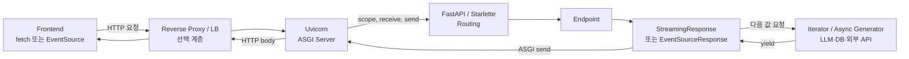

| 계층 | 책임 |
| --- | --- |
| Frontend | 요청을 보내고 응답 body 또는 SSE event를 계속 읽는다. |
| Reverse proxy / LB | 연결을 중계한다. 설정에 따라 응답을 buffering하거나 idle connection을 종료할 수 있다. |
| Uvicorn | TCP와 HTTP를 처리하고 HTTP와 ASGI message를 서로 변환한다. |
| FastAPI / Starlette | URL을 endpoint에 연결하고 Response를 실행한다. |
| Response | header를 한 번 보내고 generator 값을 body message로 반복 전송한다. |
| Generator | token, 진행 상태, DB row 등 실제 데이터를 생산한다. |

## 2. 일반 HTTP 응답과 streaming 응답의 차이

일반 JSON 응답은 보통 전체 데이터를 만든 뒤 응답을 끝낸다.

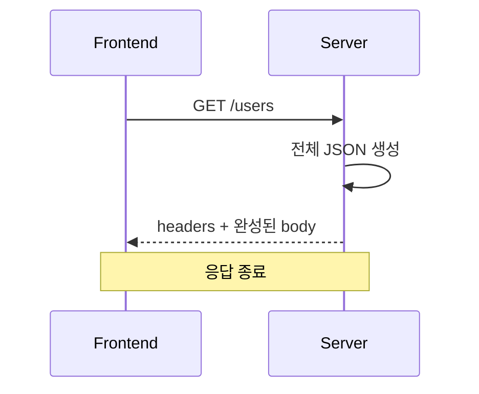

Streaming response는 header를 먼저 보내고 body를 순차적으로 보낸다.

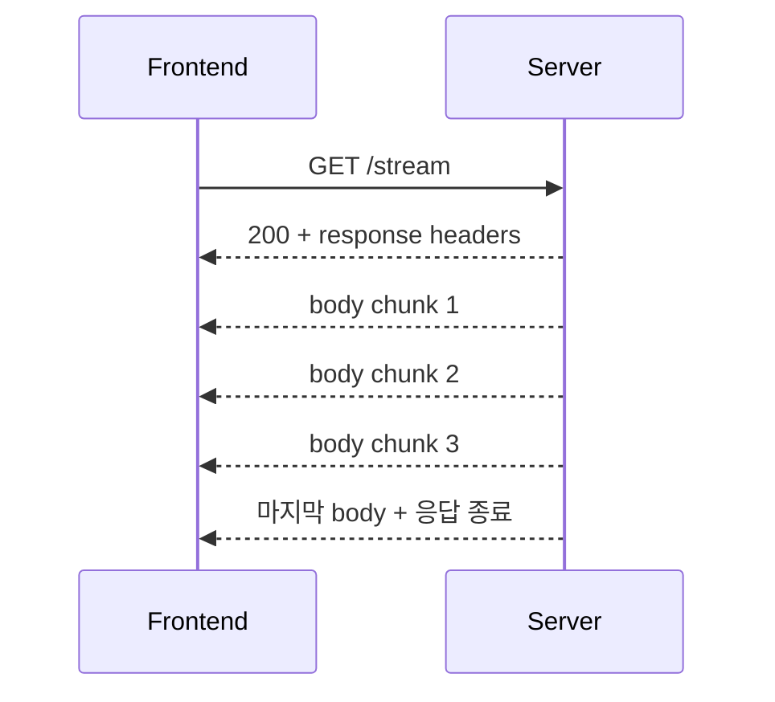

## 3. ASGI가 연결하는 인터페이스

FastAPI application과 Uvicorn은 다음 형태의 ASGI 호출로 연결된다.

```python
await app(scope, receive, send)
```

- `scope`: method, path, headers, HTTP version 등 요청의 기본 정보
- `receive()`: request body 또는 disconnect 같은 client 측 event를 받는 함수
- `send(message)`: response header와 body를 Uvicorn에 보내는 함수

### 3.1 요청 수신

Uvicorn은 socket에서 읽은 HTTP 요청을 대략 다음 ASGI 정보로 바꾼다.

```python
scope = {
    "type": "http",
    "method": "GET",
    "path": "/stream",
    "headers": [...],
    "http_version": "1.1",
}

request_message = {
    "type": "http.request",
    "body": b"",
    "more_body": False,
}
```

FastAPI는 `scope["path"]`와 method를 이용해 endpoint를 찾는다.

### 3.2 응답 시작

Response는 status와 headers를 한 번 보낸다.

```python
await send({
    "type": "http.response.start",
    "status": 200,
    "headers": [
        [b"content-type", b"text/plain; charset=utf-8"],
    ],
})
```

이 메시지가 전송된 뒤에는 이미 `200 OK` 응답을 시작했으므로, generator에서 오류가 발생해도 일반적인 `500 application/json` 응답으로 되돌리기 어렵다.

### 3.3 body 반복 전송

각 body 조각은 다음 메시지로 전송한다.

```python
await send({
    "type": "http.response.body",
    "body": b"chunk",
    "more_body": True,
})
```

`more_body=True`는 “이 응답에는 뒤에 보낼 body가 더 있으므로 아직 응답을 끝내지 말라”는 의미다.

### 3.4 응답 종료

generator가 끝나면 마지막 메시지를 보낸다.

```python
await send({
    "type": "http.response.body",
    "body": b"",
    "more_body": False,
})
```

`more_body=False`가 되면 response가 완료된다. ASGI HTTP 명세는 `http.response.start`와 반복 가능한 `http.response.body` message로 이 과정을 정의한다.

## 4. `StreamingResponse` 내부 동작

### 4.1 Backend 예시

```python
import asyncio

from fastapi import FastAPI
from fastapi.responses import StreamingResponse

app = FastAPI()


async def generate_text():
    for text in ["안녕", "하세요", "!"]:
        yield text
        await asyncio.sleep(1)


@app.get("/stream")
async def stream():
    return StreamingResponse(
        generate_text(),
        media_type="text/plain",
    )
```

endpoint가 `StreamingResponse`를 반환했을 때 generator가 모두 실행된 상태는 아니다. Response가 ASGI application으로 실행되면서 generator에 다음 값을 요청할 때 실제 실행이 진행된다.

개념적으로 핵심은 다음과 같다.

```python
await send(response_start_message)

async for chunk in body_iterator:
    if not isinstance(chunk, bytes):
        chunk = chunk.encode("utf-8")

    await send({
        "type": "http.response.body",
        "body": chunk,
        "more_body": True,
    })

await send({
    "type": "http.response.body",
    "body": b"",
    "more_body": False,
})
```

### 4.2 전체 시퀀스

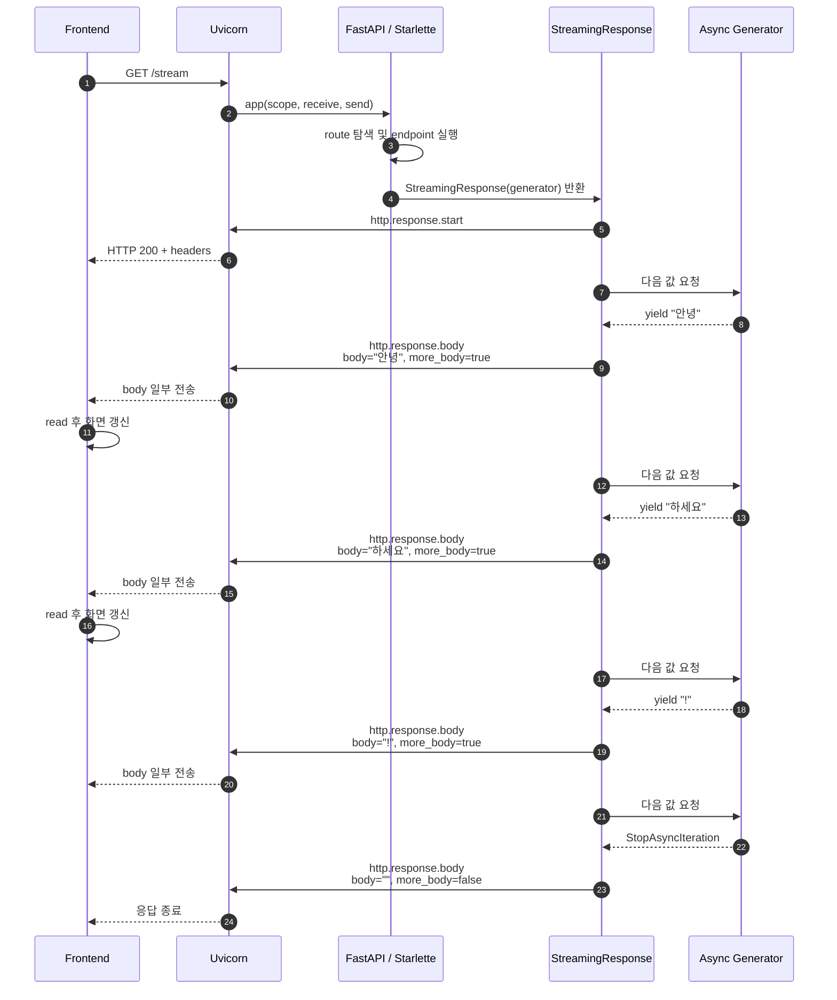

### 4.3 Frontend 예시

```javascript
const response = await fetch("/stream");
const reader = response.body.getReader();
const decoder = new TextDecoder();

while (true) {
  const { value, done } = await reader.read();

  if (done) {
    break;
  }

  const text = decoder.decode(value, { stream: true });
  console.log(text);
}
```

`reader.read()`는 브라우저의 stream buffer에 데이터가 들어올 때 완료된다. Backend generator의 `yield` 횟수와 `read()` 횟수가 같다는 보장은 없다.

## 5. `yield`와 Frontend read의 경계가 다른 이유

데이터는 여러 buffer와 protocol 계층을 통과한다.

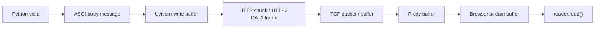

따라서 다음 등식은 성립하지 않는다.

```text
1 yield = 1 ASGI message = 1 TCP packet = 1 reader.read()
```

예를 들어 Backend가 두 번 yield해도 Frontend는 한 번에 받을 수 있다.

```python
yield b"hello"
yield b"world"
```

```text
reader.read() → "helloworld"
```

반대로 한 번 yield한 UTF-8 문자열이 network와 browser buffer 경계에서 여러 조각으로 관찰될 수도 있다. 따라서 application message의 경계를 다음 중 하나로 명시해야 한다.

- delimiter를 정의한 custom protocol
- 한 줄당 JSON 하나를 두는 NDJSON
- length-prefix protocol
- 빈 줄을 event 경계로 사용하는 SSE

## 6. `EventSourceResponse` 내부 동작

`EventSourceResponse`는 단순히 bytes를 보내는 것에서 끝나지 않고 값을 SSE wire format으로 변환한다.

### 6.1 Backend 예시

```python
import asyncio

from fastapi import FastAPI
from sse_starlette import EventSourceResponse

app = FastAPI()


async def generate_events():
    for event_id, text in enumerate(["안녕", "하세요", "!"], start=1):
        yield {
            "event": "token",
            "id": str(event_id),
            "data": text,
        }
        await asyncio.sleep(1)

    yield {
        "event": "done",
        "data": "",
    }


@app.get("/events")
async def events():
    return EventSourceResponse(generate_events())
```

dictionary는 대략 다음 bytes로 인코딩된다.

```text
id: 1
event: token
data: 안녕

id: 2
event: token
data: 하세요

event: done
data:

```

SSE에서 빈 줄은 하나의 event가 끝났다는 의미다. 응답의 media type은 `text/event-stream`이다.

### 6.2 SSE field

| field | 의미 |
| --- | --- |
| `data` | Frontend에 전달할 payload. 여러 줄이면 각 줄이 별도 `data:` field로 표현된다. |
| `event` | event 이름. Frontend가 `addEventListener(name, ...)`로 구독한다. |
| `id` | 마지막으로 처리한 event ID. 재연결 시 `Last-Event-ID`에 사용할 수 있다. |
| `retry` | native `EventSource`가 재연결을 시도하기 전 기다릴 시간이다. |
| `: comment` | application event가 아닌 주석이다. heartbeat/ping으로 사용할 수 있다. |

### 6.3 내부 task

구현 버전에 따라 세부 구성은 달라질 수 있지만 `sse-starlette`의 `EventSourceResponse`는 일반적으로 다음 책임을 함께 수행한다.

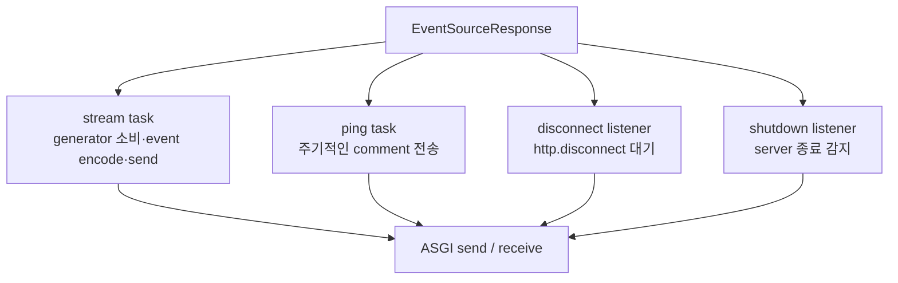

주요 추가 기능은 다음과 같다.

- event를 SSE 형식으로 encode
- 기본적으로 일정 간격의 ping comment 전송
- `receive()`에서 `http.disconnect` 감시
- 정지한 client에 대한 send timeout 지원
- 하나의 연결에서 data와 ping 전송이 겹치지 않도록 조정
- 연결 종료나 server shutdown 시 관련 task 및 generator 정리

현재 공식 `sse-starlette` 문서는 기본 ping 간격을 15초로 설명한다. 실제 사용 버전의 기본값과 옵션은 설치된 package를 다시 확인해야 한다.

### 6.4 전체 시퀀스

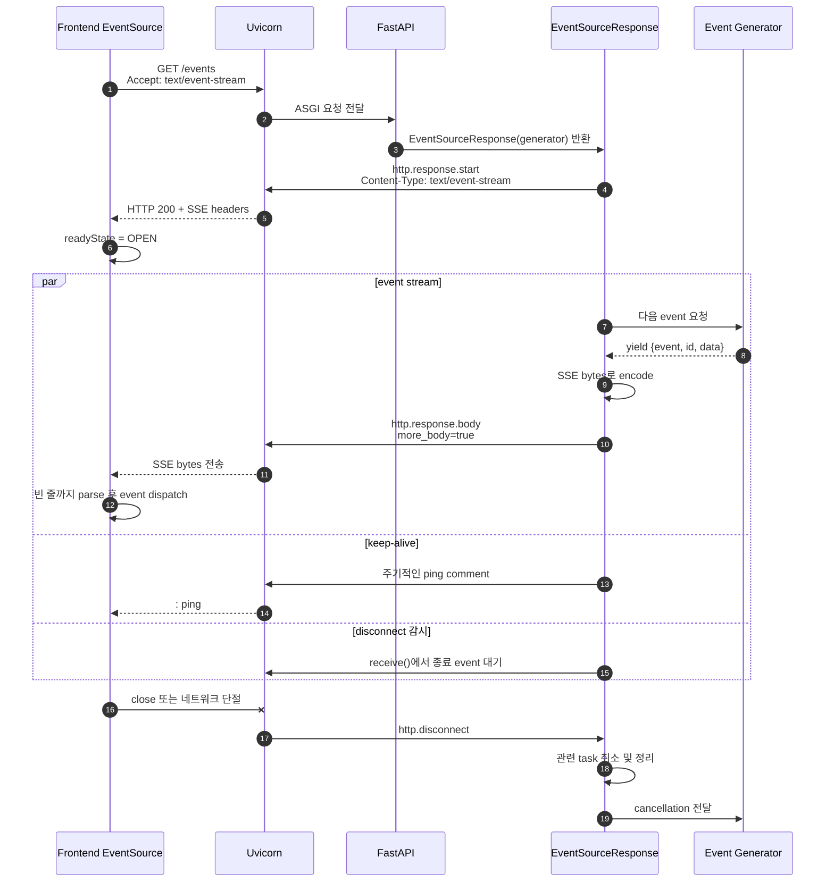

## 7. Frontend 연결 방법

### 7.1 native `EventSource`

```javascript
const eventSource = new EventSource("/events");

eventSource.addEventListener("token", (event) => {
  console.log(event.data);
});

eventSource.addEventListener("done", () => {
  eventSource.close();
});

eventSource.onerror = (error) => {
  console.error(error);
};
```

브라우저가 다음을 처리한다.

- SSE field와 event 경계 parsing
- `event:` 이름에 따른 event dispatch
- 연결이 비정상적으로 끊겼을 때 재연결
- `id:` 및 `Last-Event-ID` 관리
- `retry:` 재연결 간격 반영

다만 native `EventSource`는 일반적으로 GET 요청을 사용하며 임의의 request body와 header를 넣기 어렵다. 인증에는 same-origin cookie나 별도 token 전략을 고려해야 한다.

질문을 POST body로 보내야 하는 채팅은 다음처럼 명령과 stream을 분리할 수 있다.

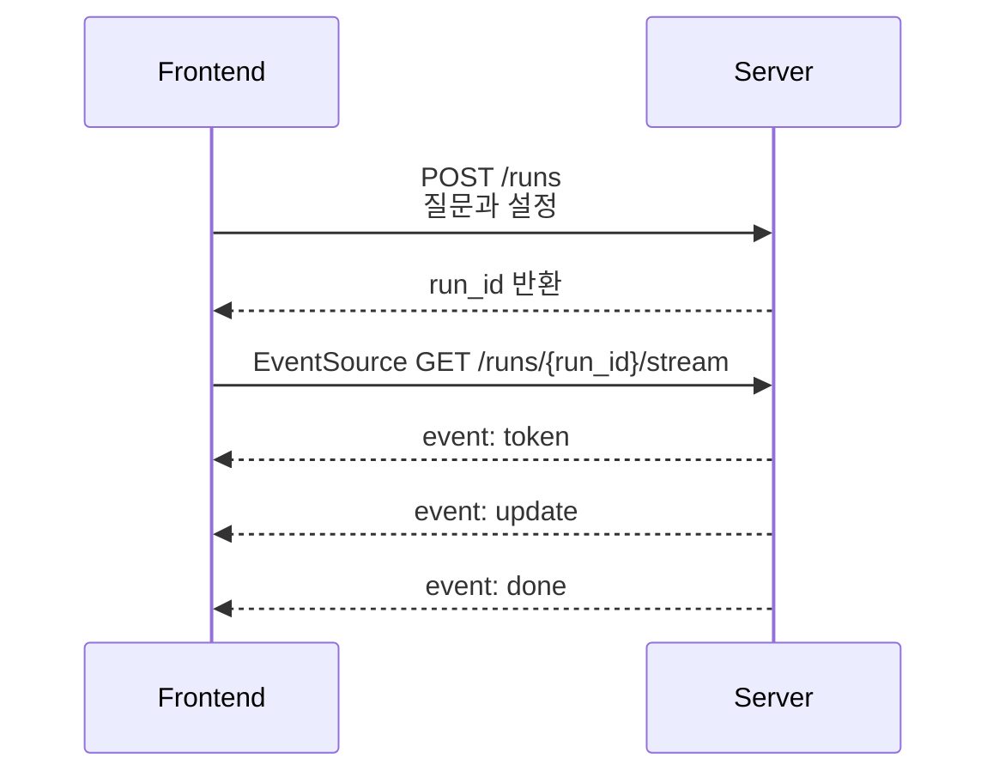

### 7.2 POST + `fetch()` streaming

POST 요청의 응답을 바로 stream으로 받고 싶으면 `fetch()`를 사용할 수 있다.

```javascript
const controller = new AbortController();

const response = await fetch("/chat", {
  method: "POST",
  headers: {
    "Content-Type": "application/json",
    "Accept": "text/event-stream",
  },
  body: JSON.stringify({ message: "안녕하세요" }),
  signal: controller.signal,
});

if (!response.ok || !response.body) {
  throw new Error(`stream 연결 실패: ${response.status}`);
}

const reader = response.body.getReader();
const decoder = new TextDecoder();

while (true) {
  const { value, done } = await reader.read();
  if (done) break;

  const chunk = decoder.decode(value, { stream: true });
  // chunk 경계는 SSE event 경계와 다를 수 있으므로
  // 실제 구현에서는 완성되지 않은 event를 buffer에 보관해야 한다.
}

// 필요할 때 연결 종료
controller.abort();
```

이 방식은 request method, body, header를 자유롭게 사용할 수 있다. 하지만 native `EventSource`가 아니므로 SSE parsing과 자동 재연결은 직접 구현하거나 전용 client library를 사용해야 한다.

## 8. 두 Response 비교

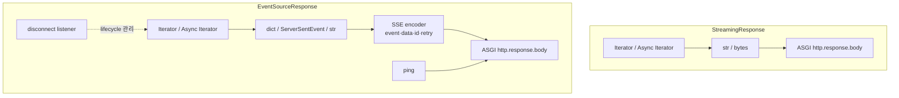

| 항목 | `StreamingResponse` | `EventSourceResponse` |
| --- | --- | --- |
| 목적 | 파일, text, NDJSON 등 범용 streaming | SSE 전용 streaming |
| Content-Type | 호출자가 결정 | 기본 `text/event-stream` |
| message 경계 | application이 직접 설계 | SSE의 빈 줄로 정의 |
| 입력 | 주로 `str`, `bytes` | `dict`, SSE event 객체, `str`, `bytes` |
| event 이름과 ID | 직접 구현 | `event`, `id`, `retry` 지원 |
| heartbeat | 직접 구현 | ping 지원 |
| disconnect lifecycle | 일반 response 수준 | 장기 SSE 연결에 맞춘 감시와 정리 |
| send timeout | 별도 구현 필요 | 옵션 지원 |
| native EventSource 호환 | SSE를 직접 만들면 가능 | 바로 사용 가능 |
| 양방향 통신 | 아님 | 아님 |

`EventSourceResponse`는 `StreamingResponse`보다 더 낮은 network 계층이 아니다. 둘 다 ASGI message를 보내며, 차이는 protocol과 lifecycle에 대한 책임 범위다. 현재 `sse-starlette`의 `EventSourceResponse`는 `StreamingResponse`를 상속하는 구조도 아니다.

## 9. LLM 답변에 적용한 흐름

```python
from sse_starlette import EventSourceResponse


async def generate_answer():
    async for token in llm.astream("질문"):
        yield {
            "event": "token",
            "data": token,
        }

    yield {
        "event": "done",
        "data": "",
    }


@app.get("/answer")
async def answer():
    return EventSourceResponse(generate_answer())
```

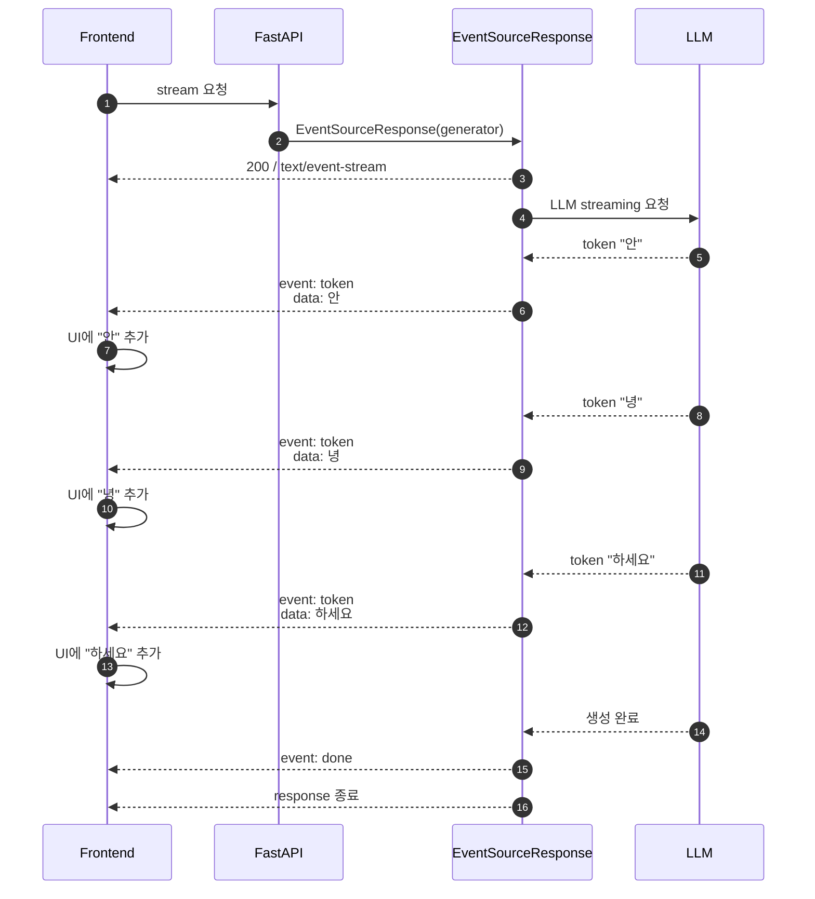

전체 답변이 완성된 뒤 전송하는 것이 아니라 다음 경로가 반복된다.

```text
LLM token 생성
  → async generator yield
  → EventSourceResponse가 SSE encode
  → ASGI send()
  → Uvicorn
  → proxy / TCP
  → browser parser
  → UI 갱신
```

## 10. 연결 종료

Frontend가 탭을 닫거나 `eventSource.close()`, `AbortController.abort()`를 호출하면 다음과 같은 흐름으로 전파된다.

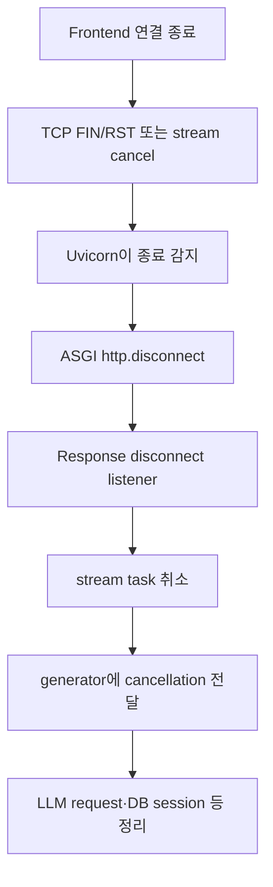

Generator는 cancellation을 삼키지 않아야 한다.

```python
import asyncio


async def generate_events():
    try:
        async for token in llm.astream("질문"):
            yield {"event": "token", "data": token}
    except asyncio.CancelledError:
        # 필요한 로그 또는 자원 정리
        raise
    finally:
        # DB session, external stream 등의 정리
        pass
```

주의할 점은 “Frontend 연결 종료”와 “Agent run을 취소해야 한다”가 항상 같은 의미는 아니라는 것이다.

- 연결 결합형: client disconnect 시 Agent run도 함께 취소
- run/transport 분리형: Agent run은 계속 진행하고 client는 나중에 다시 연결

제품 요구사항에 따라 명시적으로 결정해야 한다.

## 11. 오류 처리

### 응답 시작 전 오류

endpoint가 Response를 반환하기 전에 발생한 오류는 일반 HTTP 오류로 응답할 수 있다.

```http
HTTP/1.1 400 Bad Request
Content-Type: application/json
```

### 응답 시작 후 오류

이미 `http.response.start`로 `200`을 보낸 뒤에는 상태 코드를 바꾸기 어렵다. 따라서 stream 내부 오류를 application event로 표현할 수 있다.

```text
event: error
data: {"code":"LLM_ERROR","message":"답변 생성에 실패했습니다."}

```

Frontend는 `error` event를 받아 UI 상태를 갱신한 뒤 연결을 닫는다.

```javascript
eventSource.addEventListener("error_message", (event) => {
  const error = JSON.parse(event.data);
  showError(error.message);
  eventSource.close();
});
```

native `EventSource`의 자체 `error` callback과 application의 오류 event를 혼동하지 않도록 application event 이름을 `stream_error`, `error_message` 등으로 구분하는 편이 안전하다.

## 12. 운영 시 확인할 항목

### Proxy buffering

Backend가 매번 `send()`해도 Nginx, CDN, load balancer가 작은 body를 모아 두었다가 한꺼번에 보낼 수 있다. 이 경우 Backend log에는 전송이 진행되지만 Frontend 화면은 갱신되지 않는다.

- proxy buffering 비활성화 여부
- `X-Accel-Buffering: no` 같은 환경별 header/config
- compression middleware가 작은 event를 buffering하는지 여부

### Idle timeout과 heartbeat

LLM 또는 tool이 오래 침묵하면 중간 장비가 idle connection으로 판단할 수 있다.

```text
heartbeat interval < proxy/LB idle timeout
```

SSE comment ping은 사용자 event를 만들지 않고 연결이 살아 있다는 network traffic을 만든다.

```text
: ping

```

### 느린 client와 backpressure

Frontend가 읽지 않으면 OS와 Uvicorn의 send buffer가 차고 결국 `send()`가 오래 기다릴 수 있다. `send_timeout`, 동시 stream 제한, event 크기 제한 및 관측 지표가 필요하다.

### UTF-8 decode

Frontend는 multibyte 문자가 chunk 경계에서 나뉠 수 있으므로 streaming mode로 decode해야 한다.

```javascript
decoder.decode(value, { stream: true });
```

### 완료 의미

다음 두 완료를 구분하는 편이 좋다.

- application 완료: `event: done`
- transport 완료: HTTP response body 종료

명시적인 `done` event가 있으면 Frontend는 정상 완료와 예기치 않은 연결 종료를 구분하기 쉽다.

## 13. 선택 기준

### `StreamingResponse`가 적합한 경우

- 큰 파일이나 binary 데이터를 순차 전송한다.
- NDJSON처럼 SSE가 아닌 protocol을 사용한다.
- client가 `fetch()`로 직접 stream을 읽는다.
- SSE의 자동 재연결, event ID, ping이 필요하지 않다.

### `EventSourceResponse`가 적합한 경우

- server에서 browser로 진행 상황이나 token을 단방향 전송한다.
- event 이름, event ID, retry 같은 SSE semantics가 필요하다.
- heartbeat, disconnect 감지, send timeout을 직접 재구현하고 싶지 않다.
- native `EventSource`를 사용한다.

### WebSocket을 고려할 경우

- 연결 후에도 Frontend가 server에 여러 message를 계속 보내야 한다.
- server와 client가 독립적으로 message를 주고받는 완전한 양방향 통신이 필요하다.
- application protocol이 request 1회와 response stream 구조에 맞지 않는다.

## 14. 핵심 정리

```text
StreamingResponse
= generator 값을 ASGI body 조각으로 반복 전송하는 범용 response

EventSourceResponse
= SSE encoding
+ event 경계
+ event/id/retry field
+ ping
+ disconnect와 send lifecycle 관리
```

Frontend부터 Backend까지의 연결을 한 줄로 정리하면 다음과 같다.

```text
Browser 요청
  → Uvicorn이 ASGI scope 생성
  → FastAPI endpoint 실행
  → Response가 generator 소비
  → http.response.body(more_body=True) 반복
  → Uvicorn이 HTTP/TCP로 전송
  → Browser가 chunk 또는 SSE event를 처리
  → generator 종료 시 more_body=False
  → HTTP response 종료
```

## 참고 자료와 신뢰도

| 자료 | 확인 내용 | 신뢰도 |
| --- | --- | --- |
| [ASGI HTTP & WebSocket Specification](https://asgi.readthedocs.io/en/latest/specs/www.html) | `scope`, `http.request`, `http.response.start`, `http.response.body`, `more_body`, disconnect | 높음: 공식 protocol 명세 |
| [Starlette Responses](https://www.starlette.io/responses/#streamingresponse) | `StreamingResponse`의 공식 사용 방식 | 높음: 공식 framework 문서 |
| [sse-starlette 공식 저장소](https://github.com/sysid/sse-starlette) | `EventSourceResponse`, ping, disconnect, timeout, production 주의사항 | 높음: 구현체 공식 저장소. 세부 동작은 version 의존 |
| [MDN: Using server-sent events](https://developer.mozilla.org/en-US/docs/Web/API/Server-sent_events/Using_server-sent_events) | Browser `EventSource`, `text/event-stream`, event field와 재연결 | 높음: browser API 표준 해설 |

### 버전 주의

- ASGI HTTP sub-specification 확인 버전: 2.5, 2024-06-05
- `sse-starlette`의 task 구성, header 기본값, ping 기본값과 shutdown 기능은 package version에 따라 바뀔 수 있다.
- 실제 서비스에 적용할 때는 lock file에 고정된 Starlette, Uvicorn, `sse-starlette` 버전의 source와 release note를 다시 확인한다.
