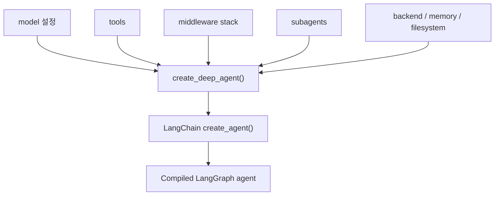
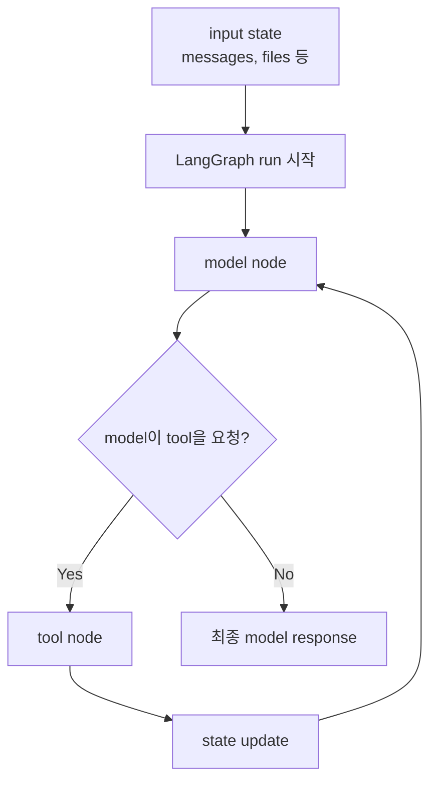
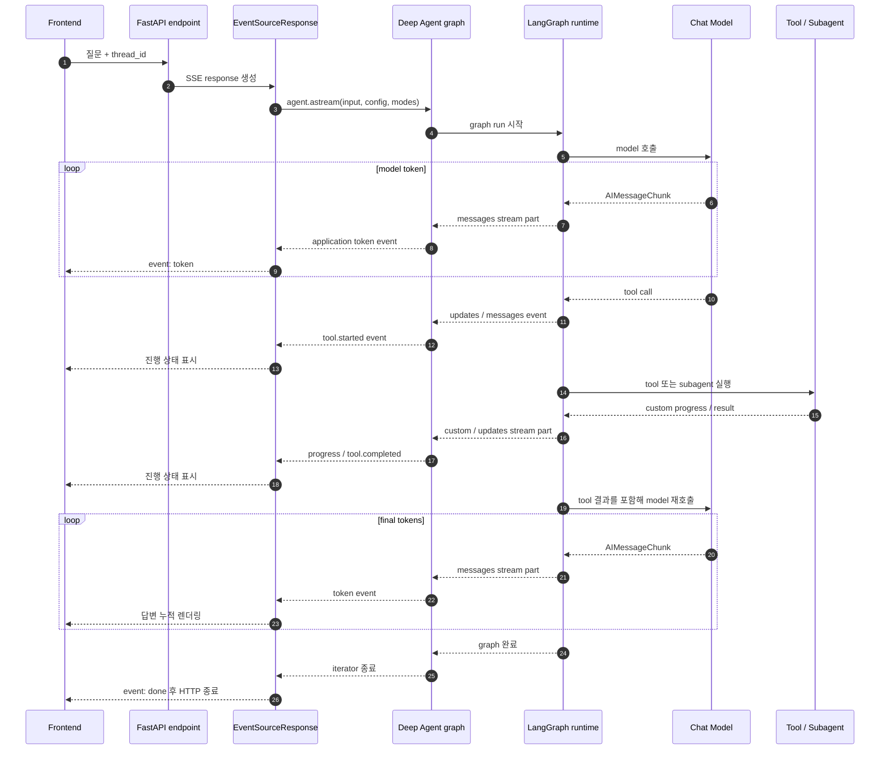
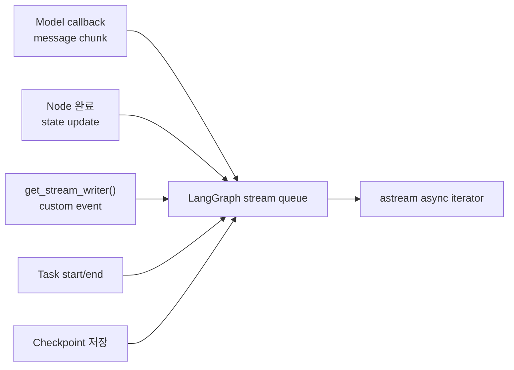
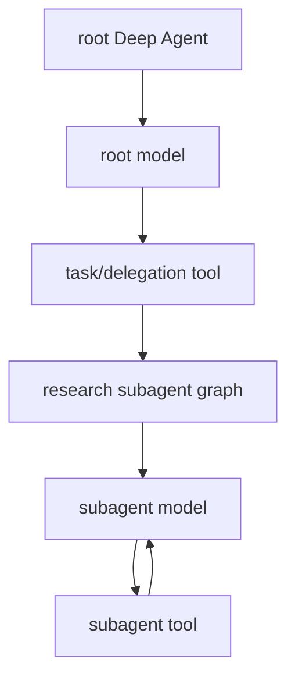
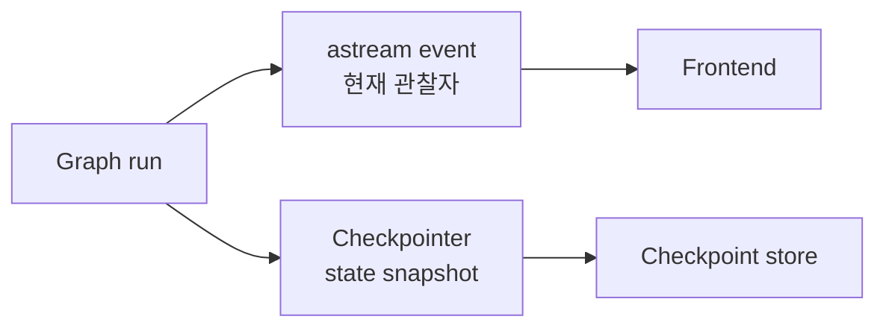
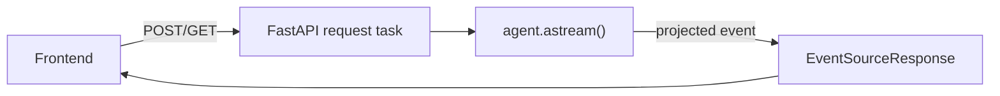
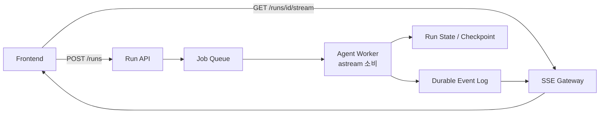
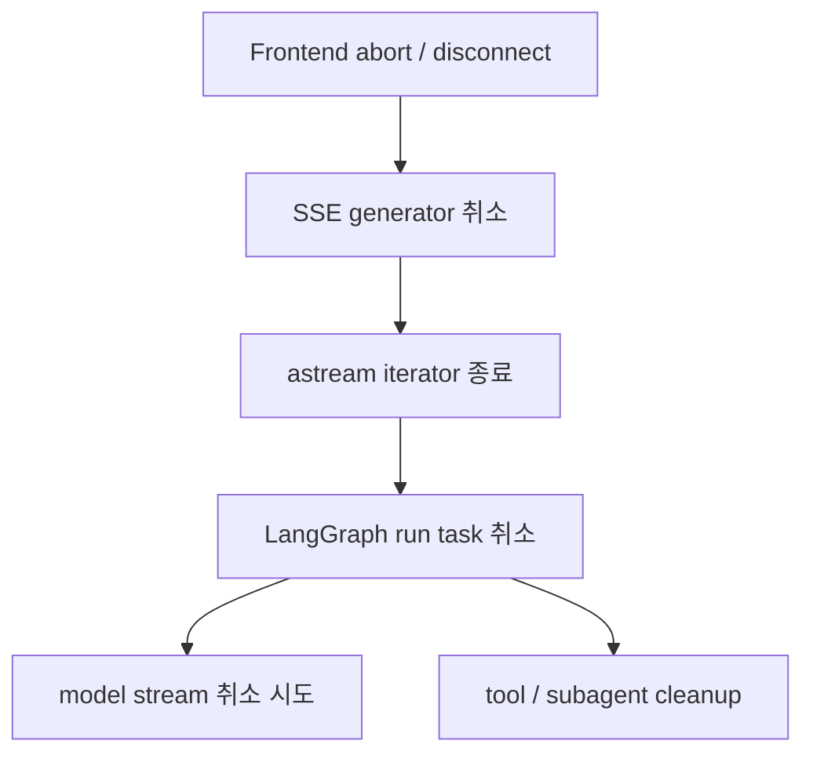

# DeepAgent·LangGraph `astream()` 전체 흐름과 구현 패턴

> 조사 기준일: 2026-09-20  
> 대상: Deep Agents → LangChain Agent → LangGraph runtime → `astream()` → application event → SSE → Frontend  
> 목적: `astream()`이 무엇을 실행하고 어떤 값을 내보내는지, 이를 서비스에 연결할 때 어떤 패턴이 안전한지 이해한다.  
> 관련 자료: [01_DeepAgent_SSE_스트리밍_동작과_운영_설계.md](./01_DeepAgent_SSE_스트리밍_동작과_운영_설계.md), [02_StreamingResponse와_EventSourceResponse_요청부터_응답까지.md](./02_StreamingResponse와_EventSourceResponse_요청부터_응답까지.md)

## 결론

`astream()`은 HTTP나 SSE 기능이 아니다. **실행 중인 Runnable 또는 LangGraph graph에서 결과와 실행 event를 비동기 iterator 형태로 관찰하는 Python API**다.

Deep Agent에서는 역할이 다음과 같이 나뉜다.

```text
Deep Agents
  = middleware, subagent, filesystem, memory 등을 조립하는 harness

LangChain Agent
  = model 호출 → tool 실행 → model 재호출 agent loop

LangGraph
  = state, node scheduling, checkpoint, interrupt, streaming runtime

astream()
  = LangGraph runtime에서 발생한 선택된 stream output을 async iterator로 노출

EventSourceResponse
  = iterator를 HTTP/SSE로 Frontend에 전달
```

서비스 구현에서는 다음 패턴을 권장한다.

1. 새 코드라면 `version="v2"`로 반환 형태를 `type`, `ns`, `data` 구조로 고정한다.
2. 일반 사용자 UI에는 `stream_mode=["messages", "updates", "custom"]`만 우선 검토한다.
3. Deep Agent의 subagent 과정도 보여줘야 하면 `subgraphs=True`를 사용하고 `ns`로 출처를 구분한다.
4. LangGraph object를 그대로 JSON 직렬화하지 않고 application event contract로 투영한다.
5. token은 `messages`, 의미 있는 상태 전환은 `updates`, 사람이 이해할 진행 상황은 `custom`으로 역할을 분리한다.
6. 연결이 끊겼을 때 Agent run까지 취소할 것인지 별도 정책으로 결정한다.
7. timeout, 동시 run 제한, event 크기 제한, cancellation 정리, 관측 지표를 둔다.

권장 기본 호출은 다음과 같다.

```python
async for part in agent.astream(
    input_state,
    config=config,
    stream_mode=["messages", "updates", "custom"],
    subgraphs=True,
    version="v2",
):
    event = project_stream_part(part)
    if event is not None:
        yield event
```

그러나 이 네 줄만으로 인증, 직렬화, 민감 정보 제거, disconnect 정책, 오류 contract, backpressure가 해결되는 것은 아니다.

## 1. 먼저 구분해야 하는 세 가지 `astream()`

`astream()`이라는 이름은 LangChain Runnable interface 전반에 존재한다. 같은 이름이라도 관찰 범위와 출력이 다르다.

| 호출 대상 | 대표 출력 | 의미 |
| --- | --- | --- |
| `chat_model.astream()` | `AIMessageChunk` | 하나의 model 호출이 생성하는 message chunk |
| `chain.astream()` | chain output chunk | LCEL/Runnable pipeline의 streaming output |
| `graph.astream()` / `agent.astream()` | state, node update, model token, custom event 등 | graph 전체 실행을 선택한 `stream_mode`로 관찰 |

### 1.1 모든 Runnable이 실제 streaming을 지원하는 것은 아니다

LangChain `Runnable.astream()`의 기본 구현은 `ainvoke()` 결과를 한 번 yield한다. 따라서 subclass가 streaming을 재정의하지 않았다면 다음처럼 보일 수 있다.

```text
astream()을 호출함
  → 실행 중에는 아무 값도 오지 않음
  → 전체 실행 완료
  → 최종 결과 하나만 yield
```

즉 `astream()`이라는 method가 존재한다는 사실만으로 token streaming을 보장하지 않는다. model provider와 중간 Runnable이 streaming을 실제 구현했는지 확인해야 한다.

### 1.2 이 문서에서 말하는 `astream()`

이후 내용은 주로 Deep Agent가 반환하는 compiled LangGraph graph의 다음 호출을 의미한다.

```python
async for part in agent.astream(...):
    ...
```

Deep Agents 공식 architecture에 따르면 Deep Agents는 별도 runtime을 만들지 않는다. `create_deep_agent()`가 LangChain `create_agent()`를 이용해 runnable agent graph를 만들고, 실행·state·checkpoint·interrupt·streaming은 LangGraph가 담당한다.

## 2. 생성 단계와 실행 단계

### 2.1 생성 단계



이 단계에서는 아직 사용자 질문을 실행하지 않는다. 호출 가능한 graph 구조와 runtime 설정을 조립한다.

### 2.2 실행 단계

`agent.astream()`을 iteration하기 시작하면 실제 graph run이 진행된다.



Deep Agent에서는 tool이 filesystem, memory, task delegation 또는 subagent 실행일 수 있다. 따라서 하나의 질문도 여러 model 호출과 tool 실행을 거칠 수 있다.

## 3. Frontend까지의 전체 흐름



중요한 점은 `astream()` 자체가 Frontend로 전송하지 않는다는 것이다.

```text
astream()
  → Python process 안에서 async iterator 제공

application adapter
  → 내부 object를 공개 event로 변환

EventSourceResponse
  → 공개 event를 SSE bytes로 변환

Uvicorn
  → SSE bytes를 HTTP/TCP로 전송
```

## 4. 내부에서는 무엇이 stream event를 만드는가

LangGraph는 Pregel 형태의 step 기반 runtime으로 graph를 실행한다. 한 step에서 실행 가능한 node task를 수행하고, node가 쓴 update를 channel/state에 적용한 후 다음 step으로 진행한다.

Stream event는 단일 위치에서만 생기지 않는다.



호출자는 `stream_mode`로 이 중 필요한 projection을 선택한다. 선택하지 않은 mode를 Frontend에서 나중에 복원할 수는 없으므로 UI contract에 필요한 정보부터 정해야 한다.

현재 공식 reference는 내부 `AsyncQueue`를 unbounded FIFO queue로 설명한다. model callback 등은 실행 중 event를 queue에 넣고, `astream()` consumer는 queue에서 값을 꺼내 받는다. 그러므로 HTTP socket의 backpressure가 model token 생산을 항상 완전하게 멈춘다고 가정하면 안 된다.

## 5. `stream_mode`의 의미

### 5.1 mode 비교

| mode | 나오는 시점 | data | 적합한 용도 | 주의점 |
| --- | --- | --- | --- | --- |
| `messages` | LLM message/token 생성 | message chunk + metadata | 답변 token rendering | 모든 내부 model 호출 token이 섞일 수 있음 |
| `updates` | node가 state update를 쓴 뒤 | node별 delta | 단계 완료, tool 결과, interrupt 감지 | state 내부 object를 그대로 노출하면 안 됨 |
| `custom` | node/tool이 writer 호출 | application 정의 payload | progress, 업무 event | schema와 크기를 직접 관리해야 함 |
| `values` | graph step 이후 | 전체 state snapshot | 개발·작은 graph 상태 관찰 | message history가 반복되어 payload가 커짐 |
| `tasks` | task 시작/종료 | task, result, error | 운영 추적 | checkpointer 필요, 내부 정보 노출 가능 |
| `checkpoints` | checkpoint 발생 | state snapshot과 metadata | persistence 진단 | checkpointer 필요, payload가 크고 민감함 |
| `debug` | 다양한 runtime 지점 | 가능한 많은 정보 | 로컬 진단 | 사용자 stream에 부적합 |

### 5.2 `messages`

`messages` mode는 `(message_chunk, metadata)`를 제공한다.

```python
async for part in graph.astream(
    input_state,
    stream_mode="messages",
    version="v2",
):
    if part["type"] != "messages":
        continue

    message, metadata = part["data"]
```

metadata에는 node, tag 등 출처를 구분하는 정보가 포함될 수 있다. multi-agent graph에서는 이 정보를 사용하지 않으면 coordinator, 내부 structured-output model, subagent의 token이 한 답변처럼 섞일 수 있다.

권장 filtering 기준은 다음 순서다.

1. `ns`: root graph인지 특정 subgraph인지
2. `langgraph_node`: 어느 node에서 생성됐는지
3. `tags`: 공개 답변용 model 호출인지
4. message type/content: 실제로 사용자에게 보낼 text인지

내부 model 호출을 아예 `messages` stream에서 제외하고 싶으면 현재 공식 문서가 제공하는 `nostream` tag도 고려할 수 있다.

```python
internal_model = model.with_config({"tags": ["nostream"]})
```

이 model은 실행되지만 token은 `messages` mode로 방출하지 않는다. 동일 내용을 `custom` event로 따로 보내는 경우 중복 token을 막는 데도 유용하다.

### 5.3 `updates`

`updates`는 전체 state가 아니라 node가 만든 변경분을 제공한다.

```python
if part["type"] == "updates":
    for node_name, update in part["data"].items():
        ...
```

추천 이유:

- `values`보다 payload가 작다.
- 어떤 node가 변화를 만들었는지 식별하기 쉽다.
- tool 결과, Agent 단계 완료, HITL interrupt 같은 의미 있는 경계를 잡기 좋다.

다만 `update`에는 내부 message object, tool 결과, filesystem 정보가 들어갈 수 있다. 통째로 `json.dumps()`하지 말고 허용된 field만 공개 event로 변환해야 한다.

### 5.4 `custom`

`custom`은 graph 구조가 아니라 application domain에 맞는 event를 명시적으로 만들 때 사용한다.

```python
from langgraph.config import get_stream_writer


async def retrieve_documents(state):
    writer = get_stream_writer()
    writer({
        "kind": "retrieval.progress",
        "current": 20,
        "total": 100,
    })

    documents = await search(state["query"])

    writer({
        "kind": "retrieval.completed",
        "count": len(documents),
    })
    return {"documents": documents}
```

`custom`을 추천하는 이유는 UI가 LangGraph 내부 node 이름이나 state schema에 직접 결합되지 않기 때문이다.

```text
내부 node 이름 변경
  retrieve_docs → hybrid_retrieval

application event 유지
  retrieval.started / retrieval.completed

Frontend 변경 없음
```

Python 3.11 미만의 async context propagation에는 제약이 있으므로, 해당 환경에서는 공식 문서에 따라 writer나 config를 명시적으로 전달해야 한다.

### 5.5 `values`

`values`는 step마다 전체 state snapshot을 내보낸다. 작은 학습 예제에는 편하지만 장기 대화에서는 다음 문제가 생긴다.

```text
step 1: messages 10개 전체 전송
step 2: messages 12개 전체 전송
step 3: messages 14개 전체 전송
...
```

누적 state를 매번 직렬화하므로 CPU, memory copy, network 비용이 커지고 민감한 내부 state가 노출될 수 있다. 운영 Frontend의 기본 mode로 권장하지 않는다.

### 5.6 `tasks`, `checkpoints`, `debug`

이 mode는 운영·진단에 유용하지만 사용자용 token stream과 목적이 다르다.

- `tasks`: node task의 시작/종료, 결과, 오류 추적
- `checkpoints`: 저장된 graph state와 다음 task 확인
- `debug`: checkpoint와 task를 포함한 광범위한 runtime 정보

일반 사용자에게 그대로 보내면 payload 증가와 내부 구조 노출 위험이 있다. 관리자 전용 stream, tracing 또는 문제 재현 도구로 분리하는 것이 좋다.

## 6. v1과 v2 반환 형식

### 6.1 v1의 가변 구조

현재 문서에서 v1은 여전히 기본값일 수 있으며 옵션 조합에 따라 반환 shape가 달라진다.

| 조건 | v1 반환 형태 |
| --- | --- |
| mode 한 개 | raw data |
| mode 여러 개 | `(mode, data)` |
| subgraph 포함 | `(namespace, data)` |
| mode 여러 개 + subgraph | `(namespace, mode, data)` |

이 구조는 옵션이 변경될 때 unpacking code도 바뀌어야 한다.

### 6.2 v2의 고정 envelope

LangGraph 1.1 이상에서 `version="v2"`를 사용하면 옵션과 관계없이 다음 구조를 사용한다.

```python
{
    "type": "messages",  # stream mode
    "ns": (),            # root 또는 subgraph namespace
    "data": ...,         # mode별 payload
}
```

```python
async for part in graph.astream(
    input_state,
    stream_mode=["messages", "updates", "custom"],
    subgraphs=True,
    version="v2",
):
    match part["type"]:
        case "messages":
            ...
        case "updates":
            ...
        case "custom":
            ...
```

새 구현에 v2를 추천하는 이유는 다음과 같다.

- stream mode 수가 바뀌어도 outer shape가 같다.
- `subgraphs=True`를 추가해도 parser 구조가 바뀌지 않는다.
- `type`이 discriminator이므로 type narrowing이 가능하다.
- local graph와 remote SDK event를 비슷한 application adapter로 다루기 쉽다.

주의할 점은 `version="v2"`가 SSE protocol version이 아니라 **LangGraph stream output format version**이라는 것이다.

## 7. subgraph와 Deep Agent subagent

Deep Agent의 subagent 실행을 parent graph에서 관찰하려면 namespace를 이해해야 한다.



`subgraphs=True`를 사용하면 root와 child graph의 event가 모두 같은 iterator로 들어오며 `ns`가 출처 경로를 알려준다.

```python
{
    "type": "messages",
    "ns": ("research_agent:<task-id>",),
    "data": (message_chunk, metadata),
}
```

`ns == ()`이면 root graph event이고 값이 있으면 subgraph event다. 중첩 subgraph라면 namespace path가 더 길어진다.

### UI 권장 패턴

root answer와 subagent output을 하나의 문자열에 섞지 않는다.

```text
root message area
  └─ coordinator 최종 답변

subagent activity cards
  ├─ researcher: searching → completed
  └─ analyst: analyzing → completed
```

그 이유는 병렬 subagent의 token 순서가 전체 문장 순서가 아니기 때문이다. 도착 순으로 하나의 buffer에 붙이면 서로 다른 발화가 섞인다.

## 8. checkpointer와 `thread_id`

`astream()`은 실행 event를 현재 consumer에게 전달하는 기능이고, checkpointer는 graph state를 저장하는 기능이다. 둘은 목적이 다르다.



checkpointer를 사용하면 config에 독립적인 thread ID를 전달해야 한다.

```python
config = {
    "configurable": {
        "thread_id": thread_id,
    }
}
```

주의할 점:

- `thread_id`는 인증된 사용자 소유권 검증 없이 request 값을 그대로 신뢰하면 안 된다.
- 서로 다른 대화에 같은 `thread_id`를 사용하면 state가 섞인다.
- 같은 thread에 동시 run을 허용할 때 충돌 전략을 정해야 한다.
- checkpoint는 token event log가 아니다. 끊긴 SSE token을 자동 replay해 주지 않는다.
- process 재시작 후 stream replay가 필요하면 별도의 durable event log가 필요하다.

## 9. 추천 application event contract

LangGraph event를 Frontend에 그대로 노출하지 않고 다음처럼 안정된 공개 schema로 변환한다.

```json
{
  "schema_version": 1,
  "run_id": "run-123",
  "seq": 17,
  "type": "assistant.token",
  "source": {
    "kind": "root",
    "name": "coordinator"
  },
  "data": {
    "text": "안녕"
  }
}
```

추천 event 종류:

| event | 목적 |
| --- | --- |
| `run.started` | run ID와 시작 상태 전달 |
| `assistant.token` | 사용자에게 보여줄 text delta |
| `assistant.message.completed` | 한 message 완료 |
| `tool.started` | 공개 가능한 tool 실행 시작 |
| `tool.completed` | tool 완료와 공개 가능한 요약 |
| `subagent.started` | subagent activity 생성 |
| `subagent.progress` | subagent 진행 상태 |
| `subagent.completed` | subagent 완료 |
| `hitl.required` | 사용자 검토 또는 승인 필요 |
| `run.completed` | graph 정상 완료 |
| `run.failed` | graph 실패 |

### 왜 `seq`가 필요한가

동일 connection에서 순서는 유지되더라도 logging, reconnect, durable event log, 중복 제거를 고려하면 run 내부 sequence가 유용하다.

- Frontend가 중복 event를 무시할 수 있다.
- reconnect 후 빠진 범위를 탐지할 수 있다.
- 병렬 source event를 수신 순서대로 재현할 수 있다.

단, in-memory 연결 결합형에서 `seq`만 추가한다고 replay가 생기는 것은 아니다. replay하려면 event를 지속성 store에 저장해야 한다.

## 10. 권장 구현: 연결 결합형

짧고 재연결 요구가 낮은 초기 서비스에는 request task가 `astream()`을 직접 소비하는 구조가 가장 단순하다.



### 10.1 event projector

```python
from collections.abc import Mapping
from typing import Any


def source_from(part: Mapping[str, Any], metadata: Mapping[str, Any]) -> dict:
    namespace = tuple(part.get("ns", ()))
    return {
        "kind": "subagent" if namespace else "root",
        "namespace": list(namespace),
        "node": metadata.get("langgraph_node"),
    }


def project_stream_part(part: Mapping[str, Any]) -> dict | None:
    part_type = part["type"]

    if part_type == "messages":
        message, metadata = part["data"]

        # 내부 model 또는 허용하지 않은 node의 token 제거
        tags = set(metadata.get("tags", ()))
        if "private" in tags or "nostream" in tags:
            return None

        text = message.content
        if not isinstance(text, str) or not text:
            return None

        return {
            "type": "assistant.token",
            "source": source_from(part, metadata),
            "data": {"text": text},
        }

    if part_type == "custom":
        payload = part["data"]
        if not isinstance(payload, Mapping):
            return None

        kind = payload.get("kind")
        if kind not in {
            "tool.started",
            "tool.completed",
            "subagent.progress",
        }:
            return None

        return {
            "type": kind,
            "source": {
                "kind": "subagent" if part.get("ns") else "root",
                "namespace": list(part.get("ns", ())),
            },
            "data": dict(payload.get("data", {})),
        }

    if part_type == "updates":
        # 내부 state 전체를 반환하지 않는다.
        return project_allowed_updates(part)

    return None
```

실제 `AIMessageChunk.content`는 provider와 content block 형식에 따라 단순 문자열이 아닐 수 있으므로, 사용하는 LangChain version과 model integration에 맞는 text 추출 함수를 별도로 두는 편이 안전하다.

### 10.2 SSE generator

```python
import asyncio
import json
from collections.abc import AsyncIterator


async def stream_agent_events(
    *,
    request,
    agent,
    input_state: dict,
    config: dict,
    run_id: str,
) -> AsyncIterator[dict]:
    seq = 0

    def make_event(event_type: str, data: dict) -> dict:
        nonlocal seq
        seq += 1
        envelope = {
            "schema_version": 1,
            "run_id": run_id,
            "seq": seq,
            "type": event_type,
            "data": data,
        }
        return {
            "event": event_type,
            "id": f"{run_id}:{seq}",
            "data": json.dumps(envelope, ensure_ascii=False),
        }

    yield make_event("run.started", {})

    try:
        async for part in agent.astream(
            input_state,
            config=config,
            stream_mode=["messages", "updates", "custom"],
            subgraphs=True,
            version="v2",
        ):
            if await request.is_disconnected():
                # 연결 결합형 정책: iterator를 종료하여 run도 취소한다.
                return

            projected = project_stream_part(part)
            if projected is None:
                continue

            yield make_event(projected["type"], projected)

        yield make_event("run.completed", {})

    except asyncio.CancelledError:
        # generator, model stream, tool resource가 정리되도록 취소를 전파한다.
        raise

    except Exception as exc:
        # 외부에는 안전한 오류만 노출하고 상세 stack은 server log/tracing에 기록한다.
        logger.exception("agent stream failed", extra={"run_id": run_id})
        yield make_event(
            "run.failed",
            {"code": "AGENT_RUN_FAILED", "message": "답변 생성에 실패했습니다."},
        )
```

### 10.3 endpoint

```python
from sse_starlette import EventSourceResponse


@router.post("/runs/stream")
async def create_run_stream(body: RunRequest, request: Request):
    principal = require_principal(request)
    thread = await thread_repository.get_owned(
        thread_id=body.thread_id,
        owner_id=principal.id,
    )

    run_id = new_run_id()
    config = {
        "configurable": {"thread_id": thread.id},
        "metadata": {
            "run_id": run_id,
            "user_id": principal.id,
        },
    }

    return EventSourceResponse(
        stream_agent_events(
            request=request,
            agent=agent,
            input_state={"messages": [("user", body.message)]},
            config=config,
            run_id=run_id,
        ),
        ping=15,
        send_timeout=30,
        headers={"Cache-Control": "no-cache"},
    )
```

### 이 패턴을 추천하는 이유

- producer와 consumer 경로가 짧아 first-token latency가 작다.
- 별도 queue, worker, broker 없이 cancellation과 오류 경로를 추적하기 쉽다.
- 초기 트래픽에서 필요한 보호 장치를 명확히 측정할 수 있다.
- run이 짧고 disconnect 시 취소해도 되는 제품에는 충분하다.

## 11. 추천 구현: run과 transport 분리형

다음 요구가 생기면 Agent run을 HTTP connection에서 분리한다.

- mobile network 전환 후 재연결
- browser tab 종료 후에도 run 계속 실행
- 수분 이상 걸리는 tool/subagent 작업
- rolling deployment와 다중 pod
- event replay 또는 여러 subscriber



이 구조에서는 worker가 `astream()`을 끝까지 소비하면서 projected event를 event log에 저장하고, SSE gateway는 저장된 event를 읽어 전달한다.

권장 사항:

- replay가 필요하면 Redis Pub/Sub만 사용하지 말고 Redis Streams, Kafka 또는 DB event table처럼 durable한 log 사용
- `(run_id, seq)`에 unique constraint 또는 idempotency 적용
- reconnect의 `Last-Event-ID`를 `seq`로 해석
- 최종 run status와 checkpoint를 event log와 별도 관리
- client disconnect가 worker cancellation으로 자동 전파되지 않게 lifecycle 분리

복잡도가 크므로 단순한 초기 서비스에 미리 도입하는 것은 권장하지 않는다.

## 12. backpressure와 memory

### 12.1 기대하면 안 되는 것

다음 추론은 안전하지 않다.

```text
Frontend가 느림
  → SSE send()가 느려짐
  → astream consumer가 느려짐
  → model provider도 token 생성을 즉시 멈춤
```

Uvicorn과 TCP 계층에는 write flow control이 있지만 LangGraph 내부 event callback과 stream queue가 완전히 같은 속도로 결합되어 있다고 보장할 수 없다. 현재 공식 reference의 `AsyncQueue`는 unbounded FIFO로 설명된다.

### 12.2 보호 장치

- 연결당 최대 run 수 제한
- 사용자/tenant별 동시성 제한
- Agent 전체 실행 timeout
- node/tool별 timeout
- `EventSourceResponse.send_timeout`
- 큰 tool 결과를 stream에 싣지 않고 요약 또는 reference만 전송
- token을 매번 무거운 JSON object로 재직렬화하지 않기
- queue가 필요하면 bounded channel과 overflow 정책 정의
- event queue depth, send latency, disconnect 수, first-token latency 관측

### 12.3 token batching

token 하나당 event 하나는 UI 반응성이 좋지만 event 수와 JSON/SSE overhead가 커진다. 다음 기준으로 짧게 묶을 수 있다.

```text
flush 조건
  - 20~50ms 경과
  - buffer가 N자 이상
  - 문장부호 또는 content block 경계
  - message 완료
```

너무 오래 묶으면 first-token latency가 나빠지고, 전혀 묶지 않으면 CPU와 network overhead가 늘어난다. 실제 model과 client 환경에서 측정해 결정한다.

## 13. 취소, timeout, 오류

### 13.1 취소 전파



`CancelledError`를 일반 오류처럼 삼키면 상위 task가 run이 끝났다고 판단하지 못하거나 resource가 남을 수 있다.

```python
except asyncio.CancelledError:
    await cleanup_if_needed()
    raise
```

### 13.2 timeout 계층

timeout은 하나가 아니라 목적별로 둔다.

| timeout | 보호 대상 |
| --- | --- |
| 전체 run timeout | 무한 agent loop와 장기 점유 |
| graph step/node timeout | 특정 node 정지 |
| model request timeout | provider 응답 정지 |
| tool timeout | 외부 API, shell, DB 정지 |
| SSE send timeout | 읽지 않는 client |
| proxy idle timeout | 중간 network 연결 |

한 timeout을 크게 잡아 모든 문제를 해결하려 하지 않는다.

### 13.3 stream 시작 후 오류

HTTP `200`과 SSE header가 이미 전송된 후에는 status를 `500`으로 바꿀 수 없다. application event로 실패를 알린다.

```text
event: run.failed
data: {"code":"TOOL_TIMEOUT","message":"작업 시간이 초과되었습니다."}

```

stack trace, provider response, prompt, tool argument는 그대로 노출하지 않고 server log와 tracing에 기록한다.

## 14. 주요 안티 패턴

### 14.1 `astream()` 출력을 그대로 `yield`

```python
async for chunk in agent.astream(...):
    yield chunk
```

문제:

- LangChain message와 metadata는 바로 JSON serializable하지 않을 수 있다.
- 내부 prompt, tool argument, state가 노출될 수 있다.
- library upgrade가 Frontend contract를 깨뜨린다.
- subagent token과 최종 답변 token이 섞인다.

대안: 명시적인 projector와 versioned application event schema를 둔다.

### 14.2 v1 tuple을 옵션과 무관하게 고정 unpacking

```python
async for mode, chunk in agent.astream(...):
    ...
```

`subgraphs=True`가 추가되면 v1은 triple이 될 수 있다. single mode에서는 raw data일 수 있다.

대안: 새 코드에서는 `version="v2"`와 `part["type"]`, `part["ns"]`, `part["data"]` 사용.

### 14.3 사용자 stream에 `values` 또는 `debug` 사용

문제:

- step마다 전체 state를 반복 전송
- 대화 history가 길어질수록 payload 증가
- 내부 state와 개인정보 노출 가능
- Frontend가 runtime 구현에 결합

대안: `messages + updates + custom`을 필요한 field로 투영.

### 14.4 metadata filtering 없이 모든 `messages` 연결

문제:

- coordinator와 subagent 발화 혼합
- structured-output용 내부 model token 노출
- 병렬 model 호출의 token interleaving
- tool call content block을 일반 text처럼 렌더링

대안: namespace, node, tag, message/content type으로 필터링하고 source별 buffer 유지.

### 14.5 checkpoint를 event replay log로 간주

Checkpoint는 graph state 복구용이다. token별 SSE event sequence를 저장하지 않는다.

대안: replay가 요구되면 projected application event를 별도 durable log에 기록.

### 14.6 연결마다 unbounded application queue 추가

문제:

- 느린 client가 memory를 계속 사용
- LangGraph 내부 queue와 중복 buffering
- 실제 backpressure가 어디에서 끊겼는지 파악하기 어려움

대안: 직접 iteration부터 시작하고 분리가 필요하면 bounded AnyIO channel과 block/drop/cancel 정책을 명시.

### 14.7 disconnect면 언제나 Agent 취소

짧은 채팅에는 합리적이지만 긴 조사, 파일 처리, 승인 workflow에서는 사용자의 일시적 network 단절로 비싼 작업이 사라진다.

대안: 제품 semantics에 따라 연결 결합형과 run/transport 분리형을 선택.

### 14.8 blocking 작업을 async node에서 직접 실행

```python
async def node(state):
    result = blocking_sdk_call()  # event loop 차단
    return {"result": result}
```

문제: 해당 worker event loop의 다른 stream과 heartbeat까지 지연될 수 있다.

대안: async client 사용, thread offload 또는 별도 worker로 분리.

### 14.9 `CancelledError`를 `except Exception` 처리로 숨김

취소가 정상 종료처럼 바뀌거나 resource 정리가 꼬일 수 있다.

대안: cancellation은 별도로 잡아 정리 후 다시 raise.

### 14.10 같은 `thread_id`에 무제한 동시 run

문제: 같은 checkpoint state에 대한 update 순서와 사용자 경험이 불명확해진다.

대안: reject, enqueue, cancel previous, interrupt 중 명시적인 multitask policy 선택.

## 15. 테스트 전략

### 15.1 projector 단위 테스트

- 공개 가능한 root token만 `assistant.token`으로 변환되는가
- private/nostream tag가 제거되는가
- subgraph namespace가 source에 보존되는가
- tool argument, prompt, 내부 state가 유출되지 않는가
- non-text content block이 안전하게 처리되는가

### 15.2 stream contract 테스트

```python
events = [event async for event in stream_agent_events(...)]

assert events[0]["event"] == "run.started"
assert events[-1]["event"] == "run.completed"
assert_sequence_is_monotonic(events)
assert_schema_version(events, expected=1)
```

### 15.3 실패 테스트

- model provider timeout
- tool exception
- tool이 cancellation을 무시하는 경우
- client disconnect
- 느린 client로 send timeout 발생
- subagent 하나만 실패
- checkpointer 장애
- 같은 thread에 동시 run

### 15.4 부하 테스트 지표

| 지표 | 의미 |
| --- | --- |
| time to headers | HTTP/SSE 연결 준비 시간 |
| time to first token | 사용자 체감 초기 latency |
| inter-token latency | 답변이 끊겨 보이는지 |
| event serialization time | projector/JSON CPU 비용 |
| SSE send latency | 느린 client와 network 정체 |
| active streams | connection 및 file descriptor 점유 |
| active agent runs | 실제 compute 점유 |
| disconnect/cancel count | network와 사용자 취소 패턴 |
| run completion after disconnect | 분리형 lifecycle 정상성 |
| event bytes per run | `values/debug` 오용 및 payload 증가 탐지 |

## 16. 구현 체크리스트

### API와 contract

- [ ] `version="v2"`를 명시했는가
- [ ] application event schema에 `schema_version`, `run_id`, `seq`, `type`, `data`가 있는가
- [ ] LangGraph object를 그대로 외부에 노출하지 않는가
- [ ] 정상 완료, 실패, HITL 대기를 서로 다른 event로 표현하는가

### stream 선택

- [ ] 정말 필요한 `stream_mode`만 선택했는가
- [ ] `values`, `debug`, `checkpoints`를 사용자 stream에서 제외했는가
- [ ] `messages`를 namespace/node/tag 기준으로 filtering하는가
- [ ] subagent UI가 필요할 때만 `subgraphs=True`를 쓰는가

### lifecycle

- [ ] disconnect 시 run 취소 여부가 제품 정책으로 결정되었는가
- [ ] `CancelledError`를 다시 raise하는가
- [ ] 전체 run, model, tool, send timeout이 분리되어 있는가
- [ ] generator 종료 시 DB session과 외부 stream이 정리되는가

### 보안

- [ ] `thread_id` 소유권을 검증하는가
- [ ] prompt, tool argument, filesystem path, credential을 event에서 제거하는가
- [ ] error stack과 provider payload를 client에 보내지 않는가
- [ ] tenant별 동시성과 사용량 제한이 있는가

### 운영

- [ ] proxy buffering을 비활성화했는가
- [ ] heartbeat interval이 idle timeout보다 짧은가
- [ ] active stream과 active run을 별도로 관측하는가
- [ ] replay 요구가 있다면 durable event log가 있는가

## 17. 자료 간 긴장과 해석

### “async iterator이므로 backpressure가 된다” vs 내부 callback queue

Python consumer 관점에서는 다음 값을 요청할 때까지 `async for`가 진행되지 않으므로 자연스러운 pull 구조처럼 보인다. 하지만 graph 내부의 model callback event는 별도 queue에 먼저 쌓일 수 있고 현재 공식 reference는 이를 unbounded FIFO로 설명한다.

해석:

- ASGI/TCP send에는 flow control이 있다.
- `astream()` consumer 속도도 event 전달 속도에 영향을 준다.
- 그러나 model provider부터 browser까지 완전한 bounded backpressure가 자동 보장된다고 확대 해석하면 안 된다.

### “checkpoint가 있으니 재연결 가능” vs event replay

Checkpointer는 graph state와 실행 재개에 강하다. 그러나 이미 Frontend에 보낸 token event의 정확한 sequence를 재생하는 log와는 다르다.

해석:

- 업무 상태 복원: checkpoint
- 전송 event replay: durable event log
- 최종 UI 복원: 저장된 final message/state

세 요구를 분리해야 한다.

### local graph v2와 remote SDK v2

둘 다 `type/ns/data` 형태를 지향하지만 serialization된 remote message payload와 local Python object의 구체 type은 다를 수 있다.

해석: 공통 projector interface를 만들 수는 있지만, local과 remote adapter를 완전히 같은 구현으로 가정하지 말고 boundary test를 둔다.

## 18. 남은 질문과 확인 필요 사항

- 실제 프로젝트가 고정할 LangGraph, LangChain, Deep Agents version은 무엇인가
- 사용하는 model integration이 진짜 token streaming을 지원하는가
- `AIMessageChunk.content`가 문자열인지 content block list인지
- Deep Agent의 어떤 middleware/model 호출을 사용자에게 공개할 것인가
- subagent token을 보여줄지 progress만 보여줄지
- disconnect 시 run을 취소할지 계속 실행할지
- HITL interrupt 시 HTTP stream을 종료할지 heartbeat와 함께 유지할지
- reconnect/replay가 제품 요구사항인지
- 동일 thread 동시 run에 reject/queue/cancel/interrupt 중 무엇을 적용할지

이 질문은 framework 문서만으로 정답이 결정되지 않으며 제품 semantics와 배포 구조가 필요하다.

## 19. 최종 권장안

초기 구현은 다음 구성을 권장한다.

```text
Deep Agent compiled graph
  → astream(
       stream_mode=["messages", "updates", "custom"],
       subgraphs=True,
       version="v2",
     )
  → namespace/node/tag filter
  → application event projector
  → versioned JSON envelope
  → EventSourceResponse
  → Frontend source별 reducer
```

선택 이유:

- `messages`는 낮은 체감 latency를 제공한다.
- `updates`는 graph 단계와 HITL 같은 상태 변화를 포착한다.
- `custom`은 UI를 내부 graph schema에서 분리한다.
- v2는 옵션이 바뀌어도 outer shape가 안정적이다.
- projector는 보안과 호환성 경계를 만든다.
- 직접 iteration은 초기 구조에서 불필요한 queue와 broker를 피한다.

다음 요구가 실제로 생길 때 run/transport 분리형으로 확장한다.

```text
재연결 + replay + 긴 실행 + multi-pod
  → worker가 astream 소비
  → durable projected event log
  → 독립 SSE gateway
```

## 참고 자료와 신뢰도

| 자료 | 핵심 근거 | 신뢰도 |
| --- | --- | --- |
| [LangGraph Streaming 공식 문서](https://docs.langchain.com/oss/python/langgraph/streaming) | v2 format, stream modes, multiple modes, subgraph, filtering, custom writer | 높음: 공식 문서, 현재 version 기준 |
| [LangGraph Python reference](https://reference.langchain.com/python/langgraph) | compiled graph API, `astream`, stream part type, AsyncQueue 설명 | 높음: 공식 API reference |
| [LangGraph `pregel/main.py`](https://github.com/langchain-ai/langgraph/blob/main/libs/langgraph/langgraph/pregel/main.py) | runtime와 stream 구현 세부 | 높음: 공식 source. commit/version에 따라 변경 가능 |
| [LangGraph SDK schema](https://github.com/langchain-ai/langgraph/blob/main/libs/sdk-py/langgraph_sdk/schema.py) | v1/v2 stream shape와 typed stream parts | 높음: 공식 source |
| [LangChain Runnable reference](https://reference.langchain.com/python/langchain-core/runnables) | 기본 `astream()`이 `ainvoke()`에 의존한다는 계약 | 높음: 공식 API reference |
| [LangChain BaseChatModel reference](https://reference.langchain.com/python/langchain-core/language_models/chat_models/BaseChatModel) | model stream, fallback 및 disable streaming | 높음: 공식 API reference |
| [Deep Agents Architecture](https://github.com/langchain-ai/deepagents/blob/main/libs/ARCHITECTURE.md) | Deep Agents/LangChain/LangGraph의 책임 분리 | 높음: 공식 architecture/source |
| [ASGI HTTP specification](https://asgi.readthedocs.io/en/latest/specs/www.html) | application stream과 HTTP body 전송 경계 | 높음: 공식 protocol 명세 |
| [sse-starlette](https://github.com/sysid/sse-starlette) | SSE lifecycle, ping, disconnect, send timeout | 높음: 공식 구현 저장소, version 의존 |

### 근거별 confidence

| 주장 | confidence | 이유 |
| --- | --- | --- |
| Deep Agents의 streaming runtime은 LangGraph가 담당 | 강함 | Deep Agents 공식 architecture가 명시 |
| v2는 `type/ns/data`의 일관된 output shape 제공 | 강함 | 공식 streaming 문서와 SDK type이 일치 |
| `messages`, `updates`, `custom`이 일반 UI의 합리적인 조합 | 중간~강함 | mode의 공식 의미에 기반한 설계 권고이며 UI 요구에 따라 달라짐 |
| `values/debug`는 일반 사용자 stream에 부적합 | 강함 | 전체 state/광범위한 debug payload 특성에서 직접 도출 |
| 현재 내부 queue가 unbounded라 end-to-end backpressure를 가정하면 안 됨 | 강함 | 공식 reference/source 기반. 향후 version에서 변경 가능 |
| v2 projector + application event contract가 장기 호환성에 유리 | 강함 | framework object와 public API 결합을 줄이는 일반적 boundary 설계 |
| token batching의 최적 시간/크기 | 약함~중간 | workload와 model/provider/client에 따라 측정 필요 |

### 버전 주의

- 조사 시 공식 reference에 표시된 LangGraph 최신 계열은 1.2.x이며 v2 stream format은 LangGraph 1.1 이상을 요구한다.
- 공식 문서상 v1이 기본인 API가 있으므로 `version="v2"`는 암묵적 기본값에 의존하지 말고 명시한다.
- stream part 종류, message content representation, internal queue와 callback 구현은 빠르게 변할 수 있다.
- 실제 구현 전 lock file의 LangGraph, LangChain Core, Deep Agents, model integration, `sse-starlette` version을 기준으로 source와 release note를 다시 검증한다.
