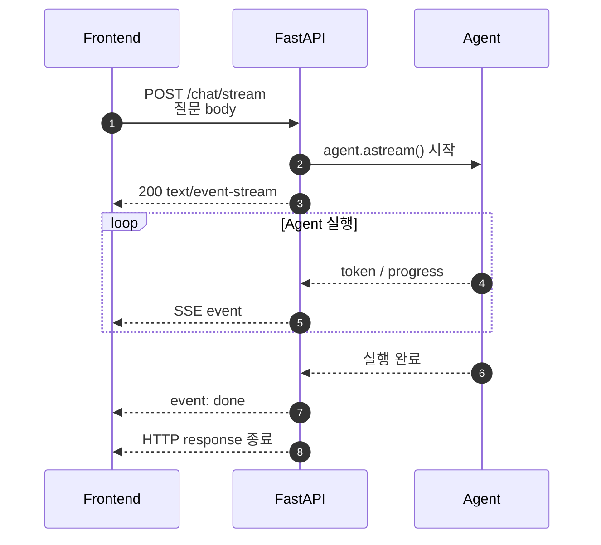
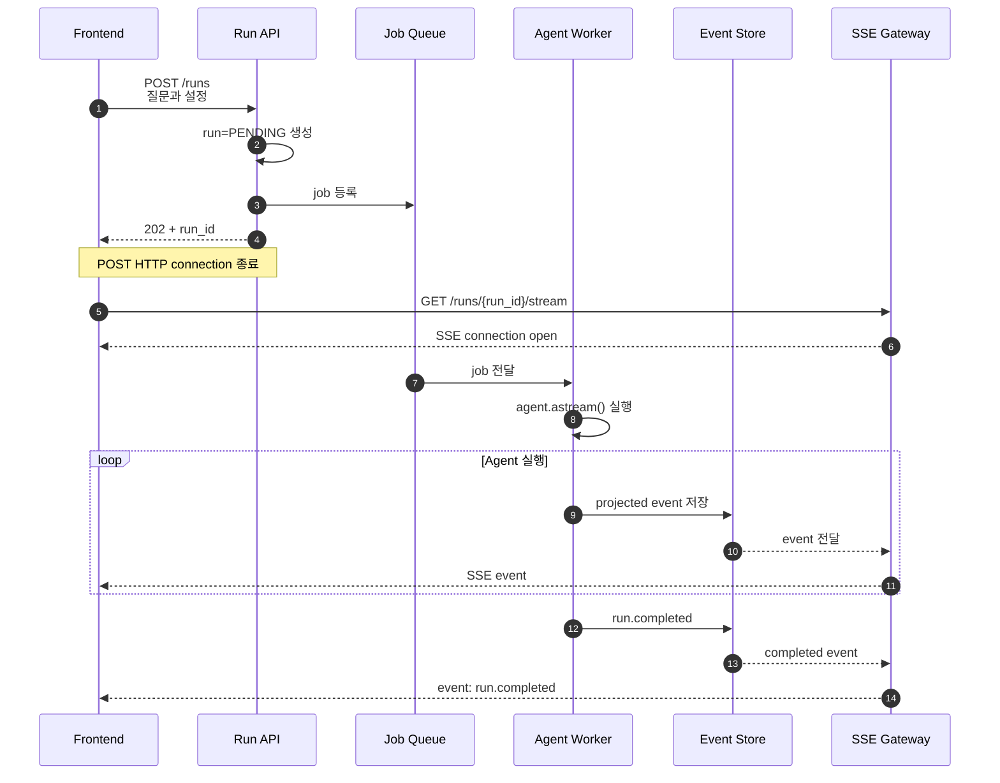
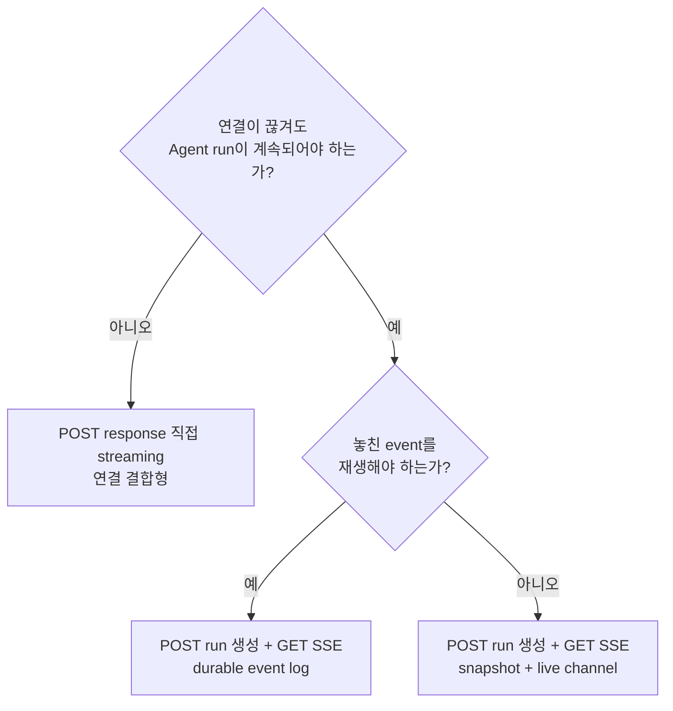
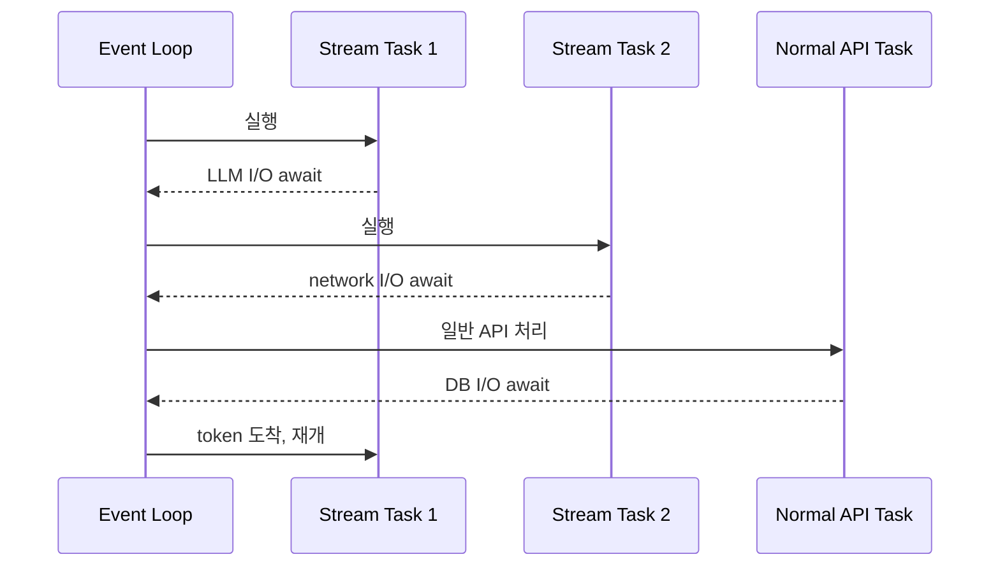
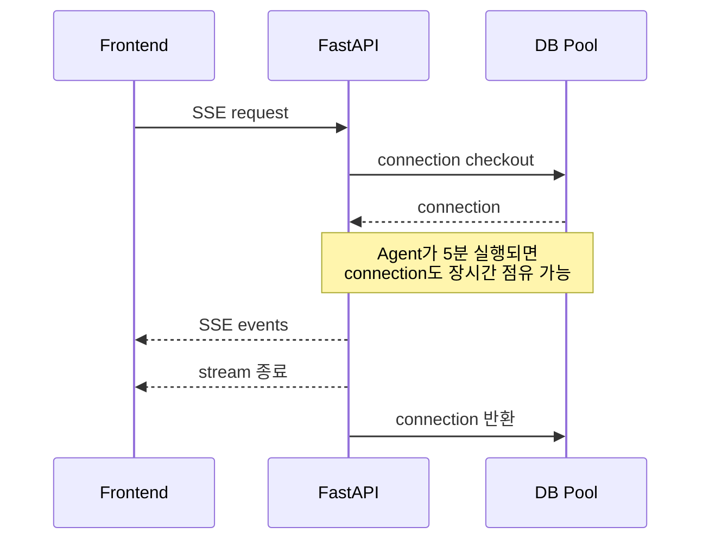
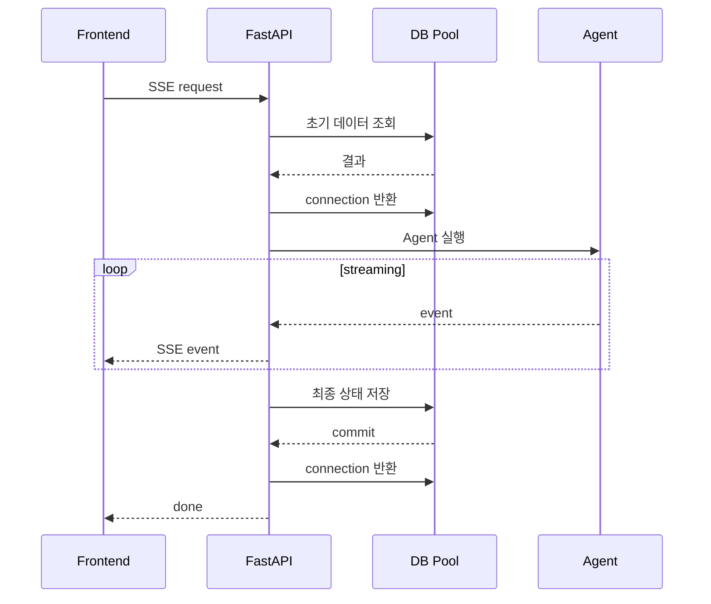
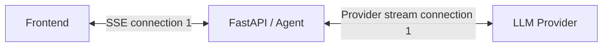
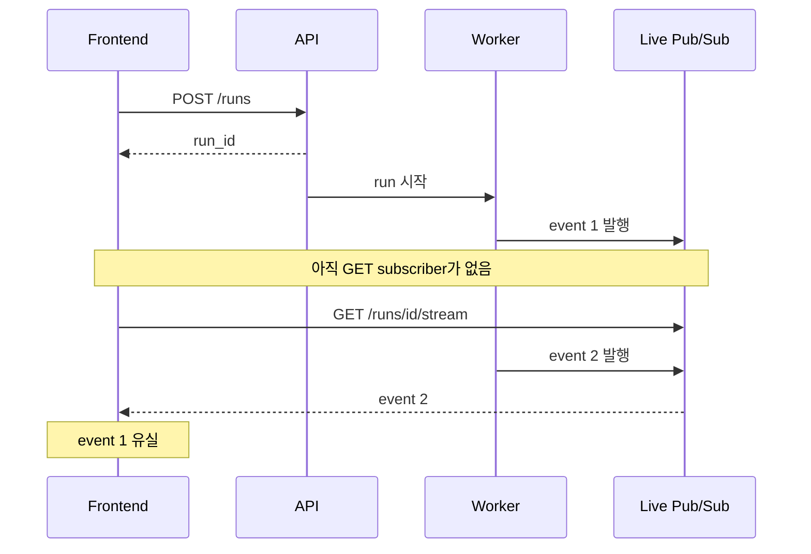
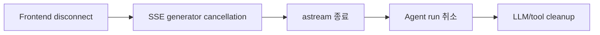
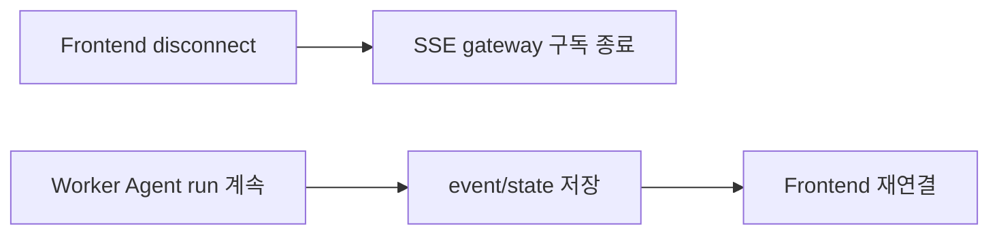

# SSE 요청 패턴과 리소스 풀 관리

> 작성 기준일: 2026-09-20  
> 질문: SSE를 사용하면 POST로 작업을 시작한 뒤 GET으로 stream을 요청해야 하는가? 장시간 연결 때문에 resource pool이 고갈되지 않는가?  
> 관련 자료: [02_StreamingResponse와_EventSourceResponse_요청부터_응답까지.md](./02_StreamingResponse와_EventSourceResponse_요청부터_응답까지.md), [03_DeepAgent_LangGraph_astream_전체_흐름과_구현_패턴.md](./03_DeepAgent_LangGraph_astream_전체_흐름과_구현_패턴.md)

## 결론

SSE라고 해서 반드시 POST 후 GET을 보내야 하는 것은 아니다. 다음 두 구조가 모두 가능하다.

```text
연결 결합형
POST /chat/stream
  → POST 응답 자체를 SSE stream으로 사용

run/transport 분리형
POST /runs
  → run_id를 즉시 반환하고 POST 종료
GET /runs/{run_id}/stream
  → 별도의 SSE 연결로 run 관찰
```

SSE 동안 계속 열려 있는 것은 기본적으로 **HTTP response connection**이다. 정상적인 비동기 구현이라면 연결마다 thread나 DB connection을 계속 점유하지 않는다.

실제로 고갈되기 쉬운 자원은 다음과 같다.

1. SSE 전체 생명주기에 결합한 DB connection
2. blocking 작업이 점유한 thread pool
3. LLM provider로 나가는 HTTP connection pool
4. 제한 없이 생성한 동시 Agent run
5. socket과 file descriptor
6. 느린 client 때문에 쌓이는 memory buffer

따라서 핵심 원칙은 다음과 같다.

```text
HTTP/SSE 연결은 오래 유지할 수 있다.

하지만 DB session, DB transaction, thread, 큰 memory buffer를
SSE 연결의 전체 생명주기와 결합하면 안 된다.
```

## 1. 먼저 `session`을 구분한다

“SSE 동안 session을 계속 연다”는 표현에는 서로 다른 자원이 섞여 있다.

| 구분 | SSE 동안 유지되는가 | 설명 |
| --- | --- | --- |
| HTTP/SSE connection | 예 | 하나의 HTTP response가 끝나지 않은 상태로 유지된다. |
| 로그인 session | 반드시 그렇지 않음 | Cookie/JWT를 요청 시작 시 검증하는 것이 일반적이다. |
| DB session/connection | 유지하면 안 됨 | 필요한 DB 작업 구간에만 checkout하고 즉시 반환한다. |
| worker process | 요청을 처리함 | 하나의 connection이 process 전체를 독점하지 않는다. |
| OS thread | async 구현에서는 아니오 | coroutine이 `await` 상태로 대기한다. |
| 외부 LLM connection | model streaming 중에는 예 | provider connection pool의 용량을 사용한다. |

이 구분 없이 “session이 오래 열린다”고 표현하면 HTTP connection이 열린다는 사실을 DB connection이나 thread까지 점유한다는 의미로 오해하기 쉽다.

## 2. 패턴 A: POST 응답 자체를 stream으로 사용

Frontend가 POST body로 질문을 보내고, 그 요청의 response body를 계속 읽는다.



이 구조에서는 요청이 하나다.

```text
POST 요청 1회
= Agent 실행 요청
= SSE stream 연결
```

### Frontend

```javascript
const controller = new AbortController();

const response = await fetch("/chat/stream", {
  method: "POST",
  headers: {
    "Content-Type": "application/json",
    Accept: "text/event-stream",
  },
  body: JSON.stringify({
    threadId,
    message,
  }),
  signal: controller.signal,
});

if (!response.ok || !response.body) {
  throw new Error(`stream 연결 실패: ${response.status}`);
}

const reader = response.body.getReader();
const decoder = new TextDecoder();

while (true) {
  const { value, done } = await reader.read();
  if (done) break;

  const chunk = decoder.decode(value, { stream: true });
  // 실제 구현에서는 불완전한 SSE event를 buffer에 보관해 parsing한다.
}
```

### Backend

```python
from sse_starlette import EventSourceResponse


@router.post("/chat/stream")
async def stream_chat(body: ChatRequest, request: Request):
    async def events():
        async for event in stream_agent(body):
            if await request.is_disconnected():
                return
            yield event

    return EventSourceResponse(
        events(),
        ping=15,
        send_timeout=30,
    )
```

### 장점

- 요청이 하나라서 구현이 단순하다.
- 질문 body와 Authorization header를 자유롭게 사용할 수 있다.
- 별도 queue, run registry, event store가 필요 없다.
- 첫 token까지 거치는 hop이 적다.
- client disconnect를 Agent cancellation으로 연결하기 쉽다.

### 단점

- native browser `EventSource`를 직접 사용할 수 없다.
- SSE parsing과 reconnect를 직접 구현하거나 client library를 사용해야 한다.
- connection이 끊겼을 때 Agent 실행도 끊을지 결정해야 한다.
- event replay가 어렵다.
- server 배포나 process 종료에 실행이 강하게 결합된다.

### 적합한 경우

- 일반적인 짧은 LLM 채팅
- disconnect 시 run을 취소해도 되는 작업
- 빠른 초기 구현
- event replay가 필요 없는 경우

## 3. 패턴 B: POST로 run 생성 후 GET으로 SSE 구독

POST는 작업을 생성하고 run ID를 반환한다. GET은 해당 run의 event를 관찰한다.



여기서 POST는 Agent가 끝날 때까지 기다리지 않는다.

```text
POST /runs
  → run 생성
  → job 등록
  → run_id 즉시 반환
  → POST connection 종료

GET /runs/{run_id}/stream
  → 완료까지 SSE connection 유지
```

### Frontend

```javascript
const response = await fetch("/runs", {
  method: "POST",
  headers: { "Content-Type": "application/json" },
  body: JSON.stringify({ message }),
});

const { runId } = await response.json();

const eventSource = new EventSource(`/runs/${runId}/stream`);

eventSource.addEventListener("assistant.token", (event) => {
  const payload = JSON.parse(event.data);
  appendToken(payload.data.text);
});

eventSource.addEventListener("run.completed", () => {
  eventSource.close();
});
```

### 장점

- native `EventSource`의 parsing과 자동 재연결을 사용할 수 있다.
- browser connection과 Agent run의 생명주기를 분리할 수 있다.
- tab이 닫혀도 worker가 실행을 계속할 수 있다.
- 수평 확장, 긴 작업, HITL, 재연결에 적합하다.
- durable event log가 있으면 replay할 수 있다.

### 단점

- run 상태 저장소가 필요하다.
- job queue와 worker가 필요할 수 있다.
- event 전달 또는 저장 계층이 필요하다.
- 인증과 run 소유권 검증이 복잡해진다.
- POST와 GET 사이의 event 유실을 처리해야 한다.
- 운영할 component와 장애 지점이 늘어난다.

### 적합한 경우

- 긴 Deep Agent 조사 작업
- subagent 또는 tool이 수분 이상 실행될 수 있는 경우
- 연결이 끊겨도 run을 계속해야 하는 경우
- 재연결과 replay가 필요한 경우
- rolling deployment와 다중 pod를 운영하는 경우
- HITL 승인 후 run을 재개하는 경우

## 4. 패턴 C: GET 하나로 실행과 stream 시작

native `EventSource`는 일반적으로 GET 요청을 사용하므로 query string으로 질문을 전달할 수도 있다.

```javascript
const stream = new EventSource(
  `/chat/stream?message=${encodeURIComponent(message)}`
);
```

기술적으로 가능하지만 일반적인 채팅에는 권장하지 않는다.

- URL 길이 제한이 있다.
- 질문이 browser history, proxy access log, monitoring system에 노출될 수 있다.
- 복잡한 JSON 입력을 전달하기 어렵다.
- GET은 조회라는 HTTP semantics를 가지므로 run 생성과 잘 맞지 않는다.

간단한 public feed나 server notification 구독에는 GET 하나가 자연스럽지만, 사용자 질문으로 Agent 작업을 만드는 API에는 POST가 더 적합하다.

## 5. 어떤 패턴을 선택할 것인가



| 요구사항 | 추천 패턴 |
| --- | --- |
| 짧은 채팅, 낮은 first-token latency | POST response 직접 stream |
| POST body/header가 필요하지만 자동 재연결은 불필요 | POST response 직접 stream |
| tab 종료 후에도 run 계속 | POST run 생성 + GET SSE |
| 재연결 후 event replay | 분리형 + durable event log |
| 현재 결과만 복구하면 충분 | 분리형 + state snapshot + live event |
| public notification feed | GET `EventSource` |

## 6. 비동기 서버가 장시간 연결을 처리하는 방식

비동기 서버에서 SSE connection 하나는 보통 전용 thread 하나를 사용하지 않는다.

```python
async def events():
    async for token in agent.astream(input_state):
        yield {"event": "token", "data": token}
```

LLM, DB, network를 `await`하는 동안 coroutine은 실행권을 event loop에 돌려준다.



대기 중인 coroutine은 CPU core를 계속 사용하지 않는다. 따라서 다음 등식은 성립하지 않는다.

```text
SSE connection 1개 = thread 1개 = worker process 1개
```

실제로는 다음에 가깝다.

```text
많은 열린 socket
+ 많은 대기 중 ASGI task
+ 연결별 작은 state와 buffer
+ 소수의 event-loop thread/process
```

하지만 connection이 무료인 것은 아니다. socket, file descriptor, task memory, proxy connection, kernel buffer를 사용한다.

## 7. HTTP connection과 로그인 session

JWT 또는 cookie 인증은 일반적으로 request 시작 시 처리한다.

```text
SSE request 수신
  → Cookie/JWT 검증
  → principal 확인
  → thread/run 소유권 검증
  → stream 시작
```

JWT를 검증한다고 별도의 connection이 장시간 유지되는 것은 아니다. Redis session store를 사용하더라도 요청 시작 시 조회한 뒤 Redis connection을 pool에 반환하는 것이 일반적이다.

```text
SSE connection이 5분 유지
≠ Redis connection을 5분간 checkout
```

주의할 점:

- stream 중 token이 만료됐을 때 즉시 연결을 끊을지 정책이 필요하다.
- long-lived connection의 권한 변경과 사용자 차단을 어떻게 반영할지 정해야 한다.
- GET `EventSource`에서는 arbitrary Authorization header를 넣기 어려우므로 same-origin cookie나 안전한 단기 token을 고려한다.
- URL query parameter에 장기 bearer token을 넣으면 access log에 남을 수 있다.

## 8. DB connection pool 고갈

### 8.1 위험한 구조

request-scoped DB session을 stream 전체에서 유지하면 pool이 고갈될 수 있다.

```python
@router.get("/runs/{run_id}/stream")
async def stream_run(
    run_id: str,
    db: AsyncSession = Depends(get_db),
):
    async def events():
        run = await db.get(Run, run_id)

        async for event in agent.astream(run.input):
            yield event

    return EventSourceResponse(events())
```

DB dependency가 streaming response가 종료될 때까지 정리되지 않는다면 connection이 장시간 checkout 상태일 수 있다.



DB pool size가 20이고 이 형태의 stream 20개가 열리면 일반 API가 connection을 얻지 못할 수 있다.

### 8.2 권장 구조

DB session을 필요한 작업 구간에만 연다.

```python
async def stream_run_events(run_id: str):
    async with session_factory() as session:
        run = await load_owned_run(session, run_id)
        input_state = make_input_state(run)

    # DB session과 connection은 이미 반환됐다.
    async for event in agent.astream(input_state):
        yield event

    async with session_factory() as session:
        await mark_completed(session, run_id)
        await session.commit()
```



### 원칙

```text
DB session 생명주기 ≠ SSE connection 생명주기
```

- transaction을 network stream 동안 열지 않는다.
- DB row나 ORM entity를 session 밖에서 사용할 때 lazy loading에 주의한다.
- 필요한 값을 plain data로 변환한 뒤 session을 닫는다.
- stream event를 모두 DB에 저장해야 한다면 별도 writer task 또는 worker를 고려한다.

## 9. Thread pool 고갈

정상적인 async I/O는 connection마다 thread를 사용하지 않는다. 하지만 blocking 함수를 async generator 안에서 직접 호출하면 event loop 또는 thread pool이 고갈될 수 있다.

### 안티 패턴

```python
async def events():
    result = blocking_llm_client.call()  # event loop 차단 가능
    yield result
```

동기 generator를 `StreamingResponse`에 전달하면 framework가 thread pool로 순회할 수 있다. 연결 수만큼 blocking iterator가 장시간 점유하면 thread pool token이 부족해질 수 있다.

### 권장 패턴

- model, HTTP, DB client의 async API를 우선 사용한다.
- blocking SDK는 제한된 thread offload를 사용한다.
- CPU-intensive 작업은 별도 process/worker로 보낸다.
- thread pool queue와 작업 시간을 관측한다.
- event loop lag를 측정한다.

## 10. 외부 HTTP connection pool 고갈

Frontend SSE connection과 별개로 Agent는 LLM provider에 streaming HTTP request를 열 수 있다.



동시 Agent run이 100개라면 provider connection도 최대 100개 가까이 필요할 수 있다. tool이 외부 API를 병렬 호출하면 더 늘어난다.

대책:

- process 전체에서 async HTTP client를 재사용한다.
- `max_connections`, `max_keepalive_connections`를 확인한다.
- 사용자·tenant별 동시 Agent run을 제한한다.
- model 호출에 semaphore를 둔다.
- connection pool checkout latency를 관측한다.
- model request timeout을 둔다.
- client disconnect 시 불필요한 upstream stream을 취소한다.
- retry가 connection 폭증을 만들지 않도록 backoff와 retry budget을 둔다.

## 11. Uvicorn worker와 file descriptor

비동기 SSE connection 하나가 Uvicorn worker process 하나를 독점하지는 않는다. worker의 event loop가 여러 connection을 처리한다.

그러나 다음 자원은 connection 수에 비례해 증가한다.

- socket/file descriptor
- ASGI task
- Python object와 coroutine state
- kernel send/receive buffer
- proxy upstream connection
- heartbeat와 event serialization CPU

다음 상황에서는 worker가 처리 능력을 잃을 수 있다.

- generator 안에서 CPU-intensive 작업 수행
- 동기 blocking I/O 수행
- 무제한 동시 Agent run 허용
- connection마다 큰 queue/buffer 생성
- `values`나 `debug`로 큰 state 반복 직렬화
- disconnect 후 Agent task가 남아 있음
- file descriptor limit 초과

연결 수와 Agent 실행 수를 별도 지표로 관리해야 한다.

```text
active_sse_connections
active_agent_runs
active_model_requests
```

세 값은 서로 같지 않을 수 있다.

## 12. Proxy와 Load Balancer connection

Reverse proxy가 있으면 client connection과 upstream connection이 모두 장시간 유지될 수 있다.

```text
Browser ↔ Nginx/ALB ↔ Uvicorn
```

확인할 항목:

- maximum concurrent connections
- worker connection limit
- file descriptor limit
- proxy buffering
- upstream read timeout
- client idle timeout
- heartbeat interval
- HTTP/1.1, HTTP/2 동작 차이
- rolling deployment 시 connection draining

Heartbeat는 다음 관계를 만족해야 한다.

```text
heartbeat interval < 가장 짧은 network idle timeout
```

하지만 heartbeat만으로 전체 실행 timeout을 대체해서는 안 된다. heartbeat는 connection 생존 확인이고 run timeout은 작업 자원 보호다.

## 13. POST와 GET 사이의 event 유실

분리형에서 다음 race condition이 생길 수 있다.



### 해결 A: subscriber가 연결된 후 실행

```text
POST → run=PENDING
GET stream 연결 → subscriber READY
READY 확인 → worker 실행
```

장점은 단순하다는 것이고, 단점은 GET이 연결되지 않으면 run이 시작되지 않는다는 것이다.

### 해결 B: durable event log

```text
Worker → Redis Streams / Kafka / DB event table
GET → Last-Event-ID 또는 seq 다음 event부터 읽기
```

가장 안정적이지만 infrastructure와 retention 관리가 필요하다.

### 해결 C: snapshot 후 live event

```text
GET 연결
  → 현재 run status와 누적 답변 snapshot 조회
  → live channel 구독
  → 이후 event 수신
```

token 단위 replay가 필요하지 않고 현재까지 완성된 답변만 복원하면 되는 채팅에 실용적이다. snapshot 조회와 live subscription 사이에도 race가 있으므로 sequence 또는 atomic subscription 전략이 필요하다.

## 14. 연결 종료 정책

### 연결 결합형



짧은 채팅에서는 사용자가 페이지를 떠났을 때 비싼 model 실행도 취소하는 것이 합리적이다.

### 분리형



긴 작업에서는 network disconnect가 업무 취소를 뜻하지 않을 수 있다. 별도 `POST /runs/{id}/cancel` API로 명시적인 취소를 제공하는 편이 안전하다.

## 15. 추천 구현

### 15.1 짧은 일반 채팅

```text
POST /chat/stream
  → 인증 및 thread 소유권 검증
  → 짧은 DB 조회 후 connection 반환
  → agent.astream() 직접 소비
  → application event로 투영
  → 같은 POST response로 SSE 전송
  → disconnect 시 Agent 취소
```

선택 이유:

- first-token latency가 낮다.
- component와 장애 지점이 적다.
- 별도 event broker가 필요 없다.
- run을 계속 유지할 제품 요구가 없다면 가장 작은 올바른 구조다.

### 15.2 긴 Deep Agent 작업

```text
POST /runs
  → DB에 run=PENDING 저장
  → job queue 등록
  → run_id 즉시 반환

Worker
  → agent.astream() 소비
  → projected event 저장
  → run 상태와 checkpoint 저장

GET /runs/{id}/stream
  → 소유권 검증
  → Last-Event-ID 이후 replay
  → live event 구독
```

선택 이유:

- network와 작업 lifecycle을 분리한다.
- 재연결과 replay가 가능하다.
- 긴 subagent/tool 실행을 보호한다.
- rolling deployment와 multi-pod 환경에 대응하기 쉽다.

복잡도가 크므로 필요가 확인되기 전에 미리 도입할 필요는 없다.

## 16. 주요 안티 패턴

### 16.1 POST가 Agent 완료까지 기다린 뒤 run ID 반환

```text
POST /runs
  → 5분 동안 Agent 실행
  → 완료 후 run_id 반환
```

POST와 GET을 분리한 이점이 사라진다. POST는 작업 등록 후 빠르게 종료해야 한다.

### 16.2 SSE 전체에서 DB transaction 유지

Pool 고갈, lock 장기 유지, transaction timeout을 만든다. DB 작업을 짧은 구간으로 분리한다.

### 16.3 연결마다 unbounded queue 생성

느린 client가 memory를 계속 사용한다. queue가 필요하면 bounded channel과 overflow 정책을 둔다.

### 16.4 blocking SDK를 async generator에서 직접 호출

하나의 느린 작업이 event loop의 다른 connection까지 지연시킨다. async SDK, thread offload 또는 worker를 사용한다.

### 16.5 Pub/Sub이면 재연결 replay도 된다고 가정

일반 Pub/Sub은 subscriber가 없을 때 발행한 event를 보존하지 않는다. replay가 필요하면 durable log가 필요하다.

### 16.6 heartbeat만 있으면 안전하다고 가정

Heartbeat는 idle timeout을 방지할 뿐 무한 run, 느린 client, memory 증가, DB pool 고갈을 막지 못한다.

### 16.7 GET query에 bearer token과 민감한 질문 전달

URL이 access log, monitoring, browser history에 남을 수 있다. cookie, POST body 또는 안전한 단기 subscription token을 사용한다.

## 17. 용량 계획과 관측 지표

SSE connection 수만 보지 말고 자원별 지표를 분리한다.

| 지표 | 확인할 문제 |
| --- | --- |
| `active_sse_connections` | socket, proxy, file descriptor 용량 |
| `active_agent_runs` | 실제 compute와 model 비용 |
| `active_model_requests` | provider connection pool과 rate limit |
| DB pool checked-out/overflow/wait time | DB session 장기 점유 |
| HTTP client pool wait time | 외부 connection 부족 |
| thread pool active/queued | blocking 작업 누적 |
| event loop lag | CPU/blocking I/O 문제 |
| SSE send latency | 느린 client와 network 정체 |
| bytes/event와 bytes/run | payload와 buffering 문제 |
| disconnect/cancel count | 사용자 이탈과 network 품질 |
| run completion after disconnect | lifecycle 정책 정상성 |
| process RSS | queue와 buffer memory 증가 |

### 부하 테스트 시나리오

1. 연결만 열고 event가 거의 없는 idle SSE
2. token을 빠르게 보내는 SSE
3. 읽기 속도가 매우 느린 client
4. 연결 후 즉시 disconnect하는 client
5. DB 조회 후 수분간 stream하는 요청
6. provider connection pool보다 많은 동시 Agent run
7. proxy timeout보다 긴 tool 실행
8. server rolling restart 중 재연결

## 18. 구현 체크리스트

### 요청 구조

- [ ] POST 직접 stream과 POST→GET 분리 중 제품 요구에 맞는 방식을 선택했는가
- [ ] 분리형 POST가 run ID를 빠르게 반환하는가
- [ ] GET stream에서 run 소유권을 다시 검증하는가
- [ ] disconnect 시 run 취소 여부가 명시되어 있는가

### DB

- [ ] DB session을 SSE 전체에서 유지하지 않는가
- [ ] stream 전에 필요한 data를 plain object로 추출했는가
- [ ] transaction을 짧게 유지하는가
- [ ] pool wait time과 checkout duration을 관측하는가

### 비동기 실행

- [ ] generator 내부 I/O가 async인가
- [ ] blocking/CPU 작업을 별도 executor 또는 worker로 분리했는가
- [ ] `CancelledError`를 정리 후 다시 전달하는가
- [ ] Agent, model, tool, send timeout이 있는가

### 연결과 용량

- [ ] connection 수와 Agent run 수를 별도로 제한하는가
- [ ] provider HTTP pool 용량과 동시 run 제한이 맞는가
- [ ] file descriptor와 proxy connection limit을 확인했는가
- [ ] heartbeat가 idle timeout보다 짧은가
- [ ] proxy buffering을 비활성화했는가

### 분리형 신뢰성

- [ ] POST와 GET 사이 event 유실 전략이 있는가
- [ ] replay가 필요하면 durable event log가 있는가
- [ ] event에 `run_id`, `seq`, `schema_version`이 있는가
- [ ] `Last-Event-ID` 처리 또는 snapshot 복구가 있는가
- [ ] 명시적인 run 취소 API가 있는가

## 19. 최종 정리

### 질문 1: SSE는 POST 후 GET을 해야 하는가?

아니다.

```text
POST response를 바로 stream
또는
POST로 run 생성 + GET으로 stream 구독
```

둘 다 가능하며 lifecycle과 reconnect 요구에 따라 선택한다.

### 질문 2: POST가 SSE 완료까지 열린 상태로 기다리는가?

POST response 자체를 stream으로 쓰면 해당 POST HTTP connection은 완료까지 열린다.

POST→GET 분리형에서는 POST가 run ID를 반환하고 종료되며, 별도의 GET SSE connection만 열린다.

### 질문 3: pool이 쉽게 마르는가?

비동기 SSE connection 자체가 connection마다 thread나 DB connection을 요구하지는 않는다. 하지만 구현이 다음 자원을 stream 전체에 결합하면 고갈될 수 있다.

```text
DB connection
thread pool
provider HTTP connection
unbounded queue memory
socket/file descriptor
```

따라서 resource scope를 다음처럼 설계한다.

```text
HTTP/SSE connection
  → 오래 유지 가능

DB session/transaction
  → 필요한 구간만 짧게

thread
  → blocking 작업에만 제한적으로

LLM/provider connection
  → Agent 실행 동안 유지하되 동시성 제한

event buffer
  → bounded 또는 durable log
```

## 참고 자료

- [ASGI HTTP & WebSocket specification](https://asgi.readthedocs.io/en/latest/specs/www.html)
- [MDN: Using server-sent events](https://developer.mozilla.org/en-US/docs/Web/API/Server-sent_events/Using_server-sent_events)
- [Starlette Thread Pool](https://www.starlette.io/threadpool/)
- [Uvicorn Flow Control](https://www.uvicorn.org/server-behavior/#flow-control)
- [sse-starlette](https://github.com/sysid/sse-starlette)
- [SQLAlchemy AsyncIO](https://docs.sqlalchemy.org/en/20/orm/extensions/asyncio.html)
- [HTTPX Resource Limits](https://www.python-httpx.org/advanced/resource-limits/)

### 신뢰도와 버전 주의

- ASGI message와 HTTP response lifecycle 설명은 공식 protocol 명세에 근거하므로 신뢰도가 높다.
- native `EventSource`의 GET 중심 동작과 재연결은 browser API 동작에 근거하므로 신뢰도가 높다.
- DB session cleanup 시점은 FastAPI/Starlette와 dependency 구현 방식에 따라 달라질 수 있으므로 실제 사용 version과 code로 검증해야 한다.
- Uvicorn, Starlette thread pool, HTTP client pool의 구체적인 기본 크기와 timeout은 version 및 배포 설정에 따라 달라진다.
- 적정 동시 connection/run 수와 pool 크기는 workload, event 크기, model latency, proxy 환경에 따라 부하 테스트로 결정해야 한다.
