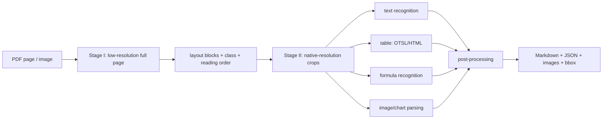
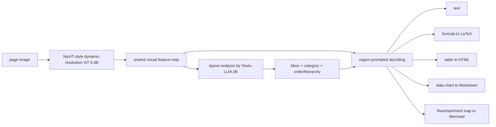
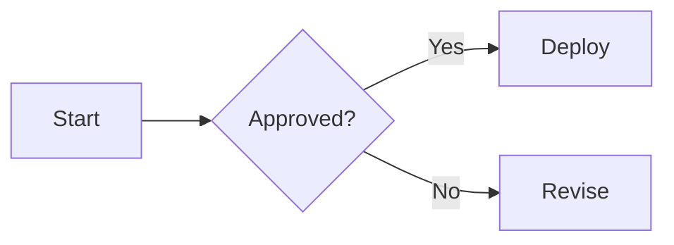
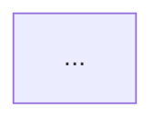
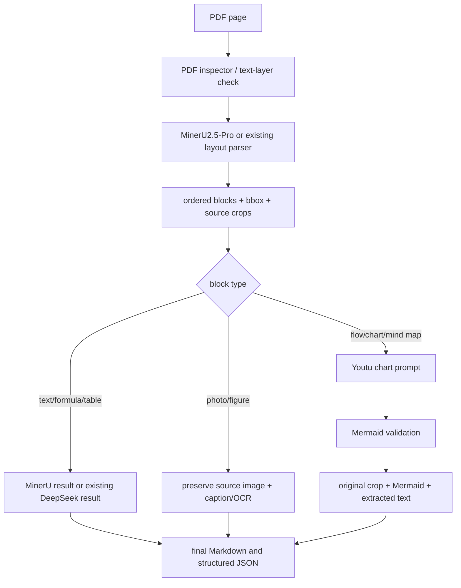

# MinerU2.5-Pro와 Youtu-Parsing 비교

> 조사 기준일: 2026-08-21  
> 비교 대상: `MinerU2.5-Pro` 1.2B 계열과 `Youtu-Parsing` 2.5B  
> 주요 관심사: reading order, flowchart·사진 보존 방식, 구조적 차이, 속도  
> 출처 원칙: 논문, 공식 GitHub, 공식 출력 문서, 공식 benchmark를 우선 사용했다.

---

## 1. 결론부터

두 모델은 단순히 정확도만 비교하면 안 된다. 산출물의 철학이 다르기 때문이다.

- **MinerU2.5-Pro는 원본 문서의 시각적 증거를 보존하는 parser에 가깝다.** 사진, 그림, chart를 crop 이미지로 저장하고 Markdown과 JSON에 경로를 남긴다. flowchart가 완벽히 구조화되지 않더라도 원본 그림 자체는 남길 수 있다.
- **Youtu-Parsing은 문서 요소를 의미 있는 구조로 변환하는 model에 가깝다.** 특히 data chart는 Markdown table로, mind map과 flowchart는 Mermaid로 변환하도록 명시적으로 학습·prompting되어 있다.
- **reading order 공개 점수는 Youtu가 아주 근소하게 좋다.** OmniDocBench v1.6에서 Youtu `0.116`, MinerU2.5-Pro `0.120`으로, 낮을수록 좋은 edit distance 기준이다. 다만 `0.004` 차이이므로 실제 문서군에서 재현 시험 없이 승패를 단정하기는 어렵다.
- **일반적인 text·formula·table 종합 품질은 MinerU2.5-Pro가 더 좋다.** 같은 v1.6에서 overall `95.75` 대 `93.74`다. 단, overall 계산에는 reading-order 점수가 포함되지 않는다.
- **flowchart를 DeepSeek-OCR-2처럼 평문 text로만 잃고 싶지 않다면 선택지는 두 가지다.** 시각 원본 보존은 MinerU, diagram의 편집 가능한 구조화는 Youtu가 유리하다.
- 실무적으로는 **MinerU를 canonical parser로 사용해 원본 crop과 bbox를 보존하고, flowchart·mind-map block만 Youtu로 재처리해 Mermaid를 부가 산출물로 붙이는 방식**이 가장 안전하다.

한 줄 선택 기준은 다음과 같다.

| 우선순위 | 더 적합한 선택 |
| --- | --- |
| 원본 사진·도표 crop 보존, provenance, 범용 문서 처리 | MinerU2.5-Pro |
| flowchart·mind map을 Mermaid로 변환 | Youtu-Parsing |
| 공개 reading-order 점수 | Youtu-Parsing, 단 차이는 작음 |
| text·formula·table의 공개 종합 점수 | MinerU2.5-Pro |
| PDF·Office 파일부터 Markdown·JSON·images까지 완성된 제품 pipeline | MinerU |
| prompt로 요소별 인식 방식을 제어하고 decoding을 병렬화 | Youtu-Parsing |

---

## 2. 버전과 수치 해석 시 주의점

### 2.1 MinerU2.5와 MinerU2.5-Pro는 같은 말이 아니다

MinerU2.5-Pro 논문의 핵심은 **architecture 교체가 아니라 data engine의 대규모 개선**이다.

- 기존 MinerU2.5의 1.2B coarse-to-fine architecture를 그대로 사용한다.
- 학습 자료를 1천만 미만에서 6,550만 sample로 확장했다.
- Diversity-and-Difficulty-Aware Sampling을 사용한다.
- 여러 model의 일치도로 sample과 annotation을 검증하는 Cross-Model Consistency Verification을 사용한다.
- 어려운 sample에는 render-then-verify 방식의 Judge-and-Refine을 적용한다.
- pre-training, hard-sample fine-tuning, GRPO alignment의 3단계 학습을 사용한다.

따라서 MinerU2.5 논문의 architecture 설명은 Pro에도 적용할 수 있지만, MinerU2.5의 속도 수치를 Pro의 실측 속도라고 그대로 부르면 안 된다.

### 2.2 Youtu의 크기는 문맥에 따라 2B, 2.5B, 3B로 보인다

- 언어 model 기반은 `Youtu-LLM-2B`다.
- vision encoder는 약 0.4B다.
- 논문과 OmniDocBench 표에서는 전체를 2.5B로 표기한다.
- Hugging Face metadata에서는 전체 VLM을 반올림해 3B로 보여 줄 수 있다.

비교 표에서는 논문·benchmark의 `2.5B` 표기를 사용한다.

---

## 3. Architecture의 구조적 차이

두 model 모두 한 번에 전체 페이지 Markdown을 생성하는 순수 end-to-end 방식보다는, **layout과 content recognition을 분리**한다. 그러나 무엇을 분리하고 무엇을 재사용하는지가 다르다.

### 3.1 MinerU2.5-Pro: coarse-to-fine, 저해상도 전체 페이지 후 고해상도 crop



핵심은 다음과 같다.

1. Stage I이 축소된 전체 페이지에서 layout을 파악한다.
2. Stage II가 각 영역을 원래 해상도에 가까운 crop으로 다시 본다.
3. 고해상도 전체 페이지를 한 번에 VLM에 넣는 비용을 피한다.
4. table에는 OTSL 계열 표현, formula에는 ADR 같은 task-specific 기법을 사용한다.
5. Pro는 이 architecture를 바꾸지 않고 data engineering으로 정확도를 끌어올렸다.

즉, MinerU의 decoupling은 **global layout과 local high-resolution recognition을 해상도·단계 관점에서 분리**한 것이다.

### 3.2 Youtu-Parsing: 공유 visual feature + layout query + region-prompted decoding



핵심은 다음과 같다.

1. NaViT-style dynamic-resolution encoder가 페이지의 shared visual feature를 한 번 만든다.
2. LLM이 이 feature로 layout bbox와 category를 찾는다.
3. content recognition 때 실제 crop image를 vision encoder에 매번 다시 통과시키기보다, bbox와 category prompt로 공유 feature를 조회한다.
4. category별 prompt를 분리해 text, formula, table, chart의 서로 다른 출력 문법이 간섭하는 것을 줄인다.
5. 여러 token과 여러 region query를 병렬 처리할 수 있다.

즉, Youtu의 decoupling은 **shared perception, layout analysis, region recognition을 feature 재사용과 query 관점에서 분리**한 것이다.

### 3.3 구조 차이를 한 표로 정리

| 항목 | MinerU2.5-Pro | Youtu-Parsing |
| --- | --- | --- |
| 전체 구조 | 2-stage coarse-to-fine | 3-stage shared feature → layout → region decoding |
| global 처리 | 저해상도 full-page layout | dynamic-resolution shared feature에서 layout query |
| local 처리 | 원 해상도 crop을 별도로 recognition | shared feature에 bbox/category prompt로 decoding |
| 핵심 효율화 | 전체 페이지 고해상도 추론 회피 | vision feature 재사용 + token/query parallelism |
| model 규모 | 1.2B | 2.5B 전체, 2B LLM + 0.4B vision encoder |
| Pro의 핵심 개선 | architecture 고정, data engine 개선 | architecture와 parallel decoding 자체가 핵심 기여 |
| 출력 지향점 | 파일 parser와 asset pipeline | prompt-guided semantic recognition model |
| long document 후처리 | 문단·cross-page table merge를 제품 기능으로 제공 | hierarchy/continuation 관계를 model이 예측하지만 공식 local parser의 장문 merge는 별도 검증 필요 |

---

## 4. Reading order 비교

### 4.1 공개 benchmark

OmniDocBench v1.6 full의 공식 결과는 다음과 같다. Edit distance는 낮을수록 좋다.

| Model | Overall ↑ | Text Edit ↓ | Formula CDM ↑ | Table TEDS ↑ | Reading Order Edit ↓ |
| --- | ---: | ---: | ---: | ---: | ---: |
| MinerU2.5-Pro 1.2B | **95.75** | **0.036** | **97.45** | **93.42** | 0.120 |
| Youtu-Parsing 2.5B | 93.74 | 0.044 | 93.63 | 92.02 | **0.116** |

해석은 다음과 같다.

- reading order만 보면 Youtu가 `0.004` 우세하다.
- text, formula, table은 MinerU2.5-Pro가 우세하다.
- OmniDocBench의 overall은 `(text + formula + table) / 3` 계열이며 reading order를 포함하지 않는다. 따라서 MinerU의 overall 우위와 Youtu의 reading-order 우위는 동시에 성립한다.
- `0.116` 대 `0.120`은 작은 차이다. 2-column 논문, side note, caption, footnote, slide, 양식 문서처럼 실제 대상 문서군을 나눠 평가해야 한다.

### 4.2 Reading order를 만드는 방식

MinerU는 Stage I에서 layout block과 순서를 만들고, 후처리에서 이를 Markdown 순서로 조립한다. `layout.pdf`에는 읽기 순서를 시각적으로 확인할 수 있는 번호가 표시되며, 구조 JSON에는 bbox와 page index가 남는다.

Youtu는 layout 결과뿐 아니라 hierarchy 전용 관계도 예측한다.

- parent-child: heading과 하위 paragraph 같은 종속 관계
- grouping: 같은 group에 속한 sibling 요소
- continuation: column 또는 page break로 잘린 동일 의미 단위의 연결

이 때문에 Youtu는 단순한 `y좌표 → x좌표` 정렬보다 문서의 논리 구조를 명시적으로 표현할 여지가 있다. 그러나 논문의 관계 예측 능력과 공개 HF parser가 최종 multi-page Markdown을 얼마나 완성도 높게 병합하는지는 구분해서 봐야 한다. 공식 HF 구현은 page 단위 processing이 중심이므로, cross-page table·paragraph merge는 실제 corpus로 확인해야 한다.

### 4.3 `.md`에 권장하는 순서

어느 model을 쓰든 최종 Markdown은 단순 bbox sort를 그대로 쓰지 않는 편이 좋다.

1. page header/footer/page number는 본문 order에서 제외하거나 metadata로 분리한다.
2. title → section heading → 해당 section의 body 순으로 hierarchy를 먼저 적용한다.
3. 동일 section 안에서 column topology를 결정한 뒤 column 내부를 위에서 아래로 정렬한다.
4. figure/table/chart는 anchor가 되는 본문 호출부 또는 caption과 결합한다.
5. caption과 footnote는 해당 visual block의 child로 붙인다.
6. continuation 관계가 확실한 paragraph만 합친다. page가 바뀌었다는 이유만으로 자동 병합하지 않는다.
7. 최종 linear order와 별도로 `page_idx`, `bbox`, `block_id`, `parent_id`, `source_asset`을 JSON에 보존한다.

Youtu의 hierarchy 결과를 사용하더라도 이 post-processing 규칙은 필요하다. MinerU를 쓰면 `layout.pdf`와 structured JSON을 기준으로 순서를 audit할 수 있다.

---

## 5. Flowchart, chart, 사진은 어떻게 처리하는가

이 부분이 두 model의 가장 실질적인 차이다.

### 5.1 MinerU2.5-Pro

공식 출력 문서와 현재 code path에서 image와 chart block은 다음 정보를 가질 수 있다.

- `img_path`
- `bbox`, `page_idx`
- image/chart caption
- footnote
- chart의 optional structured `content`
- visual subtype

실제 crop은 결과 폴더의 `images/`에 저장된다. multimodal Markdown은 image/chart의 screenshot을 먼저 렌더링하고, structured content가 있으면 접힌 `<details>` 영역에 부가할 수 있다.

따라서 기본 성격은 다음과 같다.

| 입력 요소 | MinerU의 기본 결과 성격 |
| --- | --- |
| 일반 사진 | crop image 파일 + Markdown image reference + bbox/caption |
| 삽화·architecture diagram | crop image를 보존하며, 가능한 경우 content를 부가 |
| data chart | chart crop을 보존하고 optional structured content를 붙일 수 있음 |
| flowchart·mind map | 적어도 image/chart crop 보존 가능; Mermaid 변환은 공식 핵심 보장 사항이 아님 |
| 표 | 주로 HTML/구조 표현으로 출력하며 image path도 structured output에서 다룰 수 있음 |

장점은 **시각 정보 손실을 막을 수 있다는 점**이다. 화살표 방향이나 node 경계의 semantic parsing이 실패해도 원본 crop을 다시 보거나 다른 model에 전달할 수 있다.

한계도 있다.

- 복합 figure를 detector가 여러 개의 작은 chart/figure로 나눌 수 있다.
- 분할된 조각을 원래 하나의 figure로 복원하는 parent-grouping이 항상 보장되지는 않는다.
- flowchart를 편집 가능한 Mermaid graph로 변환하는 기능은 Youtu처럼 명시적인 주 기능이 아니다.
- NLP-only Markdown mode를 선택하면 visual block이 생략될 수 있으므로 multimodal Markdown과 structured JSON을 함께 보관해야 한다.

### 5.2 Youtu-Parsing

Youtu의 공식 prompt와 model 설명은 chart를 둘로 나눈다.

- data chart → Markdown table
- mind map / flowchart → Mermaid

예를 들어 다음과 같은 도형이 있으면,

```text
[Start] -> <Approved?> --Yes--> [Deploy]
                    \--No----> [Revise]
```

DeepSeek-OCR-2 계열이 `Start Approved Yes Deploy No Revise`처럼 text를 나열할 수 있는 반면, Youtu는 다음과 같은 구조 출력을 목표로 한다.



이는 검색, graph 후처리, 편집, 접근성 측면에서 강점이다. 단, Mermaid는 **원본의 faithful copy가 아니라 model이 해석한 파생 표현**이다. 작은 arrow, 교차 edge, swimlane, 색상 의미, 아이콘, 암묵적 group을 잘못 해석할 수 있다.

더 중요한 구현상 주의점이 있다. 2026-08-21에 확인한 공식 Hugging Face parser의 기본 code path는 다음과 같이 동작한다.

- `Chart` block은 chart prompt로 구조적 text를 생성한다.
- `Figure` block은 영역을 crop해 figure 내부의 text를 인식하지만, 그 crop을 개별 asset으로 저장해 Markdown에 연결하는 처리는 보이지 않는다.
- 저장 결과는 JSON, hierarchy JSON, text 중심 Markdown, full-page layout visualization PNG다.
- 즉, official local HF parser 그대로라면 **flowchart는 Mermaid로 바뀌고, 일반 figure/photo는 bbox와 인식 text는 남아도 MinerU처럼 원본 crop asset이 자동으로 보존되는 형태는 아니다.**

Youtu의 bbox가 있으므로 custom post-processor로 원본 page에서 crop을 저장할 수는 있다. 사진 보존이 필요하면 이 단계를 반드시 추가하는 편이 안전하다. API나 추후 client 구현은 달라질 수 있으므로 위 결론은 확인한 official HF parser 기준이다.

### 5.3 요소별 직접 비교

| 요소 | MinerU2.5-Pro | Youtu-Parsing | 판단 |
| --- | --- | --- | --- |
| 일반 사진 | crop image를 저장·참조 | 기본 HF parser는 text recognition 중심, 개별 crop 저장은 별도 구현 필요 | 원본 보존은 MinerU |
| scientific figure | 원본 crop, caption, bbox 보존 | figure 내부 text 추출 가능, asset 보존은 약함 | provenance는 MinerU |
| bar/line/pie chart | image와 optional structured content | Markdown table로 semantic conversion | 수치 활용은 Youtu, 시각 보존은 MinerU |
| flowchart | image/chart crop 보존, Mermaid는 비보장 | Mermaid로 변환하도록 명시 | 구조화는 Youtu |
| mind map | 원본 visual 보존 중심 | Mermaid 변환 | 구조화는 Youtu |
| 복잡한 composite figure | detector 분할 위험 | bbox/classification과 semantic conversion 오류 위험 | 둘 다 원본 page+bbox 보관 필요 |
| 실패 시 복구 가능성 | 원본 crop으로 재처리 쉬움 | crop 저장을 추가하지 않으면 시각 정보가 사라질 수 있음 | MinerU 우세 |

### 5.4 권장 출력 형태

flowchart는 `image냐 Mermaid냐` 중 하나만 고르지 않는 것이 좋다.

```text
block_id: p03_b12
type: flowchart
page_idx: 2
bbox: [x1, y1, x2, y2]
source_asset: images/p03_b12.png
derived:
  mermaid: |
    flowchart LR
      ...
  extracted_text: ...
confidence:
  layout: ...
  graph_conversion: ...
```

Markdown에는 원본 이미지를 먼저 두고 Mermaid를 파생 정보로 붙이는 방식이 안전하다.

````markdown


<details>
<summary>구조화한 Mermaid</summary>



</details>
````

이 방식이면 Youtu가 edge를 잘못 복원해도 원본 증거가 남고, downstream RAG는 Mermaid와 text를 활용할 수 있다.

---

## 6. 속도 비교

### 6.1 가장 직접적인 공개 비교

Youtu 논문은 OmniDocBench v1.5에서 여러 model의 공식 inference script를 **동일 hardware 조건**으로 비교했다고 명시한다. 논문에는 GPU model명이 적혀 있지 않지만, 동일 표 내부의 상대 비교는 가능하다.

| Model | Parameters | Latency ↓ | Throughput ↑ |
| --- | ---: | ---: | ---: |
| MinerU2.5 | 1.2B | 2.40 s/page | 465 token/s |
| Youtu-Parsing | 2.5B | **1.75 s/page** | 445 token/s |
| DeepSeek-OCR-2 | 3B MoE, 약 500M active | 미공개 | 미공개 |
| PaddleOCR-VL | 0.9B | **1.48 s/page** | 1,300 token/s |
| dots.ocr | 3B | 3.76 s/page | 227 token/s |

이 표에서는 Youtu가 MinerU2.5보다 page latency가 약 27% 낮고, pages/s로 환산하면 약 `0.57 page/s` 대 `0.42 page/s`다. 즉 이 시험에서는 Youtu가 약 `1.37배` 빠르다.

하지만 다음 제한이 있다.

- 상대는 **MinerU2.5이지 MinerU2.5-Pro가 아니다.**
- DeepSeek-OCR-2는 Youtu 논문의 동일-hardware latency 표에 포함되지 않았으며, 자체 논문도 `s/page`나 `token/s`를 공개하지 않았다. 위 표의 `미공개`는 느리다는 뜻이 아니라 동일 조건의 수치가 없다는 뜻이다.
- Youtu 논문이 측정한 수치이므로 independent reproduction이 아니다.
- token/s는 model마다 출력 token 정의와 output format이 달라 page latency보다 비교력이 낮다.
- GPU model, batch size, rasterization, image saving, PDF preprocessing을 명확히 공개하지 않아 production capacity 숫자로 바로 쓰면 안 된다.
- MinerU가 실제 image crop을 디스크에 저장하고 Youtu가 text 중심 output만 저장하는 구성이라면 I/O 범위도 같지 않을 수 있다.

따라서 현재 공개 근거로는 **Youtu가 같은 논문 내 비교에서 MinerU2.5보다 빠르지만, 최신 MinerU2.5-Pro 또는 DeepSeek-OCR-2보다 빠르다고 확정할 자료는 부족하다**가 정확한 결론이다.

### 6.2 Youtu가 빠르게 만든 방법

Youtu는 두 종류의 병렬화를 사용한다.

#### Token Parallelism

- 한 inference step에서 최대 64개 candidate token을 동시에 제안한다.
- 다음 forward pass에서 autoregressive 결과와 같은지 검증한다.
- 첫 mismatch 이전 token만 accept하므로 표준 autoregressive decoding과 동일한 출력을 목표로 한다.
- 문서 구조 문법은 예측 가능성이 높아 평균 10~20 token을 한 iteration에서 accept한다고 보고한다.
- 논문 초록 기준 표준 autoregressive 대비 `5~11배` acceleration을 보고한다.

#### Query Parallelism

- bbox를 한 개씩 처리하지 않고 최대 5개 region query를 함께 처리한다.
- 짧은 heading, caption, label이 많은 문서에서 token-parallel capacity의 낭비를 줄인다.
- 논문 ablation에서는 query degree 1의 `18.26 s/page`가 degree 5에서 `8.74 s/page`로 줄어 `2.09배` 개선되었다.

이 ablation의 `8.74 s/page`와 앞의 end-to-end 표 `1.75 s/page`는 측정 setup과 분석 목적이 다른 표이므로 서로 대체해 사용하면 안 된다. 여기서 중요한 것은 절대값보다 query batching의 상대 개선이다.

### 6.3 MinerU2.5의 공식 throughput 참고치

MinerU2.5 논문은 OmniDocBench 1,355 page, 평균 1,100개 이상 token/page에서 vLLM을 최적화한 결과를 다음과 같이 보고했다.

| Hardware | Tokens/s | Pages/s |
| --- | ---: | ---: |
| RTX 4090 48G, 논문 표기 그대로 | 1,875.82 | 1.70 |
| A100 80G | 2,337.25 | 2.12 |
| H200 141G | 4,938.31 | 4.47 |

A100에서 최적화하지 않은 baseline은 `0.95 pages/s`, 최적화 후에는 `2.12 pages/s`였다. `max_num_batched_tokens`, `max_num_seqs`, CUDA graph 등 vLLM scheduling tuning의 영향이 크다는 뜻이다.

이 수치도 MinerU2.5 수치이지 Pro의 보장 수치가 아니다. 또한 Youtu의 `1.75 s/page`와는 실험 setup이 다르므로 직접 비교하면 안 된다.

### 6.4 DeepSeek-OCR-2의 속도 참고치

DeepSeek-OCR-2 논문과 공식 저장소가 공개한 속도 정보는 다음 수준이다.

- DeepSeek-OCR-2는 `3B` MoE decoder를 사용하지만 token당 활성 parameter는 약 `500M`이다.
- page당 LLM에 전달하는 visual token은 입력 복잡도에 따라 `256~1,120`개다. visual-token upper bound는 기존 DeepSeek-OCR의 `1,156`개보다 약간 작다.
- DeepSeek-OCR-2 논문은 기존 DeepSeek-OCR의 image compression ratio와 decoding efficiency를 유지한다고 설명한다.
- 공식 저장소의 PDF concurrency 안내는 DeepSeek-OCR과 **on-par speed**라고 명시한다.
- 그러나 DeepSeek-OCR-2 자체의 GPU별 `s/page`, `pages/s`, `token/s` 표는 공개하지 않았다.

수치로 사용할 수 있는 가장 가까운 공식 참고치는 원본 DeepSeek-OCR의 production throughput이다.

| 대상 | Hardware / workload | 공식 보고값 | 환산값 |
| --- | --- | ---: | ---: |
| DeepSeek-OCR | A100 40GB 1장, 대규모 pretraining-data 생성 | 200,000+ pages/day | `2.31+ pages/s`, `0.432- s/page` |
| DeepSeek-OCR | A100 40GB 160장, 20 node production cluster | 33M pages/day | GPU당 약 `2.39 pages/s` |
| DeepSeek-OCR-2 | 공식 vLLM PDF concurrency | DeepSeek-OCR과 on-par | 독립 절대값 미공개 |

`200,000 pages/day ÷ 86,400 seconds/day ≈ 2.31 pages/s`로 환산했다. 다만 이 값은 대규모 batch production 처리량이지, 단일 요청의 interactive latency가 아니다. 또한 PDF rasterization, 저장 I/O, prompt, resolution mode, output token 수가 Youtu의 latency 표와 일치한다는 근거가 없다. 따라서 `0.432 s/page`를 Youtu의 `1.75 s/page`와 나란히 놓고 DeepSeek-OCR-2가 약 4배 빠르다고 결론 내리면 안 된다.

실무적으로 해석하면 다음과 같다.

- **대량 PDF batch 처리:** DeepSeek-OCR 계열은 적은 visual token과 MoE의 낮은 active parameter 덕분에 매우 높은 처리량 잠재력이 있고, OCR-2도 공식적으로 기존판과 동급 속도를 주장한다.
- **단일 page end-to-end latency:** 현재 공개 자료만으로 Youtu, MinerU2.5-Pro, DeepSeek-OCR-2의 순위를 정할 수 없다.
- **flowchart 처리:** DeepSeek-OCR-2가 평문이나 Markdown으로 길게 생성하고 Youtu가 Mermaid를 생성하면 output token 수가 달라지므로 문서 유형에 따라 속도 순위가 달라질 수 있다.
- **현재 시스템 의사결정:** DeepSeek-OCR-2는 이미 사용 중인 환경에서 동일 GPU·동일 PDF로 직접 재측정해야 가장 신뢰할 수 있다. 공개 production 수치는 capacity sanity check로만 사용한다.

### 6.5 실제 속도 시험에서 측정할 것

세 parser를 비교할 때는 다음 조건을 고정해야 한다.

- 동일 PDF page rasterization DPI와 최대 resolution
- cold start 제외 여부
- batch size와 concurrent document 수
- PDF text layer 사용 여부
- layout, OCR, chart conversion, image crop 저장을 모두 포함한 end-to-end 시간
- page당 block 수와 output token 수
- born-digital, scan, two-column paper, slide, form, chart-heavy 문서 비율
- GPU model, VRAM, precision, FlashAttention, vLLM/SGLang version
- p50뿐 아니라 p95 latency와 OOM/retry rate

권장 지표는 다음과 같다.

```text
pages/s
p50 and p95 seconds/page
GPU-seconds/page
peak VRAM
failure/retry rate
reading-order edit distance
visual-asset retention rate
flowchart edge/node F1
```

특히 flowchart가 많은 문서에서는 Mermaid 생성 token 때문에 Youtu latency가 늘 수 있다. 반대로 MinerU는 image crop I/O와 별도 semantic parsing 비용이 들어갈 수 있다.

---

## 7. 장단점

### 7.1 MinerU2.5-Pro

장점:

- 공개 v1.6에서 text, formula, table, overall 품질이 높다.
- 1.2B로 Youtu보다 작다.
- 원본 image/chart crop, bbox, caption, page index를 보존하기 쉽다.
- Markdown뿐 아니라 여러 단계의 structured JSON과 layout debug PDF를 제공한다.
- PDF, image, DOCX, PPTX, XLSX까지 file parser 제품 범위가 넓다.
- paragraph merge, cross-page table merge, table 내부 image recognition 같은 장문 document 후처리가 있다.
- pipeline, VLM, hybrid backend를 선택할 수 있어 born-digital PDF 최적화 여지가 크다.
- parsing이 실패해도 원본 crop으로 fallback하기 쉽다.

단점:

- flowchart를 Mermaid로 바꾸는 명시적인 전문 기능은 없다.
- composite figure가 여러 작은 block으로 과분할될 수 있다.
- backend와 mode에 따라 Markdown 표현과 visual block 취급이 달라질 수 있다.
- Pro의 독립적인 절대 throughput 자료가 아직 충분하지 않다.
- pipeline·hybrid·VLM 선택과 post-processing까지 포함하면 운영 구성이 Youtu 단일 model보다 복잡할 수 있다.

### 7.2 Youtu-Parsing

장점:

- 공식적으로 flowchart와 mind map을 Mermaid로 변환한다.
- data chart를 Markdown table로 변환한다.
- reading order v1.6 점수가 MinerU2.5-Pro보다 근소하게 좋다.
- parent-child, grouping, continuation 관계를 명시적으로 model한다.
- shared visual feature를 layout과 region recognition이 재사용한다.
- token parallelism과 query parallelism이 architecture·training에 포함되어 있다.
- category-specific prompt로 formula, table, chart 등의 출력 형식을 제어한다.
- 같은 Youtu 논문 내 latency 시험에서는 MinerU2.5보다 낮은 page latency를 보였다.

단점:

- v1.6의 text, formula, table, overall은 MinerU2.5-Pro보다 낮다.
- 2.5B로 더 크다.
- Mermaid는 model의 해석 결과이므로 edge 방향, node grouping, condition label을 hallucinate할 수 있다.
- 공식 HF parser는 MinerU처럼 개별 figure/photo crop을 산출물로 보존하는 경로가 기본 제공되지 않는다.
- photo처럼 text가 아닌 시각 정보가 중요한 요소는 semantic extraction만으로 손실될 수 있다.
- 공식 local parser는 page 중심이므로 긴 PDF의 cross-page merge 품질을 별도 검증해야 한다.
- 최적 성능에는 FlashAttention과 custom parallel decoding path의 배포 호환성을 확인해야 한다.

---

## 8. 현재 Heron101 + DeepSeek-OCR-2 구성에 적용한다면

현재 구조에서 두 model을 모두 전체 페이지에 중복 실행할 필요는 없다. 다음 routing이 현실적이다.



추천안은 다음과 같다.

1. **MinerU2.5-Pro를 비교 baseline으로 먼저 추가한다.** 기존 Heron+DeepSeek 조합과 전체 page 품질, order, asset retention을 비교한다.
2. canonical output에는 원본 page, bbox, crop image를 반드시 남긴다.
3. chart/flowchart classifier가 확신하는 block만 Youtu의 chart prompt로 보낸다.
4. Mermaid는 원본을 대체하지 말고 derived representation으로 저장한다.
5. Mermaid syntax validation 후 rendering하고, rendered graph와 원본 crop의 node/edge를 다시 검사한다.
6. reading order는 OmniDocBench 전체 점수만 보지 말고 실제 corpus에서 block sequence를 annotation해 비교한다.

최종 판단:

- **하나만 골라 범용 parser로 운영**: MinerU2.5-Pro가 더 안전하다.
- **flowchart를 검색·편집 가능한 graph로 만드는 것이 최우선**: Youtu-Parsing이 더 직접적이다.
- **품질을 가장 높이고 싶은 경우**: MinerU의 crop 보존 + Youtu의 diagram conversion 조합이 좋다.

---

## 9. 권장 A/B test dataset

최소 500 page를 다음처럼 나누는 것이 좋다.

| 유형 | 권장 page 수 | 핵심 평가 |
| --- | ---: | --- |
| 2-column 논문 | 100 | reading order, caption anchor, formula |
| report/manual | 100 | hierarchy, list, header/footer, cross-page paragraph |
| 표가 많은 문서 | 80 | TEDS, merged cell, cross-page table |
| slide | 70 | free-form order, grouped objects, short text blocks |
| flowchart/mind map | 50 | node recall, edge F1, label accuracy, Mermaid render success |
| data chart | 50 | series/category/value accuracy, crop retention |
| photo/scientific figure | 50 | asset retention, over-splitting, caption attachment |

flowchart 평가는 plain OCR edit distance만 사용하면 안 된다.

- node text accuracy
- node type accuracy: process, decision, terminator 등
- directed edge precision/recall/F1
- edge label accuracy
- connected-component와 group/swimlane 보존
- Mermaid syntax·render success rate
- original crop retention rate

reading order는 block ID sequence의 normalized edit distance와 함께 다음 오류 유형을 따로 센다.

- column jump
- caption이 본문에 끼어듦
- footnote 조기 삽입
- figure/table anchor 분리
- header/footer contamination
- page-break paragraph merge 오류
- cross-page table row 순서 오류

---

## 10. 출처와 신뢰도

### 1차 출처

- [MinerU2.5-Pro paper: Pushing the Limits of Data-Centric Document Parsing at Scale](https://arxiv.org/abs/2604.04771) — Pro의 data engine과 architecture 비변경 근거
- [MinerU2.5 paper: A Decoupled Vision-Language Model for Efficient High-Resolution Document Parsing](https://arxiv.org/abs/2509.22186) — two-stage architecture와 MinerU2.5 speed 근거
- [MinerU official repository](https://github.com/opendatalab/MinerU) — 현재 지원 format, backend, Pro 기능
- [MinerU output files documentation](https://github.com/opendatalab/MinerU/blob/master/docs/en/reference/output_files.md) — Markdown, JSON, image/chart asset 처리
- [Youtu-Parsing paper](https://arxiv.org/abs/2601.20430) — architecture, hierarchy, flowchart/diagram, parallel decoding, latency
- [Youtu-Parsing official repository](https://github.com/TencentCloudADP/youtu-parsing) — 설치, 지원 기능, prompt와 parser 구현
- [Youtu-Parsing Hugging Face model](https://huggingface.co/tencent/Youtu-Parsing) — model 배포 정보
- [Youtu official HF parser implementation](https://github.com/TencentCloudADP/youtu-parsing/blob/main/youtu_hf_parser/youtu_ocr_parser_hf.py) — figure/chart 처리와 output 저장 방식
- [DeepSeek-OCR 2 paper: Visual Causal Flow](https://arxiv.org/abs/2601.20552) — parameter, active parameter, visual-token 범위와 기존판 decoding efficiency 유지 근거
- [DeepSeek-OCR-2 official repository](https://github.com/deepseek-ai/DeepSeek-OCR-2) — vLLM PDF concurrency가 기존 DeepSeek-OCR과 동급 속도라는 공식 안내
- [DeepSeek-OCR paper: Contexts Optical Compression](https://arxiv.org/abs/2510.18234) — A100-40GB 기준 200K+ pages/day production throughput의 원 출처
- [OmniDocBench official v1.6 leaderboard](https://github.com/opendatalab/OmniDocBench) — 동일 version 정확도와 reading-order 점수

### 신뢰도와 남은 불확실성

- architecture와 기능 설명: 높음. 공식 논문·code·문서를 사용했다.
- OmniDocBench v1.6 점수: 높음. 공식 leaderboard의 동일 version이다.
- Youtu 대 MinerU2.5 latency: 중간 이상. 동일 조건 직접 비교지만 Youtu 측 논문이며 hardware 세부가 부족하다.
- MinerU2.5-Pro의 절대 속도: 낮음~중간. Pro와 완전히 같은 조건의 독립 page/s 자료가 부족하다.
- DeepSeek-OCR-2의 절대 속도: 중간 이하. 공식적으로 기존 DeepSeek-OCR과 동급이라고 설명하지만, OCR-2 자체의 GPU별 `s/page` 표는 없다. `200K+ pages/day`는 기존판의 대규모 batch production 수치이므로 직접 latency 비교에는 신뢰도가 낮다.
- 특정 production corpus에서의 flowchart 성공률: 미확정. 공개 paper의 예시와 기능 설명만으로 실제 edge accuracy를 보장할 수 없다.
- 사진 crop 처리: MinerU는 공식 output contract로 확인했다. Youtu는 2026-08-21 official HF parser code를 기준으로 판단했으며 향후 구현은 바뀔 수 있다.
