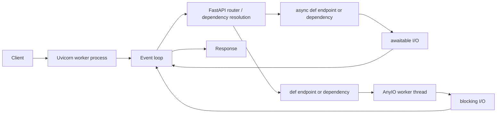

# FastAPI 요청 실행 모델: thread-per-request가 아닌 이유

> 선행: [조사 개요](./00_조사_개요와_읽는순서.md)  
> 핵심 질문: 요청 하나가 FastAPI에 들어왔을 때, 어느 코드가 이벤트 루프에서 실행되고 어느 코드가 worker thread로 가는가?

## 1. Spring MVC와 비교할 때 봐야 할 차이

전통적인 Spring MVC + Servlet container(Tomcat)의 기본 모델은 대체로 **요청 하나가 servlet worker thread 하나를 점유**하는 방식이다. DB·외부 HTTP에서 기다리는 동안에도 그 thread는 반환되지 않는다. worker thread가 모두 점유되면 다음 요청은 container queue에서 기다린다.

FastAPI는 ASGI 서버(Uvicorn 등) 위에서 실행된다. 한 worker process 안에서 보통 하나의 이벤트 루프가 많은 coroutine task를 번갈아 실행한다. 네트워크·DB 등 await 가능한 I/O를 기다리는 task는 이벤트 루프를 양보하므로, 같은 thread가 다른 요청을 처리할 수 있다.

```text
Spring MVC의 전형적 흐름
request → servlet worker thread → blocking DB/HTTP wait → response

FastAPI async 경로
request → event-loop task → await I/O → event loop가 다른 task 실행 → response
```

이 차이는 I/O 대기가 많은 서비스에서 FastAPI가 적은 thread로 높은 동시성을 다룰 수 있게 한다. 반대로 한 task가 이벤트 루프를 오래 점유하면 영향을 받는 범위가 한 요청 thread가 아니라 **해당 worker 전체**가 된다.

> Java의 pool도 항상 모든 thread를 기동 시점에 미리 만드는 것은 아니다. 구현과 설정에 따라 필요 시 만들고 idle thread를 재사용한다. FastAPI/AnyIO도 "40개의 미리 생성된 thread"가 아니라, 동기 작업의 동시 실행을 제한하는 token 기반 limiter로 이해하는 편이 정확하다.

## 2. 요청 경로



FastAPI가 사용자의 모든 함수를 자동으로 분석해서 thread로 보내지는 않는다. 자동 dispatch 대상은 **FastAPI가 호출하는 path operation function과 dependency**다.

| 코드 위치 | 실행 위치 | 주의점 |
| --- | --- | --- |
| `async def` endpoint | 이벤트 루프 | 동기 호출 하나가 loop를 막을 수 있음 |
| `def` endpoint | 외부 thread pool | pool token을 기다릴 수 있음 |
| `async def` dependency | 이벤트 루프 | 내부 blocking 호출은 여전히 위험 |
| `def` dependency | 외부 thread pool | endpoint와 같은 pool을 공유 |
| `async def` 안에서 직접 부른 일반 `def` helper | **호출한 이벤트 루프 thread** | FastAPI가 자동 offload하지 않음 |
| `def` 안에서 부른 helper | 해당 worker thread | thread를 이미 점유 중 |

공식 문서도 일반 utility function을 직접 호출하면 FastAPI가 thread pool로 옮기지 않는다고 명시한다. 즉 아래 코드는 `async def`여도 안전하지 않다.

```python
import requests
from fastapi import FastAPI

app = FastAPI()

def fetch_legacy_api():
    return requests.get("https://example.internal")  # blocking

@app.get("/bad")
async def bad():
    return {"status": fetch_legacy_api().status_code}  # event loop에서 직접 실행
```

I/O가 truly async인 client를 쓰거나, legacy blocking I/O만 명시적으로 offload해야 한다.

```python
import httpx

@app.get("/good")
async def good():
    async with httpx.AsyncClient(timeout=3.0) as client:
        response = await client.get("https://example.internal")
    return {"status": response.status_code}
```

`AsyncClient`를 요청마다 만들지 않고 lifespan에서 재사용하는 이유는 06장에서 다룬다.

## 3. 이벤트 루프가 실제로 하는 일

이벤트 루프는 OS thread 하나에서 실행되는 scheduler다. coroutine이 다음과 같이 `await`로 I/O 완료를 기다리면 그 task를 잠시 멈추고 실행 가능한 다른 task를 처리한다.

```python
async def endpoint():
    data = await client.get("https://api.example.com")
    return data.json()
```

하지만 `await` 이전의 일반 Python 코드는 중간에 자동으로 양보하지 않는다.

```python
async def endpoint():
    result = expensive_python_loop()  # 끝날 때까지 event loop 점유
    return result
```

따라서 async의 성능 모델은 "동시에 여러 줄의 Python 코드를 실행한다"가 아니라 **I/O 대기 중인 작업을 겹친다**에 가깝다.

## 4. `def` endpoint는 왜 존재하는가

동기 DB driver, 오래된 SDK, blocking 파일 API처럼 `await`를 지원하지 않는 라이브러리도 많다. 이 라이브러리를 `async def` 안에서 직접 부르면 이벤트 루프가 block된다.

FastAPI에서는 endpoint 자체를 일반 `def`로 선언할 수 있다. FastAPI/Starlette는 이 함수를 외부 thread pool에서 실행하고, 이벤트 루프는 완료를 await한다.

```python
@app.get("/legacy-db")
def legacy_db_endpoint():
    return blocking_db_query()
```

이 선택은 "동기 코드를 비동기로 바꾼다"는 뜻은 아니다. blocking 대기를 이벤트 루프가 아닌 worker thread가 맡게 바꾼다는 뜻이다. 그래서 다음 병목은 thread pool token과 DB connection pool이 된다.

## 5. AnyIO thread pool은 FastAPI 전용 pool이 아니다

Starlette는 동기 코드를 `anyio.to_thread.run_sync`로 실행한다. 기본 limiter는 40 token이며, 이 제한은 아래 작업이 공유한다.

- 동기 `def` endpoint
- 동기 dependency
- `FileResponse`
- `UploadFile` 처리
- 동기 background task
- 일부 Starlette 내부 동기 작업

따라서 "endpoint는 async인데 왜 thread pool이 찼지?"라는 일이 가능하다. 업로드·파일 응답·동기 dependency·background task가 동일한 예산을 소비할 수 있기 때문이다.

## 6. GIL은 무엇을 바꾸고 무엇을 바꾸지 않는가

일반적인 GIL-enabled CPython에서는 한 process 안에서 한 순간에 하나의 thread만 Python bytecode를 실행한다. 따라서 thread pool은 순수 Python CPU 계산을 코어 수만큼 병렬화하는 해법이 아니다.

그러나 blocking I/O에서는 기다리는 동안 GIL이 풀리거나, 적어도 실행 thread가 외부 I/O 대기에 머문다. 그래서 thread pool은 동기 HTTP·파일·DB I/O를 이벤트 루프 밖으로 옮기는 데 여전히 유효하다.

| 작업 성격 | FastAPI에서 우선 선택 | 이유 |
| --- | --- | --- |
| async I/O 지원 HTTP/DB | `async def` + async client/driver | 이벤트 루프를 양보하며 높은 I/O 동시성 |
| 동기 I/O만 지원 | `def` endpoint 또는 명시적 thread offload | loop block 방지 |
| 순수 Python CPU-bound | process pool 또는 별도 job worker | GIL과 event-loop starvation 회피 |
| GPU/ML inference | 전용 inference server 또는 명시적 bounded queue | GPU 메모리·batching·취소 정책을 별도로 관리 |

Python 3.13부터는 GIL을 끌 수 있는 free-threaded build가 존재하지만 기본 배포 모델은 아니며, C extension 호환성도 검토해야 한다. FastAPI 운영 설계에서 이를 전제로 thread 수를 늘리는 것은 아직 일반적인 기본 전략이 아니다.

## 7. worker process의 의미

`uvicorn --workers N`의 worker는 thread가 아니라 process다. 각 worker는 대체로 자체 이벤트 루프, AnyIO thread limiter, 메모리, DB/HTTP client pool을 가진다.

```text
worker 1: event loop 1 + thread tokens 40 + DB pool + HTTP pool
worker 2: event loop 2 + thread tokens 40 + DB pool + HTTP pool
...
```

worker를 늘리면 CPU core 활용과 장애 격리는 좋아질 수 있다. 하지만 각 process의 메모리와 connection pool도 증가한다. worker 수만 늘려 hang을 해결하려 하면 DB connection 초과, 메모리 부족, downstream 과부하로 문제를 옮길 수 있다.

## 8. 이 장의 결론

FastAPI 실행 모델을 다음 한 문장으로 기억한다.

> `async def`는 이벤트 루프에서 실행되며 `await`할 때만 양보한다. FastAPI가 호출하는 `def` endpoint/dependency는 AnyIO worker thread에서 실행되지만, 그 pool과 외부 connection pool 역시 유한한 대기열이다.

다음 장에서는 이 모델에서 가장 큰 장애 전파를 만드는 이벤트 루프 blocking을 다룬다.

## 출처

- [FastAPI — Concurrency and async / await](https://fastapi.tiangolo.com/async/) — `def` path operation/dependency의 external thread pool 동작, 직접 호출한 helper는 자동 offload하지 않는다는 설명.
- [Starlette — Thread Pool](https://www.starlette.io/threadpool/) — AnyIO 기반 실행, shared default 40-token limiter.
- [Python 3.14 — threading](https://docs.python.org/3/library/threading.html) — I/O-bound thread 활용과 GIL의 CPU-bound 제한.
- [Python 3.14 — asyncio event loop](https://docs.python.org/3/library/asyncio-eventloop.html) — blocking I/O는 thread executor, CPU-bound는 process pool을 고려하는 예시.
