# 04_LangGraph

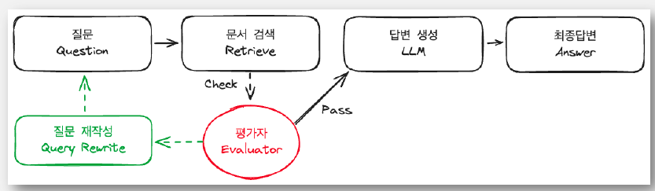

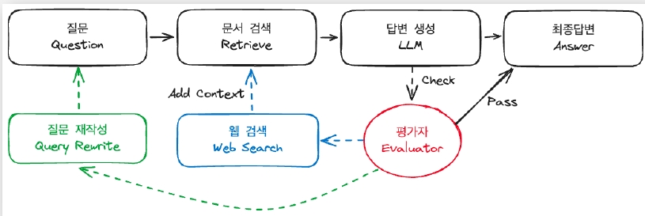

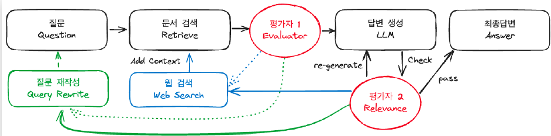

- 위와 같은 방법들로 해당 여러 work flow를 결정하고 진행할 수 있다.


## LangGraph 세부 기능

### Status

- TypedDict : dict에 타입힌트를 사용한 개념
- 모든 값을 다 채우지 않아도 된다.
- **새로운 노드에서 값을 덮어쓰기로 채운다.**
- add_messages 같이 Reducer를 사용한 경우에는 값이 append 된다.

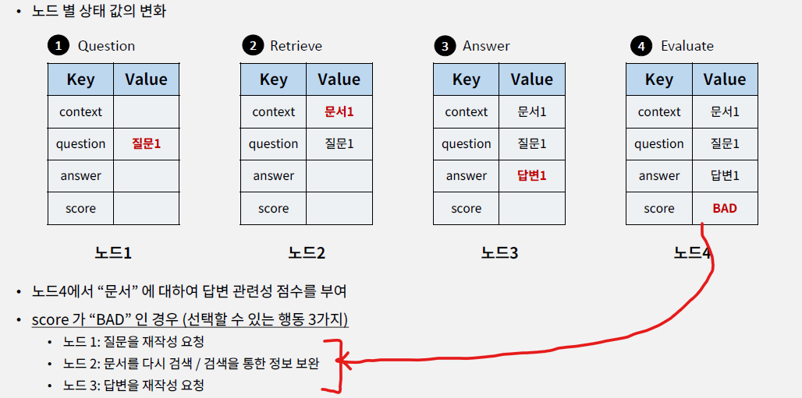

```python
from typing import TypedDict, Annotated

from langchain_core.messages import HumanMessage, AIMessage
from langgraph.graph import add_messages

# status
class GraphState(TypedDict):
    question: Annotated[list, add_messages]
    context: Annotated[str, "Context"]
    answer: Annotated[str, "Answer"]
    messages: Annotated[list, add_messages]
    relevance: Annotated[str, "Relevance"]

# Reducer
msg1 = [HumanMessage(content="안녕하세요?", id="1")]
msg2 = [AIMessage(content="반값습니다.", id="2")]
res = add_messages(msg1, msg2) # list로 합해진다.
```


### Node

- 함수로 정의
- 입력 인자 : State 객체
- return 
  - State 객체 (대부분)
  - Conditional Edge의 경우 다를 수 있음

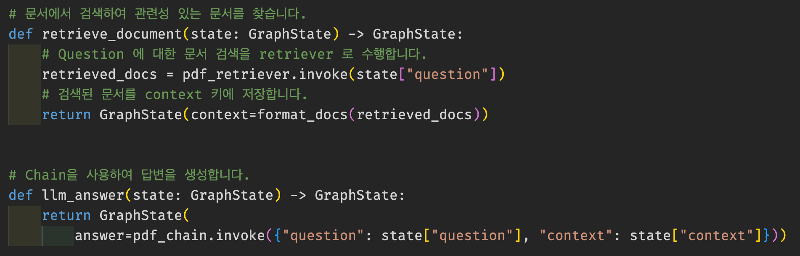

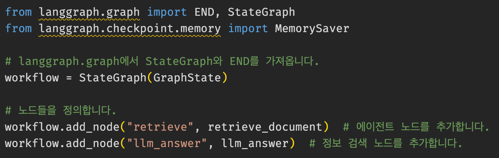


### Edge

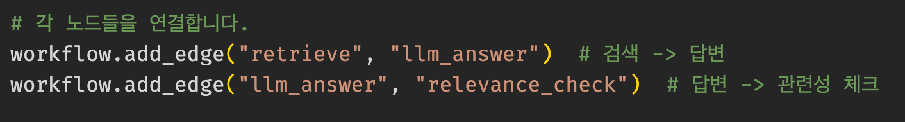

### Conditional Edge

- “relevance_check” 노드에서 나온 결과를is_relevant 함수에 입력
  - 반환된 값은“grounded”, “notGrounded”, “notSure” 중하나
  - value 에 해당하는 값이 END 면Graph 실행 종료
  - “llm_answer” 와같이 노드이름이면 해당 노드로 연결

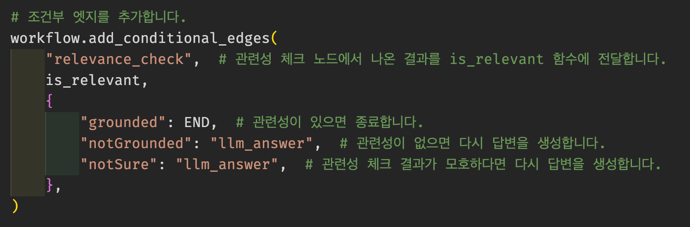

### Set Entry Point

```python
workflow.set_entry_point("retrieve")
```


## Module

### add_conditional_edges

- source : 시작노드
- path : 다음 노드를 결정하는 호출가능한 객체 또는 Runnable
- path_map : 경로와 노드 이름간의 매핑. 생략하면 path가 반환하는 값이 노드 이름이어야함
- then


## Streaming

## StateGraph의 `stream` 메서드

`stream` 메서드는 단일 입력에 대한 그래프 단계를 스트리밍하는 기능을 제공합니다.

**매개변수**

- `input` (Union[dict[str, Any], Any]): 그래프에 대한 입력
- `config` (Optional[RunnableConfig]): 실행 구성
- `stream_mode` (Optional[Union[StreamMode, list[StreamMode]]]): 출력 스트리밍 모드
- `output_keys` (Optional[Union[str, Sequence[str]]]): 스트리밍할 키
- `interrupt_before` (Optional[Union[All, Sequence[str]]]): 실행 전에 중단할 노드
- `interrupt_after` (Optional[Union[All, Sequence[str]]]): 실행 후에 중단할 노드
- `debug` (Optional[bool]): 디버그 정보 출력 여부
- `subgraphs` (bool): 하위 그래프 스트리밍 여부

**반환값**

- Iterator[Union[dict[str, Any], Any]]: 그래프의 각 단계 출력. 출력 형태는 `stream_mode`에 따라 다름

**주요 기능**

1. 입력된 설정에 따라 그래프 실행을 스트리밍 방식으로 처리
2. 다양한 스트리밍 모드 지원 (`values`, `updates`, `debug`)
3. 콜백 관리 및 오류 처리
4. 재귀 제한 및 중단 조건 처리

**스트리밍 모드**

- `values`: 각 단계의 현재 상태 값 출력
- `updates`: 각 단계의 상태 업데이트만 출력
- `debug`: 각 단계의 디버그 이벤트 출력

### `stream_mode` 옵션

`stream_mode` 옵션은 스트리밍 출력 모드를 지정하는 데 사용됩니다.

- `values`: 각 단계의 현재 상태 값 출력
- `updates`: 각 단계의 상태 업데이트만 출력 (기본값)

### stream_mode = "values"

- `values` 모드는 각 단계의 현재 상태 값을 출력합니다.

**참고**

```
event.items()
```

- `key`: State 의 key 값
- `value`: State 의 key 에 대한하는 value


### stream_mode = "updates"

`updates` 모드는 각 단계에 대한 업데이트된 State 만 내보냅니다.

- 출력은 노드 이름을 key 로, 업데이트된 값을 values 으로 하는 `dictionary` 입니다.

**참고**

```
event.items()
```

- `key`: 노드(Node) 의 이름
- `value`: 해당 노드(Node) 단계에서의 출력 값(dictionary). 즉, 여러 개의 key-value 쌍을 가진 dictionary 입니다.


### stream_mode = "messages"

- token 단위로 출력 가능
- chunk_msg와 metadata로 값을 받게 된다.

```python
for chunk_msg, metadaata in graph.stream(inputs, stream_mode="messages"):
    pass
```

- 원하는 애한테만 stream 출력하기
  - astream 을 사용해야한다. >> 그래야 TAG를 받아 불러올 수 있음

```python
# 비동기 이벤트 스트림 처리(astream_events)
async for event in graph.astream_events(inputs, version="v2"):
    # 이벤트 종류와 태그 정보 추출
    kind = event["event"]
    tags = event.get("tags", [])

    # 채팅 모델 스트림 이벤트 및 최종 노드 태그 필터링
    if kind == "on_chat_model_stream" and "WANT_TO_STREAM" in tags:
        # 이벤트 데이터 추출
        data = event["data"]

        # 출력 메시지
        if data["chunk"].content:
            print(data["chunk"].content, end="", flush=True)
```


- 도구 호출에 대한 스트리밍 출력 

```python
from langchain_core.messages import AIMessageChunk, HumanMessage

# SNS 포스트 생성 함수 정의
def create_sns_post(state: State):
    # SNS 포스트 생성을 위한 프롬프트
    sns_prompt = """
    이전 대화 내용을 바탕으로 SNS 게시글 형식으로 변환해주세요.
    다음 형식을 따라주세요:
    - 해시태그 포함
    - 이모지 사용
    - 간결하고 흥미로운 문체 사용
    - 200자 이내로 작성
    """
    messages = state["messages"] + [("human", sns_prompt)]
    sns_llm = ChatOpenAI(model="gpt-4o-mini").with_config(tags=["WANT_TO_STREAM2"]) # 여기서 tag를 걸 수 있음
    return {"messages": [sns_llm.invoke(messages)]}

# 질문 입력
inputs = {"messages": [("human", "AI 관련된 최신 뉴스를 검색해줘")]}

# 첫 번째 메시지 처리 여부 플래그 설정
first = True

# 비동기 스트림 처리를 통한 메시지 및 메타데이터 순차 처리
for msg, metadata in graph.stream(inputs, stream_mode="messages"):
    # 사용자 메시지가 아닌 경우의 컨텐츠 출력 처리
    if msg.content and not isinstance(msg, HumanMessage):
        print(msg.content, end="", flush=True)

    # AI 메시지 청크 처리 및 누적
    if isinstance(msg, AIMessageChunk):
        if first:
            gathered = msg
            first = False
        else:
            gathered = gathered + msg

        # 도구 호출 청크 존재 시 누적된 도구 호출 정보 출력
        if msg.tool_call_chunks:
            print(gathered.tool_calls[0]["args"])
```


- 서브 그래프 출력

```python
# 사용자의 메시지를 딕셔너리 형태로 입력 데이터 구성
inputs = {"messages": [("human", "AI 관련된 최신 뉴스를 검색해줘")]}


# 네임스페이스 문자열을 보기 좋은 형식으로 변환하는 포맷팅 함수
def format_namespace(namespace):
    return namespace[-1].split(":")[0] if len(namespace) > 0 else "parent graph"


#################### 여기를 True로 넣음면 됨
for namespace, chunk in graph.stream(
    inputs, stream_mode="updates", subgraphs=True
):
    for node_name, node_chunk in chunk.items():
        # 노드의 청크 데이터 출력
        if "messages" in node_chunk:
            node_chunk["messages"][-1].pretty_print()
        else:
            print(node_chunk)
```


## Human in the Loop

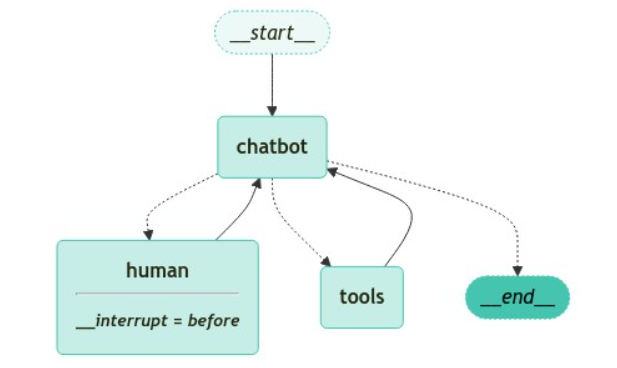

```python
from typing import TypedDict, Annotated

from langchain_core.messages import AIMessage, ToolMessage
from langchain_openai import ChatOpenAI
from langchain_teddynote.tools import TavilySearch
from langgraph.checkpoint.memory import MemorySaver
from langgraph.constants import END, START
from langgraph.graph import add_messages, StateGraph
from langgraph.prebuilt import ToolNode, tools_condition
from pydantic import BaseModel


class HumanRequest(BaseModel):
    """Forward the conversation to an expert. Use when you can't assist directly or the user needs assistance that exceeds your authority.
    To use this function, pass the user's 'request' so that an expert can provide appropriate guidance.
    """
    request: str

class State(TypedDict):
    messages: Annotated[list, add_messages]
    ask_human: bool # 이 부분이 추가

def create_response(response: str, ai_message: AIMessage):
    return ToolMessage(
        content=response,
        tool_call_id=ai_message.tool_calls[0]["id"]
    )

tool = TavilySearch(max_results=3)
tools = [tool, HumanRequest]
llm = ChatOpenAI(temperature=0)
llm_with_tools = llm.bind_tools(tools)

class HumanInTheLoopNode:
    def __init__(self, state:State):
        state:State = state
        chatbot = self.chatbot(state)
        human_node = self.human_node(state)

    # Node 생성
    def chatbot(self, state:State):
        response = llm_with_tools.invoke(state["messages"])
        ask_human = False

        # 답변에서 HumanRequest 가 나왔다면, ask_human 모드로 들어간다.
        if response.tool_calls and response.tool_calls[0]["name"] == HumanRequest.__name__:
                ask_human = True
        return {
            "messages": [response],
            "ask_human": ask_human
        }


    def human_node(self, state: State):
        new_messages = []
        if not isinstance(state["messages"][-1], ToolMessage):
            # 사람으로부터 응답이 없는 경우
            new_messages.append(
                create_response("No response from human.", state["messages"][-1])
            )
        return {
            # 새 메시지 추가
            "messages": new_messages,
            # 플래그 해제
            "ask_human": False,
        }

class GraphBuilder:
    def __init__(self, nodes:HumanInTheLoopNode):
        self.nodes:HumanInTheLoopNode = nodes

    @staticmethod
    def _select_next_node(state: State): # 다음 노드 선택
        # 인간에게 질문 여부 확인
        if state["ask_human"]:
            return "human"
        # 이전과 동일한 경로 설정
        return tools_condition(state)

    def build(self):
        graph_builder = StateGraph(State)
        graph_builder.add_node("chatbot", self.nodes.chatbot)
        graph_builder.add_node("tools", ToolNode(tools=[tool]))
        graph_builder.add_node("human", self.nodes.human_node)
        graph_builder.add_conditional_edges(
            "chatbot",
            self._select_next_node,  # ask human이면 human 노드로 이동
            {"human": "human", "tools": "tools", END: END},  # human, tool, end 로 연결
        )
        graph_builder.add_edge("tools", "chatbot")
        graph_builder.add_edge("human", "chatbot")
        graph_builder.add_edge(START, "chatbot")
        return graph_builder

    def compile(self):
        return self.build().compile(
            checkpointer=memory,
            # 'human' 이전에 인터럽트 설정할 수 있음
            interrupt_before=["human"],
        )

memory = MemorySaver()
nodes = HumanInTheLoopNode(State)
graph = GraphBuilder(nodes).compile()

# Output
# user_input = "이 AI 에이전트를 구축하기 위해 전문가의 도움이 필요합니다. 검색해서 답변하세요" (Human 이 아닌 웹검색을 수행하는 경우)
user_input = "이 AI 에이전트를 구축하기 위해 전문가의 도움이 필요합니다. 도움을 요청할 수 있나요?"

# config 설정
config = {"configurable": {"thread_id": "1"}}

# 스트림 또는 호출의 두 번째 위치 인수로서의 구성
events = graph.stream(
    {"messages": [("user", user_input)]}, config, stream_mode="values"
)
for event in events:
    if "messages" in event:
        # 마지막 메시지의 예쁜 출력
        event["messages"][-1].pretty_print()


# 그래프 상태 스냅샷 생성
snapshot = graph.get_state(config)
# AI 메시지 추출
ai_message = snapshot.values["messages"][-1]

# 인간 응답 생성
human_response = (
    "전문가들이 도와드리겠습니다! 에이전트 구축을 위해 LangGraph를 확인해 보시기를 적극 추천드립니다. "
    "단순한 자율 에이전트보다 훨씬 더 안정적이고 확장성이 뛰어납니다. "
    "https://wikidocs.net/233785 에서 더 많은 정보를 확인할 수 있습니다."
)

# 도구 메시지 생성
tool_message = create_response(human_response, ai_message)

# 그래프 상태 업데이트
graph.update_state(config, {"messages": [tool_message]})

```


## DeleteMessage

```python
# 메시지 개수가 3개 초과 시 오래된 메시지 삭제 및 최신 메시지만 유지
def delete_messages(state):
    messages = state["messages"]
    if len(messages) > 3:
        return {
            "messages": [
                RemoveMessage(id=m.id) 
                         for m in messages[:-3]
            ]
        }

def should_continue(state: MessagesState) -> Literal["action", "delete_messages"]:
    """Return the next node to execute."""
    last_message = state["messages"][-1]
    # 함수 호출이 없는 경우 메시지 삭제 함수 실행
    if not last_message.tool_calls:
        return "delete_messages"
    # 함수 호출이 있는 경우 액션 실행
    return "action"

# 메시지 상태 기반 워크플로우 그래프 정의
workflow = StateGraph(MessagesState)

# 에이전트와 액션 노드 추가
workflow.add_node("agent", call_model)
workflow.add_node("action", tool_node)

# 메시지 삭제 노드 추가
workflow.add_node(delete_messages)

# 시작 노드에서 에이전트 노드로 연결
workflow.add_edge(START, "agent")

# 조건부 엣지 추가를 통한 노드 간 흐름 제어
workflow.add_conditional_edges(
    "agent",
    should_continue,
)

# 액션 노드에서 에이전트 노드로 연결
workflow.add_edge("action", "agent")

# 메시지 삭제 노드에서 종료 노드로 연결
workflow.add_edge("delete_messages", END)

# 메모리 체크포인터를 사용하여 워크플로우 컴파일
app = workflow.compile(checkpointer=memory)
```

- 즉 메시지가 3개 이상이 되는 경우에는 메시지 삭제 노드로 보내지게 되면서 진행되는 것


## Fan-in / Fan-out

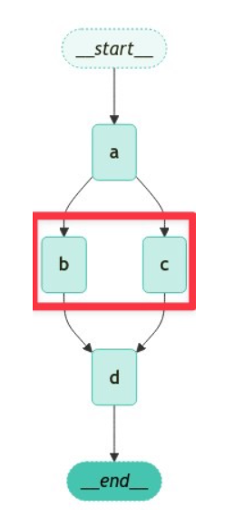

### 병렬로 실행 시키기

- 아래와 같이 각각 노드들을 만들고 난 뒤 노드 연결을 시키면 된다.

```python
# 상태 그래프 초기화
builder = StateGraph(State)

# 노드 A부터 D까지 생성 및 값 할당
builder.add_node("a", ReturnNodeValue("I'm A"))
builder.add_edge(START, "a")
builder.add_node("b", ReturnNodeValue("I'm B"))
builder.add_node("c", ReturnNodeValue("I'm C"))
builder.add_node("d", ReturnNodeValue("I'm D"))

# 노드 연결
builder.add_edge("a", "b") # 병렬
builder.add_edge("a", "c") # 병렬
builder.add_edge("b", "d") 
builder.add_edge("c", "d") 
builder.add_edge("d", END)

# 그래프 컴파일
graph = builder.compile()
```

- 유의사항
  - **병렬 노드 중에서 하나라도 실패 하게 된다면 전체 실패**
  - 따라서 retry 정책을 만들어 두는 게 좋음 >> 실패한 분기만 재시도

### 조건부 분기

```python
# 상태 그래프 초기화
builder = StateGraph(State)
builder.add_node("a", ReturnNodeValue("I'm A"))
builder.add_node("b", ReturnNodeValue("I'm B"))
builder.add_node("c", ReturnNodeValue("I'm C"))
builder.add_node("d", ReturnNodeValue("I'm D"))
builder.add_node("e", ReturnNodeValue("I'm E"))

# 상태의 'which' 값에 따른 조건부 라우팅 경로 결정 함수
def route_bc_or_cd(state: State) -> Sequence[str]:
    if state["which"] == "cd":
        return ["c", "d"]
    return ["b", "c"]

# 전체 병렬 처리할 노드 목록
intermediates = ["b", "c", "d"]

builder.add_edge(START, "a")
builder.add_conditional_edges(
    "a",
    route_bc_or_cd, # router를 타서 bc 또는 cd를 타는 경우
    intermediates, # 3개 병렬 처리하는 경우
)
for node in intermediates:
    builder.add_edge(node, "e")
builder.add_edge("e", END)

# compile
graph = builder.compile()
```


### 결과 순서 정해서 반환하기

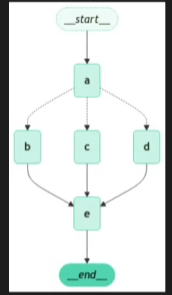

```python
# 팬아웃 값들의 병합 로직 구현, 빈 리스트 처리 및 리스트 연결 수행
def reduce_fanouts(left, right):
    if left is None:
        left = []
    if not right:
        # 덮어쓰기
        return []
    return left + right

# 상태 관리를 위한 타입 정의, 집계 및 팬아웃 값 저장 구조 설정
class State(TypedDict):
    # add_messages 리듀서 사용
    aggregate: Annotated[list, add_messages]
    fanout_values: Annotated[list, reduce_fanouts]
    which: str

# 병렬 노드 값 반환 클래스
class ParallelReturnNodeValue:
    def __init__(
        self,
        node_secret: str,
        reliability: float,
    ):
        self._value = node_secret
        self._reliability = reliability

    # 호출시 상태 업데이트
    def __call__(self, state: State) -> Any:
        return {
            "fanout_values": [
                {
                    "value": [self._value],
                    "reliability": self._reliability, # 이부분
                }
            ]
        }

# 신뢰도(reliability)가 다른 병렬 노드들 추가
builder = StateGraph(State)
builder.add_node("a", ReturnNodeValue("I'm A"))
builder.add_node("b", ParallelReturnNodeValue("I'm B", reliability=0.1)) # 3
builder.add_node("c", ParallelReturnNodeValue("I'm C", reliability=0.9)) # 1
builder.add_node("d", ParallelReturnNodeValue("I'm D", reliability=0.5)) # 2 

def aggregate_fanout_values(state: State) -> Any:
    # 신뢰도 기준 정렬
    ranked_values = sorted(
        state["fanout_values"], key=lambda x: x["reliability"], reverse=True
    )
    return {
        "aggregate": [x["value"][0] for x in ranked_values] + ["I'm E"],
        "fanout_values": [],
    }
builder.add_node("e", aggregate_fanout_values)

# 상태에 따른 조건부 라우팅 로직 구현
def route_bc_or_cd(state: State) -> Sequence[str]:
    if state["which"] == "cd":
        return ["c", "d"]
    return ["b", "c"]

# 중간 노드들 설정 및 조건부 엣지 추가
intermediates = ["b", "c", "d"]
builder.add_edge(START, "a")
builder.add_conditional_edges("a", route_bc_or_cd, intermediates)

# 중간 노드들과 최종 집계 노드 연결
for node in intermediates:
    builder.add_edge(node, "e")

# 그래프 완성을 위한 최종
graph = builder.compile()

```


## 대화 기록 요약 방법

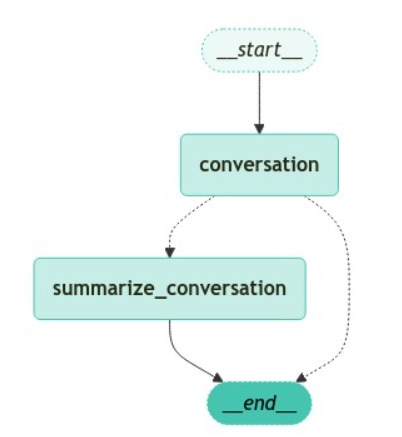

```PYTHON
# Node 생성
def ask_llm(state: State):
    # 이전 요약 정보 확인
    summary = state.get("summary", "")

    # 이전 요약 정보가 있다면 시스템 메시지로 추가
    if summary:
        system_message = f"Summary of conversation earlier: {summary}"
        # 시스템 메시지와 이전 메시지 결합
        messages = [SystemMessage(content=system_message)] + state["messages"]
    else:
        # 이전 메시지만 사용
        messages = state["messages"]
    response = model.invoke(messages)
    return {"messages": [response]}

# 대화 종료 또는 요약 결정 로직
def should_continue(state: State) -> Literal["summarize_conversation", END]:
    # 메시지 목록 확인
    messages = state["messages"]

    # 메시지 수가 6개 초과라면 요약 노드로 이동
    if len(messages) > 6:
        return "summarize_conversation"
    return END

# 대화 내용 요약 및 메시지 정리 로직
def summarize_conversation(state: State):
    summary = state.get("summary", "")
    if summary:
        summary_message = (
            f"This is summary of the conversation to date: {summary}\n\n"
            "Extend the summary by taking into account the new messages above in Korean:"
        )
    else:
        # 요약 메시지 생성
        summary_message = "Create a summary of the conversation above in Korean:"

    # 요약 메시지와 이전 메시지 결합
    messages = state["messages"] + [HumanMessage(content=summary_message)]
    response = model.invoke(messages)
    # 오래된 메시지 삭제
    delete_messages = [RemoveMessage(id=m.id) for m in state["messages"][:-2]]
    return {"summary": response.content, "messages": delete_messages}


# 워크플로우 그래프 초기화
workflow = StateGraph(State)

# 대화 및 요약 노드 추가
workflow.add_node("conversation", ask_llm)
workflow.add_node(summarize_conversation)

# 시작점을 대화 노드로 설정
workflow.add_edge(START, "conversation")

# 조건부 엣지 추가
workflow.add_conditional_edges(
    "conversation",
    should_continue,
)

# 요약 노드에서 종료 노드로의 엣지 추가
workflow.add_edge("summarize_conversation", END)

# 워크플로우 컴파일 및 메모리 체크포인터 설정
app = workflow.compile(checkpointer=memory)
```


## SubGraph

- sub graph를 Node로 넣어서 실행
- 시나리오 1
  - 상위 그래프와 서브 그래프가 **스키마 키를 공유하는 경우**
  - **컴파일된 서브그래프로 노드를 추가**할 수 있다.
  - 스키마 키란 TypeDict로 key값을 정의하는데 그 key값이 같은 경우를 의미한다.
- 시나리오 2
  - 상위 그래프와 서브그래프가 **서로 다른 스키마 키를 공유하는 경우**
  - 서**브그래프를 호출하는 노드 함수**를 추가해야한다.
  - 대부분 Parent와 Child의 key값이 다르게 된다. 따라서 대부분 이 경우로 진행하는게 좋을듯


### 시나리오 1

```python
class ParentState(TypedDict):
    name: str
    company: str

class ChildState(TypedDict):
    name: str  # 부모 그래프와 공유되는 상태 키
    family_name: str

# 부모 그래프의 첫 번째 노드, name 키의 값을 수정하여 새로운 상태 생성
def node_1(state: ParentState):
    return {"name": f'My name is {state["name"]}'}

# 서브그래프의 첫 번째 노드, family_name 키에 초기값 설정
def subgraph_node_1(state: ChildState):
    return {"family_name": "Lee"}

def subgraph_node_2(state: ChildState):
    return {"name": f'{state["name"]} {state["family_name"]}'}

# 서브그래프 구조 정의 및 노드 간 연결 관계 설정
subgraph_builder = StateGraph(ChildState)
subgraph_builder.add_node(subgraph_node_1)
subgraph_builder.add_node(subgraph_node_2)
subgraph_builder.add_edge(START, "subgraph_node_1")
subgraph_builder.add_edge("subgraph_node_1", "subgraph_node_2")
subgraph = subgraph_builder.compile()

# 부모 graph build
builder = StateGraph(ParentState)
builder.add_node("node_1", node_1)
builder.add_node("node_2", subgraph) # 그냥 이렇게 추가하면 된다.

builder.add_edge(START, "node_1")
builder.add_edge("node_1", "node_2")
builder.add_edge("node_2", END)
graph = builder.compile()
    
```


### 시나리오 2

```python
class ParentState(TypedDict):
    family_name: str
    full_name: str
    
# 부모 그래프의 첫 번째 노드: family_name 값 그대로 반환
def node_1(state: ParentState):
    return {"family_name": state["family_name"]}

# 부모 그래프의 두 번째 노드: 서브그래프와 상태 변환 및 결과 처리
def node_2(state: ParentState):
    # 부모 상태를 서브그래프 상태로 변환
    response = subgraph.invoke({"name": state["family_name"]})
    # 서브그래프 응답을 부모 상태로 변환
    return {"full_name": response["name"]}

class ChildState(TypedDict):
    name: str # 부모 그래프와 공유되지 않는 키들

# 서브그래프의 첫 번째 노드: name 키에 초기값 설정
def subgraph_node_1(state: ChildState):
    return {"name": "Teddy " + state["name"]}

# 서브그래프의 두 번째 노드: name 값 그대로 반환
def subgraph_node_2(state: ChildState):
    return {"name": f'My name is {state["name"]}'}

# 서브그래프 빌더 초기화 및 노드 연결 구성
subgraph_builder = StateGraph(ChildState)
subgraph_builder.add_node(subgraph_node_1)
subgraph_builder.add_node(subgraph_node_2)
subgraph_builder.add_edge(START, "subgraph_node_1")
subgraph_builder.add_edge("subgraph_node_1", "subgraph_node_2")
subgraph = subgraph_builder.compile()


# parents 그래프 빌드
# 컴파일된 서브그래프 대신 서브그래프를 호출하는 node_2 함수 사용
builder = StateGraph(ParentState)
builder.add_node("node_1", node_1)
builder.add_node("node_2", node_2) # 위에 코드는 바로 sub graph가 들어오지만 여기선 x

# edge
builder.add_edge(START, "node_1")
builder.add_edge("node_1", "node_2")
builder.add_edge("node_2", END)
graph = builder.compile()

```


