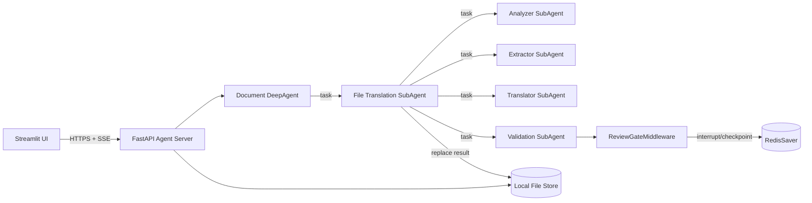
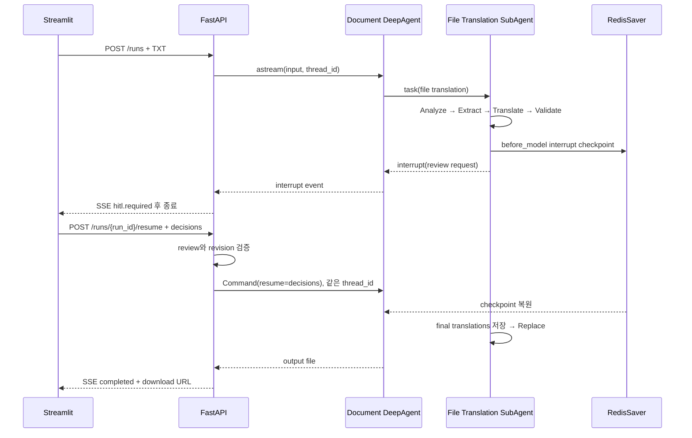

# DeepAgent File Translation HITL PoC 설계

> 작성일: 2026-09-13  
> 상태: 구현 계획 작성 전 승인 설계  
> 대상 경로: `AI/agent_hitl/`  

## 1. 목표

TXT 파일 하나를 업로드하면 DeepAgent의 File Translation SubAgent가 단순 분석·추출·1차 번역·검증을 수행한다. Validation 결과가 생성된 직후 Custom Middleware가 자동으로 실행을 중단한다. 사용자는 Streamlit에서 두 번역 중 하나를 선택하거나 직접 수정하고, FastAPI Resume Endpoint를 통해 같은 실행을 재개한 뒤 결과 TXT를 다운로드한다.

이 PoC는 번역 품질이나 여러 문서 형식 지원보다 다음 기술 가정을 검증한다.

1. Document DeepAgent가 File Translation SubAgent를 호출한다.
2. Validation SubAgent 완료를 `before_model` Middleware가 감지한다.
3. Middleware가 LLM의 별도 Tool 선택 없이 `interrupt()`한다.
4. interrupt가 최상위 Agent 호출과 SSE까지 전파된다.
5. RedisSaver checkpoint로 프로세스 간 중단·재개가 가능하다.
6. 재개 시 Validation SubAgent가 반복 호출되지 않는다.
7. 사용자의 선택 또는 수정문이 결과 TXT에 반영된다.

## 2. PoC 범위

### 포함

- UTF-8 TXT 파일 업로드
- FastAPI 기반 Agent Server
- Streamlit 기반 검수 UI
- OpenAI 호환 Ollama Endpoint를 사용하는 `ChatOpenAI`
- Document DeepAgent와 File Translation SubAgent
- Analyzer, Extractor, Translator, Validation 역할의 단순 SubAgent
- File Translation SubAgent의 `before_model` Custom Middleware
- RedisSaver 기반 checkpoint
- 최초 실행 SSE와 Resume 실행 SSE
- 1차 번역 선택, 검증 번역 선택, 직접 수정
- 결과 TXT 다운로드
- 프로세스 재시작 후 resume 검증
- Validation 호출 횟수 및 Replace 멱등성 검증

### 제외

- DOCX, PPTX, PDF 등 복합 문서
- 원본 스타일과 레이아웃 보존
- MinIO 연동
- 사용자 로그인과 조직 권한
- 다중 검수자 및 검수 작업함
- 배치·segment별 여러 번의 HITL
- 운영 배포와 TLS 종료
- 번역 품질 평가 시스템

## 3. 선택한 접근법

### 3.1 전송 방식

각 실행 요청에서 SSE 연결을 열고 interrupt 또는 완료 시 종료한다.

```text
POST /runs
→ SSE progress
→ SSE hitl.required
→ 연결 종료

POST /runs/{run_id}/resume
→ SSE progress
→ SSE completed
→ 연결 종료
```

백그라운드 큐와 별도 이벤트 구독 Endpoint는 첫 PoC에서 사용하지 않는다. 현재 운영 구조와 같은 SSE를 검증하면서 구현 복잡도를 낮추기 위한 선택이다.

### 3.2 HITL 방식

File Translation SubAgent에 `TranslationReviewGateMiddleware`를 설치한다. Middleware의 `before_model` hook은 완료된 Validation `task` 결과를 감지해 다음 LLM 호출 전에 `interrupt(review_request)`를 실행한다.

`wrap_tool_call`에서 Validation 실행 후 interrupt하는 방식은 사용하지 않는다. interrupt 재개 시 같은 Tool 호출이 반복돼 Validation LLM 호출과 결과가 달라질 수 있기 때문이다.

### 3.3 완료 강제 방식

LLM의 자연어 완료 메시지를 작업 성공으로 인정하지 않는다. 작업 완료 조건은 결과 파일이 생성된 경우뿐이다.

```text
review_status == completed
AND
replace_status == completed
AND
output_file_path 존재
```

Replace Tool은 검수 완료 상태와 revision을 검사한다. 검수 전 호출은 오류 ToolMessage를 반환하고 파일을 변경하지 않는다.

## 4. 전체 구조



## 5. 컴포넌트 책임

### Streamlit UI

- TXT 파일과 번역 요청을 FastAPI에 전송한다.
- SSE 이벤트를 읽어 단계와 상태를 표시한다.
- `hitl.required` payload에서 원문, 1차 번역, 검증 번역을 표시한다.
- 각 항목에서 1차·검증본 선택 또는 직접 수정을 받는다.
- Resume API를 호출하고 새 SSE를 읽는다.
- 완료 이벤트의 다운로드 URL을 제공한다.

### FastAPI

- 업로드 파일과 run metadata를 관리한다.
- 내부 `thread_id`를 생성하고 `run_id`와 연결한다.
- DeepAgent stream event를 PoC 전용 SSE event로 변환한다.
- Resume 입력의 run 상태, review ID, revision과 segment를 검증한다.
- 프런트가 임의의 `thread_id`를 전달하지 못하게 한다.
- 결과 파일을 다운로드한다.

### Document DeepAgent

- 파일 번역 요청을 File Translation SubAgent에 위임한다.
- SubAgent interrupt를 최상위 호출에 전파한다.
- File Translation 결과를 사용자 응답으로 정리한다.

### File Translation SubAgent

- Analyzer → Extractor → Translator → Validation 순서를 지시받는다.
- 네 역할은 DeepAgent의 `task` Tool을 통해 SubAgent로 호출한다.
- 검수 완료 후 Replace Tool을 호출한다.
- Replace 성공 후 결과 경로를 반환한다.

### TranslationReviewGateMiddleware

- Validation `task` Tool Call과 대응 ToolMessage를 찾는다.
- 구조화된 Validation 결과 schema를 검증한다.
- 결정적인 review ID와 revision으로 payload를 만든다.
- 아직 검수하지 않은 결과라면 `interrupt()`한다.
- Resume 결정을 검증해 `final_translations`를 state에 저장한다.
- 동일 validation revision에서 다시 interrupt하지 않는다.

### RedisSaver

- DeepAgent checkpoint를 저장한다.
- 동일 `thread_id`로 중단된 실행을 복원한다.
- 사람의 응답 대기보다 긴 TTL을 사용한다.

### Local File Store

- 입력 TXT와 출력 TXT를 `data/runs/{run_id}/` 아래에 저장한다.
- PoC에서 MinIO 역할을 대체한다.
- FastAPI만 실제 경로를 알고 UI에는 다운로드 URL만 노출한다.

## 6. LLM 설정

다음 OpenAI 호환 Ollama Endpoint를 사용한다.

```dotenv
OLLAMA_BASE_URL=https://jayho-macmini.tail60408a.ts.net/v1
OLLAMA_MODEL=gemma4:26b-a4b-it-qat
OLLAMA_API_KEY=ollama
```

```python
llm = ChatOpenAI(
    api_key=settings.ollama_api_key,
    base_url=settings.ollama_base_url,
    model=settings.ollama_model,
    temperature=0.1,
    max_tokens=2028,
    reasoning_effort="none",
)
```

실제 `.env`는 버전 관리 대상에서 제외하고 `.env.example`만 생성한다. Endpoint 장애를 번역 실패와 구분해 API 이벤트에 표시한다.

## 7. 데이터 계약

### Segment

TXT PoC에서는 빈 줄이 아닌 문단을 하나의 segment로 취급한다.

```json
{
  "segment_id": "segment-0001",
  "order": 0,
  "original_text": "Hello world."
}
```

### Validation 결과

```json
{
  "result_type": "translation_validation_completed",
  "validation_run_id": "validation:{run_id}:1",
  "revision": 1,
  "segments": [
    {
      "segment_id": "segment-0001",
      "original_text": "Hello world.",
      "first_translation": "안녕 세상.",
      "validated_translation": "안녕하세요, 세상.",
      "validation_note": "한국어 표현을 자연스럽게 수정"
    }
  ]
}
```

### Review 결정

```json
{
  "review_request_id": "review:validation:{run_id}:1",
  "revision": 1,
  "decisions": [
    {
      "segment_id": "segment-0001",
      "selected": "custom",
      "custom_text": "안녕하세요, 여러분."
    }
  ]
}
```

## 8. 실행 흐름



## 9. API

### `POST /runs`

- multipart TXT 업로드를 받는다.
- `run_id`와 내부 `thread_id`를 생성한다.
- 응답은 `text/event-stream`이다.
- `progress`, `hitl.required`, `failed`, `completed` 이벤트를 보낸다.

### `POST /runs/{run_id}/resume`

- JSON Review 결정을 받는다.
- 현재 상태가 `WAITING_FOR_REVIEW`인지 검사한다.
- review ID와 revision을 검사한다.
- 같은 `thread_id`로 `Command(resume=...)`한다.
- 응답은 새로운 SSE다.

### `GET /runs/{run_id}`

- SSE 유실 또는 새로고침 후 상태를 복구한다.
- 검수 대기라면 현재 review request를 반환한다.
- 완료라면 다운로드 URL을 반환한다.

### `GET /runs/{run_id}/download`

- 완료된 결과 TXT를 내려준다.
- 미완료 run에는 충돌 응답을 반환한다.

## 10. SSE 이벤트

```text
event: progress
data: {"run_id":"run-1","stage":"validating","message":"번역을 검증하고 있습니다."}

event: hitl.required
data: {"run_id":"run-1","review_request":{...}}

event: completed
data: {"run_id":"run-1","download_url":"/runs/run-1/download"}

event: failed
data: {"run_id":"run-1","code":"MODEL_UNAVAILABLE","message":"..."}
```

SSE heartbeat와 이벤트 replay는 첫 PoC에서 구현하지 않는다. 연결이 유실되면 상태 조회 API로 복구한다.

## 11. 오류와 복구

| 상황 | 처리 |
| --- | --- |
| Ollama Endpoint 연결 실패 | run을 `FAILED`로 기록하고 `MODEL_UNAVAILABLE` 이벤트 전송 |
| TXT가 UTF-8이 아님 | Agent 호출 전에 400 응답 |
| Validation 결과 schema 오류 | Replace 금지, run 실패 처리 |
| 첫 SSE 유실 | `GET /runs/{run_id}`에서 review request 복구 |
| 서버 재시작 | RedisSaver checkpoint와 run metadata로 resume |
| 오래된 revision 제출 | 409와 현재 review request 반환 |
| 같은 결정을 재제출 | 동일 결과를 반환하고 Agent resume는 한 번만 수행 |
| 검수 전 Replace 호출 | Tool이 거절하고 파일을 생성하지 않음 |
| 결과 파일 생성 후 응답 유실 | 같은 output path를 반환하고 중복 생성 방지 |

PoC의 run metadata는 단일 프로세스 메모리가 아니라 Redis에 저장한다. 그래야 FastAPI 재시작 후 `run_id → thread_id`와 현재 review request를 복구할 수 있다. LangGraph checkpoint와 서비스 run metadata는 key namespace를 분리한다.

## 12. 검증 전략

### 단위 검증

- TXT segment 분리와 재조립
- Validation 결과 schema 판별
- review decision 정규화
- `first`, `validated`, `custom` 선택 처리
- revision 및 중복 segment 검증
- Replace Tool의 review gate
- SSE 이벤트 직렬화

### 통합 검증

- `/runs`가 `hitl.required`까지 진행되는지
- `/resume`이 결과 파일까지 진행되는지
- 재개 후 Validation 호출 수가 1회인지
- 동일 Resume 재전송 시 Replace가 1회인지
- FastAPI 재시작 후 RedisSaver에서 재개되는지
- Streamlit에서 업로드부터 다운로드까지 완료되는지

### 성공 기준

다음 시나리오가 한 번의 수동 실행과 자동 통합 테스트에서 모두 성립해야 한다.

```text
TXT 업로드
→ progress 수신
→ 두 번역 후보 표시
→ 직접 수정 제출
→ 서버 재개
→ 수정문이 들어간 TXT 생성
→ 다운로드
```

Validation 호출 카운터는 최초 실행부터 완료까지 1이어야 한다.

## 13. 디렉터리 설계

```text
AI/agent_hitl/
├─ README.md
├─ pyproject.toml
├─ .env.example
├─ docker-compose.yml
├─ app/
│  ├─ api/
│  ├─ agents/
│  ├─ hitl/
│  ├─ runs/
│  └─ storage/
├─ streamlit_app/
├─ tests/
│  ├─ unit/
│  └─ integration/
├─ data/
│  └─ runs/
└─ docs/
   ├─ specs/
   └─ plans/
```

각 모듈은 Agent 구성, HITL 정책, run 상태, 파일 저장, HTTP 전송을 분리한다. 구현 계획에서 정확한 파일 이름과 의존성을 확정한다.

## 14. 구현 순서

1. 프로젝트 설정과 Redis 실행 환경
2. 순수 데이터 schema와 TXT 처리
3. Review 결정 검증과 Replace gate
4. 단순 DeepAgent/SubAgent 구성
5. `before_model` Middleware와 RedisSaver
6. FastAPI 시작·상태·Resume·다운로드 API
7. SSE 변환
8. Streamlit 검수 UI
9. 프로세스 재시작과 중복 Resume 통합 검증

## 15. 설계상 제한

- SubAgent `task` 결과와 Middleware state의 정확한 타입은 선택한 최신 호환 버전으로 spike에서 확정한다.
- 중첩 SubAgent interrupt가 최상위 stream에 전파되는지는 공식 문서만으로 단정하지 않고 통합 테스트한다.
- `reasoning_effort="none"`을 OpenAI 호환 Ollama Endpoint가 거부하면 해당 인자만 설정에서 제외할 수 있게 구성한다.
- 실제 번역 모델이 Tool Call 형식을 안정적으로 생성하지 못하면 프롬프트와 구조화 출력 계약을 먼저 조정한다.
