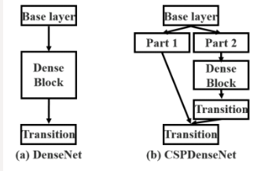
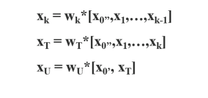

## CSPNet

> CPSNet: A new backbone that can enhance learning capability of cnn
>
> Cross Stage Partial Network(CSPNet)

출처

https://deep-learning-study.tistory.com/632

https://keyog.tistory.com/30

## 00_목표

- 무거운 inference computation의 감소
- 저자는 backbone의 무거운 inference computation이 optimization내에 있는 duplicate gradient information에 의해 발생한다고 결론지었다
- 신경망의 **처음과 끝의 feature map을 통합**하여 variability of gradients를 해결하려 한다.
  - base layer의 feature map을 두파트로 분할
  - **cross-stage hierarchy**로 결합
  - 이 과정을 통하여 **gradient information이 큰 상관관계 차이**를 갖게 되고 **CSPNet을 기존의 모델에 적용하여 연산량을 감소**시키고 정확도까지 상승시킵니다.

- 연산량, 신경망의 메모리 사용을 감소시키고 추론 속도와 정확도 까지 상승시키는 실험 결과

## 01_CSPNet

> 01_Cross Stage Partial Network
>
> 02_Exact Fusion Model 

#### 01_Cross Stage Partial Network

##### - DenseNet의 매커니즘

- 뒤에 있는 이전 layer들의 값이 연결되어 컨볼루션을 통해 가중치와 출력이 만들어지는 구조

##### - Backpropagation

- f : 가중치를 업데이트하는 함수
- w : forward의 가중치
- g : 미분을 통해 얻어지는 기울기
- DenseNet의 forward와 backward pass 과정 속에 **수 많은 gradient정보가 재사용**된다고 말함
  - 복사된 **gradient정보를** **반복적으로 학습할 뿐**이라고 말함

#####  - **Cross Stage Partial DenseNet**

- part1 : x0' | part2 : x0''
- xk : Dense block을 통과하여 나온 값
- xt : Transition layer를 통과한 값
- part1의  x0'와 part2에서 DenseBlock을 지나온 Xt가 만나 Xu가 출력된다.

- 역전파 단계 역시 반대로 이동하여 가중치의 업데이트가 이루어진다.

##### 특징

- DenseNet의 출력값 연결을 통한 **재사용을 유지**
- **gradient information이 많아지는 것을 방지**
- Backbone의 **특성을 그대로 유지** 시키면서 **성능 향상**
- 모든 backbone에 해당 아이디어를 적용시킬 수 있음

#### 02_Exact Fusion Model

> detection neck에 대한 이야기

