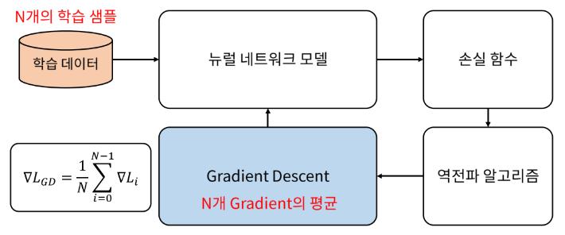
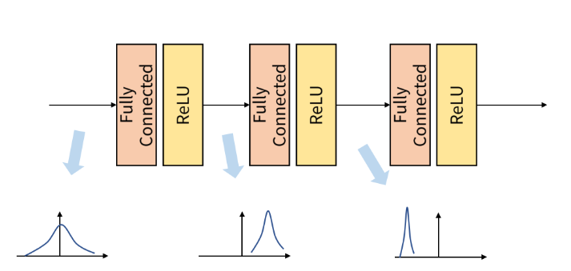
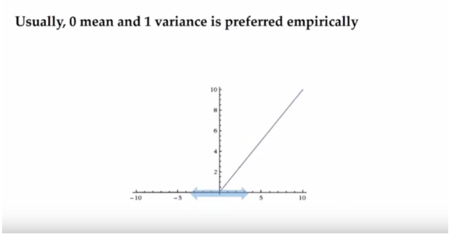
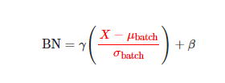
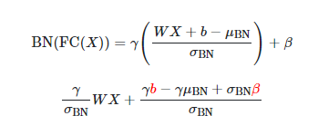
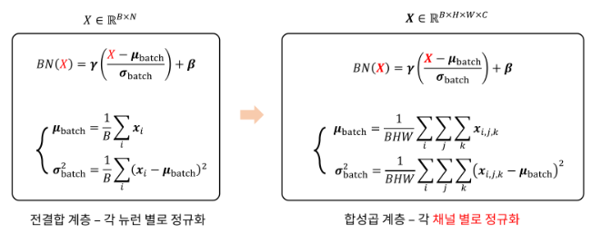

# Batch_Normalization

출처 : 

https://gaussian37.github.io/dl-concept-batchnorm/

https://www.youtube.com/watch?v=TDx8iZHwFtM&list=PLlMkM4tgfjnJhhd4wn5aj8fVTYJwIpWkS

https://www.youtube.com/watch?v=58fuWVu5DVU&t=2078s

## 1. Batch?

Batch : gradient를 구하는 단위

Epoch : 전체 데이터 한번을 도는 단위

- Gradient Descent에서 Gradient를 한번 업데이트 하기 위해선 모든 데이터를 사용
  - 학습 데이터 전부 넣음 => gradient를 모두 구함 => 모든 gradient를 평균을 구함 => 한번에 데이터를 업데이트 한다.

- 문제 : **대용량 데이터를 한번에 처리할 수 없음** => batch를 사용하는 이유

  

- SGD (stochastic gradient descent)
  - 한번 업데이트를 하기 위해 **batch size만큼의 일부 데이터**만 사용
- B :  batch size

## 2. Internal Covariant Shift?

- 계층별로 입력의 데이터 분포가 달라지는 현상
- 순서
  - 입력 feautre를 받음 
  - convolution이나 fully connected연산
  - activation function을 적용
- 이렇게 Batch단위별로 이러한 학습을 할 시 배치마다 분포의 차이가 발생할 수 있다. 
- 이를 해결하기 위해서 Batch Normalization 개념을 적용

## 3. Batch Normalization

#### 컨셉 

- Hidden layer에서의 변화량이 너무 크지 않으면 학습도 안정하게 될 것
- 즉 너무 크게 변화하는 것을 막아주는 것 => what??(뭘?)

- **변화하는 부분 : weight**
  - Batch normalization에서는 이 **weight의 변화량이 큰 것**을 막기 위한것
  - **Activation하기 전 값의 변화**를 줄이게 된다.
  - Batch 단위로 Normalization 진행 => scale(크기)을 줄임 => 변화를 줄임
    - scale : 그래프의 크기

#### 평균, 분산

- Scale의 평균 0
- 분산 : 1
- **표준 정규 분포**를 따르도록 설계
  - 크기 않은 variance를 주게 된다. => 분산 : 1

#### 공식

- mini-batch mean (평균)
  - sum(x) / batch-size

- mini-batch variance (분포)
  - (x값 - 평균)^2한것을 다 더함 / batch-size

- normalize
  - (x - 평균) / (루트( 분포 + 작은 값 ))

- scale and shift

  - normalize * 간마 + 베타

  - 간마 : scale

  - 베타 : shift 

  - **간마와 베타는 학습을 통해서** 계산이 되게 된다.

    

#### 데이터 플로우

- 간마와 베타가 학습되는 플로우
- 이런식으로 간마 베타 등의 데이터가 학습이 되게 된다.

#### ReLU 사용

- 문제 : Batch Norm은 ReLU 적용시 **음수에 해당하는 범위 반이 0**이 되어 버린다.
- 해결
  - 간마(sclae)와 베타(shift)를 이용하여 더 많은 영역을 0이 되지 않게 만든다.
  - **간마와 베타는 학습을 통해서** 계산이 되게 된다.

#### Batch Normalization의 효과

- learning rate를 감소와 weight initialization에 다소 자유로움

- Regularization Effect

  - 평균과 분산이 고정일 떄 학습하는 동안 고정된 값이 연산되기 때문에 특정 weight가 엄청 클 경우가 있다.

  - Batch Normalization에서 평균과 분산이 계속해서 변함으로써 weight의 업데이트에도 계속 영향을 주게 된다.=> 따라서 큰 방향으로만 학습되지 않는다.

## 4. Training과 Validation의 BatchNormlization

#### Training

#### Validation

- Training과 Validation의 차이
  - Training : 학습단계에서는 batch단위별로 Batch Normalization이 계속 변경해야함 
  - Validation: Validation에서는 계속해서 변경할 필요가 없음
                        추론 단계에서는 결정된 값을 고정으로 사용
                        학습 과정 속에서 평균과 분산을 **이동 평균 또는 지수 평균에 의하여 고정**
    - 이유 : 간마, 베티, 평균, 분산이 고정 => 연산량을 줄일 수 있음

## 5. Fully Connected Layer와 Batch Normalization

- 식을 대입해서 전개하게 되면 bias가 중복되는 현상을 볼 수 있다 (빨강색 글자)
- 따라서 bias를 사용하지 않는 방향으로 구현된다.
- Fully Connected Layer를 거친 후 Batch Normalization을 계산하는 것이 아니라 
  두 layer를 하나로 fusion 하여 사용할 수 있습니다.
  - 위 식을 사용하면 한번에 계산 가능

## 6. Convolution Layer와 Batch Normalization

- 왼쪽 : fully connected network / 오른쪽 : Convolution 
- convolution layer
  - 채널 별로 Normalization된다.
  -  즉, **Batch, Height, Width에 대해** `평균`과 `분산`을 구합니다.

## 7. batch Normalization의 한계

#### Batch의 크기가 너무 작을 경우 (batch를 많이 주었다는 뜻)

- GPU 메모리의 한계로 인해 RNN이나 크기가 큰 CNN에 적용하기가 어렵다
- Batch 사이즈가 1이 되면 평균은 샘플 1개의 값이 되고 표준 편차는 0이 되어 정상적인 작동이 안된다.
- 큰수의 법칙? 중심 극한 이론? 을 만족 하지 못함

#### Batch의 크기가 너무 클 경우

- multi modal 형태? 의 gaussian mixture 모델 형태? 가 나타날 수 있음
-  Batch 크기가 너무 크면 병렬 연산 하는 데에도 비효율적
- gradient를 계산하는 시점이 Batch 단위인데, gradient를 계산을 너무 한번에 하게 되어 학습에도 악영향이 있을 수 있음

이로 인하여 Weight Normalization, Layer Normalization 등이 사용되기도 함
