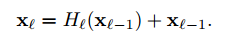
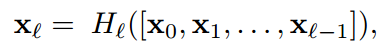
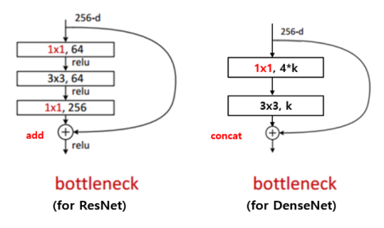
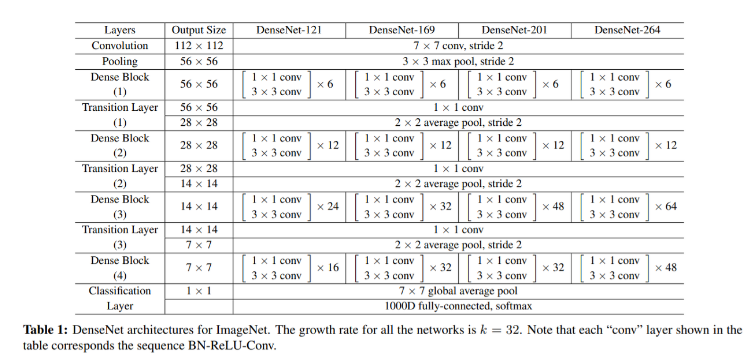
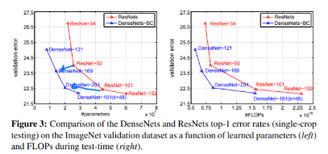

# DenseNet

> Densely Connected Convolutional Networks

출처

1. https://deep-learning-study.tistory.com/528#:~:text=DenseNet%EC%9D%80%20ResNet%EA%B3%BC%20Pre,%ED%94%BC%EC%B3%90%EB%A7%B5%EC%97%90%20%EC%97%B0%EA%B2%B0%ED%95%A9%EB%8B%88%EB%8B%A4.

2. https://csm-kr.tistory.com/10 , + 코드 존재
3. https://inhovation97.tistory.com/47


## 01_DenseNet?

>  DenseNet은 ResNet과 Pre-Activation ResNet보다 적은 파라미터 수로 더 높은 성능을 가진 모델입니다.

#### 특징

- **DensNet은 모든 레이어의 피쳐맵을 연결**
- **이전 레이어의 피쳐맵을 그 이후의 모든 레이어의 피쳐맵에 연결**
- ResNet과 다르게 덧셈이 아니라 concatenate(연결)을 수행
  - **피쳐맵 크기가 동일**해야한다.
- 레이어의 피쳐맵 **채널 수는 굉장히 작은 값**을 사용


- vanishing-gradient 문제를 완화 할 수 있다.
- feature propagation을 강화 할 수 있다.
- feature 의 재사용을 할 수 있다.
- parameter 의 수를 줄일 수 있다. 


## 02_**connectivity**

> ResNet과 DenseNet의 비교


#### - 1. ResNet

- H( ) : conv, bn, relu함수의 연산
- xl-1 : skip connection에 의한 덧셈 
  - 입력값이 출력값에 더해져 gradient flow가 직접적으로 전달
  - 하지만 **덧셈으로 결합되기 때문에 신경망에서 information flow이 지연**될 수 있다고 함



#### - 2. DenseNet

-  DenseNet은 **이전 레이어를 모은 다음 레이어에 직접적으로 연결**
  - **따라서 정보 흐름(information flow)가 향상**
- **x0,...,xl−1x0,...,xl−1가 결합** => **H( ) 연산**을 수행



- **concatenate** => 행렬에서 세로로 연결 시켜주는 것
- h layer를 거칠때마다 이전에 입력값이었던 output feature map들을 계속 concat하여 입력해주는 것입니다.
- 이때 각 dense block에서 몇 개의 feature map을 뽑을지 결정하는 하이퍼 파라미터
  ==> **Growth rate**

- **원래는 깊이가 깊어질수록 conv block 한 번에 상당히 많은 개수의 feature map을 뽑지만**, 논문에서는 이번 실험에 **block 마다 k = 12개로 설정하여 아주 효율적인 구조**라고 설명합니다. 


#### -3. 차이

- **resnet** 은 output, Input feature channel 이 같다는 것이고, 

- **densenet**은 **output feature의 channel이 더 커진다**는 것 입니다. 
  - 이를 위해서 densenet은 한 layer의 **output의 channel크기를 제한**한다.
    => **"Growth rate"**


## 03_Dense Block

#### -1 . Dense Block을 사용하는 이유

```
1. 연결(concatenation) 연산을 수행하기 위해서는 피쳐맵의 크기가 동일
2. But 피쳐맵 크기를 감소시키는 pooling 연산은 conv net의 필수적인 요소
```

- **위 두가지를 동시에 만족시키기 위해** Dense Block개념이 도입


#### -2.  transition layer

- **Dense Block 사이에 pooling 연산을 수행**

- **pooling 연산** :  **BN, ReLU,1x1conv, 2x2 avg_pool**로 수행
- **Compression** : 
  - pooling layer(Transition layer)의 1x1 Convolution layer 에서 channel 을 줄여주는 비율을 말합니다. 위 코드에서 0.5 가 적용된것을 볼 수 있습니다. (256 -> 128)

```python
BN(ReLU)-Conv(1x1)-AvgPool(2x2)

nn.Sequential(nn.BatchNorm2d(256),
              nn.ReLU(inplace=True),
              nn.Conv2d(256, 128, 1, bias=False),
              nn.AvgPool2d(kernel_size=2, stride=2)
              )
```

-  2x2 avg_pool
  - 하이퍼 파라미터 0 < θ ≤ 1가 존재
  - θ 는 dense block에서 featrue map m개를 입력받았다면, transition layer가 출력하는 feature map 개수를 조정하는 인자로서 m*θ 로 출력 channel을 맞추어 줍니다.
  - 논문에서는 0.5로 두어 실험을 진행


#### -3. Growth rate

- concat 을 하기위해서 각 layer 에서의 output 이 똑같은 channel 수로 만들어주는게 좋습니다
-  output 의 channel 수를 Growth rate라고 한다.
- hyper parameter 로 Imagenet training 을 위한 Growth rate = 32 
- 참고로 densenet의 parameter 를 줄이는 역할을 하는데, output 의 channel을 작게(12, 32..)줄이기 때문에 output 을 만드는 conv 의 weight 를 줄이게 됩니다. 


#### -4. Bottleneck layers



## 04_DenseNet Architecture


#### Architectures

- growth rate = 8
- Dense Block 3개
- dense block은 각각 {32x32}, {16x16}, {8x8}사이즈의 feature map을 출력
- Global avg Pooling뒤 classifier
- {L=40, k=12}, {L=100, k=12}, {L=100, k=24}, {L=250, k=24}, {L=190, k=40}의 여러 아키텍쳐로 실험을 진행


#### imageNet을 위한 Architectures

- 스케일이 크기 때문이다
- Growth rate = 32 사용


**ex_Densenet-121**

- dense block 마다 conv block이 2개씩
  -  파라미터 layer 수를 세보면, 2*(6+12+24+16) = 116 layer입니다.
-  가장 상단의 7x7 Conv layer 1개, 
- transition layer의 1x1 conv layer 3개, 
- 최하단 1000D fc layer 1개
- **(116 + 1 + 3 + 1)layer = 121layer architecture**




#### Result




## ResNet과 DenseNet

DenseNet은 원본값과 변경되 값을 그대로 합(add X, concat O)해서 계산을 진행한다.

하지만 ResNet은 add를 함으로써 진행된다. 즉 정보를 change한뒤 다음 layer전해준다.

- **information flow가 매우 잘되는 것**
- **gradient flow도 원만하게 해줌**
  - 입력값을 뿌려주는 저 connection 하나하나가 사실 gradient의 flow
  - 수록 초반부까지 gradient가 흘러가기가 무척 힘들텐데 최상단의 입려값이 최하단의 입력값에도 존재하니 gradient flow가 매우 좋은 겁니다.  (이해필요)

- 정보와 기울기가 잘 보존될 정도로 효율적이니 **computational cost도 적은 것**


https://inhovation97.tistory.com/47 님의 생각 / 하지만 뭔가 그럴 수도 있겠다 싶어서 캡쳐함

