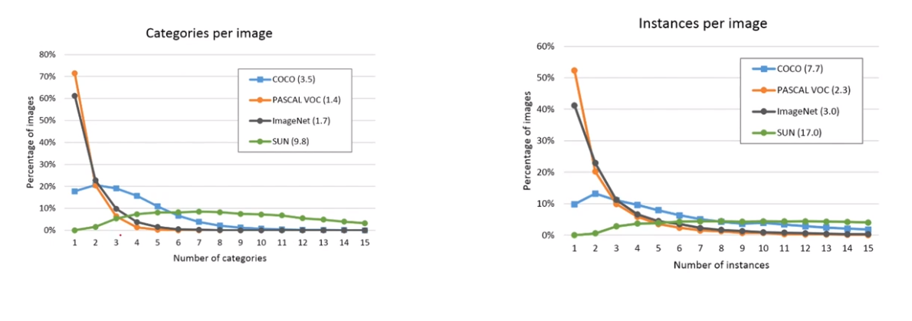
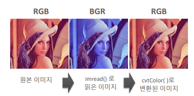
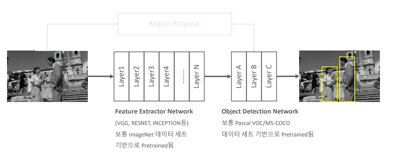
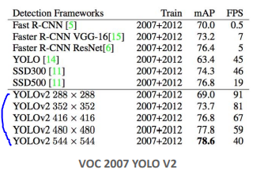

# 02_Dataset_of_OpenCV


## 1. 주요 데이터 셋 이해

##### 주요 데이터 셋

PASCAL VOC : 20개 카테고리 (XML Format) / 평이하다!

MS COCO : 80개 (json Format) / 이미지가 다양함 / 엄격

Google Open Images : 600개 (csv Format) / 


### PASCAL VOC

보통 PASCAL VOC 2012를 사용

##### Annotation이란?

- 박스를 쳐서 주는게 아님
- 그냥 좌표값,이름, 등등을 넣어서 준다는 뜻임


##### 구조


- 이렇게 여래개의 object들의 정보가 하나의 이미지 안에 담겨져 있다

## Element Tree

#### Element Tree란?

- 파징을 쉽게하기 위한 도구 => XML 데이터를 쉽게 분석하기 위한 구조로 바꿔주는 도구이다
- parsing??
  - analyze (a sentence) into its parts and describe their syntactic roles.

```python
# !pip install lxml
import os
import xml.etree.ElementTree as ET

# 비행기 이미지
xml_file = os.path.join(ANNO_DIR, '2007_000032.xml')

# XML 파일을 Parsing 위한 Element 생성
# 이렇게 하면 트리가 만들어짐
tree = ET.parse(xml_file)

# annotation을 root로 잡는다는 소리
root = tree.getroot()

# image 관련 정보는 root의 자식으로 존재
# 자식 노드중에 filename 찾겠다는 소리
image_name = root.find('filename').text

# 자식노드
full_image_name = os.path.join(IMAGE_DIR, image_name)
image_size = root.find('size')
image_width = int(image_size.find('width').text)
image_height = int(image_size.find('height').text)

# 파일내에 있는 모든 object Element를 찾음.
objects_list = []

# 모든 object 찾고 ==> loop돌림
# 핵심 .find('----').text
for obj in root.findall('object'):
    # object element의 자식 element에서 bndbox를 찾음. 
    xmlbox = obj.find('bndbox')
    # bndbox element의 자식 element에서 xmin,ymin,xmax,ymax를 찾고 이의 값(text)를 추출 
    x1 = int(xmlbox.find('xmin').text)
    y1 = int(xmlbox.find('ymin').text)
    x2 = int(xmlbox.find('xmax').text)
    y2 = int(xmlbox.find('ymax').text)
    
    bndbox_pos = (x1, y1, x2, y2)
    class_name=obj.find('name').text
    object_dict={'class_name': class_name, 'bndbox_pos':bndbox_pos}
    objects_list.append(object_dict)

print('full_image_name:', full_image_name,'\n', 'image_size:', (image_width, image_height))

for object in objects_list:
    print(object)
    
    
# 결과 값
--------------------------------------------------------------------------------------
<xml.etree.ElementTree.ElementTree object at 0x7f179099ded0>
<Element 'annotation' at 0x7f17909efad0>
full_image_name: /content/data/VOCdevkit/VOC2012/JPEGImages/2007_000032.jpg 
 image_size: (500, 281)
{'class_name': 'aeroplane', 'bndbox_pos': (104, 78, 375, 183)}
{'class_name': 'aeroplane', 'bndbox_pos': (133, 88, 197, 123)}
{'class_name': 'person', 'bndbox_pos': (195, 180, 213, 229)}
{'class_name': 'person', 'bndbox_pos': (26, 189, 44, 238)}
```


## 박스 치기

```python
import cv2
import os
import xml.etree.ElementTree as ET

xml_file = os.path.join(ANNO_DIR, '2007_000032.xml')

tree = ET.parse(xml_file)
root = tree.getroot()

image_name = root.find('filename').text
full_image_name = os.path.join(IMAGE_DIR, image_name)

# 불러옴
img = cv2.imread(full_image_name)

# opencv의 rectangle()는 인자로 들어온 이미지 배열에 그대로 사각형을 그려주므로 별도의 이미지 배열에 그림 작업 수행. 
draw_img = img.copy()


# OpenCV는 RGB가 아니라 BGR이므로 빨간색은 (0, 0, 255) 255배열이라서 255를 넣은 것인가?
green_color=(0, 255, 0)
red_color=(0, 0, 255)

# 파일내에 있는 모든 object Element를 찾음.
objects_list = []
for obj in root.findall('object'):
    xmlbox = obj.find('bndbox')
    
    left = int(xmlbox.find('xmin').text)
    top = int(xmlbox.find('ymin').text)
    right = int(xmlbox.find('xmax').text)
    bottom = int(xmlbox.find('ymax').text)
    
    class_name=obj.find('name').text
    
    # 추가된 부분
    # draw_img 배열의 좌상단 우하단 좌표에 녹색으로 box 표시
    # + rectanble 함수
    # + 사진, 위치, 색, 두께
    cv2.rectangle(draw_img, (left, top), (right, bottom), color=green_color, thickness=1)
    
    # draw_img 배열의 좌상단 좌표에 빨간색으로 클래스명 표시
    # + 이름 넣기 ==> cv2.putText
    cv2.putText(draw_img, class_name, (left, top - 5), 
                cv2.FONT_HERSHEY_SIMPLEX, 0.4, red_color, thickness=1)


img_rgb = cv2.cvtColor(draw_img, cv2.COLOR_BGR2RGB)
plt.figure(figsize=(10, 10))
plt.imshow(img_rgb)
```


### MS-coco Dataset소개

##### 특징

- 80개 object category
- 300k 이미지, 1.5M object
- id가 빈경우가 있음

- bounding box
  - 우, 상, w, h 로 표시된다
  - float로 표현되어 있음  ==> 바꿔줘야함




- 왼쪽
  - 이미지 하나당 카테고리의 수
  - ex) 이미지 하나에 사람
- 오른쪽
  - 이미지 하나당 instance의 수
  - ex) 이미지 하나당 물체 수

PASCAL은 너무 쉽다! => 실제로 쓸 수없음 ==> MS COCO가 나옴


## Open CV개요

PIL : 처리 성능이 상대적으로 느림

Scikit Image : 사이파이 기반

OpenCV : C++기반이나 python도 지원


#### 주의할 점



##### imread()

- 이미지가 RGB형태가 아닌 ==> BGR형태로 로딩 ==> 즉 원본이미지와 다르게 나타난다

- 따라서 다시 변환시켜줘야함

  - ```python
    cv2.cvtColor( 이미지, cv2.COLOR_BGR2RGB) # bgr to rgb
    ```


##### imwrite()

- 다시 저장할땐 RGB로 바꿈

  

##### OpenCV Windows Frame interface

- OpenCV는 Windows 하고 바로 인터페이스를 한다

```python
cv2.imshow() # 윈도우 프레임에 보여줌

cv2.waitKey() # 키보드 입력이 있을 때까지 무한 대기
 
cv2.destroyAllWindows() # 화면의 윈도우 프레임 모두 종료

# 하지만 쥬피터에서 실습할때는 리눅스 x윈도우가 없기 때문에 쓸 수 없음
```


### 코드

```python
import cv2

# bgr ==> 읽어옴
cv2_image = cv2.imread('/content/data/beatles01.jpg')

# rgb로 저장함
cv2.imwrite('/content/data/beatles02_cv.jpg', cv2_image)

```


- 순서

```python
# imread 함
# cv2.cvtColor => 컬러 변환 함수 사용 cv2.COLOR_BGR2RGB
# 그리고 RGB라고 생각하고 영상처리를 하게 된다.
cv2_image = cv2.imread('/content/data/beatles01.jpg')
draw_image = cv2.cvtColor(cv2_image, cv2.COLOR_BGR2RGB)

# 그럼 저장할땐?? 그냥 저장하면 되나?
```


## open CV 영상처리 개요

- 비디오에 object detection을 어떻게 할지


##### VideoCapture

- `` cap = cv2.VideoCapture(video_input_path)``
- 영상 Frame 너비
  - cap.get(cv2.CAP_PROP_FRAME_WIDTH)
- 영상 Frame 너비
  - cap.get(cv2.CAP_PROP_FRAME_HEIGHT)
- 영상 FPS (1초에 프레임을 몇개??) ==> 많을수록 스무스하고 깨끗하게
  - cap.get(cv2.CAP_PROP_FPS)

```python
cv2.VideoWriter(output) # formatting


cap.read() #읽음
```


##### VideoWrite

- 까다로운 부분
  - VideoWrite는 wirte시 특정 포맷으로 동영상을 Encoding 할 수 있음


### Object Detection네트워크



##### 전체 흐름

- Region Proposal

  - Object가 있을만한 위치

  

- Feature Extractor Network

  - 이미지 classification

  - feature map 사이즈가 점점 작아질 수록 추상화 된다. ==> 핵심 특징을 가지게 된다. (1)

  - 주요 feature들을 뽑아내는 것 까지를 말한다

    

- Object Detection Network

  - class and bounding box를 제공하는 것
  - 별도의 네트워크로 되어 있음
  - Bounding box regression에 대해서 어떻게 할 것인지?
  - 스케일을 어떻게 맞출 것인지? 등등


(1) layer가 깊어질수록

When stacked on top of each other, convolutional layers can detect a hierarchy of visual patterns. For instance, the lower layers will produce feature maps for vertical and horizontal edges, corners, and other simple patterns. The next layers can detect more complex patterns such as grids and circles. As you move deeper into the network, the layers will detect complicated objects such as cars, houses, trees, and people.


### image Resolution / FPS / Detection성능 상관관계



- 높음 image Resolution => Detection성능 높아짐 ==> FPS (판단하는 속도) 작아짐 (배열크기가 큼)
- FPS 가 빨라야 하는 상황 ==>  Detection성능 낮아짐


### 코드


- 비디오 불러오기

```python
import cv2

# 다운로드 받은 path
video_input_path = '/content/data/Night_Day_Chase.mp4'


# linux에서 video output의 확장자는 반드시 avi 로 설정 필요.ok
video_output_path = '/content/data/Night_Day_Chase_out.mp4'

# 중요
# 캡쳐하는 부분
cap = cv2.VideoCapture(video_input_path)

# Codec은 *'XVID'로 설정. ?? ==> XVID 인코딩하는 것인데 왜 XVID?
# 코덱: 인코딩하는 프로그램
codec = cv2.VideoWriter_fourcc(*'XVID')

# cap을 이용해서 다양한 속성을 가져 올 수 있다고 했음 ( 비디오 사이즈 (너비, 높이), fps) (영상 => 가로, 세로)
vid_size = (round(cap.get(cv2.CAP_PROP_FRAME_WIDTH)),round(cap.get(cv2.CAP_PROP_FRAME_HEIGHT))) #(200, 400)
vid_fps = cap.get(cv2.CAP_PROP_FPS )


# writer정해줌
vid_writer = cv2.VideoWriter(video_output_path, codec, vid_fps, vid_size) 

# 총 프래임
frame_cnt = int(cap.get(cv2.CAP_PROP_FRAME_COUNT))


print('총 Frame 갯수:', frame_cnt, 'FPS:', round(vid_fps), 'Frame 크기:', vid_size)


#CAP_PROP_FRAME_WIDTH: 프레임 폭
#CAP_PROP_FRAME_HEIGHT: 프레임 높이
#CAP_PROP_FRAME_COUNT: 프레임 갯수 세기
#CAP_PROP_FPS: 초당 프레임의 수
#CAP_PROP_ZOOM: 카메라 줌
#각 항목들을 확인할 때는 get, 변경할 때는 set을 통해 할 수 있습니다.
#ap.get(cv2.CAP_PROP_FRAME_WIDTH): 프레임의 폭을 반환합니다.
#cap.set(cv2.CAP_PROP_FRAME_WIDTH, 320): 프레임의 폭을 320으로 변경합니다.
```


- 박스 그리기
  - 위에 트리 만들어서 하는 것과 비슷함

```python
import time

green_color=(0, 255, 0)
red_color=(0, 0, 255)

start = time.time()
index=0
while True:

    # cap.read ==> 읽어오겠다
    #  프레임 존재 여부, 프레임
    hasFrame, img_frame = cap.read()


    # 프레임 없으면 break = 동영상이 끝나
    if not hasFrame:
        print('더 이상 처리할 frame이 없습니다.')
        break


    index += 1
    print('frame :', index, '처리 완료')
    
    # 네모
    # 사진, 크기, 색깔, 두께
    cv2.rectangle(img_frame, (300, 100, 800, 400), color=green_color, thickness=2)
    caption = "frame:{}".format(index)
    
    # 설명
    cv2.putText(img_frame, caption, (300, 95), cv2.FONT_HERSHEY_SIMPLEX, 0.7, red_color, 1)
    
    vid_writer.write(img_frame)

print('write 완료 시간:', round(time.time()-start,4))
vid_writer.release()
cap.release()  
```


