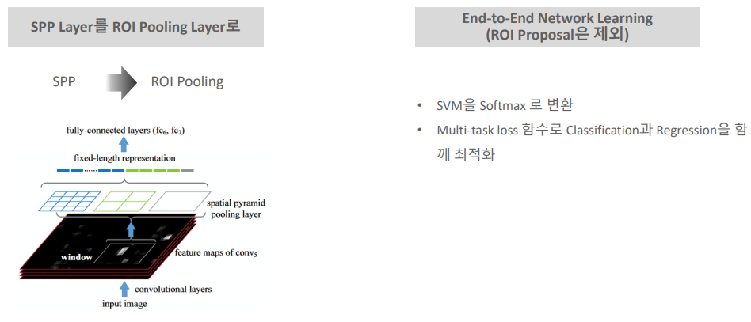
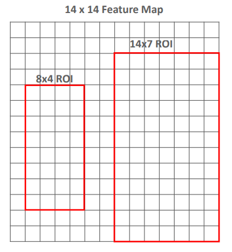
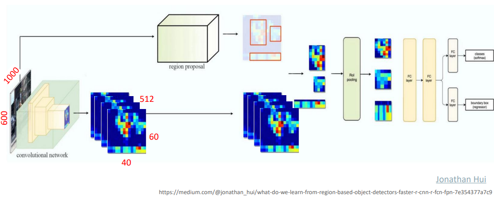
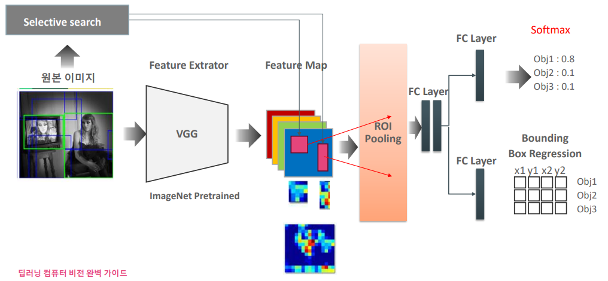

# 05_Fast_RCNN

### SPP-Net과 비교

- SPP와 비슷한 작업을 하게 된다 ===> Rol pooling
- SVM을 사용하지 않고 softmax를 사용하였다.
- Loss함수를 Classification과 Regression을 함께 더해서 만들게 된다.
  - 이 부분이 네트워크 안으로 들어왔기 때문에 가능하다

## Rol Pooling

- Feature Map 상의 임의의 RoI를 고정 크기의 Pooling 영역으로 매핑
- 매핑시 Max Pooling사용
  - ex) 
    - 4분면으로 나누고 max Pooling시킴
    - 그럼 2x2 feature map이 나오게 된다.

- 일반적으로 Pool사이즈는 7x7을 사용하게 된다.
  - 7x7로 딱 떨어지게끔 만들어주면 된다.
  - 오른쪽
    - 2x1로 하나씩 자르면 ==> 7x7을 만들 수 있다.
    - max pooling
  - 왼쪽
    - 정수형으로 떨러지지 않는다
    - 값자체를 늘려서 mapping을 시키게 된다.
    - 이미지를 키울때 사용하는 방법과 유사하게 적용시킨다.
    - 이미지를 늘리는 로직은 RoI 별도 로직이 존재한다.

## Fast RCNN 구조

- SS에서 나온 값들을 Feature map에 mapping을 하게 된다.
  - 이것이 Feature map에 원본이미지 사이즈 대비로 간것이다.
  - 왜? Feature map의 사이즈가 원본대비 작아졌을 것이기 때문이다
    ( padding을 사용했다 하더라도 pooling 과정에서 사이즈가 줄어든다)

- 이제 ROI Pooling에 7x7로 어떻게든 꾸겨 넣게된다.
- Feature map의 개수가 256개라면 ROI Pooling도 256개가 있는 것이다. 
  - (2000, 7, 7, 256)  = 2000개 이미지, 7, 7 짜리로, 256(채널, 깊이)개 있다
- SPP와 다른점:   
  - ROI Pooling은 사이즈만 동일하게 만들고 depth는 똑같이 가져가게 된다.

##  Multi-task loss

- Clsssification Loss와 Regression Loss을 합칠 수 있게 됨
  - 이 이야기는 즉 Backpropagation을 전체 과정에 적용시킬 수 있다는 뜻이다. 
- smooth L1 Loss ==> 예측값과 실제값 차이를 절대값으로 한다는 뜻이다. 
  - 1보다 작을때 ==> 제곱  ==> Loss를 조금더 급격하게 줄여준다는 뜻
  - 1보다 클 때 ==> |x| - 0.5

## 성능

- 이전 모델들 보다 Training time이 줄어듦
- 이전 모델들 보다 Test timedl 줄어듬