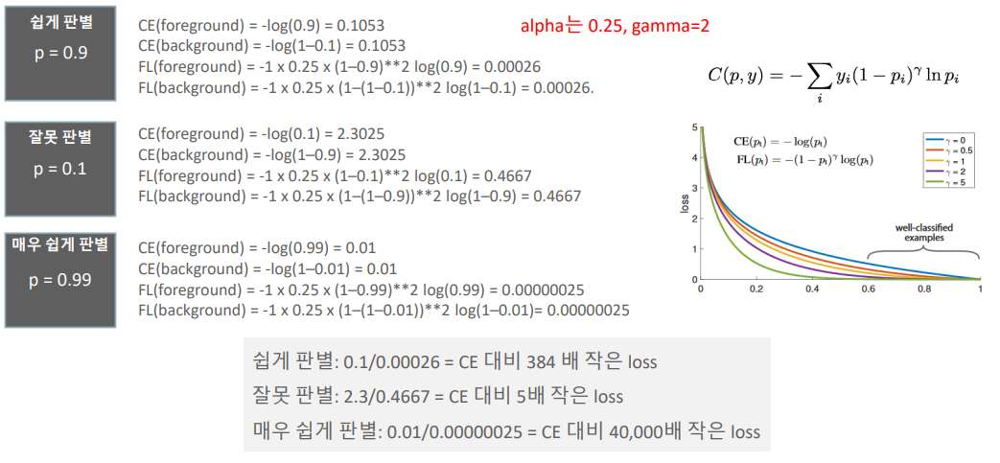
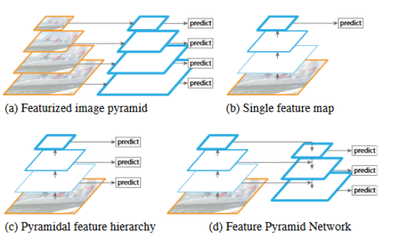
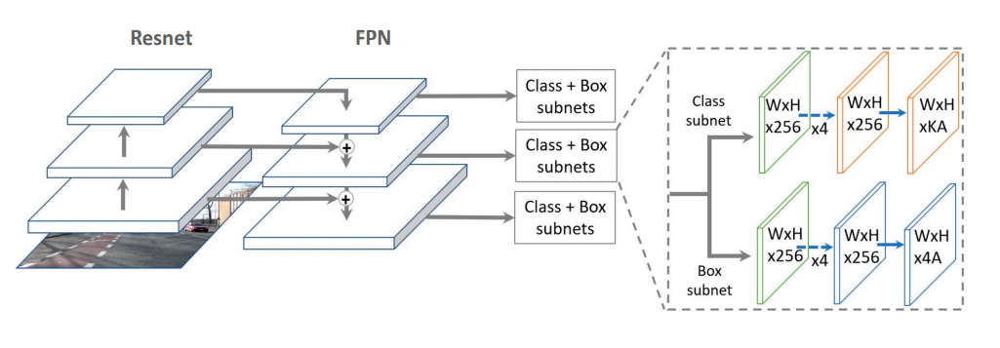

# 13_RetinaNet

- facebook
- 성능 저하 문제가 있었음
- YOLO나 SSD보다 느림 그러나 Faster RCNN보다 빠름
- Focal Loss + Feature Pyramid Network

## Focal Loss

#### Cross Entropy의 변형

### Object Detection의 Class imbalance이슈

#### Class imbalance란?

https://techblog-history-younghunjo1.tistory.com/74

- 어떤 데이터에서 각 클래스가 갖고 있는 데이터의 양의 차이가 큰 경우
  - 왜 균형이 필요한가?
  - 소수의 의견에 귀를 기울이기 위해서

**2가지 방법**

1. **Weight balancing**
   - Train 데이터에서 각 loss를 계산할 때 **특정 클래스에 대해서는 더 큰 loss를 계산해주는 것**
   - 클래스의 비율에 대해 가중치를 두는 방법
     - 두 개의 클래스 비율 ==> 1:9 이면  가중치를 9:1로 해줌으로써 전체 클래스의 loss에 비슷하게 기여하도록 하는 것
   - Focal loss

2. **Oversampling & Undersampling**

   

**Under sampling**

- 양을 줄여버린 파란색 데이터들은 양이 많았던 원본 파란색 데이터의 대표성을 잘 지니고 있어야 하는 것이 중요

**Oversampling**

- 주황색 데이터의 양을 늘려줄 때 원본 주황색 데이터를 **복사하는 개념**이기 때문에 **양이 늘어난 주황색 데이터는 양이 적었던 주황색 원본 데이터의 성질과 동일**

#### Class imbalance란? (deep learning에서)

- 대부분의 영역이 background가 차지 하고 있음
- 1stage 경우 anchor box를 사용 ==> 힌트 x ==> 다 쏴줘야함 ==> 즉 anchor box가 굉장히 많음
  - 대부분의 굉장히 많은 anchor들이 background에 치중 되게 된다.

- 상대적으로 매우 적은 foreground(Positive) example들 = 매우 유용한 정보

#### 문제점

Easy Example  :  찾기 쉬운 대상들 => background나 크고 선명한 object

Hard Example : 찾기 어려운 대상들 , 작고 불분명한 object

- ##### 2 stage같은 경우 

  - : RPN에서 object가 있을만한 곳을 높은 확률 순으로 필터링을 먼저 수행할 수 있음
  - 300개만 보내~ 이런것이 가능 => 이렇게 하더라도 성능에 영향을 많이 끼치지 않음

- ##### 1 stage : 

  - Region Proposal과 Detection을 같이 수행함
  - 매우 많은 object 후보들에 대해서 Detection을 수행해야 한다.
  - class imbalance로 인한 성능 저하 영향이 큼

##### Cross entropy의 문제점

- 실제 값과 예측 값의 차이를 줄이기 위한 엔트로피

- easy example의 loss가 작아도 수가 너무 많기 때문에  합치면 hard example보다 Loss가 더 크게 된다
- 불확실한 object들을 개선하는 방향성으로 학습 X
- 이미 높은 예측 확률을 가진 easy example (배경, 확실한 object)들에 대해서 더 정확한 예측을 하기 위해 학습이 진행된다.

##### 해결방안

- 동적으로 Cross entropy를 조절할 방법을 찾자
- Cross entropy의 가중치를 부여하는 것이다.

Ex)

- 예측값 : 0.99 => 즉 굉장히 확실하다 라는 의미
- 그럼 1 - 0.99 = 0.01 ==> 그리고 감마승을 해준다 ==>  값이 굉장히 줄어들게 된다.
- 원래 가지고 있던 cross entropy값에 곱해지게 된다.
- 즉 확실하면 loss값을 그냥 더 줄여준다 ==> 이렇게 하면 많은 값들(background)가 모여도 전체 loss값이 작게 유지하기 때문에 이쪽에 신경을 덜 쓰게 된다. ==> 그럼 hard example의 loss값이 더 클 것이기 때문에 hard example의 loss값을 줄이는 방향으로 학습을 할 것이다.
- 예측하기 쉬운 example에는 0에 가까운 loss를 부여하고, 예측하기 어려운 negative example에는 기존보다 높은 loss를 부여합니다. 

##### Focal loss와 Cross Entropy의 loss값 비교

일반적으로

- gamma  =2
- alpha값 = 0.25

## FPN

##### Feature Pyramid Network

- 이미지를 줄이는 방식 = computing 시간, detecting시간이 너무 오래걸림 => 사용하지 않음
- feature map을 이용해서 predict하는 방식이 일반적
  - 너무 최상위 => 위치적인 특성을 잃어버림 ==> 정확도 떨어짐
- 따라서 각 level에 있는 feature들을 뽑아내서 합침

- 3x3 conv로 끄집어 낸다
- 각 개별 포인트마다 9개의 anchor 박스를 가지고 있음 (anchor 박스 기반)
- 

3x3conv를 추가적으로 하는 이유??

- 두개를 합치면 혼돈되어서 자신만에 특징을 잃어버리는 문제가 발생함(aliasing effect)
- 그것을 희석하기 위해서 3x3을 해줌

#### anchor box

- 9개의 anchor box가 P2 ~ P5의 개별 Layer의 개별 포인트에 다 찍여 있음
- 3개의 서로 다른 크기와 3개의 서로 다른 스케일을 가짐. 
  - aspect ratio={1:2, 1:1, 2:1}, size={2의 0승 ,2 1/3승,2의 2/3승}을 사용하여 총 9개의 anchor를 할당합니다. 
- 약 100K 의 anchor box들 
  - anchor를 기반으로 prediction하게 되는 것
  - anchor 박스가 많을 수 있는 이유는 imbalance문제에서 background부분을 조절 했기 때문에 anchor box를 많이 만들어도 된다.
- 개별 anchor box는 Classification을 위한 K개의 클래스 확률값과 Bounding box regression을 위한 4개 좌표 값을 가짐. (똑같음)

