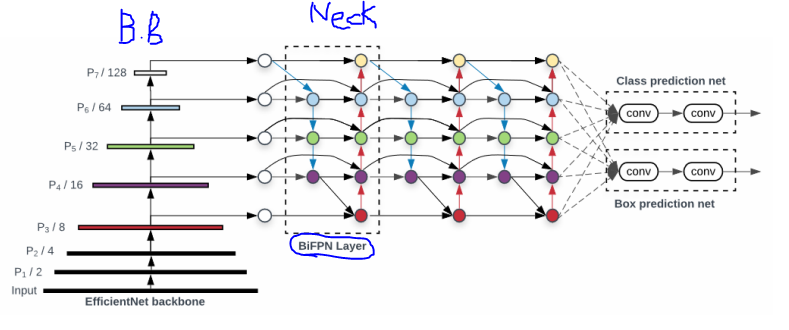
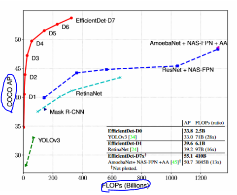
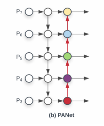
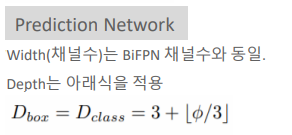
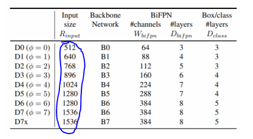

# 14_EfficientDet

- width, resolution은 2배가 되면 FLOPS는 4배가 된다. ==> 그래서 제곱을 곱함 ??

- EfficientDet Compound Scaling에서 cost란??

- depth에서 7788 으로 고정 => 왜?

- SILU

- scale jittering

- soft NMS

  

- Scalable and Efficient Object Detection

- back bone : Efficient Net을 사용
- BiFPN Layer : FPN을 진화시킴

##### 주요 기법

- BiFPN
- Compound Scaling

- 적은 연산 수, 적은 파라미터 수
- 높은 AP

### BiFPN  (Bi-directional FPN)

두가지 중요 요소

- Cross Scale Connection
- Weight Feature Fusion

#### Cross Scale Connection

##### PANet

- 내려오면서 합친 것을 다시 올린다. 

  - 낮은 level에 있던 추상화도 높은 level의 추상화에 합쳐보자

    

##### NAS-FPN 

- Nas search(강화학습)를 이용해서 구한 모델
- 하지만 왜 이런 구조를 띄는지 설명이 불가하다 (explainable하지 않다)

##### BiFPN

- 첫번째와 마지막이 존재하지 않음
  - 이유
    - 사실상 첫번째와 마지막은 합쳐지는 것이 아니라 그냥 있는 것임
    - 있을 필요가 없다고 판단하고 제거
    - 따라서 p7에서 바로 밑으로 내려가서 합치게 된다.
- 원본 feature map에서 fusion을 하면 어떨까??
  - 마지막 부분에서 input이 3개가 된다.

#### Weighted Feature Fusion

**idea**

- 서로 다른 resolution(feature map size)를 가지는 input feature map들은 Output feature map을 생성하는 기여도가 다를 것
  - p7과 p6가 서로 가른 기여도를 가지고 있을 듯? ==> weight다르게 주는게 맞다 아님??
- 따라서 다른 가중치를 부여하여 합쳐질 수 있어야 함

특징

1. 가중치 값은 정해진 것이 아님 ==> 학습시켜서 도출된 것임
   - 일정한 계수만 곱하면 된다 하지만 그 계수를 학습함
2. Fast normalized fusion
   - softmax로 0~1사이 값 만들기 ==>
     -  시간이 너무 오래 걸림 그래서 다르게 normalizing시킴
     -  미분이 너무 오래걸려서
   - 입실론 : 분모가 0이 되는 것을 막기위한 작은 값
   - 모든 가중치 값으로 나눔
   - 이것을 하는이유 : 가중치값이 너무 커질 수 있기 때문에 

- 성능 향상
  - parameters 가 줄어든 이유 : Separable Convolution을 적용했기 때문
  - Separable Convolution?????

### EfficientNet 개요

- back bone

- 이미지(Resolution), 필터 수 (Width), 네트웨크 깊이(Depth)
  - 이것들을 따로따로 최적화를 한다면 최적의 모델을 구축할 수 없겠다
  - 그래서 좋은 조합을 찾아야한다.
  - Compound Scaling

- 각각의 최적화된 포인트

#### 개별 Scaling ==> 성능 비교

- 모든 요소가 일정 구간 이상으로는 더이상 많이 늘어나지 않는다

#### 최적 Scaling 도출 기반 식

- 최초의 승수는 1로 고정 => grid search 기반으로 a,b,r값을 찾아낸다
  - EfficientNetB0 :  a=1.2, b=1.1, r=1.15가 나옴
- a,b,r을 고정하고 승수를 증가시켜가면서 Scale up 구성 
  - 이렇게 하면 함께 증가하고 함께 감소하게 된다. => 따로따로가 아님
- 알파 * 베터 제곱 * 감마 제곱 == 2로 고정
  - width(필터 수), resolution(이미지)은 2배가 되면 FLOPS는 4배가 된다. ==> 그래서 제곱을 곱함
  - 사진을 생각하면서 넓이이기 때문에 4배가 늘어남

- 각각 필요한 경우에 따라 b0 ~ b7을 선택

### EfficientDet Compound Scaling

##### 성능을 높이는 방법 (net)

- 거대한 Back bone
- 여러겹의 복잡한 FPN
- 큰 입력 이미지의 크기
  - 이유: 이미지를 키우면 작은 object들도(커지기 때문에) 잘 캐치할 수 있다

==> 하지만 이런 개별적인 부분들에 집중하는 것은 **비효율적**이다.

EfficientDet 에서도 Backbone, BiFPN, Prediction layer, 입력이미지 크기를 Scaling 기반으로 최적결합

#### backbone network

- EfficientNet B0~B6로 Scaling 그대로 적용

#### BiFPN network

##### depth

- Depth는 기본적으로 layer의 개수를 의미

- Depth는 BiFPN 기본 반복 block을 3개로 설정하고 Scaling 적용 (3개 layer)

- 기본으로 repeatition을 3번을 반복한다는 뜻
- d6부터는 8로 고정???

##### width

- 채널수

##### Box/class layer

##### 입력이미지 크기

##### 기타 요소(SILU?, scale jittering? , soft NMS?)

- activation : SILU(Sigmoid Linear Unit)
  - 
  - 
  - 
  - 논문에 따르면 2차원에서 확인했을 때, linear 또는 ReLU보다 훨씬 부드러운 형태를 가집니다.
  - 

- loss : Focal Loss

  

- Augmentation: horizontal flip, scale jittering

  - Standard Scale Jittering (SSJ) **resizes and crops(잘라내기) an image with a resize range of 0.8 to 1.25 of the original image size**. 

  - The resize range in Large Scale Jittering (LSJ) is from 0.1 to 2.0 of the original image size.

  - If images are made smaller than their original size, then the images are padded with gray pixel values.

    

- NMS : soft NMS

  - hard NMS : bbox가 있으면 이 중에서 가장 크게 겹치는 것 빼고 나머지를 다 제거
  - soft NMS : 
    - 만약 object 주변에 여러 object들이 겹쳐있다면??
    - hard NMS에서는 다 지워버리게 된다.

##### 성능평가

Efficient Det의 약점

- small object를 잡기 위해서 여러기법을 사용
- 근데 작은 object에 대해서 성능이 잘안나옴 ㅋㅋ
