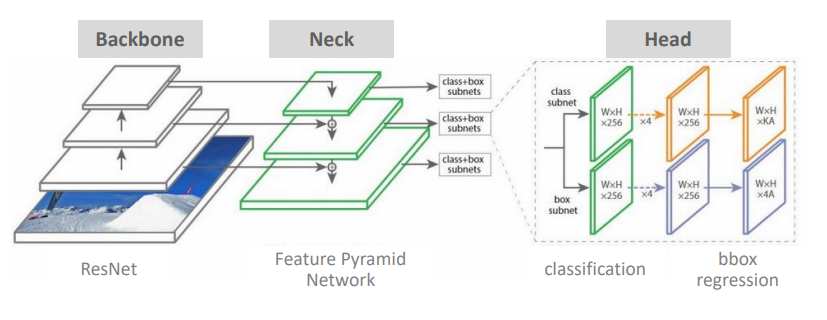
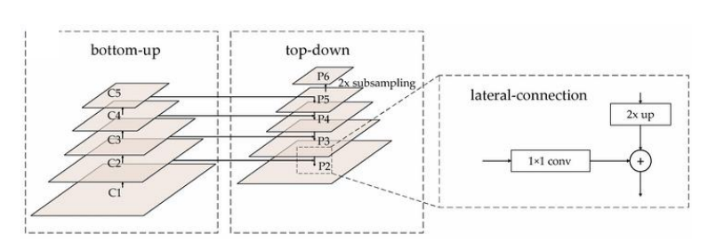

# 99_ObjectDetection_Models

#### backbone

- 원본이미지를 받아서 feature map 정보들을 만들어 내는 것
- backbone에서 사이즈를 계속 줄어들 두께는 두꺼워진다.
  - 위로 올라 갈수록 조금더 추상화된 feature map이 만들어지게 된다
  - 많은 정보를 직관적으로 알 수 있는 추상화된 정보들로 채워지게 된다. (두께가 두꺼워질수록)
- 밑에 층(두께가 얇은 층)에 있는 feature map에서는 상세한 위치같은 정보를 가지고 있게 된다.

- image classification
  - backbone + head

#### neck

- neck이라는 단어가 FPN때 부터 나오게 됨 (feature pyramid network)

- 각각의 층에서 정보들을 받아서 feature map의 정보를 활용
  - 이유: 작은 object나 큰 object들을 모두 detect하기 위해서

## Feature Pyramid Network

##### 각각의 층에서 feature map의 정보를 활용

- 작은 object나 큰 object들을 모두 detect하기 위해서 
- 상위 feature map의 추상화 된 정보와 하위 feature map의 정보를 효과적으로 결합을 하고 싶음 

##### 프로세스

- bottom-up
  - feature map의 사이즈가 2배씩 줄어든다

- top down
  - feature map 사이즈를 2배씩 늘림
  - 늘리면서 bottom-up에서 줄어든 애들과 결합을 시킨다. 

## FPN을 활용한 Faster RCNN RPN

- bottom-up에서 뽑아낸 정보들을 top down하면서 합쳐준다
- 왜?? 
  - 상위 feature map의 추상화 된 정보와 하위 feature map의 정보를 효과적으로 결합을 하고 싶기 때문에

- 이때 나온 Feature map을 통하여 RPN을 진행하게 된다.
- ROI뒤에 classification과 box regression을 진행

## Detector의 구조

backbone : VGG, ResNet, GoogleNet등등

neck : FPN, BFP

DenseHead : RPN