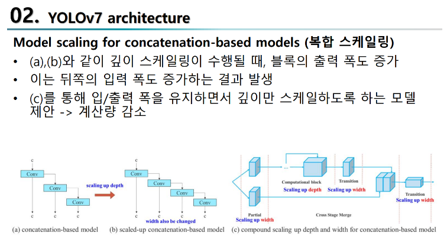

# YOLOv7

https://da2so.tistory.com/59

https://velog.io/@parksh089g/%EC%97%B0%EA%B5%AC%EC%8B%A4%EB%85%BC%EB%AC%B8%EB%A6%AC%EB%B7%B0YOLOv7-Trainable-bag-of-freebies-sets-new-state-of-the-art-for-real-time-objectdetectors

- 이것들을 공부해야 이해할 수 있다.
  - VoVNet
  - CSPVoVNet
  - ELAN
  - E-ELAN
  - BOF (YOLOv4)
  - RepConv :
    -  (Re-parameterized) ex)VGG, ResNet, DenseNet

1. real-time object detection 이면서 inference cost를 증가시키지 않고도 정확도를 향상시킬 수 있는 trainable bag-of-freebies 방법을 제안 

2. re-parameterized module이 original module을 대체하는 방법과 different output layers에 대한 dynamic label assignment strategy 방법 + 여기서 발생하는 어려움을 해결하기 위한 방법 제안

3. parameter 계산을 효과적으로 활용할 수 있는 real time object detector를 위한 "extend" 및 "compound scaling" 제안

4. 본 논문에서 제안한 방법은 SOTA 방법 보다 parameter 수를 40%, 계산량을 50% 감소시킬 수 있으며 더 빠른 inference time과 더 높은 accurcy를 달성

YOLOv7의 base line

- VoVNet
  
  - DenseNet과 다르게 input channel수가 일정하다는 장점
  - 때문에 1x1 Depthwise conv를 사용안하기 때문에 inference time이 더 빠름
    - 1x1 Depthwise conv는 하드웨어 상으로 대부분의 GPU에 가속화되기 힘든 구조를 가지고 있기 때문

- CSPVoVNet
  
  - VoVNet에 Cross Stage Partial(CSP)구조를 추가한 것
    
    - input channel을 반으로 나누어(partial) 왼쪽의 c는 그대로 transition layer에 더해짐
  
  - 나눠진 c때문에 기존보다 gradient flow가 truncate되어 과도한 양의 gradient information을 방지함
    
    - 이로 인해 gradient path는 2배로 증가하여 다양한 feature를 학습할 수 있음
  
  - VoVNet의 장점을 그대로 가져간다.

- ELAN
  
  - CSPVoVNet 의 장점을 그대로 가져감
  - CSPVoVNet의 가장 짧고 가장긴 gradinet path 차이를 극대화 시키고 이로 인해 모듈 간소화
  - 가장 짧고 가장긴 gradinet path를 controll하여 deep 한 네트워크도 학습가능, 수렴도 효과적으로 잘됨
  - 단점
    - Computation block을 어느정도많이 쌓아도 학습 잘됨
    - 하지만 무한대로 쌓을 경우 => statble state가 망가질 것
    - parameter utilication이 낮아질 것

- E-ELAN( YOLOv7 )
  
  - 다양한 계층의 가중치가 더 다양한 기능을 학습할 수 있도록
  - Expand, shuffle, merge cardinality를 통해 computational block을 많이 쌓아도 학습능력이 뛰어남
  - Computational block만 바뀌고 transition layer는 바뀌지 않음
  - Conv => Conv2D + BatchNorm + SiLU 구조
  - 과정
    - Computational block들에 대해 channel수를 miltiplier하는 Group conv를 적용
    - CSP로 나눠진 feature와 coputational block의 output feature들이 shuffle후 concatenate 된다.
    - merge cardinality수행

알아야할 개념

bag-of-freebies : 

inference시에 추가적인 cost비용 없이 네트워크의 성능을 향상하기 위한 방법

(reparameterization, data augmentation, bbox regression, label smoothing 등)

모델 보정(Model calibration)

- 이런 상황을 해결하기 위해 모델 보정(Model calibration)이 필요합니다. 모델 보정은 딥 러닝 모델이 물체를 예측한 확률(Confidence score)과 실제로 정답을 맞출 정확도(Accuracy)가 일치하도록 조정을 해 줍니다. 개와 고양이를 분류하는 모델이 어떤 사진을 보고 고양이일 확률을 70%로 예측한다면 실제로 정답을 맞출 확률이 70%에 가까워야 보정이 잘 이뤄졌다고 말할 수 있습니다. 
  
  이러한 모델 보정은 예측 확률과 정확도의 관계를 나타내는 신뢰도 다이어그램(Reliability diagram)을 이용해서, 주어진 모델이 얼마나 잘 보정되어 있는지 쉽게 파악할 수 있습니다.

- 빨간 점선으로 된 대각선은 모델의 예측 확률과 정확도가 일치하는 이상적인 상태(완전 보정, Perfect calibration)를 보여줍니다. 이 빨간 점선보다 파란색 막대가 더 작다면, 실제 정확도보다 예측 확률이 큰 상태로 모델의 과잉확신(과대확신, over-confidence)을 의미합니다. 그 반대로 대각선 위로 막대 그래프가 넘어갈 경우, 정확도에 비해 낮은 확률로 예측을 한다고 볼 수 있고 이를 과소확신(under-confidence)이라고 부릅니다. 위에 나온 신뢰도 다이어그램은 예측 확률이 0.3-0.4, 0.9-1.0인 구간을 제외한다면 전반적으로 과잉확신 양상이 나타나는 모델이라고 해석할 수 있습니다.
  
  이번 글에서는 이와 같은 딥 러닝 모델의 Miscalibration을 해소하는 기술 중 하나로 라벨 스무딩(Label Smoothing)에 대해서 알아보고자 합니다.

label smoothing

https://blog.si-analytics.ai/21

- Miscalibration을 해소하는 기술 중 하나이다
- Hard label(원핫 인코딩)을 soft label(0~1 사이의 값)으로 스무딩 하는 것을 뜻한다.
- K개의 클래스에 대해서 스무딩 파라미터를 a라고 할때, k번째 클래스에 대해서 다음과 같이 스무딩 한다.

model re-parameterization

1. Training시 : 여러 개의 layer들을 학습한다.
2. interence시 : 해당 layer들을 하나의 layer로 fusing하는 것
- 대표적이 예 : RepVGG, Conv-BN folding
- YOLOv7에서는 RepVGG를 변형시킨 형태의 reparameterrization
- gradient propagation path 개념으로 분석하고, **planned re-parameterized model**을 제안

Label assignment

- Ground trugh를 스냥 사용하는 것이 아닌 모델의 prediction, ground truth의 distribution을 고려하여 새로 soft label을 만들어냄
- 대표적인 예시 : ATSS, OTA, SimOTA( in YOLOX )
- multiple output layer를 사용하여 모델을 학습하게 될 경우 새로운 문제가 발생하게 됩니다. 이에 따라 multiple output layers가 있는 모델에 dynamic label을 할당하는 **coarse-to-fine lead guided label assignment** 방법을 제안합니다. 
