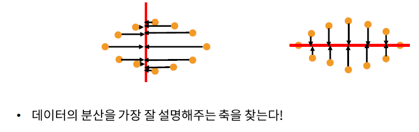
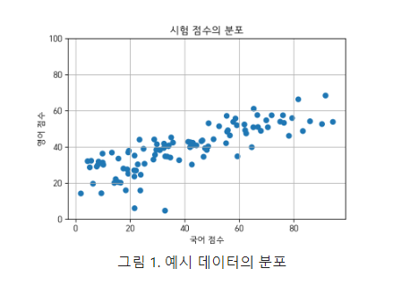

# socar2

## 정답이 없는 문제

- Dimensionality Reduction
- Clustering

특징

- 정답레이블이 없음
- 의미 있는 패턴 찾기

Process

- 문제정의
- 데이터 수집
- 데이터 분석
- 데이터 모델링
- 결과 분석

## 1. Dimensionality Reduction

#### 실생활에는 고차원의 데이터가 많음

- 추천시스템 : of users x of movies 행렬
- 이미지 동영상
- 유전자 분석 등등

##### ==> 고차원일수록 같은 성능의 모델 학습을 위한 더 많은 데이터가 필요하다 

##### ==> 하지만  고차원을 저차원으로 설명가능한 경우가 많음

##### 목적에 따른 방법

- PCA : 데이터의 variance를 보존하면서 차원축소
- MDS : 데이터간의 거리정보를 보존하면서 차원축소
- t-SNE : 로컬 거리 정보를 보존하면서 차원 축소 및 시각화 목적

#### PCA (principal components analysis)

- 데이터에서 중요한 성분을 순서대로 추출

- 오른쪽이 더 분산을 잘 설명해준다고 할 수 있음

https://angeloyeo.github.io/2019/07/27/PCA.html

예를 들어, A라는 학생의 국어 성적, 영어 성적이 100점, 80점 이었다고 하자.

그렇다면, 5:5의 비율로 평균을 낸다는 것은

100×0.5+80×0.5(1)(1)100×0.5+80×0.5

라고 할 수 있으며, 6:4의 비율로 종합 점수를 낸다는 것은

100×0.6+80×0.4(2)(2)100×0.6+80×0.4

라고 할 수 있다.

조금 더 용어를 써가면서 설명하자면, 식 (1)은 (100,80)(100,80) 벡터를 (0.5,0.5)(0.5,0.5)벡터와 내적한 것이고, 식 (2)는 (100,80)(100,80) 벡터를 (0.6,0.4)(0.6,0.4) 벡터와 내적한 것이라고 할 수 있다.

그림으로 표현하면 다음과 같다.

종합점수를 얻을 때 5:5비율 혹은 6:4 비율로 종합점수를 얻을 수 있다 ==> 내적 = 기하학적으로 정사영(직각인 부분으로 투사하기 때문)

고민해야할 문제

- 데이터 벡터를 어떤 벡터에 내적(정사영)하는 것이 최적의 결과를 내주는 가?
- 벡터 찾음 => 그럼 어떤게 가장 중심축이 되는가?

 [행렬이란 선형 변환](https://angeloyeo.github.io/2019/07/15/Matrix_as_Linear_Transformation.html)이고 하나의 벡터 공간을 선형적으로 다른 벡터 공간으로 mapping 하는 기능을 가진다.

##### How to find the line???

- Projection을 한 뒤에 variance를 최대화하느 축을 찾는다

- 목표: 분산값을 최대로 하는 것을 목표로 한다.

##### 얼마나 많은 components를 사용해야할까?

d 차원을 1차원으로 바꿀 수 있음 ==> 이때 정보손실이 발생 ==> 따라서 적절한 component의 수를 찾는 것이 필요

#### MDS(Multidimentsional Scailing)

- 데이터간의 거리를 보존하는 저차원 상의 좌표 계산

#### t-SNE

- 로컬 네이버후드를 잘 보존하면서 차원 축소하는 것에 초점이 맞춰진 방법
  - j번째 데이터가 i번째 neighbor일 확률을 보존하도록 차원을 축소하는 것

- 가우시안 분포를 기반으로 근처에 있을 확률을 보는 것이다

## clustering

- 유사한 문서, 이미지
- 유사한 추세를 나타내는 주식 종목
- 비슷한 나이, 소득수준 등등

종류

- Partitioning Clustering
  - 특정기준으로 나누는 것
- Hierachical Clustering
  - 합집합처럼 군집이 된다.
  - 가까운 집단 부터 차근차근 묶어가는 방식
- Density-based Clustering
  - 밀도의 기반으로 군집을 찾을 수 있음

#### K-means clustering

- 각 군집이 하나의 중심을 가진다
- SSE를 최소화 하는 Partition을 찾는 것이 목표

- k의 개수에 따라 결과가 달라짐
- 감으로 k를 찾을 것인가?? ==> Nope ==> 룰이 존재

- x축 = K , y축 = SSE
- K의 개수가 많아질 수록 하나씩 군집을 하는 것이기 때문에 ==> SSE는 0이 된다. ==> 오차라는 것이 존재하지 않기 때문에(차이)
- 그 중에서 완만하게 줄어드는 지점을 찾는다 = elbow point

##### Process

- Assignment 초기화
  - 각 데이터에 랜덤하게 K개중 하나의 군집을 할당
- Assignment 가 변하지 않을때 까지 다음을 반복
  - 각각의 군집에서 중심을 계산
  - 각 데이터에서 가장 가까운 중심에 해당하는 군집으로 Assignment 를 update

##### 한계점

- k개를 미리 정해줘야함
- 초기 Assignment에 따라서 결과가 달라진다.
- 각 군집의 크기, 밀도가 다르거나 구형이 아닌경우 어려움이 발생

#### Agglomerative Clustering

Hierachical Clustering : K를 미리 정해줄 필요가 없음

##### Process

- 개별군집으로 정의하고 군집간 거리를 계산
- 모든 데이터가 하나의 군집으로 통합될 때까지 반복
  - 가장 가까운 두개의군집을 하나의 군집으로 결합
  - 군집간 거리 계산 업데이트

- 그리고 마지막으로 어디에서 잘라줄지 보면 된다.

##### 결합 방식

- min distance
- max distance
- average distance
- centroids distance

한계점

- 계산 복잡도가 크다
- 한번 잘못 군집화 하면 되돌릴수 없음
- 결합방식에때라 장단점 존재
  - ex) max distance일 경우 군집의 크기가 다른경우 취약함

#### DBSCAN

density-based clustering

- 데이터의 밀도가 높은 영역과 그렇지 않은 영역으로 공간을 구분함

##### terms

- ##### density

  - 원안에 data point개수

    

- ##### dense region

  - 최소한의 data point개수 이상의 데이터를 포함하는 원

    

- ##### neighborhood

  - 두 data point간의 거리가 원 반지름 이하인 경우

    

- ##### core point

  - 최소한의 data point개수 이상의 데이터를 포함하고 있는  data point

    

- ##### border point

  - 최소한의 data point개수 미만이지만 , core point, neighborhood인 point

    

- ##### noise point

  - border point와 core point 모두 속하지 않는 point

- density edge
  - 두 데이터 point가 이웃인 경우 둘 사이에 density edge를 둔다
- density-connected
  - 두 data point가 일련의 edge들을 통해 연결되는 경우

Proccess

- data point들을 core, border, noise 중 하나로 labeling한다.
- noise point를 없앤다
- 군집에 assign되지 않은 모든 core point x에 대해 다음을 반복한다.
  - point x 및 point x 와 density-connected된 모든 point들에 새로운 군집을 할당한다.
- border point는 가장 가까운 core point의 군집으로 할당한다.

