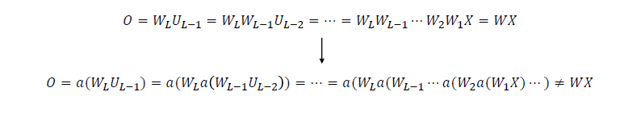

# socar3

### Activation function

- 선형 연산 ==> 의미 없음 ==>layer를 합칠수 있기 때문에

##### activation 조건

- 연산 빠름
- 미분계산 빠르고
- 비선형
- 데이터 분포에서 의미있게 작동 => 
  - 데이터를 넣어서 parameter와 곱했을 때 나오는 값의 범위에서 non-linearity를 가지고 있어야 함

 

##### ReLU Function의 장점 

- 0먼 넘으면 기울기가 1이다
- 미분계수가 양수기만 하면 살아있다
- 계산이 빠르다

##### softmax function

- 모델 output을 확률 분포의 형태로 만들어 주는 함수
  - output값을 모두 더하면 1이되게 normalization을 해주는 것이다.

### Loss function

- 모델의 output이 얼마나 틀렸는지를 나타내는 척도
  - 모델을 얼마나 혼내줄지를 나타내는 척도이다.

- loss function은 바로 미분을 해가지고 기울기가 사용 되기 때문에 미분의 형태가 어떻게 생겼는지도 중요하다.

##### Cross-Entropy Loss function

- 모델의 output을 class label에 대한 확률 분포로 가정하고 true label과의 차이를 측정하는 loss function
- classification task에서 주로 사용됨
  - softmax function과 결합하여 간단하게 계산이 됨

