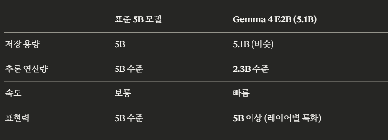

## Gemma4

[필요 학습]

- Gemma 모델 기반이라는게 무슨 뜻일까?
- RoPE란? 

- 특징
  - 가변 종횡비 지원
  - 이미지 토큰 입력 수 조정 가능하도록 지원

Overview of Capabilities and Architecture

- 슬라이딩 윈도우 

  - 소형 dense : 512 토큰
  - 대형 dense : 1024 토큰

- Dual RoPE

  - 슬라이딩 레이어 : 표준 RoPE
  - 글로벌 레이어 :  Proportional RoPE
  - 더 긴 컨텍스트를 가능

- Per-Layer Embeddings (PLE)

  

  - **기존 Transformer**
    -  h0 가 들어오면 h0를 layer가 들어갈 때마다 계속 정보를 업데이트해버린다. 따라서 모든 정보가 h0에 우겨넣게 되는 것.
    - 각각의 layer 마다 어떤 layer에선 문법 구조, 어떤 layer에선 품사 등 layer 마다 다른 패턴을 학습하게 된다. 이건 사람이 그렇게 설계를 하는 것이 아니라 자연스럽게 학습이 되면서 layer 마다 패턴의 복잡성을 학습하는 것
  - **PLE가 하는 것**
    - 임베딩 테이블과 별도로 **PLE 테이블**이 하나 더 있어. 여기서 레이어마다 전용 작은 벡터 p₁, p₂, p₃... pₙ 을 만들어서 각 레이어에 직접 주입한다. 레이어 16이 "나 지금 이 토큰에 대해 뭔가 더 알고 싶어"할 때, h₀를 거슬러 올라갈 필요 없이 p₁₆이 직접 신호를 줘.
  - Pk
    - **토큰 정체성 성분** — "이게 어떤 단어냐" (토큰 ID 기반 lookup)
    - **문맥 인식 성분** — "지금 이 흐름에서 어떤 맥락이냐" (h의 선형 투영)
  - 다 적은 파라미터의 추론 연산량을 만들어내어 속도를 높임
  - **즉 "5B짜리 저장 공간으로, 2.3B 속도에, 5B 이상의 표현력을 낸다"** 

- Shared KV Cache
  - 모델의 마지막 N개 레이어가 앞 레이어의 key-value 상태를 재사용해서 불필요한 KV 프로젝션 연산을 제거

- 기본 KV Cache

  - KV Cache가 있는 이유

    - 이중 계산을 방지하기 위함

    

- Query : 관심도 계산을 위해서 기준이 되는 단어
  - 예를 들어 query 를 cat 이라고 하면 cat을 기준으로 나머지 단어들과 관심도가 어떻게 되는지를 계산하게 된다.
- Key : 관심도 계산을 위해 Query와 연결되어야하는 모든 단어
  - Q와 내적해서 **얼마나 관련 있는지 점수를 매기기 위한 각 토큰의 식별자**
  - 즉 "모든 단어가 자기 자신을 소개하는 명찰"에 가깝다. Q가 K들과 점수를 계산한 후에야 비로소 "연결 강도"가 결정
- Value : 1차적 Context Vector를 생성하기 위해서 Attention Weights를 적용하는 벡터들
  -  Context Vector : 단어가 아니라 문장 자체를 벡터화시키는 것이라고 보면 된다.
     -  문장 자체라기 보단 현재 Query 토큰 입장에서 문장을 바라본 표현
     -  왜냐하면 현재까지 생성된 내용 까지의 내용과 다음 단어가 추가되고 나서의 내용이 완전히 바뀔 수 있기 때문
- 만약에 100 토큰이 있는 문장이 있어. 그럼 100토큰의 key, value 값을 전부 확인하고 Query가 생성된다.

- **KV Cache 크기 = 토큰 수 × 레이어 수 × (K 차원 + V 차원) × 정밀도**
  - 따라서 KV Cache 사이즈를 줄이는 방법이 중요하다.

- 비전 인코더
  -  원본 종횡비 보존
  - 다양한 토큰 예산으로 인코딩 가능 (70, 140, 280, 560, 1120)