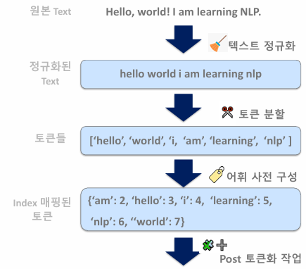
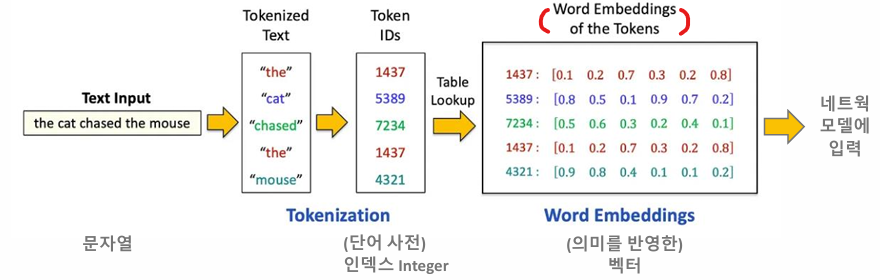
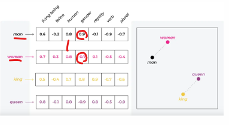
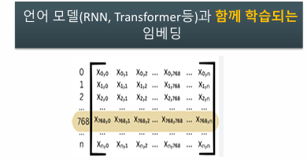

# 01_RNN

## 01) Tokenization

- 텍스트를 토큰 단위로 분할, 개별 토큰을 indesx 값으로 매핑하는 어휘 사전 구축 작업
- 


Token ID는 word embeding과 mapping하기 위해서 사용하는 것


### 토큰화 (Tokenization) 의 주요 프로세스



- 정규화 : 
  - 덱스트를 일관된 문자열로 변환 및 소문자 변환
  - 불필요한 공백, 특수문자, 이모지 등을 제거
- 토큰 분할
  - 공백, 문장 부호등을 기준으로 분리
- 어휘 사전 구성
  - 개별 토큰을 숫자 Index 값으로 mapping을 한다. 

```python
import re

class SimpleTokenizer:
    def __init__(self):
        # 어휘 사전 및 역 단어 사전 dictionary 초기화
        self.vocab = {"<PAD>": 0, "<UNK>": 1}
        self.inv_vocab = {0: "<PAD>", 1: "<UNK>"}
    
    # 문자열 정규화 및 토큰 분할
    def normalize_and_split(self, text):
        text = text.lower()
        tokens = re.findall(r"\b\w+\b", text)
        return tokens
        
    # 단어 사전 및 역 단어 사전 구성. 단일 문장이 아닌, 
    # 여러 문장들을 list로 가지는 말뭉치(corpus)를 인자로 받음. 
    def build_vocab(self, corpus):
        # <PAD>, <UNK> 이후에 token index 부여
        idx = len(self.vocab)
        for sentence in corpus:
            tokens = self.normalize_and_split(sentence)
            for token in tokens:
                if token not in self.vocab:
                    self.vocab[token] = idx
                    self.inv_vocab[idx] = token
                    idx += 1    
    
    def encode(self, text):
        tokens = self.normalize_and_split(text)
        return [self.vocab.get(token, self.vocab["<UNK>"]) for token in tokens]

    def decode(self, ids):
        return [self.inv_vocab.get(i, "<UNK>") for i in ids]

    # 최대 토큰 길이만큼(max_len) <PAD>의 index 별도 추가
    def pad(self, ids, max_len):
        return ids + [self.vocab["<PAD>"]] * (max_len - len(ids))

    # callable로 객체 호출. 
    # text의 token index list 반환. max_len값이 설정 시 max_len 만큼 <PAD> 별도 추가. 
    def __call__(self, text, max_len=None):
        ids = self.encode(text)
        if max_len:
            ids = self.pad(ids, max_len)
        return ids

```

```python
corpus = [
    "The cat sat on the mat.",
    "I love natural language processing.",
    "How are you doing today?",
    "She sells seashells by the seashore.",
    "Artificial intelligence is transforming the world.",
    "Can you believe it's already July?",
    "Let's meet at 5 p.m. in the cafe.",
    "He didn’t know what to say.",
    "The weather is nice and sunny.",
    "Data science combines statistics and programming.",
    "Despite the heavy rain and traffic, she arrived on time with a smile on her face."
]

s_tokenizer = SimpleTokenizer()
s_tokenizer.build_vocab(corpus)
print(s_tokenizer.vocab)
```

```
Encoded: [3, 7, 4, 2, 5, 6]
Decoded: ['hello', 'world', 'i', 'am', 'learning', 'nlp']
```


### Word Embedding



- Embedding : 
  - Tokenizer를 통해 만들어진 토큰값을 단어 의미를 가지는 다차원의 embedding vector로 생성
  -  벡터화를 통해서 개별 단어를 수치화하는 것 

- 단어와 단어 사이의 다양한 관계, 문장의 문맥을 효과적으로 이해하기 위해선?
  - DeepLearning Model이 이 역할을 하는 것




- Man 과 Woman을 비교해 보면 gender에서는 값이 멀고 human으로는 값이 비슷한 것을 볼 수 있음
- 이와 같이 비슷한 의미를 가지는 단어의 주제에 따라 vector화 시킨 것
  - 즉 비슷한 의미를 가지면 비슷한 위치에 놓이게 된다. (딥러닝으로 학습시킬 때 )

- 신기한 점
  - king - man + woman = queen
  - 위치에서 위와 같은 식을 넣으면 queen의 위치가 나오게 된다.
  - 이런 식으로 문장 속 단어들간의 문맥을 모델이 이해하고, 텍스트 생성에 사용되게 된다.
  - Dense Vector 형태로 연산 복잡도 및 메모리 사용도 효율화 하였다.




- 언어 모델 (RNN, Transformer) 학습과 함께 학습되는 임베딩
- 초기에는 **random 값** 다차원 벡터값을 가지고 있지만, 모델이 학습되면서 **단어의 문맥**을 표현하는 다차원 벡터 값으로 학습되게 된다.


