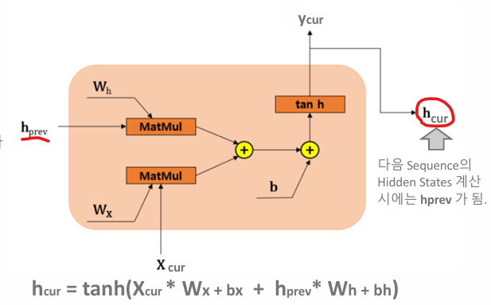

# 01_RNN

## 01) Tokenization

- 텍스트를 토큰 단위로 분할, 개별 토큰을 indesx 값으로 매핑하는 어휘 사전 구축 작업
- 


Token ID는 word embeding과 mapping하기 위해서 사용하는 것


### 토큰화 (Tokenization) 의 주요 프로세스


- 정규화 : 
  - 덱스트를 일관된 문자열로 변환 및 소문자 변환
  - 불필요한 공백, 특수문자, 이모지 등을 제거
- 토큰 분할
  - 공백, 문장 부호등을 기준으로 분리
- 어휘 사전 구성
  - 개별 토큰을 숫자 Index 값으로 mapping을 한다. 

```python
import re

class SimpleTokenizer:
    def __init__(self):
        # 어휘 사전 및 역 단어 사전 dictionary 초기화
        self.vocab = {"<PAD>": 0, "<UNK>": 1}
        self.inv_vocab = {0: "<PAD>", 1: "<UNK>"}
    
    # 문자열 정규화 및 토큰 분할
    def normalize_and_split(self, text):
        text = text.lower()
        tokens = re.findall(r"\b\w+\b", text)
        return tokens
        
    # 단어 사전 및 역 단어 사전 구성. 단일 문장이 아닌, 
    # 여러 문장들을 list로 가지는 말뭉치(corpus)를 인자로 받음. 
    def build_vocab(self, corpus):
        # <PAD>, <UNK> 이후에 token index 부여
        idx = len(self.vocab)
        for sentence in corpus:
            tokens = self.normalize_and_split(sentence)
            for token in tokens:
                if token not in self.vocab:
                    self.vocab[token] = idx
                    self.inv_vocab[idx] = token
                    idx += 1    
    
    def encode(self, text):
        tokens = self.normalize_and_split(text)
        return [self.vocab.get(token, self.vocab["<UNK>"]) for token in tokens]

    def decode(self, ids):
        return [self.inv_vocab.get(i, "<UNK>") for i in ids]

    # 최대 토큰 길이만큼(max_len) <PAD>의 index 별도 추가
    def pad(self, ids, max_len):
        return ids + [self.vocab["<PAD>"]] * (max_len - len(ids))

    # callable로 객체 호출. 
    # text의 token index list 반환. max_len값이 설정 시 max_len 만큼 <PAD> 별도 추가. 
    def __call__(self, text, max_len=None):
        ids = self.encode(text)
        if max_len:
            ids = self.pad(ids, max_len)
        return ids

```

```python
corpus = [
    "The cat sat on the mat.",
    "I love natural language processing.",
    "How are you doing today?",
    "She sells seashells by the seashore.",
    "Artificial intelligence is transforming the world.",
    "Can you believe it's already July?",
    "Let's meet at 5 p.m. in the cafe.",
    "He didn’t know what to say.",
    "The weather is nice and sunny.",
    "Data science combines statistics and programming.",
    "Despite the heavy rain and traffic, she arrived on time with a smile on her face."
]

s_tokenizer = SimpleTokenizer()
s_tokenizer.build_vocab(corpus)
print(s_tokenizer.vocab)
```

```
Encoded: [3, 7, 4, 2, 5, 6]
Decoded: ['hello', 'world', 'i', 'am', 'learning', 'nlp']
```


### Word Embedding


- Embedding : 
  - Tokenizer를 통해 만들어진 토큰값을 단어 의미를 가지는 다차원의 embedding vector로 생성
  -  벡터화를 통해서 개별 단어를 수치화하는 것 

- 단어와 단어 사이의 다양한 관계, 문장의 문맥을 효과적으로 이해하기 위해선?
  - DeepLearning Model이 이 역할을 하는 것


- Man 과 Woman을 비교해 보면 gender에서는 값이 멀고 human으로는 값이 비슷한 것을 볼 수 있음
- 이와 같이 비슷한 의미를 가지는 단어의 주제에 따라 vector화 시킨 것
  - 즉 비슷한 의미를 가지면 비슷한 위치에 놓이게 된다. (딥러닝으로 학습시킬 때 )

- 신기한 점
  - king - man + woman = queen
  - 위치에서 위와 같은 식을 넣으면 queen의 위치가 나오게 된다.
  - 이런 식으로 문장 속 단어들간의 문맥을 모델이 이해하고, 텍스트 생성에 사용되게 된다.
  - Dense Vector 형태로 연산 복잡도 및 메모리 사용도 효율화 하였다.


- 언어 모델 (RNN, Transformer) 학습과 함께 학습되는 임베딩
- nn.Embedding은 2차원 Weight Matrix 형태로 존재한다.
  - Learnable Lookup Table

- 초기에는 **random 값** 다차원 벡터값을 가지고 있지만, 모델이 학습되면서 **단어의 문맥**을 표현하는 다차원 벡터 값으로 학습되게 된다.


### nn.Embedding


```python
emb_layer = nn.Embedding(
	num_embeddings, # 단어 사전 수
    embedding_dim, # embed vector 크기
    padding_idx # <PAD> token idx 값 : 보통 0
)

# token id 값을 넣어으면 vector 값을 반환
emb_vector = emb_layer(torch.tensor(768))
```

- nn.Embedding : 
  - Learnable Lookup Table
  - 즉 vector table 을 바라보는 것
  - (vocab_size, embed_dim) learnable weight matrix를 가지고 있는 형태
  - 이 weight matrix 자체가 개별 토큰별 embedding vector 값을 가지고 있다


```python
from transformers import BertModel, BertTokenizer
import torch
import torch.nn as nn

# model & tokenizer를 로딩. 
# pretrained 모델을 활용할 때는 해당 모델 학습 시에 적용된 tokenizer를 이용해야 함. 
# tokenizer의 토큰 index와 pretrained 모델의 embedding이 서로 loosely 연결되어 있기 때문
tokenizer = BertTokenizer.from_pretrained("bert-base-uncased")
model = BertModel.from_pretrained("bert-base-uncased")

# embedding layer 가져옴. (nn.Embedding)
embedding_layer = model.embeddings.word_embeddings

print(embedding_layer)
print(embedding_layer.weight.shape)
```

```python
Embedding(30522, 768, padding_idx=0) # 30522 : 단어 수 / 768 : 차원
torch.Size([30522, 768]) 
```


### Deep Learning Model 이슈

- 다양한 의미와 문맥을 이해해야 함
- 서로 다른 문장 길이가 가지고 있을 텐데 어떻게 메모리를 효율적으로 사용할 수 있을까?

### Sequence Model

- 순차적으로 생서어되는 Sequence Data를 기반으로 한 모델
- 순차적 생성이 매무 중요한 요소이다. 이전에 생성된 데이터는 **현재  생성된 데이터에 밀접한 영향이 있음**
  - 과거 데이터는 업데이트를 수행하지 않음

## RNN 

### RNN(Recurrent Neuaral Network) 모델 개요


- Sequence 데이터를 시점 순으로 모델에 순차적으로 입력하면서 학습하는 모델로서 동적으로 변하는 입력 문장의 개수에 관계 없이 모델 구성
- Sequence 데이터의 현 시점 입력 데이터와 이전 시점에서 학습된 Hidden State를 입력 받아 시점별 Hidden State와  출력을 순차적으로 생성
- h : hidden state
  - 좋은 hidden states 를 만드는 것이 중요
- Wh : 이전 Hidden State에 적용된 학습 파라미터
- Wx : 토큰 Embedding에 적용되는 학습 파라미터

- 동작 방식 
  - RNN을 넣음 >> Wh, h0 를 만들고 넘김 >> h1을 만들때 Wh를 사용해서 만들게 됨
  - **즉! 이전에 있던 단어가 다음 단어에 영향을 끼치게 된다.** 



- Wh : (이전) Hidden State 적용을 위한 Weight Matrix
- Wx : (현) input Token 적용을 위한 Weight Matrix
- X : Sequence 입력 데이터 (b, seq_len, emb_size)

```python
seq_len = 60 # 600으로 변경하면 ? 
# sequence length를 증가시켜도 Learnable Parameter 크기의 변화가 없음.
# Learnable Parameter 는 input embed 크기와 hidden state의 크기에 영향
# input은 (batch_size=4, seq_len=60, embed_dim=128)
summary(rnn_model, input_size=(4, seq_len, embed_dim),
        col_names=["input_size", "output_size", "num_params"],
        verbose=2,
       )
```

- (batch_size=4, seq_len=60, embed_dim=128)
  - 60개 단어로 이루어진 문장이 4개 있고, 그걸 128개의 차원으로 표현한 것이라고 이해하면 될듯

```python
torch.manual_seed(123)

hidden_dim = 256

rnn_model = nn.RNN(input_size=embed_dim, 
                   hidden_size=hidden_dim, num_layers=1, 
                   batch_first=True) #batch_first=False

#RNN 모델에 입력 embed 값을 forward 시키면 2개의 tensor를 반환. 
#outputs는 sequence 별 입력값에 대한 hidden status 출력값. sequence 순서에 맞춰 입력된 값을 sequence 순서에 맞춰 출력함. 
#sequence 입력에 따라 순차적으로 출력이 생기지만, outputs 자체는 모든 sequence가 출력 처리된 다음에 묶어서 반환됨. 
#즉 outputs의 shape는 (batch_size, seq_len, hidden_dim)임. 
# last_hidden은 sequence의 마지막에서 만들어 지는 hidden status 값. 
# 연산 결과 shape는 (batch_size, hidden_dim)이 되지만 3차원으로 통일 시켜서 (1, batch_size, hidden_dim)

# outputs: (batch_size, seq_len, hidden_dim)
# last_hidden: (1, batch_size, hidden_dim)
outputs, last_hidden = rnn_model(embedded) 
print(outputs.shape, last_hidden.shape)
```

- 

### RNN 모델의 학습

- 좋은 hidden state를 만들기 위해서 오차 역전파를 만들게 된다.
  - 따라서 역순으로 Gradient 값을 계산하면서 Wh, Wx, Embedding 값을 Update하게 된다.

```
He sat near the "bank" and watched the ducks swim.
She opened a saving "bank" account yesterday.
```

- 여기서 bank는 문맥상 다른 의미로 사용된다. 그렇다면 서로 다른 문장의 bank는 다른 의미를 가지고 있을까? => NO
- 서로 같은 Embedding 값을 가지고 있음. 
  하지만 **문맥을 학습할수록 Wh, Wx가 학습되면서, 해당 문맥에 맞는 서로 다른 Hidden State를 가지고 있게 된다.** 
- 또한 그러면서 다른 의미를 가지는 문맥이 추가 될 때 마다 그에 맞는 Embedding 값으로 조정되게 된다. 즉 2개 의미를 갖고 있다면, 2개의 의미를 가지는 Embedding 값을 가지고 있게 된다는 뜻 


### RNN의 문제점

- **문장은 개별 단어가 순차적으로 이어져서 만들어지지만, 문장의 문맥상 의미는 단어순으로 해석되는게 아니다.**

```
“The dog that barked loudly and chased the squirrels through the yard and over the fence into the woods was very tired”
```

- 위 문장에서 dog랑 was는 매우 멀리 떨어져 있다.
- 따라서 dog랑 was는 관계가 없다고 RNN이 해석하게 된다. 왜냐하면 순차적인 학습이기 때문
- 그로 인해 제대로 된 문맥을 이해하지 못하는 구조적 문제를 가지게 된다.
  - 단어 순서에 큰 영향을 받음
  - 장기 기억 문제 
  - Gradient 소실
  - 느린 학습 속도 : **단어 단위**로 순차적으로 입력해 줘야함 
- LSTM, GRU 등의 RNN 기반 모델이 있지만 근본적인 해결하지는 못함


