# 02_Transformer

## 1. Transformer 모델 개요

```
"The cat sat on the table"
```

- 위와 같은 문장이 있으면, 예를 들어 Cat은 모든 토큰에 얼마나 관계가 있는지를 계산한다.
  - 예를 들어서 sat, on, the, table 등 모든 토큰이 cat과 얼마나 관심도가 있는지 알아보는 과정이다.


#### **Attention**

- **Self Attention**
  - 입력 문장내의 개별 단어와 다른 단어들과의 관심도에 기반해서 문장의 문맥을 표현하게 해준다. = Context Vector를 생성 / Qeury, Key, Value를 활용해서 생성함
- **Multi-Head Attention**
  - 여러 head 별로(개별 단어를 기준으로) self attention을 구한 후 이들을 **결합** 
    **\>> 최종 attention을 구성**
  - 이유 : 다양한 관점에서의 Attention을 제공하기 위해서

#### Postional Encoding

- **Attention은 문장 내 단어의 순서와는 상관없음**
- 하지만 문장은 순서와 무관하지 않기 때문에 문맥 보강이 필요
- **개별 단어 Embedding 값에 해당 단어의 위치 정보를 더해서 Attention 계산에 사용**

#### Add & Layer Normalization

- 여러 Layer가 반복 연결되면 Gradient 소실 등이 발생할 수 있음
- 이런 문제를 개선하기 위해서 Redisual Connection과 Layer Normalization 적용 (ResNet 과 동일)

#### Position-wise Feed Forward

- 비선형 activation과 Linear Lyaer를 개별 단어 토큰 별로 적용
- 개별 단어 토큰들의 의미 표현을 강화하기 위함

####  Encoder(and Decoder) Stack

- 개별Encoder/Decoder Layer(Block)들을 연속적으로 이어서 전체 모델 구성

#### Masked Multi-Head Self Attention

- Decoder는 전체 문장을 입력으로 받음
- 하지만 현 단어 다음의 단어(future word)를 포함한 Attention을 생성하면 모델 학습 시 이미 알고 있는 내용이기 때문에 학습이 잘 안됨
  - ex) I want to change job : 이렇게 문장을 받으면 change 다음에 job이 오는걸 이미 알고 있음
  - 즉 각 **개별 단어가** 다음 단어가 어떤걸 올지를 학습해야하는데 학습이 안되는거지 이미 답을 알고 있어서 
- 이를 해결하기 위해 **previous words만 사용하고 future words는 masking(INF 같은 값)으로 Attention에서 제외**

#### Cross Attention(Encoder-Decoder Attention)

- Decoder의 개별 단어 생성 시 Encoder의 출력 중 어느 부분에 집중해야 할지를 알기 위해 Decoder의 개별 단어와 Encoder의 모든 출력간 Attention을 계산


## Self Attention

### Self Attention이란?

```
The cat sat on the mat
```

- 문장내에서 개별 단어가 다른 단어들을 얼마나 관심있게 집중해야하는지를 기반으로 문장의 문맥을 표현하는 방식
  - 즉 주어진 단어에 중요한 다른 단어들은 무엇일까? 
  - 문장의 여러 부분에 있는 정보를 어떻게 결합해야할까?

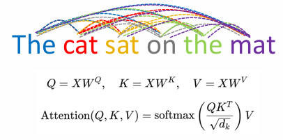

- 단어와 다른 단어간의 관심도 (Attention Wdights) 는 관계 유사도를 바탕으로 계산된다.

- Query : 관심도 계산을 위해서 기준이 되는 단어
  - 예를 들어 query 를 cat 이라고 하면 cat을 기준으로 나머지 단어들과 관심도가 어떻게 되는지를 계산하게 된다.
- Key : 관심도 계산을 위해 Query와 연결되어야하는 모든 단어
- Value : 관심도가 적용되어야 할 단어 정보 

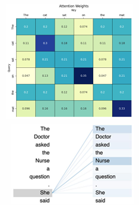

- 위와 같은 Map이 만들어지며, 각각의 단어가 다른 단어들과 관계가 얼마나 있는지를 나타내는 것이라고 보면 된다.

**유사도 계산**

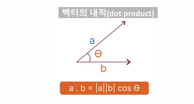

- Self Attention은 단어와 단어들간의 벡터 내적에 기반이 된다.
  - 단어의 관계가 높을 수록 세터 값이 낮아질 것 >> 이로 인해 값이 커지게 된다.
  - 따라서 값이 크다는 것은 유사도가 높다.


### Query, Key, Value 란?

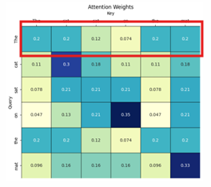

네모 박스 : Attention Weight

- Query : 관심도 계산을 위해서 기준이 되는 단어
  - 예를 들어 query 를 cat 이라고 하면 cat을 기준으로 나머지 단어들과 관심도가 어떻게 되는지를 계산하게 된다.
- Key : 관심도 계산을 위해 Query와 연결되어야하는 모든 단어
- Value : 1차적 Context Vector를 생성하기 위해서 Attention Weights를 적용하는 벡터들


### Self Attention 구현 (weight 적용 안하는 버전 : 설명을 위해서)

1. (학습 파라미터가 적용된) 입력 Token들의 행렬 곱으로 Attention Score를 계산한다.
2. Attention Score에 Softmax 정규화를 적용해여 Attention Weights를 계산한다.
3. 입력 Token들에 Attention Weights를 반영해서 문장 문맥을 담은 Token별 1차적인 Context Vector를 생성한다. (1차인 이유는 다른 단계에서 또 Context Vector를 생성하기 때문)


**개별 단어(token)의 Attention Weights를 반영**

- 개별 단어 token과 자신의 token을 포함한 전체 token들 행렬곱을 적용하여 Attention score를 구한다.
- Attention 값은 벡터의 크기를 반영한 유사도를 나타낸다.

- Q의 shape : (6, 3) 
  - 6 : 문자에서 단어가 6개
  - 3 : 3차원 벡터로 표현했기 때문에 3
- q : 아래 그림에선 cat의 shape : (3, )

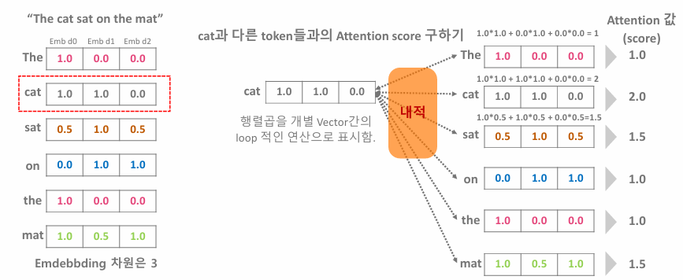

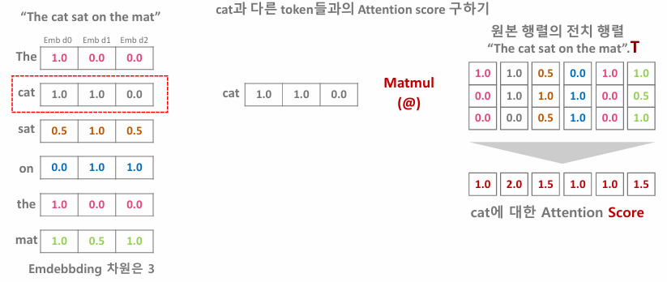

- 원래는 **루트로 된 차원 값(Transformer 식 참고)을 나눠줘야한다.**
- 왜냐하면 Q * (전치 행렬 곱)을 하게 되면 **값이 워낙 크게 되어서 softmax로 해도 값 정규화가 잘 되지 않기 때문에** 값을 낮춰주기 위해서  루트로 된 차원 값을 나눠주게 된다.

```python
def do_test_with_scale(embeddings, use_scale=True):
    seq_len = embeddings.shape[0]
    emb_dim = embeddings.shape[1]
    
    torch.manual_seed(123)
    
    linear_q = nn.Linear(in_features=emb_dim, out_features=emb_dim, bias=False)
    linear_k = nn.Linear(emb_dim, emb_dim, bias=False)
    linear_v = nn.Linear(emb_dim, emb_dim, bias=False)
    
    query = linear_q(embeddings)
    key = linear_k(embeddings)
    value = linear_v(embeddings)
	
    # use_scale이 False이면 scale 적용하지 않음
    scale = emb_dim ** 0.5 if use_scale else 1.0 
    attn_scores = torch.matmul(query, key.transpose(0, 1)) / scale
    attn_weights = F.softmax(attn_scores, dim=-1)

    return attn_weights, attn_scores

emb_dims = [16, 256] # embedding 크기 변화하면서 테스트 
seq_len = 100

# 1. scale 적용(루트 차원을 나눈 경우) 테스트
# Attention wieghts
# max : 1.4 / min : -1.3
scale_option = True
for emb_dim in emb_dims:
    embeddings = torch.randn(seq_len, emb_dim)
	attn_weights, attn_scores = do_test_with_scale(
        embeddings, use_scale=scale_option
    )
# 2. scale 미 적용 (루트 차원을 안 나눈 경우) 테스트
# Attention wieghts
# max : 22.45 / min : -27.6
scale_option = False
for emb_dim in emb_dims:
    embeddings = torch.randn(seq_len, emb_dim)
	attn_weights, attn_scores = do_test_with_scale(
        embeddings, use_scale=scale_option
    )
```

- Scale 적용을 한 경우에는 min, max의 편차가 작은 반면, Scale을 적용하지 않은 경우는 편차가 매우 큰 것을 알 수 있음
- **편차가 매우 크게되면, 특정 토큰에 attention이 집중되는 현상이 발생하여 골고루 집중도가 분산되지 않는 현상이 생긴다.**
- 이로 인해서 차원을 나눔으로써 편차를 줄이는 과정을 포함한다.


**개별 단어(token)의 Attention Weights 구하기**


- 개별 단어 token과 다른 단어들간 Attentioin Socre(위에서 구한 Score) 값을 Softmax 함수로 정규화 (0~1)를 적용해서 Attention Weights를 구한다.
- **Softmax는 입력값이 큰 값에 보다 집중하게 만들어준다.** 
  - 즉 큰 값은 더 크게 만들고, 작은 값은 더 작게 만드는 특징을 가지고 있음
- **미분 가능하면서도 안정적인 모델 학습으로 수행**


**개별 단어에 Attention Weights 반영하기**


- 원래 가지고 있었던 값 (Value) 랑 위에서 만든 Attention Weights 값이랑 Matmul을 하게 된다.
- 그렇게 해서 Attention Weights 가 반영된 token 값을 얻게 된다.


**Self Attention 코드 (weight 적용 안하는 버전 : 설명을 위해서) >> 적용 버전은 아래**

1. (학습 파라미터가 적용된) 입력 Token들의 행렬 곱으로 Attention Score를 계산한다.
2. Attention Score에 Softmax 정규화를 적용해여 Attention Weights를 계산한다.
3. 입력 Token들에 Attention Weights를 반영해서 문장 문맥을 담은 Token별 1차적인 Context Vector를 생성한다. (1차인 이유는 다른 단계에서 또 Context Vector를 생성하기 때문)

```python
# 0. data init
import torch
import torch.nn.functional as F
tokens = ["The", "cat", "sat", "on", "the", "mat"]
token_embeddings = torch.tensor([
    [1.0, 0.0, 0.0],   # The
    [1.0, 1.0, 0.0],   # cat
    [0.5, 1.0, 0.5],   # sat
    [0.0, 1.0, 1.0],   # on
    [1.0, 0.0, 0.0],   # the
    [1.0, 0.5, 1.0],   # mat
])  # shape: (6, 3)
queries = token_embeddings.clone()
keys = token_embeddings.clone()
values = token_embeddings.clone()

# 1. Attention Score 계산하기 ()
attn_scores = queries @ keys.T

# 2. softmax 정규화 적용. dim = -1 >> Attention Weights 계산하기
attn_weights = F.softmax(attn_scores, dim=-1)

# 3. 1차 context vector 값 구하기
context_vecs = attn_weights @ values

```


### Self Attention 구현 (weight 적용 버전 )

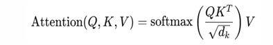

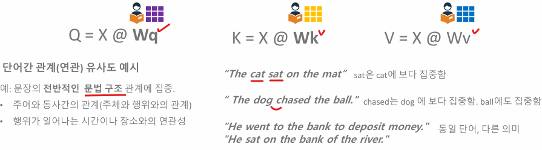

- weights 있어야 학습이라는 것을 시킬 수 있음
- 학습 파라미터가 적용되어야 문맥을 이해할 수 있는 것
  - **즉 Q, K, V의 학습 파라미터들은 문장 문맥의 핵심을 잘 파악한 특정 관계 유사도를 찾고, 이를 Context Vector에 최적으로 적용하기 위한 파라미터이다.**

**Self Attention 구현 메커니즘**


**Self Attention 코드 (weight 적용 버전)**

1. (학습 파라미터가 적용된) 입력 Token들의 행렬 곱으로 Attention Score를 계산한다.
2. Attention Score에 Softmax 정규화를 적용해여 Attention Weights를 계산한다.
3. 입력 Token들에 Attention Weights를 반영해서 문장 문맥을 담은 Token별 1차적인 Context Vector를 생성한다. (1차인 이유는 다른 단계에서 또 Context Vector를 생성하기 때문)

```python
# 0. data init
tokens = ["The", "cat", "sat", "on", "the", "mat"]
token_embeddings = torch.tensor([
    [1.0, 0.0, 0.0],   # The
    [1.0, 1.0, 0.0],   # cat
    [0.5, 1.0, 0.5],   # sat
    [0.0, 1.0, 1.0],   # on
    [1.0, 0.0, 0.0],   # the
    [1.0, 0.5, 1.0],   # mat
])  # shape: (6, 3)
seq_len = token_embeddings.shape[0] # 6 : 토큰 수
emb_dim = token_embeddings.shape[1] # 3 : 차원 수

linear_q = nn.Linear(in_features=emb_dim, out_features=emb_dim, bias=False)
linear_k = nn.Linear(in_features=emb_dim, out_features=emb_dim, bias=False)
linear_v = nn.Linear(in_features=emb_dim, out_features=emb_dim, bias=False)

query = linear_q(token_embeddings)
key = linear_k(token_embeddings)
value = linear_v(token_embeddings)

# 1. Attention Score 계산하기
scale = emb_dim ** 0.5 # 루트
attention_scores = query @ key.transpose(0, 1) / scale # transformer 식

# 2. softmax 정규화 적용. dim = -1 >> Attention Weights 계산하기
attention_weights = F.softmax(attention_scores, dim=-1)

# 3. 1차 context vector 값 구하기
context_vecs = attention_weights @ values
```


**모듈화**

```python
class SelfAttention_01(nn.Module):
    def __init__(self, emb_dim, dropout=0.1):
        super().__init__()

        self.linear_q = nn.Linear(emb_dim, emb_dim) # bias=True
        self.linear_k = nn.Linear(emb_dim, emb_dim)
        self.linear_v = nn.Linear(emb_dim, emb_dim)

        self.scale = emb_dim ** 0.5 # math.sqrt(emb_dim)
        self.dropout = nn.Dropout(dropout)

    # 입력 x는 batch를 포함한 (batch_size, seq_len, emb_dim) shape의 3차원 tensor
    def forward(self, x): 
        query = self.linear_q(x)
        key = self.linear_k(x)
        value = self.linear_v(x)
       
        # key는 batch가 아닌 1, 2차원이 서로 transpose 되어야 함.
        # key.transpose(1, 2) : (1>>seq_len, 2>>emb_dim), x 들어오는 값 확인 
        scores = torch.matmul(query, key.transpose(1, 2)) / self.scale 
        attn_weights = F.softmax(scores, dim=-1)
        
        # attention weights에 dropout 적용
        attn_weights = self.dropout(attn_weights)
        
        # context vector 생성
        context = torch.matmul(attn_weights, value)
        
        return context, attn_weights
```

```python
batch_size = 8
seq_len = 100
emb_dim = 128

sample_token_embedding = torch.randn((batch_size, seq_len, emb_dim))
print(f"sample_token_embedding shape:{sample_token_embedding.shape}")

sattention = SelfAttention_01(emb_dim, dropout=0.1)
context, attn_weights = sattention(sample_token_embedding)
# weights의  shape는 (batch_size, seq_len, seq_len), context의 shape는 (batch_size, seq_len, emb_dim)
print(f"attn_weights shape:{attn_weights.shape} context shape:{context.shape}")
```


## Multi-Head Self Attention

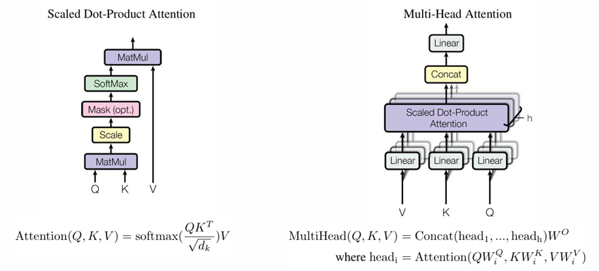

- Single Head Attention
  - 문장 내 문맥을 **특정 관계에 집중**
    
- Multi Head Attention
  - 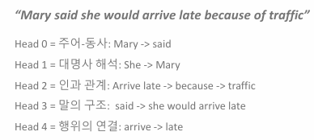
  - 문장 내 다양한 유형의 관계들에 기반하여 attention weight를 적용함
  - 이로 인해 **복잡한 문맥을 포괄적으로 표현할 수 있게 됨**


### 구현 메커니즘

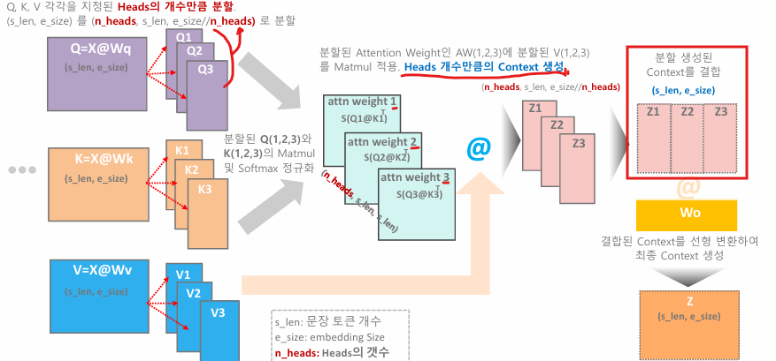

1. Q, K, V 를 Head의 개수만큼 분할한다
   - 이게 무슨 의미일지 생각해보면 긴 문장을 쪼개서 학습을 시키는 것으로 이해했다.
   - 이로 인해서 긴 문장에서의 의미를 쪼개서 서로 얼마만큼의 의미가 있는지 더욱 세세하게 확인하고 싶어서 나누는 작업을 한다고 이해함
2. 각각의 Q, K를 계산해서 attention weight를 만들어서 softmax 정규화를 진행한다.
3. 그리고 Value를 곱한다.


#### 코드 구현

```python

class MultiHeadAttention(nn.Module):
    def __init__(self, emb_dim, num_heads, dropout=0.1):
        super().__init__()
        assert emb_dim % num_heads == 0, "embed_dim must be divisible"
        self.num_heads = num_heads
        self.head_dim = emb_dim // num_heads
        
        # linear layers
        self.linear_q = nn.Linear(emb_dim, emb_dim)
        self.linear_k = nn.Linear(emb_dim, emb_dim)
        self.linear_v = nn.Linear(emb_dim, emb_dim)
        
        # 최종 context 변환을 위한 linear layer
        self.linear_out = nn.Linear(emb_dim, emb_dim)        
        self.dropout = nn.Dropout(dropout)
        
	def forward(self, x, mask=None):
        query = self.linear_q(x)
        key = self.linear_k(x)
        value = self.linear_v(x)
        
        # multi head self attention 적용을 위해 query, key, value를 num_heads 
        # 레벨로 (배치포함) 4차원 텐서로 변환
        # embedding dim를 num_heads x head_dim으로 차원을 높여 분할. 
        # 이후 (batch_size, num_heads, seq_len, head_dim)으로 변환
        query = query.view(b_size,
                           seq_len,
                           self.num_heads,
                           self.head_dim).transpose(1,2 )
        key = key.view(b_size,
                           seq_len,
                           self.num_heads,
                           self.head_dim).transpose(1,2 )
        value = value.view(b_size,
                           seq_len,
                           self.num_heads,
                           self.head_dim).transpose(1,2 )
        
        # head dim이 self attention 할 때 multi_dim과 같은 역할
        # 왜냐면 쪼갰기 때문
        score = torch.matmul(query, key.transpose(-2, -1)) /
											 math.sqrt(self.head_dim)
        
        # attention masking 처리
        if mask is not None:
            scores = scores.masked_fill(mask == 0, float('-inf'))

        # attention weights 및 dropout  적용
        # (b_size, num_heads, seq_len, seq_len)
        attn_weights = F.softmax(scores, dim=-1) 
        attn_weights = self.dropout(attn_weights)

        # heads 별 context vector 생성.
        # (b_size, num_heads, seq_len, head_dim)
        context_by_heads = torch.matmul(attn_weights, value) 
        
        # Concatenate head별 context vector -> tensor를 병합 
        # (num_heads * head_dim)하는 방식으로 적용
        # (b_size, num_heads, seq_len, head_dim) -> 
        # (b_size, seq_len, num_heads, head_dim) -> 
        # (b_size, seq_len, num_heads * head_dim) >> num_heads * head_dim=emb_dim
        context = context_by_heads
        				.transpose(1, 2)
        				.contiguous()
            			.view(b_size, seq_len, emb_dim) # 다시 3차원으로 변형
        
        # context의 최종 linear 변환
        context = self.linear_out(context) #(b_size, seq_len, emb_dim)
        
        return context, attn_weights, scores
    
```

```python
emb_dim = 256
num_head = 8
seq_len = 100
batch_size = 32

mha = MultiHeadAttention(emb_dim=emb_dim, num_heads_num_heads)
x = torch.randn(batch_size, seq_len, emb_dim)
context, attn_weights, socre = mha(x)

print("context shape:", context.shape) # (32, 100, 256)
print("Attention weights shape:", attn_weights.shape)  # (32, 8, 100, 100)
```


#### Attention Maksing 처리

```python
# mask==0 : 조건 >> mask가 0인 값을 -inf 로 변환하라는 뜻
socres = scores.masked_fill(mask==0, float("-inf"))
```

- -inf 인 이유는 softmax 식 : 
  - 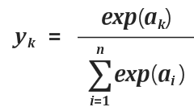
  - 위 식에서 inf 를 넣으면 exp는 0이 되기 때문에 무시되게 된다.
  - 따라서 masking할 곳은 -inf로 넣어주는 것
  - 나중에 Value를 행렬 곱을 하게 되는데 이때 0이되어서 무시되게 된다.
  - **즉 Masking 처리는 PAD로 되어있는 애들을 계산에 영향을 주지 않도록 하기 위한 것**


