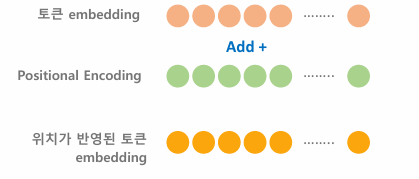
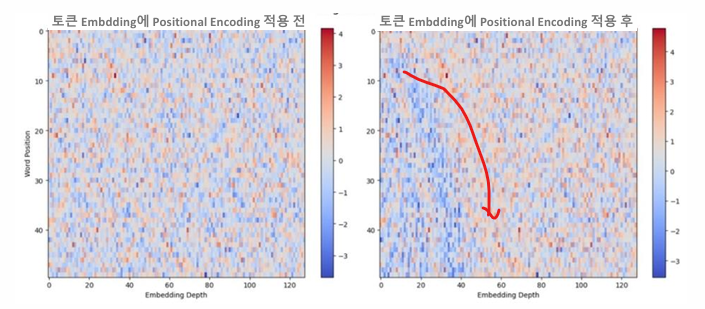
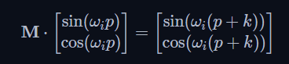

# 03_Encoder


## 1. Positional Encoding

**Positional Encoding 필요 이유**

- 문장 내 단어와 다른 단어들간의 관심도(Attention Weight) 보다 문장 내 **i 번째 위치의 다른 위치의 단어들간의 관심도를 향상**시키기 위함
- Positional Encoding 을 적용하지 않으면 Encoding 성능이 많이 떨어지게 된다.
- ex) 
  - All students **who** failed the exam recieved a wraining from the teacher
  - All students received a warning from the teacher **who** failed the exam.


**Positional Encoding 적용 방식**

- **Add 방식**

  - 

  - Positional Encoding을 더하기 때문에 원래 토큰 embedding 값이 변경된다.

  - 의미적인 값의 변경을 최소화하면서 위치를 반영시킴

    

- **Concatenation 방식**

  - 
  - 빨강색 : 의미 정보 / 초록색 : 위치 정보 >> 두가지를 이어붙히는 방식
  - Embedding 값이 훼손되지는 않지만, 텐서내에 완전히 다른 정보인 embedding 과 위치 값을 함께 가지게 되면서 Attention Wieght 기반의 학습 최적화가 어려워지고, 추가적 메모리도 필요


### **Positioanl Encoding 주요 조건**

- **개별 위치를 고유한 값으로 나타낼 수 있어야 함**
- **토큰 Embedding 값을 크게 변형시키지 않아야 함**
  - 예를 들어 정수형 index 값을 넣어서 Embedding 값을 더하게 되면?
  - 토큰 Embedding 값이 변경되어서 의미가 달라지게 된다. 즉 학습을 시킨 의미가 없어진다. 따라서 큰 수를 적용시킬 수 없다.
- **매우 긴 sequence 라도 모델이 쉽게 학습하여 인지** 할 수 있도록 **특정 형태의 패턴**으로 위치 값을 생성해야한다.
  - Deep Leaning은 고정된 패턴 값을 잘 찾아준다.
- **위치간 상호 관계** (특정 위치가 다른 위치에서 얼만큼 떨어져 있는지)를 나타낼 수 있어야한다.


### Sinusoidal positional encoding

- sin, cos 을 사용해서 위치를 확인하는 방법


- 위 공식으로 개별 위치를 고유한 값으로 나타낼 수 있음
- 토큰 Embedding 값을 크게 변형시키지 않음
- 특정 형태의 패턴을 가지고 있음
- **위치간 상호 관계** (특정 위치가 다른 위치에서 얼만큼 떨어져 있는지)를 알 수 있음


- x 축은 차원 
- y축은 postion (단어의 위치)
- sin : 홀수, cos : 짝수라고 생각해면 됨
- 작은 embedding dimension 값(i)은 에는 주파수가 커서 파형이 빨리 변하게 된다. (맨 위)
- 각 position별로 패턴이 있고, position이 근처에 있는 값은 서로 비슷한 패턴 값을 가진다 
  - postiion이 비슷하면 변하는 값도 비슷 >> 멀리있는 애들은 크게크게 변하긴 함
- sin, cos 이 함께 사용되어서 position의 상대 위치를 용이하게 표현할 수 있음



- Positional Encoding을 적용한 뒤에는 확실히 위치간에 패턴이 생기게 되었음
- 앞부분은 좀 더 파랗게 변함




- M을 계산하게 되면 위와 같은 식이 나온다.
- 이 M으로 각각의 위치 K의 값을 알 수 있기 때문에 위치 정보를 알 수 있게 된다.


### Sinusoidal positional  구현

- register_buffer : 
  - tensor에서 GPU에 모델이 있고, CPU에 tensor가 있고, 이러게 되면 에러가 나게 된다.
  - 이런 상황을 편하게 해결 할 수 있음 함수다.
  - 보통 model 학습에는 필요없는 tensor들을 내부적으로 이용할 때 적용

```python
import torch
import torch.nn as nn
import math

# Sinusoidal Positional Encoding
class PositionalEncoding(nn.Module):
    def __init__(self, embed_dim, max_length=5000):
        super().__init__()
        # positional encoding tensor 생성. shape는 (max_length, embed_dim)
        pe = torch.zeros(max_length, embed_dim)
        
        # max_length 만큼의 position값 생성. shape는 (max_length, 1)로 만듬.
        # 이러면 [[0],[1],[2],[3] ...] 이런식으로 바뀌게 된다.
        position = torch.arange(0, max_length).unsqueeze(1)
        
        # emdedding dimension의 순차 index값을 step 2로 생성. 
        dim_indices = torch.arange(0, embed_dim, 2).float()
        
        # div_term = 1.0 / (10000.0 ** (dim_indices / embed_dim)) 
        # 대신 보다 계산 안정성이 높은 아래식으로 변환 
        # 뒤로 갈수록 값이 작아지게 된다.
        div_term = torch.exp(dim_indices * (-math.log(10000.0) / embed_dim))
        
        # pe에 sin또는 cosine 값 할당. 
        pe[:, 0::2] = torch.sin(position * div_term) # 홀수 
        pe[:, 1::2] = torch.cos(position * div_term) # 짝수
        
        # pe는 token embedding을 add해야 하므로 batch 레벨을 추가하여 3차원 변환
        pe = pe.unsqueeze(0)  # Shape: (1, max_len, embed_dim)
        
        # register_buffer()적용하여 'pe'라는 이름으로 pe tensor를 model에 등록
        # model에 parameter가 아닌 model buffer에 등록 됨
        # 따라서 model.todevice
        self.register_buffer('pe', pe)

    def forward(self, x):
        # x는 token embedding tensor. 문장 길이에 따라 seq_len은 다를 수 있음.
        seq_len = x.size(1)
        #self.pe에서 embedding tensor의 문장 길이 만큼만 추출해서 더함. 
        return x + self.pe[:, :seq_len, :]
    
    
```


