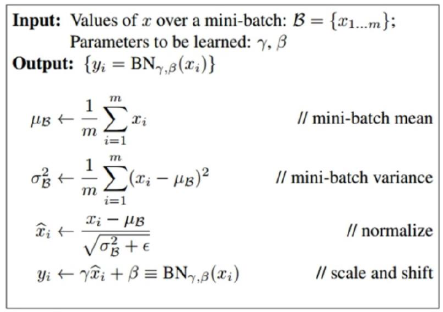
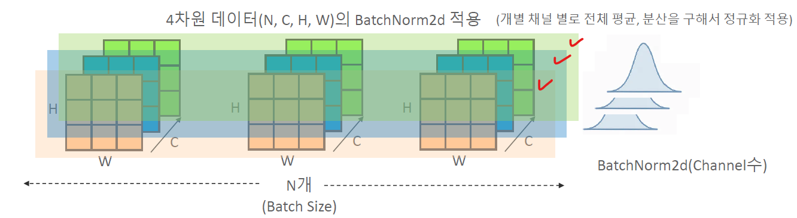
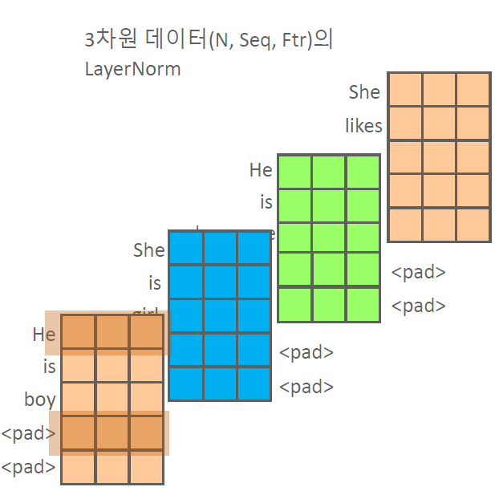
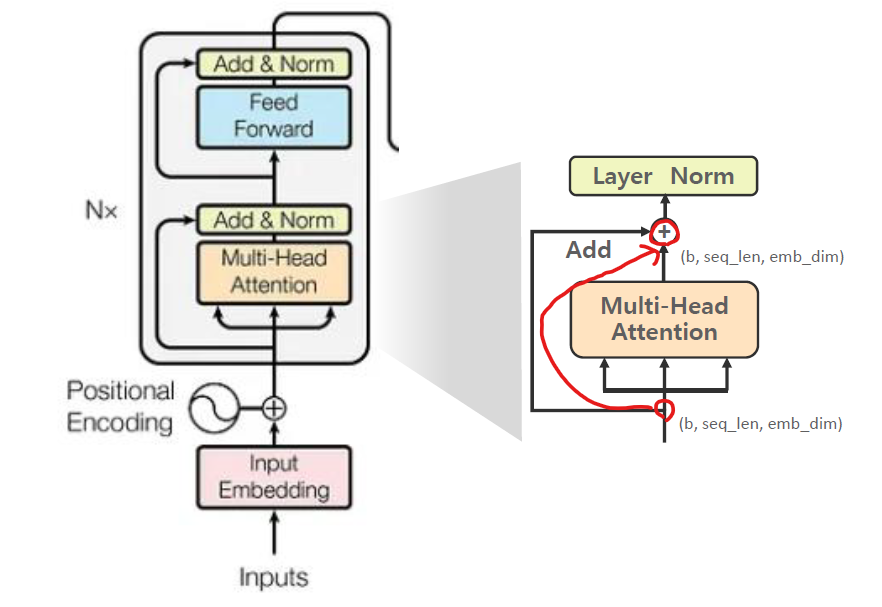

# 03_Encoder


## 1. Positional Encoding

**Positional Encoding 필요 이유**

- 문장 내 단어와 다른 단어들간의 관심도(Attention Weight) 보다 문장 내 **i 번째 위치의 다른 위치의 단어들간의 관심도를 향상**시키기 위함
- Positional Encoding 을 적용하지 않으면 Encoding 성능이 많이 떨어지게 된다.
- ex) 
  - All students **who** failed the exam recieved a wraining from the teacher
  - All students received a warning from the teacher **who** failed the exam.


**Positional Encoding 적용 방식**

- **Add 방식**

  - 

  - Positional Encoding을 더하기 때문에 원래 토큰 embedding 값이 변경된다.

  - 의미적인 값의 변경을 최소화하면서 위치를 반영시킴

    

- **Concatenation 방식**

  - 
  - 빨강색 : 의미 정보 / 초록색 : 위치 정보 >> 두가지를 이어붙히는 방식
  - Embedding 값이 훼손되지는 않지만, 텐서내에 완전히 다른 정보인 embedding 과 위치 값을 함께 가지게 되면서 Attention Wieght 기반의 학습 최적화가 어려워지고, 추가적 메모리도 필요


### **Positioanl Encoding 주요 조건**

- **개별 위치를 고유한 값으로 나타낼 수 있어야 함**
- **토큰 Embedding 값을 크게 변형시키지 않아야 함**
  - 예를 들어 정수형 index 값을 넣어서 Embedding 값을 더하게 되면?
  - 토큰 Embedding 값이 변경되어서 의미가 달라지게 된다. 즉 학습을 시킨 의미가 없어진다. 따라서 큰 수를 적용시킬 수 없다.
- **매우 긴 sequence 라도 모델이 쉽게 학습하여 인지** 할 수 있도록 **특정 형태의 패턴**으로 위치 값을 생성해야한다.
  - Deep Leaning은 고정된 패턴 값을 잘 찾아준다.
- **위치간 상호 관계** (특정 위치가 다른 위치에서 얼만큼 떨어져 있는지)를 나타낼 수 있어야한다.


### Sinusoidal positional encoding

- sin, cos 을 사용해서 위치를 확인하는 방법


- 위 공식으로 개별 위치를 고유한 값으로 나타낼 수 있음
- 토큰 Embedding 값을 크게 변형시키지 않음
- 특정 형태의 패턴을 가지고 있음
- **위치간 상호 관계** (특정 위치가 다른 위치에서 얼만큼 떨어져 있는지)를 알 수 있음


- x 축은 차원 
- y축은 postion (단어의 위치)
- sin : 홀수, cos : 짝수라고 생각해면 됨
- 작은 embedding dimension 값(i)은 에는 주파수가 커서 파형이 빨리 변하게 된다. (맨 위)
- 각 position별로 패턴이 있고, position이 근처에 있는 값은 서로 비슷한 패턴 값을 가진다 
  - postiion이 비슷하면 변하는 값도 비슷 >> 멀리있는 애들은 크게크게 변하긴 함
- sin, cos 이 함께 사용되어서 position의 상대 위치를 용이하게 표현할 수 있음


- Positional Encoding을 적용한 뒤에는 확실히 위치간에 패턴이 생기게 되었음
- 앞부분은 좀 더 파랗게 변함


- M을 계산하게 되면 위와 같은 식이 나온다.
- 이 M으로 각각의 위치 K의 값을 알 수 있기 때문에 위치 정보를 알 수 있게 된다.


### Sinusoidal positional  구현

- register_buffer : 
  - tensor에서 GPU에 모델이 있고, CPU에 tensor가 있고, 이러게 되면 에러가 나게 된다.
  - 이런 상황을 편하게 해결 할 수 있음 함수다.
  - 보통 model 학습에는 필요없는 tensor들을 내부적으로 이용할 때 적용

```python
import torch
import torch.nn as nn
import math

# Sinusoidal Positional Encoding
class PositionalEncoding(nn.Module):
    def __init__(self, embed_dim, max_length=5000):
        super().__init__()
        # positional encoding tensor 생성. shape는 (max_length, embed_dim)
        pe = torch.zeros(max_length, embed_dim)
        
        # max_length 만큼의 position값 생성. shape는 (max_length, 1)로 만듬.
        # 이러면 [[0],[1],[2],[3] ...] 이런식으로 바뀌게 된다.
        position = torch.arange(0, max_length).unsqueeze(1)
        
        # emdedding dimension의 순차 index값을 step 2로 생성. 
        dim_indices = torch.arange(0, embed_dim, 2).float()
        
        # div_term = 1.0 / (10000.0 ** (dim_indices / embed_dim)) 
        # 대신 보다 계산 안정성이 높은 아래식으로 변환 
        # 뒤로 갈수록 값이 작아지게 된다.
        div_term = torch.exp(dim_indices * (-math.log(10000.0) / embed_dim))
        
        # pe에 sin또는 cosine 값 할당. 
        pe[:, 0::2] = torch.sin(position * div_term) # 홀수 
        pe[:, 1::2] = torch.cos(position * div_term) # 짝수
        
        # pe는 token embedding을 add해야 하므로 batch 레벨을 추가하여 3차원 변환
        pe = pe.unsqueeze(0)  # Shape: (1, max_len, embed_dim)
        
        # register_buffer()적용하여 'pe'라는 이름으로 pe tensor를 model에 등록
        # model에 parameter가 아닌 model buffer에 등록 됨
        # 따라서 model.todevice
        self.register_buffer('pe', pe)

    def forward(self, x):
        # x는 token embedding tensor. 문장 길이에 따라 seq_len은 다를 수 있음.
        seq_len = x.size(1)
        #self.pe에서 embedding tensor의 문장 길이 만큼만 추출해서 더함. 
        return x + self.pe[:, :seq_len, :]
    
    
```


**Multi-head Attention**

```python
import torch
import torch.nn as nn
import torch.nn.functional as F
import math

class MultiHeadAttention(nn.Module):
    def __init__(self, hidden_size, num_heads, dropout=0.1):
        super().__init__()
        assert hidden_size % num_heads == 0, 
        						"hidden_dim must be divisible by num_heads"
        self.num_heads = num_heads
        self.head_size = hidden_size // num_heads

        # q, k, v를 위한 Linear layers
        self.linear_q = nn.Linear(hidden_size, hidden_size)
        self.linear_k = nn.Linear(hidden_size, hidden_size)
        self.linear_v = nn.Linear(hidden_size, hidden_size)
        
        # 최종 context 변환을 위한 linear layer
        self.linear_out = nn.Linear(hidden_size, hidden_size)
        self.dropout = nn.Dropout(dropout)     
        
	def forward(self, x, pad_mask=None):
        # 입력 x의 shape는 (batch_size, seq_len, emb_dim)
        b_size, seq_len, hidden_size = x.size() 
        
        # Linear layer 적용하여 query, key, value 생성
        query = self.linear_q(x) #(b_size, seq_len, hidden_size)
        key = self.linear_k(x)
        value = self.linear_v(x)
        
        query = query.view(b_size,
                           seq_len,
                           self.num_heads,
                           self.head_size).transpose(1, 2)
        key = key.view(b_size, 
                       seq_len, 
                       self.num_heads, 
                       self.head_size).transpose(1, 2)
        value = value.view(b_size,
                           seq_len,
                           self.num_heads,
                           self.head_size).transpose(1, 2)
        
        scores = torch.matmul(query, key.transpose(-2, -1)) 
        									/ math.sqrt(self.head_size)
        
        # attention용 pad masking 처리
        if pad_mask is not None:
            # <수정> attention_mask 차원 변환
            pad_mask = pad_mask.unsqueeze(1).unsqueeze(2)
            scores = scores.masked_fill(pad_mask == 0, float('-inf'))
            
		# attention weights 및 dropout  적용
        attn_weights = F.softmax(scores, dim=-1)
        attn_weights = self.dropout(attn_weights)

        # heads 별 context vector 생성.
        context_by_heads = torch.matmul(attn_weights, value) 
        
        # context의 최종 linear 변환
        context = self.linear_out(context) #(b_size, seq_len, hidden_size)

        # <수정> context vector만 반환하도록 수정.
        return context

```


### Layer Normalization 과 Batch Normalization

- 둘 다 layer의 input 전 분포와 output 후 분포가 비슷하게 유지하기 위해서 사용하는 것


**Batch Normalization**


- 목표 : 신경망 내부의 각 층(layer)를 통과 할 때마다 입력 데이터의 분포가 조금씩 변경되는 현상을 막 기 위함
- 위 사진과 같이 layer가 지날 수록 한쪽으로 치우치는 현상이 있을 수 있음



- mini-batch 의 평균 값
- mini-batch 의 편차 값 
- 위 두값을 사용하면 정규화 값을 뽑을 수 있음




- 각 채널 별로 Normalization을 가져가는 것이 맞다.
- 왜냐하면 이미지는 채널별로 특성을 가지고 있기 때문이다. 예를 들어 RDB일 수도 있고, 질감을  갖고 있을 수도 있고 등등


**Layer Normalization**

- 탄생 이유
  - 기존 Batch Norm같은 경우 이미지 데이터 기반의 모델에서는 성능향상이 검증되었음
  - 하지만 이미지 (Batch를 포함한 4차원) 데이터와 언어 데이터(Batch를 포함한 3차원)의 특성이 다르기 때문에 Layer Norm이 탄생
  - 이미지와 다르게 channel 별로 특성을 가지고 있는게 맞을까? 각 토큰별로 특성을 가지고 있는게 맞다!



- 정의
  - **개별 토큰 레벨에** 기반한 평균과 분상을 적용항여 개별 feature 값을 정규화


### Residual Connection과 Layer Normalization



- Residual Connection
  - Multi-Head Attention에 들어가기 전 값 + 들어간 후 값을 더한 것


**Post-Norm 과 Pre Norm**


- Original Transformer는 Post Norm이 사용되지만, 요즘은 Pre-Norm이 사용된다.


## Point wise Feed Forward


- **이 부분은 토큰간에 관계를 표현하는 부분이 아니다.**
  - 비선형적인 학습을 하는 구간이라고 생각하면된다.
  - 따라서 더 풍부하게 context를 이해하는 부분이라고 보면 된다.
- Self Attention 내에서는 비선형 변환이 거의 존재하지 않으며, 오직 Query, Key, Value의 선형 변환만이 존재한다.
  - Self Attention 은 나와 타 토큰 간의 관계에 집중하여 결과를 출력한다.
  - 이렇게 출력된 값을 개별 토큰 단위로 비 선 형성을 적용하여 학습할 수 있도록 함
- FFN 은 2 개의 선형 변환 Layer 들과 그 사이에 Activation 함수로 구성 . 개별 선형 변환 Layer  은 출력 features 수 가 다르게 구성되며 intermediate_size 가 hidden_size 보다 크게 구성 보통 4 배
  - hidden_size : 512
  - intermediate size : 2048(4배) 

```python
import torch
import torch.nn as nn

class FeedForward(nn.Module):
    def __init__(self, hidden_size, intermediate_size, dropout=0.1):
        super().__init__()
        self.linear_first = nn.Linear(
            in_features=hidden_size,
            out_features=intermediate_size
        )
        self.activation = nn.ReLU() # nn.GELU() >> 발전하면서 GELU를 사용(BERT)
        self.linear_second = nn.Linear(intermediate_size, hidden_size)
        self.dropout = nn.Dropout(dropout) # 최종 출력 전 Dropout 적용 
        # self.ff_sequential = nn.Sequential(
        #     nn.Linear(hidden_size, intermediate_size),
        #     nn.ReLU(), 
        #     nn.Linear(intermediate_size, hidden_size),
        #     nn.Dropout(dropout)
        # )

    def forward(self, x):
        x = self.linear_first(x)        # (batch, seq_len, intermediate_size)
        x = self.activation(x)           # ReLU non-linearity
        x = self.linear_second(x)        # (batch, seq_len, hidden_size)
        x = self.dropout(x)             # 최종 출력 전 Dropout 적용 
        # x = self.ff_sequential(x)
        return x

```


## Encoder Layer

```python
class EncoderLayer(nn.Module):
    def __init__(self, hidden_size, num_heads, intermediate_size, dropout=0.1):
        super().__init__()
        self.attention = MultiHeadAttention(
            hidden_size=hidden_size, num_heads=num_heads, dropout=dropout
        )
        #Attention 출력 결과 Norm을 위한 LayerNorm layer 생성
        self.attn_norm = nn.LayerNorm(hidden_size)
        # attention 출력 결과 dropout용.
        self.dropout = nn.Dropout(dropout)
        #Feed Forward 
        self.feed_forward = FeedForward(hidden_size=hidden_size,
                                       intermediate_size=intermediate_size,
                                       dropout=dropout)
        #FeedForward 출력 결과 Norm을 위한 LayerNorm layer 생성
        self.ff_norm = nn.LayerNorm(hidden_size)
        
    def forward(self, x, pad_mask=None):
        attn_out = self.attention(x, pad_mask)
        
        # residual 및 layer norm 이전에 attention 출력 결과에 dropout 적용. 
        attn_out = self.dropout(attn_out)
        
        # attention 적용 전 입력과 attention 적용 후 출력을 residual connection
        #(더하기) 한 뒤 layer normalization 적용
        x = self.attn_norm(x + attn_out)
        
        # feed forward 적용
        ff_out = self.feed_forward(x)
        # feed forward 출력과 feed forward 입력 전 값을 residual connection 한 
	    # 뒤 layer normalization 적용
        x = self.ff_norm(x + ff_out)
        return x
```


```python
class Encoder(nn.Module):
    def __init__(
        self, num_layers, hidden_size, num_heads, intermediate_size, dropout=0.1
    ):
        super().__init__()
        # layer를 연속적으로 올리는 것이라고 보면된다.
        self.layers = nn.ModuleList([
            EncoderLayer(hidden_size, num_heads, intermediate_size, dropout)
            for _ in range(num_layers)
        ])
        
    def forward(self, x, pad_mask=None):
        for layer in self.layers:
            x = layer(x, pad_mask)
        return x
```

```python
class TransformerEncoderModel(nn.Module):
    def __init__(self, config):
        super().__init__()
        self.embedding = nn.Embedding(config.vocab_size, config.hidden_size)
        self.pos_encoder = PositionalEncoding(
            config.hidden_size, config.max_length
        )
        self.pos_dropout = nn.Dropout(config.dropout)
        self.encoder = Encoder(num_layers=config.num_layers, 
                               hidden_size=config.hidden_size, 
                               num_heads=config.num_heads, 
                               intermediate_size=config.intermediate_size,
                               dropout=config.dropout)

    def forward(self, input_ids, pad_mask=None):
        x = self.embedding(input_ids) # (batch_size, seq_len, embed_dim)
        x = self.pos_encoder(x)       # positional encoding 적용
        x = self.pos_dropout(x)
        x = self.encoder(x, pad_mask) #여러개의 EncoderLayer Stack들에 입력 적용.     
        
        return x
```


