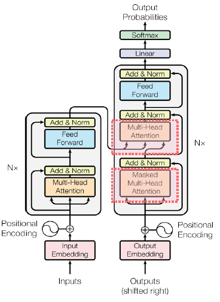
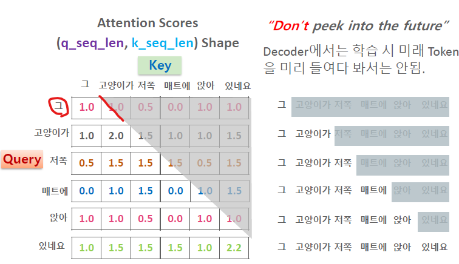

# 04_Decoder



- Encoder와 유사하게 생겼지만 2가지 주요 차이점 존재
  1. Causal(Masked) Self Attention
  2. Cross Attention

- **Decoder의 역할** 
  - 첫 Token부터 현재까지의 Token들을 기반으로 **다음에 올 수 있는 Token을 예측하는 것**
  - 이를 위해서 Encoderㅇ의 Context Vector와 Decoder 자체의 입력 Token들을 사용하여 학습을 시키게 된다.


## Decoder의 Causal Attention

### Causal(Self Attention + Causal Masking) Attention의 필요성



- Maked 하지 않으면 이미 답을 알고 있는 상태에서 학습을 하는 것과 같다.
- 이렇게 되면 학습이 되지 않고 답을 외워버리는 현상이 있기 때문에 Masking을 하여 학습하게 된다.
- 자신의 현재 기준 Token 이후의 Token 들은 Attention Weights 를 계산하지 않도록 Causal Attention(마스킹) 을 적용함.

```python
import torch 

def create_causal_mask(seq_len):
    """
    shape가 (1, 1, seq_len, seq_len)인 lower-triangular causal mask 반환 
    """
    # multihead attetnion scores의 shape는 (b_size, num_heads, seq_len, seq_len)로 4차원. masking 도 4차원 변환
    return torch.tril(torch.ones((seq_len, seq_len))).unsqueeze(0).unsqueeze(1)

torch.manual_seed(1234)
torch.set_printoptions(linewidth=200)

BATCH_SIZE = 2
NUM_HEADS = 4
SEQ_LEN = 10

temp_scores = torch.randn((BATCH_SIZE, NUM_HEADS, SEQ_LEN, SEQ_LEN))
causal_mask = create_causal_mask(seq_len=SEQ_LEN)
# causal_mask가 0인 곳은 '-inf'로 치환
causal_masked_scores = temp_scores.masked_fill(causal_mask == 0, float('-inf'))
print(causal_masked_scores) #temp_scores

```


## Cross Attention 


- Query는 Decoder에서 받게 된다.
- Key, Value 는 Encoder에서 받게 된다.
  - BART, T5 구조에서만 사용된다.
  - **Encoder 전용의 모델 (BERT)나 Decoder 전용의 모델 (GPT 등의 LLM) 에서는 사용되지 않음**


```python
# self attention과 cross attention 을 모두 반영하도록 수정 
class MultiHeadAttention(nn.Module):
    def __init__(self, hidden_size, num_heads, dropout=0.1, is_cross_attn=False):
        super().__init__()
        # hidden_size가 num_heads로 정확히 나눠지지 않으면 오류 발생시킴 
        assert hidden_size % num_heads == 0, "hidden_size must be divisible by num_heads"
        self.num_heads = num_heads
        self.head_size = hidden_size // num_heads
        #<수정> cross attention 여부 속성 추가
        self.is_cross_attn = is_cross_attn
        
        # query, key, value를 위한 Linear layers
        self.linear_q = nn.Linear(hidden_size, hidden_size)
        self.linear_k = nn.Linear(hidden_size, hidden_size)
        self.linear_v = nn.Linear(hidden_size, hidden_size)
        
        # 최종 context 변환을 위한 linear layer
        self.linear_out = nn.Linear(hidden_size, hidden_size)
        self.dropout = nn.Dropout(dropout)

    # <수정> 입력 인자가 기존 x에서 query, key, value로 수정. query는 Decoder에서 생성됨, key와 value는 Encoder에서 생성됨. 
    # <수정> 변수명 pad_mask는 key_pad_mask로 변경
    def forward(self, query, key, value, key_pad_mask=None, causal_mask=None):
        #<수정> cross attention인데, causal mask가 입력되면 오류 처리
        if self.is_cross_attn:
            assert causal_mask is None, "cross attention의 경우 causal masking이 허용되지 않습니다"
        # <수정> query는 Decoder로 부터, key, value는 Encoder로 부터
        # Cross Attention의 경우 key와 value는 동일한 shape이지만, query는 key와 sequence length가 다를 수 있음
        # query의 seq_len과 key의 seq_len을 별도로 추출. 
        b_size, q_seq_len, hidden_size = query.size() 
        k_seq_len = key.size()[1]

        # <수정> 입력 인자로 들어온 query, key, value에 다시 한번 Linear layer 적용하여 query, key, value 생성
        query = self.linear_q(query) #(b_size, q_seq_len, hidden_size)
        key = self.linear_k(key) #(b_size, k_seq_len, hidden_size)
        value = self.linear_v(value) #(b_size, k_seq_len, hidden_size)

        # multi head self attention 적용을 위해 query, key, value를 num_heads 레벨로 (배치포함) 4차원 텐서로 변환
        # hidden_size를 num_heads x head_size으로 차원을 높여 분할. 이후 (batch_size, num_heads, seq_len, head_size)으로 변환
        # <수정> Cross Attention을 감안하여 query, key, value의 분할 시 기존 seq_len을 q_seq_len과 k_seq_len으로 각각 구분
        query = query.view(b_size, q_seq_len, self.num_heads, self.head_size).transpose(1, 2) #(b_size, num_heads, q_seq_len, head_size)
        key = key.view(b_size, k_seq_len, self.num_heads, self.head_size).transpose(1, 2) #(b_size, num_heads, k_seq_len, head_size)
        value = value.view(b_size, k_seq_len, self.num_heads, self.head_size).transpose(1, 2) #(b_size, num_heads, k_seq_len, head_size)
        
        # num_heads 레벨로 분할된 (배치포함) 4차원 query와 keys에 Scaled dot-product attention 적용
        #(b_size, num_heads, seq_len, seq_len)
        scores = torch.matmul(query, key.transpose(-2, -1)) / math.sqrt(self.head_size) 
        
        # padding masking 및 causal masking 함께 처리. 
        # <수정> 변수명 pad_mask는 key_pad_mask로 변경. 
        combined_mask = self.create_combined_mask(key_pad_mask=key_pad_mask, causal_mask=causal_mask)
        if combined_mask is not None:
            scores = scores.masked_fill(combined_mask == False, float('-inf'))

        # attention weights 및 dropout  적용
        attn_weights = F.softmax(scores, dim=-1) # (b_size, num_heads, seq_len, seq_len)
        attn_weights = self.dropout(attn_weights)

        # heads 별 context vector 생성.
        context_by_heads = torch.matmul(attn_weights, value) #(b_size, num_heads, seq_len, head_size)
        
        # Concatenate head별 context vector -> tensor를 병합(num_heads * head_size)하는 방식으로 적용
        # (b_size, num_heads, seq_len, head_size) -> (b_size, seq_len, num_heads, head_size) -> (b_size, seq_len, num_heads * head_size)
        # <수정> self attention, cross attenion 모두 생성되는 context vector의 sequence length는 query의 sequence_length와 같아야 함. 
        # <수정> 기존 seq_len을 q_seq_len으로 수정. 
        context = context_by_heads.transpose(1, 2).contiguous().view(b_size, q_seq_len, hidden_size) # context.permute(0, 2, 1, 3).contiguous().view(b_size, seq_len, hidden_size)
        
        # context의 최종 linear 변환
        context = self.linear_out(context) #(b_size, seq_len, hidden_size)
        
        return context, attn_weights, scores
        
    #입력 인자는 pad_mask는 2차원(batch, seq_len), causal_mask도 2차원(seq_len, seq_len). 함수내에서 4차원 tensor로 변환.
    #<수정> 변수명 pad_mask는 key_pad_mask로 변경. 
    # key_pad_mask는 Encoder의 self attention 시, Decoder의 Cross attention 시에 입력되며 양쪽 다 Encoder의 Key값에 padding을 기반으로 함
    # causal_mask는 decoder의 self attention 시에만 입력됨. 
    def create_combined_mask(self, key_pad_mask=None, causal_mask=None):
        # print(f"key_pad_mask:{key_pad_mask} causal_mask:{causal_mask}")
        if key_pad_mask is not None:
            # 2차원 key_pad_mask(batch, k_seq_len)를 4차원 형태로 변경(batch, 1, 1, k_seq_len)
            key_pad_mask = key_pad_mask.unsqueeze(1).unsqueeze(2)  # (batch, 1, 1, k_seq_len)
        if causal_mask is not None:
            causal_mask = causal_mask.unsqueeze(0).unsqueeze(1)  # (1, 1, seq_len, seq_len)
        
        # key_pad_mask와 causal_mask를 bitwise AND 적용: decoder self attention 인 경우 
        if key_pad_mask is not None and causal_mask is not None:
            combined_mask = key_pad_mask.bool() & causal_mask.bool()  # (batch, 1, seq_len, seq_len)
        # key_pad_mask만 not None일 경우: encoder self attention, decoder cross attention
        elif key_pad_mask is not None:
            combined_mask = key_pad_mask.bool()
        # causal_mask만 not None일 경우: decoder self attention 인데, padding masking을 적용하지 않음. 
        elif causal_mask is not None:
            combined_mask = causal_mask.bool()
        # 어떤 masking도 없을 경우
        else:
            combined_mask = None

        return combined_mask
```

```python
class TransformerDecoderModel(nn.Module):
    def __init__(self, config):
        super().__init__()
        self.embedding = nn.Embedding(config.vocab_size, config.hidden_size)
        self.pos_encoding = PositionalEncoding(config.hidden_size, config.max_length)
        self.decoder = Decoder(num_layers=config.num_layers, 
                               hidden_size=config.hidden_size, 
                               num_heads=config.num_heads, 
                               intermediate_size=config.intermediate_size,
                               dropout=config.dropout)

    def forward(self, input_ids, enc_output, dec_pad_mask=None, dec_causal_mask=None, enc_pad_mask=None):
        x = self.embedding(input_ids)  # (batch_size, seq_len, hidden_size)
        x = self.pos_encoding(x)       # positional encoding 적용
        x = self.decoder(dec_input=x, enc_output=enc_output, 
                         dec_pad_mask=pad_mask, dec_causal_mask=causal_mask, 
                         enc_pad_mask=enc_pad_mask) # Self Attention -> Add & Norm -> Cross Attention -> Add & Norm -> Feed Forward     
        
        return x
```

```python
class DecoderLayer(nn.Module):
    def __init__(self, hidden_size, num_heads, intermediate_size, dropout=0.1):
        super().__init__()
        # self attention용. Decoder 자체의 self attention
        self.s_attention = MultiHeadAttention(hidden_size=hidden_size, num_heads=num_heads, dropout=dropout,
                                              is_cross_attn=False)
        # cross attention용. query는 Decoder로 부터, key와 value는 Encoder로 부터
        self.c_attention = MultiHeadAttention(hidden_size=hidden_size, num_heads=num_heads, dropout=dropout, 
                                              is_cross_attn=True)

        self.s_attn_norm = nn.LayerNorm(hidden_size)
        self.c_attn_norm = nn.LayerNorm(hidden_size)

        self.feed_forward = FeedForward(hidden_size=hidden_size, intermediate_size=intermediate_size)
        self.ff_norm = nn.LayerNorm(hidden_size)

    def forward(self, dec_input, enc_output, dec_pad_mask=None, dec_causal_mask=None, 
                enc_pad_mask=None, return_weights=False):
        # decoder layer자체에서 self attention 적용 -> residual -> Layer Norm
        s_attn_out, s_attn_weights, _ = self.s_attention(query=dec_input, key=dec_input, value=dec_input, 
                                                      key_pad_mask=dec_pad_mask, causal_mask=dec_causal_mask)
        x = self.s_attn_norm(dec_input + s_attn_out)

        # cross attention 적용 후 -> residual -> Layer Norm
        # pad masking은 encoder의 pad masking, causal_mask는 적용하지 않음. 
        c_attn_out, c_attn_weights, _ = self.c_attention(query=x, key=enc_output, value=enc_output, 
                                                      key_pad_mask=enc_pad_mask, causal_mask=None)
        x = self.c_attn_norm(x + c_attn_out)

        # feed forward 적용 후 -> residual -> Layer Norm
        ff_out = self.feed_forward(x)
        x = self.ff_norm(x + ff_out)
        # 테스트를 위해 self attention weights와 cross attention weights 반환
        return (x, s_attn_weights, c_attn_weights) if return_weights else x
```


```python
class TransformerSeq2SeqModel(nn.Module):
    def __init__(self, encoder_model, decoder_model):
        super().__init__()
        self.encoder_model = encoder_model
        self.decoder_model = decoder_model

    def forward(self, enc_input_ids, dec_input_ids,
                enc_pad_mask=None,
                dec_pad_mask=None,
                dec_causal_mask=None):
        
        encoder_output = self.encoder_model(input_ids=enc_input_ids, enc_pad_mask=enc_pad_mask)
        # self.encoder_model에서 출력된 최종 encoder context vector인 encoder_output을 decoder_model의 forward 인자로 입력 
        decoder_output = self.decoder_model(input_ids=dec_input_ids, enc_output=encoder_output,
                                            dec_pad_mask=dec_pad_mask, dec_causal_mask=causal_mask,
                                            enc_pad_mask=enc_pad_mask)
        return encoder_output, decoder_output
```


