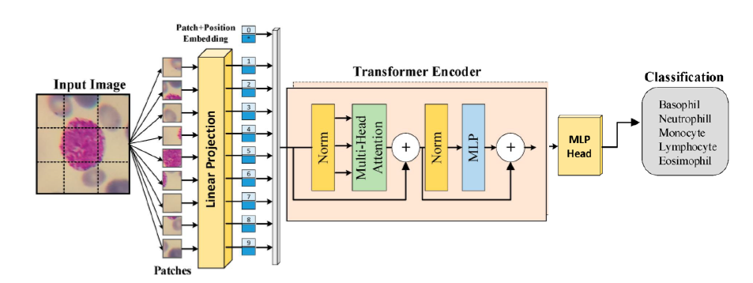
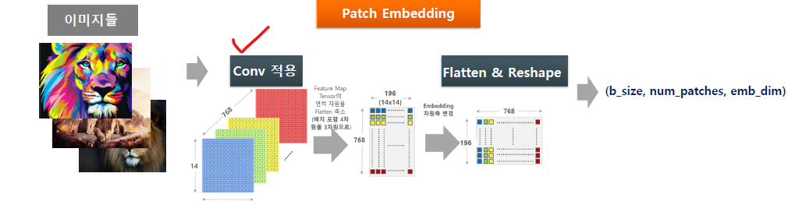
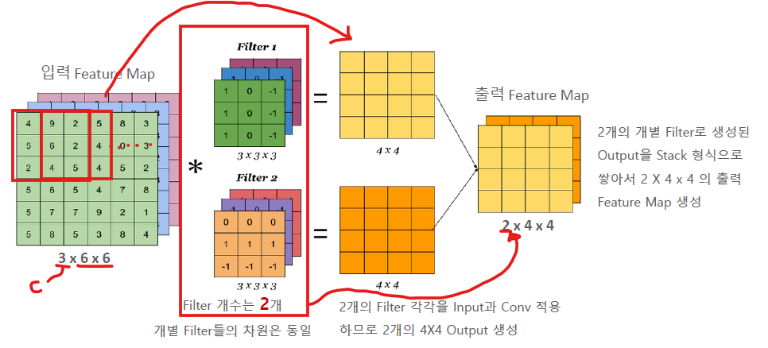
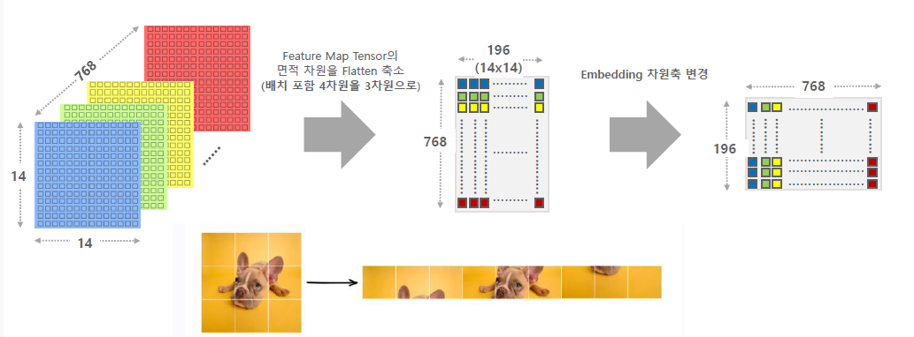
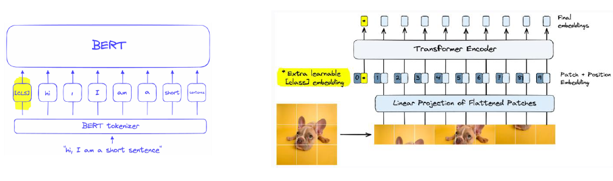
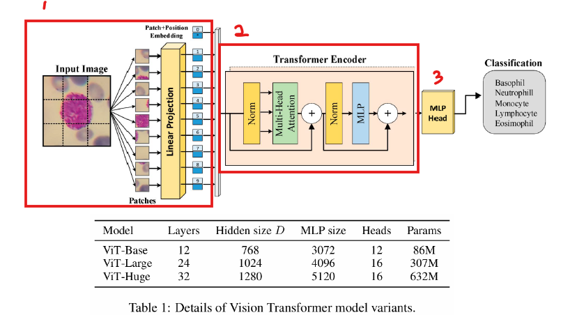

# 11_ViT

## 01_Vision Transformer 개요

### 01) 특징

- Multi Head Self Attention 만으로 CNN의 Local Feature Extraction과 Receptive Field 확장 능력을 Context Vector 학습으로 대체한 모델이다.
- 대규모 데이터 셋이 아닌 작은 데이터 셋에서는 CNN 보다 성능이 떨어진다.
  따라서 **반드시 대규모 데이터 셋에서 pretrained 된 weight가 필요**하게 된다.
- **로컬 패턴 인식이 약해서 작은 이미지에는 성능이 떨어지게 되며**, 고해상도 이미지에서는 계산비용이 매우 커지게 된다.
- 이미지와 텍스트를 같은 Transformer 구조안에서 통합할 수 있는 길을 열어 **이미지와 텍스트를 함께 다루는 멀티모달에서 주도적인 역할**을 수행
  - CLIP, BLIP, Qwen-VL

### 02) Vision Transformer 아키택처

- Transformer Encoder 모델의 입력을 문자열 토큰 임베딩에서 Image Patch Embedding 으로 전환하여 이미지 판별 모델 구축
  - Image Patch Embedding 은 input 이미지를 잘라서 정렬한 뒤에 Embedding 시키는 행위이며 문자열로 하던 것을 image로 바꿔서 하는 것
- 모델 아키택처는 Encoder 기반의 BERT와 유사하지만 Post Norm이 아닌 Pre Normalization 을 사용하게 된다. (현재 많은 모델이 Pre Norm을 채택한다.)

## 02_Patch Embedding

vit-b-16 >> 이게 픽셀을 16픽셀로 잘랐다는 뜻

- Image Patching은 텍스트에서 문장을 단어 토큰으로 나누듯, 이미지를 작은 정사각형 패치 토근들로 분활하는 과정이다.
- 여기서 Image를 일정하게 잘라서 사용하는게 아니라 Convolution layer에 넣게 되는데 Feature 들을 뽑아서 Embedding 시키기 위해서 이렇게 사용하는 것으로 보인다.

**Conv 복습**

- chanel 3 개 (r,g,b) 와 image 사이즈 
- 이렇게 된 차원을 Filter를 통해서 Sliding Window 방식으로 feature을 뽑아내게 된다. 
  (각 filter마다 feature를 뽑아냄)
- 그렇게 되면 Feature Map이 완성되는데 이 차원은 (filter 수, feature h, w)
  - 이렇게 3차원인 되는데 Batch(이미지 개수) 까지 포함되어야하기 때문에 4차원이 된다.
  - Feature Map의 채널 수 = Filter 개수

**Patch Embedding 프로세스 **

1. C=768, H=14, W=14 인 (B, 768, 14, 14) 크기의 Feature Map 을 (B, 196[num_patches], 768[Emb_dim]) 형태로 변환하여 ViT 에 입력
   - 위에서 Conv 와 똑같은 과정을 거치게 된다.
2. Conv가 끝난 뒤에 **면적 차원을 Flatten 하여 축소**하게 된다. (B, 768[Emb_dim ], 196[H*W])
   - 이렇게 축소하는 이유는 Transformer 모델의 input이 3차원이다. 
     (b_size, num_patch, emb_dim)
   - 이렇게 Flatten하여 차원을 축소하게 되면 이미지가 가지고 있던 위, 아래의 위치 정보를 잃게 된다. 따라서 위에서 ViT의 특징 중 하나인 **로컬 패턴 인식이 약해서 작은 이미지에는 성능이 떨어지게 되며** 이로 인해서 지역적이 아니라 Global 한 이미지 인식의 특징을 가지게 된다.
3. Shape 로 차원 축 변경하여 (b_size, num_patch, emb_dim) 형태로 만들어 준다.
   원래 차원  : (b_size, emb_dim, num_patch)

**Class Embedding 추가**

- 이미지를 판별을 해야한다. 따라서 이미지를 판별할 수 있는 추가적인 학습파라미터가 필요한데, 그것을 Class Embedding 이라고 하며 (b_size, emb_dim, num_patch) 에서 emb_dim 에 추가한다.
- Class Embedding 은 Transformer Encoder 의 출력 후 Linear Layer 적용하여 최종 Classification Layer 로 사용

## Vision Transformer 의 Module

- layer가 12라는 건 Transfomer Encoder가 12개 쌓여있다는 뜻

- MLP : Feed Forward

  

- layer가 12라는 건 Transfomer Encoder가 12개 쌓여있다는 뜻

	1. Image Patch Embedding 을 통해서 Feature를 뽑아내고 Transfomers 에 맞도록 Flatten 하는 과정
	2. Transformer Encoder를 통해서 학습 과정을 거친다. 
    - 이떄 특징은 Pre Normalization을 사용하게 된다. (성능이 더 좋음)
    - 논문 : On Layer Normalization in the Transformer Architecture (참고)
	3. Classification
    - MLP : Feed Forward

