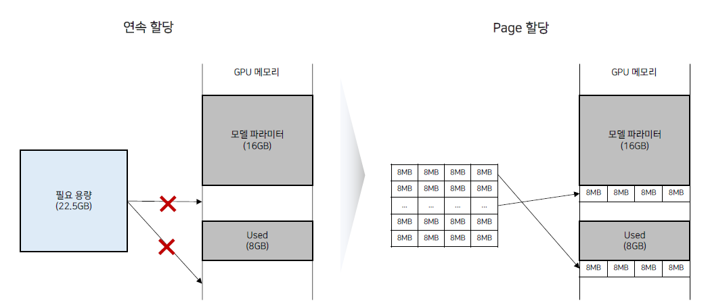
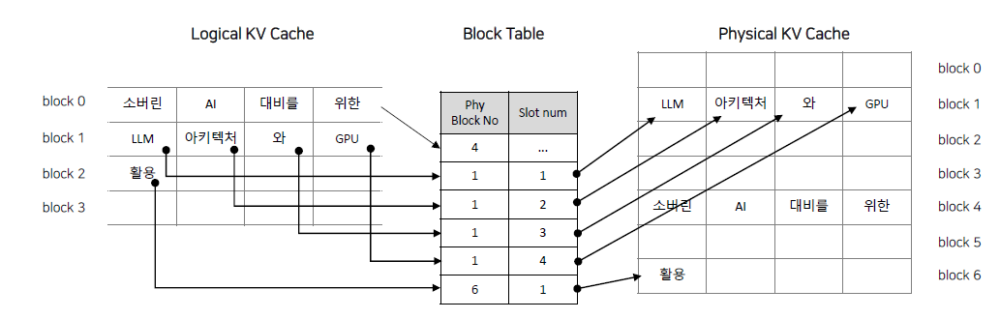
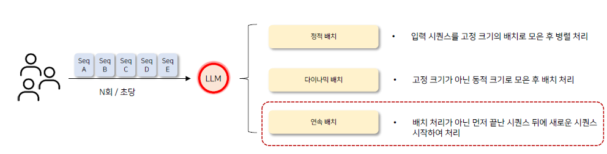
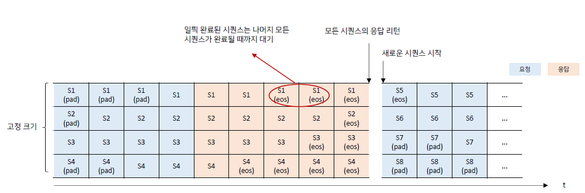
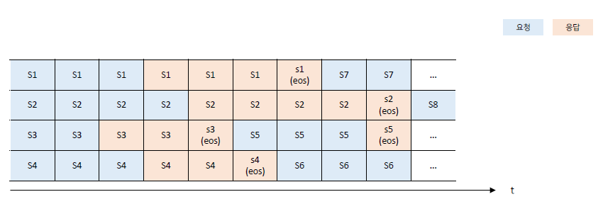
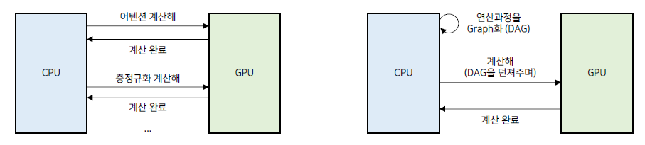

# 02_vLLM 고성능 원리

## 1. Paged Attention

- Transformers 같은 경우에는 연속 할당을 하게 된다.
- 따라서 메모리 파편화가 생기게 되고, 메모리를 효율적으로 사용하지 못하게 된다.
- vLLM은 page 할당을 하기 때문에 GPU 메모리를 더욱 효율적으로 사용할 수 있게 된다.

### Paged Attention 구조

- KV Cache를 일정한 블록으로 나눠 1개의 블록에는 고정된 토큰 수(일반적으로 16개) 에 대한 Key, Value 값이 저장된다.
- 메모리 할당/해제는 블록 단위로 수행된다.

- 메모리 저장은 마치 OS에서 저장하는 것과 같이 Pagnation 하는 방법과 같다.
- block을 일정한 크기로 나누고 Block Table을 만들어서 실제 물리적인 메모리 위치를 저장하게 된다.
- 이렇게 함으로써 해당 토큰의 위치가 어디에 저장되어있는지를 알 수 있게 된다.

**장점**

- 메모리 단편화 제거 : 기존 메모리 낭비율 60~80% > 4% 수준으로 절감
- 멀티 출력 시퀀스 생성 효율화
  - 1개의 프롬프트에 대해 여러개의 답변 생성시 입력 프롬프트에 대한 K,V 캐시  저장된 블록을 
    공유 가능
  - 즉 1개의 공통된 프롬프트를 재사용하게 됨으로써 만약 3개의 답변을 하게 된다면 공통된 프롬프트가 3개가 필요한 걸 1개로 줄일 수 있다는 뜻

## 2) Continuous Batch

- 동시에 많은 입력 프롬프트 요청이 틀어올 경우을 위해 사용하는 기술

### 정적 배치의 문제

- 쿼리가 동시에 여러개 들어온 경우
  - 배치처리를 위해서 한번에 모아서 보낸다.
  - 이때 배치 Sequence 길이를 맞추기 위해서 Padding을 하게 됨
    - 쿼리가 긴 애 때문에 불필요한 연산이 추가되게 됨
  - 그리고 동시에 던겨서 답변도 동시에 받게 된다.
  - 이때 Attention 구조는 자기 회기 구조! 
    **>> 따라서 이 방법을 가장 긴 답변이 나오는 애까지 기다려줘야한다.**

**즉 금방 답변하고 끝날 수 있는 Seq 도 답변이 긴 Seq 때문에 return을 대기하고 있어야 하는 현상이 발생**

### Continuous Batch

- 연속 배치의 경우 응답이 완료된 시퀀스가 존재하면 새로운 시퀀스가 바로 시작

## CUDA Graph

- 연산해야하는 과정들을 CPU에서 미리 Graph화 해서 메뉴얼을 GPU에 던져서 CPU와 GPU의 반복되는 정보 교환을 줄이는 방법

