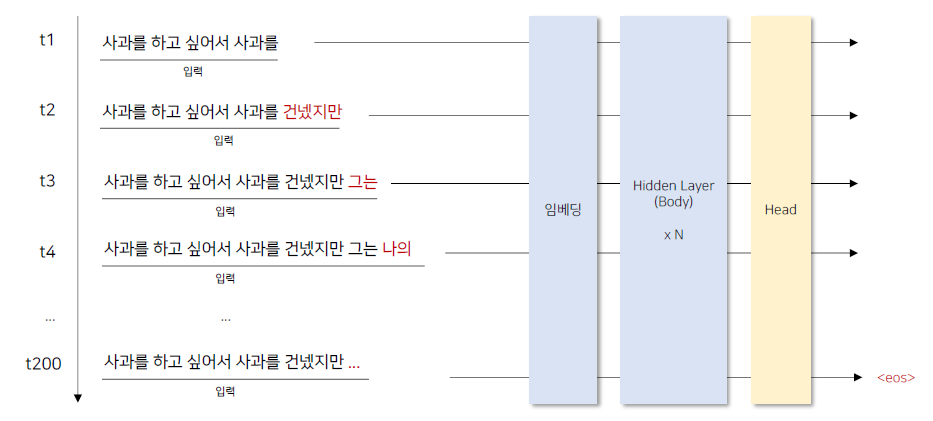
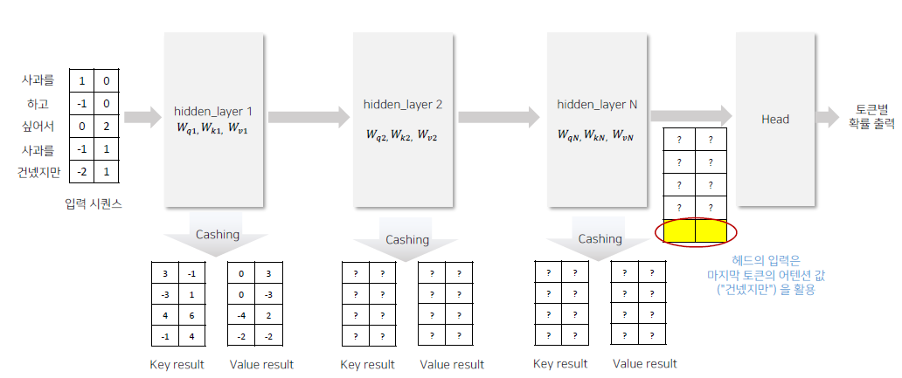
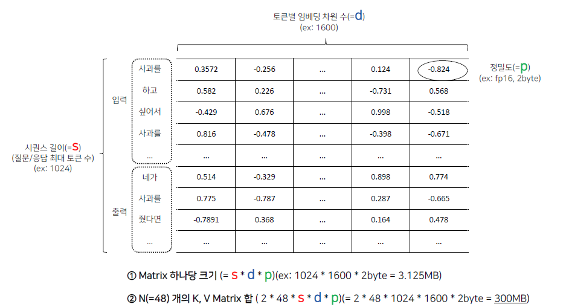
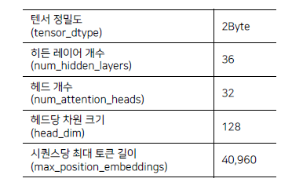

# KV Cache

### 디코더의 문제점

- 디코더 eos 토큰을 만나 종료할 때까지 출력을 입력에 넣어 어텐션 연산을 반복해야 함

- 위와 같이 t1, t2 ... 을 계산하려면 t1을 통째로 넣고 계산하고, t2를 통째로 넣어야 함
- 이러한 어텐션 반복 계산이 불필요하기 때문에 메모이제이션을 하는 것

### 캐시 필요 범위

- Key, Value 의 전체 값이 매번 어텐션 연산 시 필요하게 된다.
- 따라서 이것을 전체를 Cache해놓으면 됨

- 위 그림과 같이 hidden layer 1, hidden layer 2 들은 각각의 전체 Key, Value Result값이 필요하다.

- **KV Cache 가 저장되는 공간**
  - GPU에 캐싱되며 어텐션 연산 자체가 GPU에서 발생함
  - GPU 메모리(HBM)에 캐싱된 ,Key, Value 값을 이용하여 빠르게 어텐션 연산을 수행
    
- **KC Cache에 필요한 GPU의 필요량**
  - 여러 요인에 따라 다름
  - 파라미터의 정밀도, hidden layer의 개수, hidden_size 등에 따라 다름
  - 시퀀스 하나에 최대 몇개의 토큰을 포함할지에 대한 설정, 동시 몇 개의 시퀀스 처리 가능 등에 따라서 달라지게 된다.

- 2개의 서로 다른 입력이 동시에 들어왔을 경우
  - KV Cache 공유되지 않음
  - 시퀀승에 존재하는 토큰에 따라 1개라도 다르면 어텐션 연산 값이 달라질 수 밖에 없음
  - 따라서 KV Cache는 공유될 수 없음
  - KV Cache는 시퀀스의 문맥에 종속되어 있음.
  - Key, Value의 캐싱은 해당 시퀀스의 답변이 완료되기 전까지만 유용하며, 답변이 완료되면 사라지게 됨

### 기본적인 KV Cache에 필요 공간

- 1개의 질의에 대한 답변할 때 필요한 KV Cache 크기 예시

- 토큰별 임베딩 차원 수는 모델마다 다를 것
- N = 48 은 layer 의 수이며, 이것도 모델마다 다름(gpt 가 48개 layer를 가지고 있음)

### KV Cache 공간 할당 (Qwen/Qwen3-4B)

- Multi Head로 가정
- 40,960 * 32 * 128 * 2 * 2 * 36 = 22.5GB
-  최대 시퀀스 토큰 길이 * 

