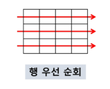
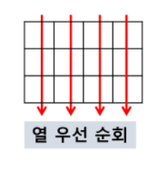
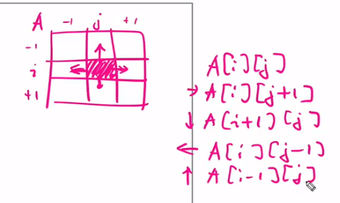
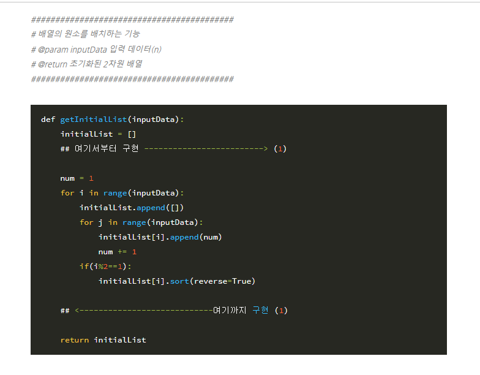
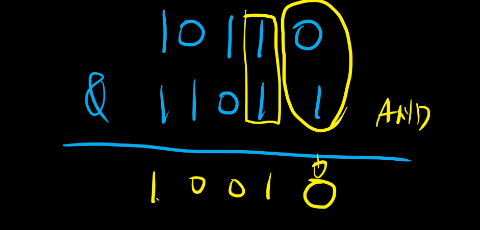
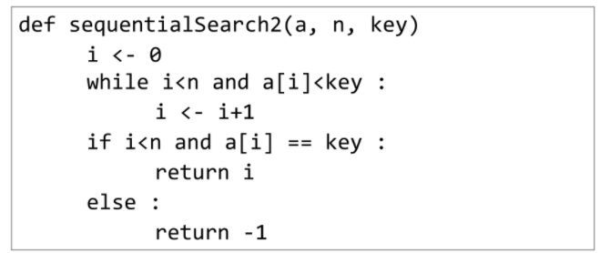

# 02_List

- 2차원 배열
- 부분집합
- 바이너리서치
- 셀렉션 알고리즘
- 선택정렬

- 디버깅
  - print(locals())
  - print(globals())
  - 이렇게 두개를 사용하면서 본다.

## 2차원 배열

1. 



2.  




3. 


```python
# i 행의 좌표
# j 열의 좌표
# n x m

# 1 행우선
for i in range(n):
    for j in range(m):
        Arrary[i][j]
        
lst = [[1,2,3],[4,5,6],[7,8,9]]        
for i in range(n):
    for j in lst[i]:
        print(j)
        
        
# 2 열우선
# 세로로 찾으라고 할 때
# 먼저 고정된 아이(j)가 열에 있기 때문에 세로로 된다.
for j in range(m):
    for i in range(n):
        Arrary[i][j]


# 3 지그재그
# 
for i in range(n):
    for j in range(m):
        Arrary[i][j + (m-1-2*j) * (i % 2)]
 
# 뒤에 아이가 (i % 2) ==> 이것이 홀수면 1, 짝수면 0이 된다
# (인덱스가) 짝수면 0부터 시작 
# (인덱스가) 홀수면 m-1부터 거꾸로 시작
# j + (m-1-2*j) 이부분
# ==> 정리하면 m-1-j ==> 이런식으로 j가 증가하면 마이너스 방향으로 점점 줄어들게 된다 따라서 저렇게 써주면 된다. ==> 그래서 j*2를 빼주는 것이다.
# 뒤에 i%2는 밑에와 똑같은 소리다
for i in range(4):
    if i%2 == 0:
        for j in range(4):
            print(lst[i][j])

    else: # 역순
        for j in range(4):
            print(lst[i][-j-1])

        
       
# 대각선 방향 알아보기
# 위아래 오른쪽-> 왼쪽
for i in range(len(lst)):
    print(lst[i][i])
    
# 위아래 왼쪽 -> 오른쪽
for i in range(len(lst)):
    print(lst[i][-i-1])  
    
    
# 대각선 합

total = 0
for i in range(len(lst)):
    total += lst[i][i]
    print(total)

```


#### 델타를 이용한 2차 배열 탐색




```python
arr = [0 ~ n-1][0 ~ n-1]

# 그려놓고 해야 헷갈리지 않는다
# 팁 ==> 오른쪽을 0번, 하, 1 좌 2 상 3 으로 한다
# 오른쪽을 시작으로 시계방향
# 90도로 꺽는 문제가 나왔을 때 사용하면 좋다
di = [0,1,0,-1]
dj = [1,0,-1,0]
for k in range(4):
    ni = i + di[k]
    nj = j + dj[k]

    
# 없는 인덱스를 걸러낼 때
# 예를 들어 바닷가에는 못가는 문제 같은 경우
di = [0,1,0,-1]
dj = [1,0,-1,0]
for k in range(4):
    ni = i + di[k]
    nj = j + dj[k]
    if 0 <= ni < n and 0 <= nj < m:
        arr[ni][nj]
        
# 동서남북에서 사용하면 좋다
di = [0,0,-1,1]
dj = [-1,1,0,0]

for i in range(0,n):
    for j in range(0,n):
        for k in range(4):
            ni = i + di[k]
            nj = j + dj[k]
            if 0 <= ni < n and 0 <= nj < m:
        		arr[ni][nj]

                
# 파이썬 특성 활용
for di, dj in [(0,1),(1,0),(0,-1),(1-,0)]:
    ni = i + di[k]
    nj = j + dj[k]
    if 0 <= ni < n and 0 <= nj < m:
        arr[ni][nj]

        
        
        
# 전체 확인
# 인덱스 주변 값
# (1,1)의 자리라면 ==> 2,8,4,6이 출력되게 된다.
for i in range(n):
    for j in range(n):
        for di, dj in [(0,1),(1,0),(0,-1),(1-,0)]:
            ni = i + di[k]
            nj = j + dj[k]
            if 0 <= ni < n and 0 <= nj < m:
                print(i, j, arr[ni][nj])


# 8개방향 알아보기
# 8방향
# (0,0) (0,1)  ==> 이런식으로 오른쪽 위에가 0,0이고 밑으로 내려갈때 (1,0)이다
# (1,0) (1,1)  ==> 따라서 (x,y)가 아니고 (y,x) 인 느낌
# 따라서 수학좌표를 생각하지 말자!!!!!
dx = [1, -1, 0, 0, 1 ,1, -1, -1]
dy = [0, 0, 1, -1, 1, -1, -1, 1]


                
```

- 대각선 합구하기
  - 이거 한번 구현해서 알아보기
  - 이거 숫자를 하나 넣어주면 n*n 배열이 나오게 되고
  - 지그재그 순서로 1 ~ 100까지 나오게 된다.




#### 2차원 배열에 0으로 시작 or 0으로 padding하기


```python
# 2차원 배열에서 0을 하나씩 붙히고 싶을때
# 패딩으로 0을 붙이고 싶을때
# 쓰임 ==> 1~N번행, 열 ==> 이렇게 되면 인덱스를 따로 저장을 해줘야한다.
# 

arr2 = [[0]*(N+1) + [[0]+ list(map(int, input().split())) for _ in range(N)]]


#0으로 둘러쌓인 아이로 만들기
arr3 = [[0]*(N+1) + [[0]+ list(map(int, input().split()))+[0] for _ in range(N)] + [0]*(N+1)]


```


### 전치 행렬

```python
# 전치행렬
for i in range(3):
    for j in range(3):
        #lst[i][j] # 가로로
        #lst[j][i] # 세로로
        # 따라서
        if j < i: # i가 작을때만 바꿀께 이유==> 가운데는 안바꿀 꺼
            lst[i][j], lst[j][i] = lst[j][i], lst[i][j]

# zip이랑 map으로 전치행렬 만들기
lst = [[1,2,3],
       [4,5,6],
       [7,8,9]]

lst = list(map(list, zip(*lst)))
# zip으로 언패킹을 하면 튜플로 되기 때문에
# map을 사용하여 
pprint(lst)
# [[1, 4, 7], [2, 5, 8], [3, 6, 9]]
[1, 4, 7]
[2, 5, 8]
[3, 6, 9]
            
lst = list(map(list, zip(*lst[::-1])))
#[[3, 2, 1], [6, 5, 4], [9, 8, 7]] 
[3, 2, 1]
[6, 5, 4]
[9, 8, 7]
        
lst = list(map(list, zip(*lst[::-1])))[::-1]
[7, 4, 1]
[8, 5, 2]
[9, 6, 3]

        
```


### 부분집합 합 문제


- 원소가 5개라면 32개의 부분집합이 생긴다
  - 2 **5 => 32개

- 왜냐하면 (1,2,3,4) ==> 이면 1이포함되거나 포함되지 않는경우 = 2가지
  - 이것이 4개 ==> 16가지

- 

```python
bit = [0,0,0,0]
for i in range(2):
    bit[0] = i
    for j in range(2):
        bit[1] = j
        for k in range(2):
            bit[2] = k
            for l in range(2):
                bit[3] = 1
                print(bit)
# 원가 굉장히 비효율적이어 보임
```


- 비트연산자

  - bin(222) ==> 222를 이진수로 나타내줄 수 있다.
  - int('10110', 2) ==> 이렇게 해주면 10진수로 바꾸겠어

  - 10진수를 2진수로 다루는 것이 비트 연산자이다

  

  - & : 비트 단위로 and 연산을 한다(둘다 참 => 참) (각각의 비트마다 비교)
    - j 번째의 값만1이면 0이 아닌값이 나오고. 
    - j 번째의 값만0이면 0인 값이 나온다. 
    -  T T => True
    - 10110 & 11011 => 하나씩 비교해 주겠어
    - 둘이 같으면 1 , 다르면 0이 나오게 된다.
    - 이렇게 되면 어떻게 되는거임? 

  

  - |  : 비트단위로 or 연산을 한다

  

  - <<: 피연산자의 비트 열을 왼쪽으로 이동시킨다 ==> 자릿 수를 하나 늘리겠어

    - a << 1 8칸의 배열이 왼쪽으로 1칸 가게 된다
    - bin(10 <<1) : 는 즉 2배 해주었다는 뜻이다
    - bin(10 <<2) : 4배
    - 1 << n : 즉 2**n 이라는 뜻이다 ==> 자리수 이동

    

  - \>\>: 피연산자의 비트 열을 오른쪽으로 이동시킨다

    - 끝자리는 없어지게 되고
    - 그자리를 오른쪽으로 한칸씩 이동시키게 된다. 
    - bin(10 \>\>1) : 는 즉 2로 나누었다든 뜻이다
    - bin(10 \>\>2) : 는 즉 4로 나누해주었다는 뜻이다


- i & (1<<j): i의 j번째 비트가 1인지 아닌지를 검사한다.
  -  (1<<j) : 1인데 1000000000.........( j 개)
  - i => j자리의 어떤 수 100101011001010
  - 왜? 계속 하나씩 늘려가면서 자릿수를 하나씩 비교한다는 뜻이다. 
  - 불린으로 표현이 된다.
  - 0 => false
  - 2**j ==> True
  - 이런식으로 나오게 된다.


- 있고 없고를 따져서 연산을 할 것이다

```python
arr = [3,6,7,1,5,4]

n = len(arr)

for i in range(1<<n): # 1을 계속 왼쪽으로 이동시킴 그럼  # 2**n 이다
    for j in range(n): # 1인지 아닌지를 n번 검사하게썽
        if i & (1<<j): 
            # if ==> 이게 0이 아니면 부분집합에 포함된것이야
            # 값이 1일 때 2의 j승이 나오게 된다 => True
            print(arr[j], end= ", ")
    print()
print()


arr = [3,6,7,1,5,4]
power_set []
for i in range(1<<n): # 1을 계속 왼쪽으로 이동시킴 그럼  # 2**n 이다
    tmp_set =[]
    
    for j in range(n): # 1인지 아닌지를 n번 검사하게썽
        if i & (1<<j): 
            # if ==> 이게 0이 아니면 부분집합에 포함된것이야
            # 값이 1일 때 2의 j승이 나오게 된다 => True
            tmp_set.append(arr[j])
    power_set.append(temp_set)
print(power_set)


# (1<<n)를 2**n 으로 바꿀 수 있음
# (1<<j)를 2**j 으로 바꿀 수 있음
```


## 검색

- 종류
  - 순차검색
  - 이진검색
  - 해쉬

### 순차검색

- 자료를 순서대로 검색하는 방법 ==> O(n)
- 구현이 쉽다. 그러나 비효율적임

- 2가지 경우
  - 정렬되어 있는 경우
  - 정렬이 안되어 있는 경우

- 과정
  - 찾을 것을 찾지 못하면 항상 끝까지 볼것임
  - 따라서 비효율적이다

```python
# 자주 실수하는 부분
# and를 쓸때 i를 먼저 넣어야 한다
# 만약 그것을 안했을 경우에는 인덱스 에러가 뜨게 된다
# 둘중에 앞쪽이 거짓이면 뒤에 값을 보지 않기 때문이다 ==> and 논리연산
i = 0
while i < n and a[i] != key:
    i += 1
```

- 정렬이 되어있는 경우




### 이진 검색

- 자료의 가운데에 있는 항목의 키값과 비교하여 다음 검색의 위치를 결정

- 조건

  - 자료가 정렬된 상태여야 한다.

- 순서

  1. 중앙에 있는 원소를 고름

  2. 목표 값과 비교

     - 원소의 값보다 적음
       - 왼쪽으로

     - 원소의 값보다 큼
       - 오른쪽과 비교

  3. 반복

- 구현

```python
# 이진검색
def binarySearch(a, n, key):

    start = 0
    end = n-1
    while start <= end: 
        # 스타스가 오른쪽에 있고 end가 왼쪽에 있으면 끝났다는 뜻
        middle = (start+end)//2
        if a[middle] == key:
            return True

        elif a[middle] > key: 
            # end는 오른쪽 애들을 버린거는 뜻이다(찍은 값이 더 크다)
            end = middle - 1 # 미들이 포함이면 여기 -1 이없어지면 됨
        else:
            start = middle + 1 
            # 앞쪽을 버린다는 뜻
    return False
```


## 인덱스

- 대량의 데이터를 매번 정렬하면, 프로그램의 반응이 느려짐
- 따라서 적절한 인덱스를 선정이 필요
- 그리고 테이블을 만들어서 정리를 시킨다


## 선택 정렬(selection sort)

- 기본적으로 기억해주어야 한다
- 암기

- 시간복잡도 O(n**)


- 순서
  - 리스트에서 최소값을 찾는다
  - 그 값을 리스트의 맨 앞에 위치와 교환한다
  - 반복

```python
def selctionsort(lst, n):
    for i in range(n-1):
        minIdx = i #일단 하나를 아무거나 잡아준다
        for j in range(i + 1, n):
            if lst[minIdx] > lst[j]: # 최솟값 구현
                minIdx = j # 최소값인것을 저장
        lst[i], lst[minIdx] = lst[minIdx], lst[i] 
        # 그리고 그것을 i랑 교환
```


## Selection Algorithm

- k 번째로 작은 수 or k 번째로 큰수 등을 찾는 방법이라고 한다
- k가 비교적 작을때 유용하다


```python
def select(lst, k):
    for i in range(k):
        minIdx = i
        for j in range(i + 1, len(lst)):
            if lst[minIdx] > lst[j]:
                minIdx = j
        lst[i], lst[minIdx] = lst[minIdx], lst[i]
    return lst[k-1]
```


### 연습문제 달팽이

1. 델타 이용
   - 더이상 갈곳이 없을때 꺽는다

2. 인덱스 계산
   - 아래쪽으로 갈때가 되었을때


 


