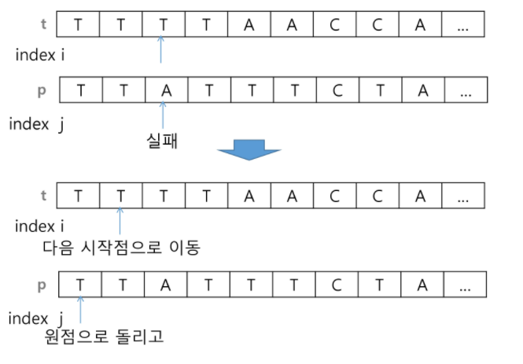
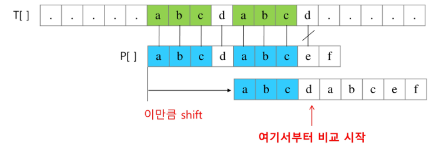
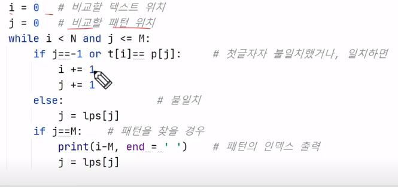

# 문자열(string)

- endian?
  - big-endian: 봤을 때 쉽다
  - little-endian : 계산했을 때 더 쉽다
- 유니코드 인코딩(UTF: Unicode Transformation Format)
  - UTF-8 (web)
  - UTF-16 (in windows, java)
  - UTF-32 (in unix)
  - 한글같은 경우=> 3바이트

### 고지식한 알고리즘 (brute Force)

- 패턴내의 문자들을 일일이 비교하는 방식으로 동작
- 시간복잡도 : O(MN)



```python
m = len(p) # 찾을 패턴의 길이
n = len(t) # 전체 텍스트의 길이

i =0
j =0
while j < m and i < n:
    if t[i] != p[t]:  # 실패하면 
        i -= j # 이전 시작위치로 되돌아감
        j = -1 
       # 이것을 하는 이유는 뒤에 1을 더할것이기 때문에 그럼 -1 에서 0으로 시작한다
	i += 1 # 계속 하나씩 
    j += 1
if j == m:
    return i -m # 검색 성공
else:
    return -1 # 검색 실패


for i (0-> n -1)
	for j (0-> n)
```


### KMP알고리즘==> 구현 한번 알아보기

- 시간복잡도: O(M+N)

  - 

- 설명

  - 일치하는 부분을 덩어리로 생각함
  - 그러면 앞에 굳이 앞에를 계산하지 않아도 됨

- 순서

  - 일치하면 
    - i += 1
    - j +=1

  - 패턴의 맨 앞에서 불일치
    - i += 1
    - 


- 앞에 일치하는 것의 개수를 세준다





### 보이어-무어 알고리즘


- 오른쪽 끝에부터 비교
- 문자가 다르다면 그냥 통째로 건너뛴다 ==> 패턴의 길이만큼 건너뛰면 된다.
- 가장 빠르다고 알려져 있다


