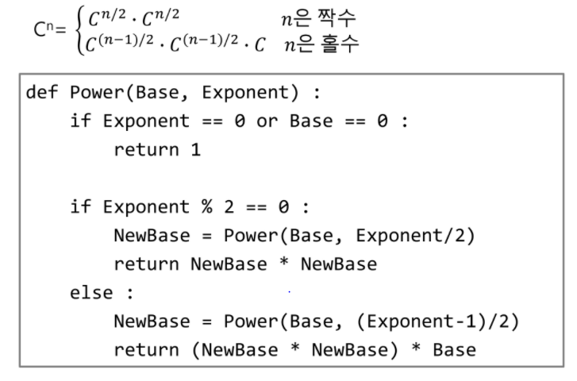
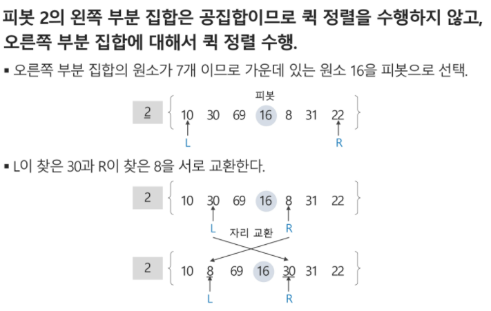

# 스택

### 자료구조 => 특정 자료구조가 왜 생겼는지에 집중해야한다.

- 데이터를 효율적으로 저장하고 관리하는 방법이다
- Data = 정보

데이터가 컴퓨터에 어떻게 저장??

- storage : 창고같은 느낌(HDD, SSD, USB, CD)등
- memory:  임시적으로 저장되는 곳(RAM, 캐시,)
  - RAM(Random Access Memory)
    - 랜덤으로 저장한다
    - 왜? 빠르게 하기 위해서
    - 순차적으로 저장하면 느리게 된다

### 데이터 타입

- 데이터 타입마다 다른 공간에 저장하게 된다.
- 데이터 타입이 중요한 이유?
  - 효율적으로 저장을 위해서

- 새로운 데이터 타입을 만들어 주어야 한다 = class같은 것들 등등

- 스택 큐? 등등 왜 생겼는지 알는 것이 중요하다

### ADT(Abstract Data Type) ==> 추상

- 데이터가 가지고 있는 공통점을 뽑아  ==> 구조와 연산 = 자료구조

### 스택

- 선입후출
- 브라우저 히스토리 같은 것들이 스택
  - 뒤로가기 같은 것들
- 콜스택?
- 스택이 나온 이유: 재귀를 표현하기 위해서 나온 것

##### 연산

- CreateStack : size도 필요하다
- isEmpty
- isFull
- Push
- Pop
- Peek, Top
- items = [None] * size

### Memorization

### DFS

- 깊이 우선 탐색(DFS)
  - 한방향으로 갈 수 있고 경로가 있는 곳까지 깊이 탐색
  - 스택으로 구현 가능
  - 재귀로 구현 가능

- 순서

## 백트래킹(Backtracking)

- 최적화 문제
- 결정 문제를 해결할 수 있다. (a~b를 갈 수 있니?) (yes or no)
  - 미로찾기
  - n-Queen
  - mapp coloring

- 미로찾기
  - 갈림길이 있을때 부터 스택에 visited를 해놓는다
  - 지나온 길을 되돌아가면서 탐색을 다시 시작한다

- 백트래킹과 깊이 우선 탐색의 차이
  - 백트래킹은 불필요한 경로를 조기 차단한다. 
  - 따라서 경우의 수가 줄어들수 있다
  - 하지만 최악의 경우 지수함수 시간을 요한다

- 탐색중에 어떠한 조건을 탐색이라고 한다
- 예를 들어서 어차피 직선으로 갈 아이를 돌아가면 break걸고 그 길을 지운다

#### 순열

### 퀵 정렬

- 순서

  - 파티션

  - 퀵 (a, 시작, p-1)

  - 퀵 (a, p+1 , 끝)

- 파디셔닝

1. 

- 
- L ==> 피봇보다 크거나 같은 원소를 찾는다
- R ==> 피봇보다 작거나 같은 원소를 찾는다
- 두 원소가 만날때 까지 진행을 한다
- LR이 만났다 ==> 더이상 자리를 바꿀 아이가 없다는 뜻

- 만약에 

