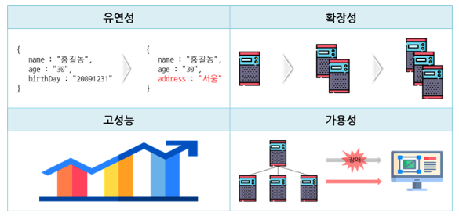
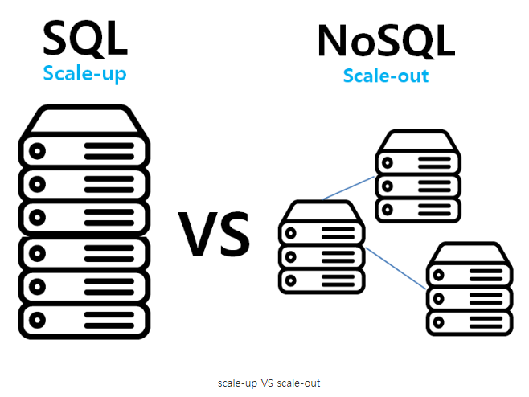
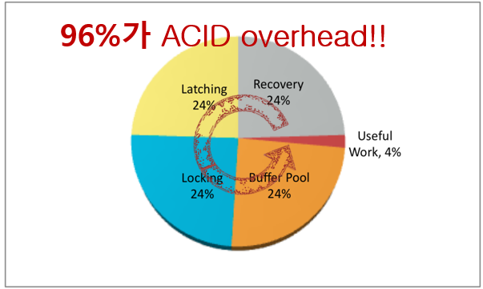
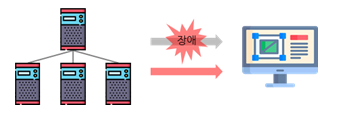
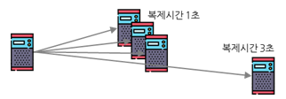

# SQL & NoSQL

> 01_Database와 DBMS?
>
> 02_SQL (관계형 데이터 베이스)
>
> 03_NoSQL
>
> 04_NoSQL이 핫해진 이유
>
> 05_SQL & NoSQL의 차이점

출처

https://zangzangs.tistory.com/79

http://blog.skby.net/nosql-base-%EC%86%8D%EC%84%B1/

## 01_Database와 DBMS?

> 1_Database
>
> 2_DBMS(Database Management System)
>
> 3_DBMS의 종류

#### 1_Database

- 컴퓨터 시스템에 저장되는 **구조화된 정보** 혹은 **데이터의 집합**

  - Excel도 구조화된 정보이기 때문에 Database라고 할 수 있음

  

#### 2_DBMS

> Database Management System

- 데이터를 정의(define), 저장(store), 검색 및 인출, 관리하기 위해 사용되는 소프트 웨어
- Excel같은 경우 이러한 기능이 없기 때문에 DBMS라고 하지 않는다.

#### 3_DBMS의 종류

​	**1. SQL**

​	**2. NoSQL**

## 02_SQL (관계형 데이터 베이스)

> 1. 정의
> 2. 기능&특징

**1. 정의**

- Structured Query Language (구조화 된 쿼리 언어)

- 데이터베이스 자체를 나타내는 것이 아니라, **특정 유형의 데이터베이스와 상호 작용하는 데 사용 하는** 쿼리 언어

**2. 기능&특징**

- RDBMS에서 데이터를  **CRUD**할 수 있음

- 데이터가 **테이블(Column, row) 형태**로 저장
- 테이블 사이의 관계(relationship)로 구조 형성

## 03_NoSQL

> 1. NoSQL란?
> 2. 종류
> 3. 특징

##### 1. NoSQL이란?

- 특정 데이터 모델에 대해 **특정 목적에 맞추어 구축되는 데이터베이스**.

- 현대적인 애플리케이션 구축을 위한 **유연한 스키마**를 갖추고 있다.
- Not only SQL => SQL만 사용하지 않겠다.

**2. 특징**

- 확장성 : 스케일 아웃에 의한 **서버 확장이 용이**
- 유연성 : **스키마 없이** 동작한다. / **대부분 클러스터에서 실행할 목적**
- 고성능 : 대용량 데이터를 처리하는 성능이 뛰어나다
- 가용성 : 여러 대의 백업 서버 구성이 가능하여 장애 발생 시에도 **무중단 서비스가 가능**

**3. 종류**

- **Document** : 

  - 데이터 그 자체를 저장하는 것 (Json)

    

- **Graph** : 

  - 노드와 노드사이의 관계를 저장함

  - ex_ 신용카드 분실후 다른 곳에서 사용했을 경우

    

- **Key-Value** :

  - 해시 테이블
  - 직관적으로 많이 넣음

  - 빅데이터로 사용

## 04_NoSQL이 핫해진 이유

- 빅데이터
- 서비스의 스케일이 커짐
- RDB가 해결해주지 못하는 것을 해소해줄 수 있는 NoSQL이 Open Source로 나오기 시작

## 05_SQL & NoSQL의 차이점

> 1_Scalability
>
> 2_Query
>
> 3_Schema
>
> 4_Transaction

### 1_Scalability

수평적 확장성 vs 수직적 확장성 (Horizontal vs Vertical Scalability)

#### - 수평적 확장성

- NoSQL
- 서버 개수를 늘리게 되면 스케일이 계속 늘어나게 되어 있음 => 장비의 성능을 올림
- 분산 저장
  - 데이터를 저장할 때 DB서버에 나누어서 저장

- 응답속도는 어느정도 보장이 된다.
  - 이유 : 데이터 구조 (hash => O(1))

#### - 수직적 확장성

- RDBMS의 머신을 더 좋은 머신으로 업그레이드를 하는 것
  - ex) SSD의 메모리를 늘림, cpu를 좋은 것으로 바꿈 등등
- 돈을 한 컴퓨터에 투자하는 방식
- Scalability 관점에서는 돈이 많이 들게 되고, 손이 많이 가게 된다.

------

### 2_Query

#### - 간단한 쿼리

- NoSQL의 특징
- 간단한 데이터 일때 사용하기 좋음
- Facebook, instagram같이 유저가 폭발적으로 증가할 수 있으면서 간단한 정보를 가지고 있는 경우
  - 다차원 분석을 하던 것들이 NoSQL로 많이 이동하고 있는 추세

#### - 복잡한 쿼리 

- SQL의 특징

- 데이터가 join을 계속해야하는 데이터라면  SQL문이 있는 경우가 더 좋음
  - 쇼핑몰같은 정형데이터가 많은 경우에는 SQL이 더 좋을 때가 많음

------

### 3_Schema

#### - Strick Schema 

- 인덱스를 많이 넣게 된다.
- 이를 이용하면 특정 데이터를 찾는 데 걸리는 시간은
  전체 데이터를 스캔하지 않고 logN만큼의 시간을 얻을 수 있다.
  탐색 시간 : logN
- 즉 검색 속도가 빨라짐

#### - Schema-free

- 최대한 key를 기준으로 데이터를 찾게 된다.

- 중간에 인덱스를 넣어주는 것이 비효율적이기 때문 ?? => 왜?

------

### 4_Difference of Transaction

#### - ACID

- 원자성
- 일관성
- 독립성
- 지속성

#### - BASE

(Basically Available, Soft State, Eventually Consistent)

- **Basically Available(가용성)**
  

  - Master 서버에 장애 발생 시에도 여러 Slave 서버로 인해 무중단 서비스가 가능함
  - 즉 부분고장이 있어도 쓸수 있으면 된다.

  

- **Soft State(독립성)**

  - 각각의 데이터가 도달한 시점에 데이터가 갱신됨
    - 일관성이 없는 상태에서 data읽기 가능

  

- **Eventually Consistent(결과적 일관성)**
  
  
  - 일시적으로 일관성이 깨질 수 있음
  - 하지만 나중에는 다시 돌아와야한다.

트랜잭션의 차이

RDB : ACID가 확실하다

NoSQL : injection타임때에 데이터를 읽을 수 있다는 것을 보장하지 않음

