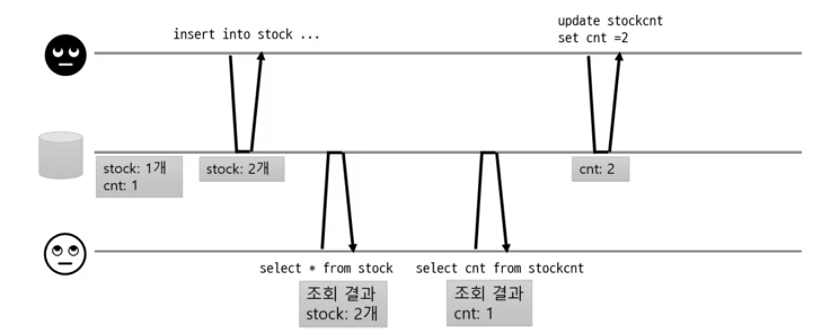
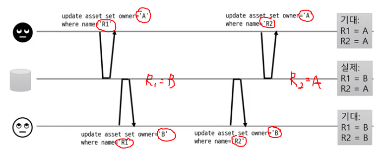
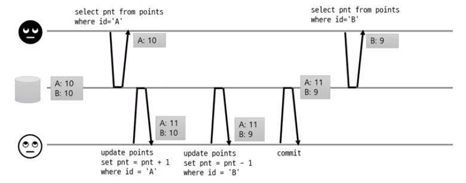
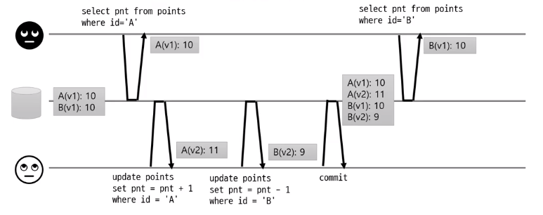
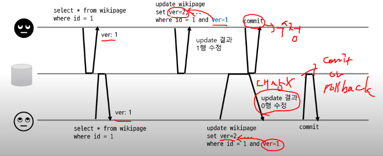
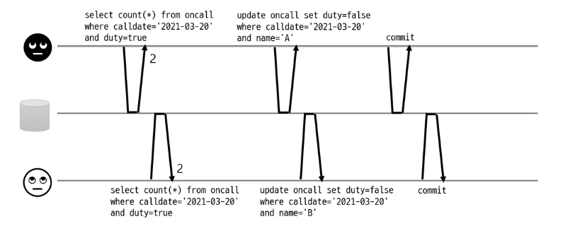
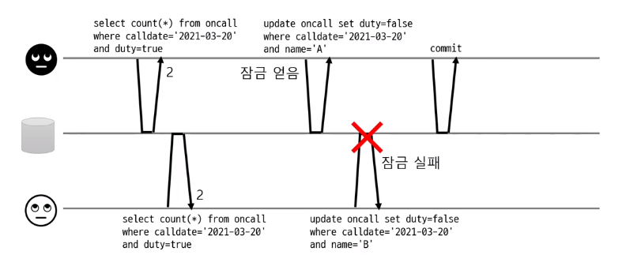

# Transaction

출처

https://gyoogle.dev/blog/computer-science/data-base/Transaction.html

https://www.youtube.com/watch?v=poyjLx-LOEU&t=289s

https://mangkyu.tistory.com/30

https://mangkyu.tistory.com/154


## 01_트랜잭션이란?

- 데이터 베이스의 상태를 변화시키기 위해 수행하는 **최소단위**

```
ex) 사용자 A가 사용자 B에게 돈을 보낸다

진행 되는 DB작업
1. A계좌에서 10000원 빠짐
2. B계좌에서 10000원 들어옴

송금 : 출금 UPDATE문 + 입금 UPDATE문 (2개의 쿼리문)
=> 이와 같이 쪼갤 수 없는 단위 = 트랜젝션
```


#### Transaction의 필요성

**commit** : 2작업이 모두 성공할 경우, DB가 일관성있는 상태일 때 이를 알려주기 위해 사용하는 연산

**rollback** : 작업이 진행하던 중 하나라도 실패할 경우 모두 되돌린다.

```
송금 : 출금 UPDATE문 + 입금 UPDATE문 (2개의 쿼리문)
2가지 쿼리문 중에서 1개만

if
출금 UPDATE문 = 성공
입금 UPDATE문 = 실패
==> 돈 1만원 증발

결론
따라서 중간에 실패가 있을 시==> 처음으로 돌아가야한다.
```


## 02_트랜젝션의 특징

##### 원자성(Atomicity)

- 트랜잭션이 DB에 **모두 반영**되거나, 혹은 **전혀 반영**되지 않아야 된다.


##### 일관성(Consistency)

- 트랜잭션의 작업 처리 결과는 항상 **일관성** 있어야 한다.

  - 결과가 항상 같아야한다. => 당연한 것

  

##### 독립성(Isolation)

- 둘 이상의 트랜잭션이 동시에 병행 실행되고 있을 때, 어떤 트랜잭션도 다른 트랜잭션 연산에 끼어들 수 없다.


##### 지속성(Durability)

- 트랜잭션이 성공적으로 완료되었으면, 결과는 영구적으로 반영되어야 한다.

  => 당연한 것


## 03_Race Condition

> 경쟁 상태
>
> 1. diry read
> 2. dirty write
> 3. Read Skew
> 4. Lost Update
> 5. Read Skew2


#### 1. dirty read

> 커밋 되지 않은 데이터 읽기

 -  cnt가 업데이트가 되기전에 cnt를 조회해버릴 경우
 -  if : A가 rollback될 경우 => B는 존재하지 않는 값을 조회하게 된다.



**처리방법 **: **Read committed**

- 커밋된 데이터만 읽기
  - 커밋된 값과 트랜잭션 진행중인 값을 따로 보관
  - 트랜잭션 진행중인 값은 읽지 않는다


#### 2. dirty write

> 커밋되지 않은 데이터 덮어쓰기

-  A : R1, R2를 A로 변경
- B : R1, R2를 B로 변경



**처리방법 **: **Read committed**

- 커밋된 데이터만 덮어쓰기
  - 행 단위 잠금 사용
  - 같은 데이터를 수정한 트랜잭션이 끝날 때까지 대기


#### 3. Read Skew

> 읽는 동안 데이터 변경

- A : 결과값 10/9
  - 원래 받아야하는 결과값 : 11/9


데이터가 깨지는 현상이 발생한다. 




**처리방법 **: **Repeatable Read**

- 트랜잭션 동안 같은 데이터를 읽게 함
  - MVCC(Multi-Version Concurrency Control)
    - 여러 버전을 저장함
    - 읽는 시점에 특정 버전에 해당하는 데이터만 읽음


**구현**

- Black : v1로 저장 / White : v2로 저장
  - A는 v1으로 저장했기 때문에 트랜잭션을 끝날때 까지 v1으로 받는다




#### 4. Lost Update

> 변경 유실

- read cnt가 3이 되는 것을 기대
- 하지만 readcnt가 2가 되는 현상


**순서**

​	1 : Black가 읽는다 => readcnt 1

​	2 : White가 읽는다 => readcnt 1

​	3 : Black가 update =>readcnt 2

​	4 : White가 wait (트랜젝션이 끝날때까지)

​	5 : Black의 commit이 끝난 뒤 White update 하지만 다른 버전

​	6 : 따라서 Readcnt 2


**처리방법 **:

**1. 원자적 연산 사용**

- DB가 지원하는 원자적 연산 사용
- 동시 수정 요청에 대해 DB가 순차적으로 알아서 처리
- ex) update article set readcnt = readcnt + 1 where id = 1// 순차적으로 알아서 연산해줌
  - 단 DB가 지원을 해줄 경우에만 사용가능


**2. 명시적인 잠금**

- 조회할 때 수정할 행을 미리 잠금
- 즉 작업하는 동안에는 다른 트랜잭션은 select조차 못하게 된다.
- ex) select ... for update :
  -  잠금이 풀릴때까지 대기를 하게 된다.
  - 다른 트랜잭션의 update후에 본인 것을 업데이트하게 된다.


**3. CAS(Compare And Set)**

- 수정할 때 값이 같은지 비교해서 같은 경우에만 변경 발생




#### Read Skew2

> 읽는 동안 데이터 변경2

**조건**

- 당직자는 무조건 1명 이상

**상황**

- 당직자가 2명/ 동시에 당직자를 뺄 경우?
  - 동시에 데이터 접근

- **물리적**으로는 트랜젝션 충돌이 아니다
  - 같은 행을 건드린 것이 아니기 때문
  - 똑같은 사람이 아니라 서로 다른 사람이기 때문
- **논리적**으로는 트랜젝션 충돌




**처리방법 **: **Serializable**

- 인덱스 잠금이나 조건 기반 잠금 등 사용한다.




#### 정리

- 잠금시간은 최소화
  - 잠금 시간이 길어지면 성능(처리량) 저하

- 동시성 문제를 다룰때 알아야 할 점

  - 사용하는 DB의 기본 격리 레벨

  - DB의 격리 레벨 동작방식 (DB마다 동작 방식이 다를 수 있음)


## 04_Spring에서 트랜젝션 사용

> 1. Transaction 동기화
> 2. Transaction 추상화
> 3. AOP를 이용한 Transaction분리
> 4. Spring 트랜젝션의 세부 설정

#### 1. Transaction 동기화

> Connection 객체 : 자바에서 DB와 연결하기 위해 사용하는 객체

- 트랜잭션을 시작하기 위한 Connection 객체를 특별한 저장소에 보관해두고 필요할 때 꺼내쓸 수 있도록 하는 기술
- 트랜잭션 동기화 저장소는 작업 쓰레드마다 Connection 객체를 독립적으로 관리하기 때문에, 멀티쓰레드 환경에서도 충돌이 발생할 여지가 없다. 그래서 다음과 같이 트랜잭션 동기화를 적용하게 된다.

```java
// 동기화 시작
TransactionSynchronizeManager.initSynchronization();
Connection c = DataSourceUtils.getConnection(dataSource);

// 작업 진행

// 동기화 종료
DataSourceUtils.releaseConnection(c, dataSource);
TransactionSynchronizeManager.unbindResource(dataSource);
TransactionSynchronizeManager.clearSynchronization();
```

- 하지만 Hibernate에서는 Connection이 아닌 Session이라는 객체를 사용하기 때문에 이러한 기술 종속적인 문제를 해결하기 위해 Spring은 트랜잭션 관리 부분을 추상화한 기술을 제공


#### 2. 트랜잭션(Transaction) 추상화

- 애플리케이션에 각 기술마다(JDBC, JPA, Hibernate 등) **종속적인 코드를 이용하지 않고도 일관되게 트랜잭션을 처리**할 수 있도록 해주고 있다.


- **사용하는 기술과 무관하게** PlatformTransactionManager를 통해 다음의 코드와 같이 **트랜잭션을 공유하고, 커밋하고, 롤백**할 수 있다.

```java
public Object invoke(MethodInvoation invoation) throws Throwable {
	TransactionStatus status = this.transactionManager.getTransaction(new DefaultTransactionDefinition()); // 이부분 코드 확인하기
	
	try {
		Object ret = invoation.proceed();
		this.transactionManager.commit(status);
		return ret;
	} catch (Exception e) {
		this.transactionManager.rollback(status);
		throw e;
	}
}
```


#### 3. AOP를 이용한 트랜잭션(Transaction) 분리

- 트랜잭션 코드와 비지니스 로직 코드가 복잡하게 얽혀있는 경우

  - 트랜잭션 코드와 비지니스 로직은 **서로 성격이 다르다**/ **주고 받는 경우도 없다**
    => 즉 분리 시키는 것이 맞다

  - But, 어떠한 방법을 이용하여도 트랜잭션을 담당하는 기술 코드를 완전히 분리시키는 것이 불가능하였음

```java
public void addUsers(List<User> userList) {
	TransactionStatus status = this.transactionManager.getTransaction(new DefaultTransactionDefinition());
	
	try {
        // 비지니스 로직
		for (User user: userList) {
			if(isEmailNotDuplicated(user.getEmail())){
				userRepository.save(user);
			}
		}
		
        // transaction 코드
		this.transactionManager.commit(status); 
        
	} catch (Exception e) {
        
        // transaction 코드
		this.transactionManager.rollback(status);
		throw e
	}
}
```


결론

- 해당 로직을 클래스 밖으로 빼내서 별도의 모듈로 만드는 AOP(Aspect Oriented Programming, 관점 지향 프로그래밍)
- 트랜잭션 어노테이션(@Transactional)을 지원

```java
@Service
@RequiredArgsConstructor
@Transactional // Tranaction코드
public class UserService {
	
    // 비지니스 로직
    private final UserRepository userRepository;

    public void addUsers(List<User> userList) {
        for (User user : userList) {
            if (isEmailNotDuplicated(user.getEmail())) {
                userRepository.save(user);
            }
        }
    }
}
```


## 05_Spring 트랜젝션의 세부 설정

> - 트랜잭션 전파
> - 격리 수준
> - 제한시간
> - 읽기전용

#### **트랜잭션 전파**

- 정의
  - 경계에서 이미 진행중인 트랜잭션이 있거나 없을 때 어떻게 동작할 것인가를 결정하는 방식
  - 예를 들어 어떤 A 작업에 대한 트랜잭션이 진행중이고 B 작업이 시작될 때 B 작업에 대한 트랜잭션을 어떻게 처리할까에 대한 부분이다.


-  **A의 트랜잭션에 참여(PROPAGATION_REQUIRED) **
  - B의 코드는 새로운 트랜잭션을 만들지 않고 A에서 진행중인 트랜젝션에 참여할 수 있게 한다.
  - B의 작업이 마무리 되고 나서, 남은 A의 작업을 처리 할때 예외가 발생하면 AB작업 모두 취소
  - 이유 :  A와 B의 트랜잭션이 하나로 묶여있기 때문


-  **독립적인 트랜잭션 생성(PROPAGATION_REQUIRES_NEW) **

  - B의 트랜젝션은 A의 트랜잭션과 무관하게 만듦

  -  B의 트랜잭션 경계를 빠져나오는 순간 B의 트랜잭션은 독자적으로 커밋 또는 롤백되고 이것은 A에 어떠한 영향도 주지 않는다

    

-  **트랜잭션 없이 동작(PROPAGATION_NOT_SUPPORTED) **

  - B의 작업에 대해 트랜잭션을 걸지 않을 수 있다. 만약 B의 작업이 단순 데이터 조회라면 굳이 트랜잭션이 필요 없을 것


#### **격리 수준**

- 정의

  - 적절하게 격리수준을 조정해서 가능한 많은 트랜잭션을 동시에 진행시키면서 문제가 발생하지 않도록 제어해야 한다

- DefaultTransactionDefinition에 설정된 격리수준은 ISOLATION_DEFAULT로 DataSource에 정의된 격리 수준을 따른다는 것이다.

- DB나 DataSource에 설정된 기본 격리 수준을 따르는 것이 좋지만, 특별한 작업을 수행하는 메소드라면 독자적으로 지정해줄 필요가 있다.

  

#### **제한시간**

- 트랜젝션을 수행하는 제한 시간을 설정 할 수 있음
- PROPAGATION_REQUIRED나 PROPAGATION_REQUIRES_NEW의 경우에 사용해야만 의미가 있다.
- PROPAGATION_REQUIRED
- PROPAGATION_REQUIRES_NEW


#### **읽기전용**

-  트랜잭션 내에서 데이터를 조작하는 시도를 막아줄 수 있을 뿐만 아니라 데이터 액세스 기술에 따라 성능이 향상될 수 있다.
- 데이터 액세스 기술???


