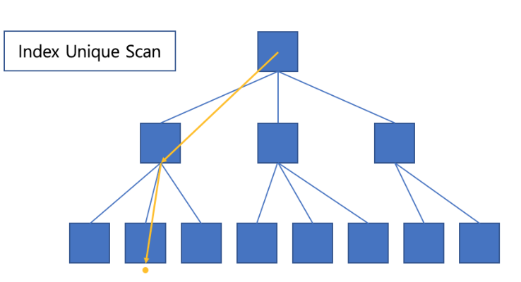
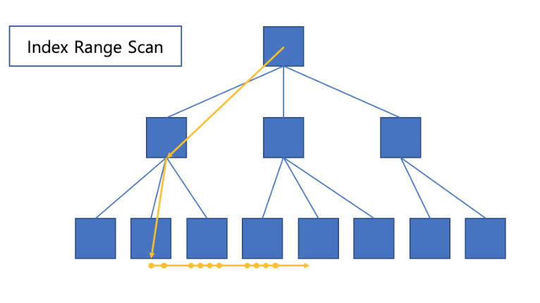
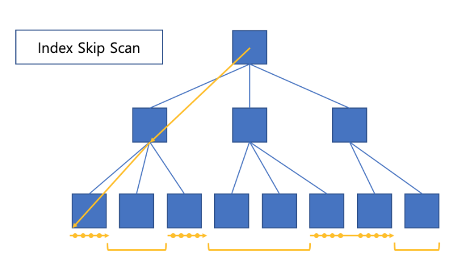
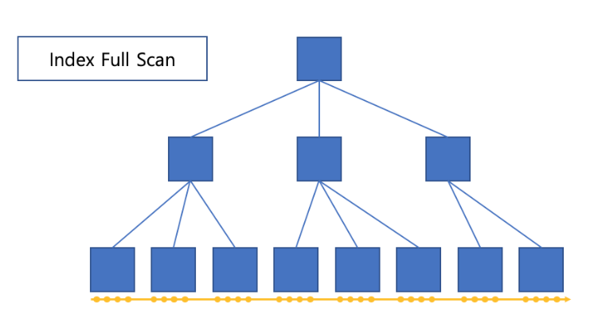
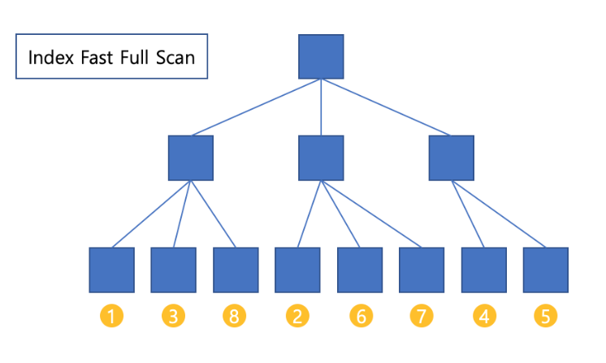

https://dataonair.or.kr/db-tech-reference/d-guide/sql/?mod=document&uid=360#:~:text=MultiBlock%20I%2FO%EB%8A%94%20I,%EA%B0%99%EC%9D%B4%20%EC%9D%BD%EB%8A%94%20%EA%B2%83%EC%9D%B4%20%EC%9C%A0%EB%A6%AC%ED%95%98%EB%8B%A4.


순서

- FROM-WHERE-GROUP BY-HAVING-SELECT-ORDER BY
- 


Query 관련

- where절이 Having절 보다 먼저 실행된다.
  - Where절로 미리 데이터 크기를 작게 만든 후 Group by한 뒤에 having을 사용하면 group by에서 다뤄야하는 데이터 크기가 작아지낟.
- Index활용
- 조건 부여시, 가급적 DB값에 별도의 연산을 걸지 않기

```sql
-- 전 쿼리
SELECT m.id, ANY_VALUE(m.title) title, COUNT(r.id) r_count 
FROM movie m 
INNER JOIN rating r 
ON m.id = r.movie_id 
WHERE FLOOR(r.value/2) = 2 
GROUP BY m.id;

-- 향상된 쿼리
SELECT m.id, ANY_VALUE(m.title) title, COUNT(r.id) r_count 
FROM movie m 
INNER JOIN rating r 
ON m.id = r.movie_id 
WHERE r.value BETWEEN 4 AND 5 
GROUP BY m.id;
```

- 기존에 r.value가 가지고 있는 index를 그대로 활용할 수 있다.
  - 따라서 모든 필드 값을 탐색할 필요가 없어 전 쿼리 대비 짧은 Running Time을 가질 수 있다.


- select distinct, union distinct와 같이 중복 값을 제거하는 연산을 최대한 사용하지 않는 것

```sql
-- Inefficient
SELECT DISTINCT m.id, title 
FROM movie m  
INNER JOIN genre g 
ON m.id = g.movie_id;

-- Improved
SELECT m.id, title 
FROM movie m  
WHERE EXISTS (SELECT 'X' FROM rating r WHERE m.id = r.movie_id);
```

- 중복 값을 제거하는 연산은 많은 시간이 걸린다.
- EXISTS를 활용하는 것이 더 좋다.
  - 연산의 대상이 되는 테이블의 크기를 최소화 하는 방법을 생각


- 3개 이상의 테이블을 JOIN할 경우 
  ==> 가장 큰 테이블을 FROM절에 배치
  ==> JOIN절에는 남은 테이블을 작은 순서대로 배치

  ==> 많은 테이블을 JOIN할 경우 JOIN에 대한 경우의 수가 생긴다. ==> OPTIMIZER가 PLANNING을 사용하게 되면서 비용이 증가하게 된다.

- 자주 사용되는 테이터의 형식은 전처리된 테이블을 따로 보관/관리하기
  - 로드 테이블은 기간이 길어지면 DB에 부하가 걸리는 경우가 많음
  - 필요한 컬럼들로 전처리된 경량테이블을 만들면 효율이 증가된다.


- where절의 과변을 가공하지 않을 것

  - ```sql
    select ename, sal*12 from emp where sal *12 = 36000;
    -> select ename, sal*12 from emp where sal = 36000/12;
    ```

  - ```sql
    SELECT ename, job FROM emp WHERE substr(job,1,5)='SALES';
    -> SELECT ename,job FROM emp WHERE job like 'SALES%';
    ```

  - ```sql
    SELECT ename, hiredate FROM emp WHERE to_char(hiredate, 'RRRR') = '1981';
    
    -> SELECT ename, hiredate FROM emp WHERE hiredate BETWEEN to_date('1981/01/01' 'RRRR/MM/DD')
    and to_date('1981/12/31', 'RRRR/MM/DD') + 1;
    ```

  - 


- CHAR vs VARCHAR
  - 4byte 이하는 char
  - 그 이상은 varchar이 좋음

- 쿼리 실행 순서
  - sub-query => main query


explain

- 


실행 계획

> 사용자가 SQL을 실행하여 데이터를 추출하려고 할 때 옵티마이저가 수립하는 작업 절차

- 해석하는 방법 (실행계획은 읽는 방법)

  - 위에서 아래로 읽어 내려가면서 제일 먼저 읽을 스텝을 찾는다. 
  - 내려가는 과정에서 같은 들여쓰기가 존재한다면 무조건 위 ==> 아래 순으로 읽는다.
  - 읽고자 하는 스템보다 들여쓰기가 된 하위스텝이 존재한다면, 가장 안쪽으로 들여쓰기 된 스템을 시작으로 한단계씩 상위 스템으로 읽는다.

  

scan의 종류와 속도

> - full table scan : 데이터 전체를 스캔
> - rowid scan : rowid 를 기준으로 데이터를 추출하며 단일 행에 접근하는 방식 중 가장 빠름
> - index scan : 인덱스를 활용하여 데이터 추출

- FULL SCAN을 타는 상황
  - 데이터가 적은 상황에서 full scan이 유일할 수 있음 or 테이블에서 추출해야하는 데이터 양이 엄청 많다면 full scan이 유리
  - 조건절에서 비교한 칼럼에 인덱스가 없는 경우
  - 조건절에 비교한 컬럼에 인덱스가 있지만 조건에 만족하는 데이터가 테이블의 많은 양을 차지하여 full scan이 낫다고 판단한 경우
  - 인덱스는 있으나 table 데이터 자체가 적은 경우
  - 테이블 생성 시 DEGREE 속성 값이 크게 설정되어 있는 경우


- ROWID SCAN을 타는 상황
  - 조건절에 ROWID를 직접 명시할 경우
  - INDEX SCAN을 통해 ROWID를 추출한 후 테이블에 접근할 경우


- 

- 오라클에서 I/O는 블록단위로 이루어짐
  - 하나의 레코드(row)에서 하나의 컬럼만을 읽고자 하더라도 레코드가 속한 블록 전체를 읽게 됨
  - 따라서 SQL성능을 좌우하는 가장 중요한 지표는 엑세스하는 블록의 개수
  - 디스크 I/O는 비용이 크다.
    - I/O call한번에 한 블록씩 읽는 것보다 여러 블록을 읽는게 성능향상에 도움이된다.

- 인덱스를 스캔할 때 한 블록씩 읽는 이유
  - 인덱스 블록간의 논리적 순서는 물리적으로 데이터 파일에 저장된 순서와 다르기 때문
  - 인덱스 블록간 논리적 순서 : index leaf블록끼리 이중 연결리스트로 연결되어있음
  - 

- single I/O
  - 한번의 I/O call에 하나의 데이터 블록만 읽어 메모리에 적재하는 것

- Multi Block 
  - 인접한 블록들을 같이 읽어 메모리에 적재하는 것


- INDEX SCAN을 타는 상황
  

  - INDEX UNIQUE SCAN

    - 컬럼이 유니크 할 경우 ==> 값이 하나만 존재하는 것이 보장 될 경우를 뜻함

    - UNIQUE INDEX를 구성하는 모든 컬럼이 조건에 "="로 명시된 경우

    - ```sql
      select
      	emp_id,
      	name,
      	salary
      from
      	emps
      where emp_id = 100; # 이부분과 같이 =로 명시된 경우를 뜻함
      ```

    - 

  - INDEX RANGE SCAN
    

    - index값이 unique가 아니라 중복을 허용할 때, 2번 이상 범위를 탐색하는 방법

    - 유니크 성격의 결합 인덱스의 선두 컬림이 where절에 사용되는 경우

    - ```sql
      select
      	emp_id,
      	name,
      	salary,
      	department_id
      from
      	emps
      where department_id > 80
      order by department_id;
      ```

    - 

      

  - INDEX SKIP SCAN
    

    - 결합 인덱스의 선행 컬럼이 where절인 경우
    - Single Block read
    - optimizer가 index skip scan이 full table scan보다 낫다고 판단하는 경우
    -  Multi Column Index에서 후행 칼럼을 조건절에 사용할때 활용
    - 예를 들어 부서가 1,2,3,4인 회사에서 500,100,200,200 명의 직원이 있다고 가정
      5000~7000의 연봉을 가지고 있는 직원이 궁금
      그럼 1번부서에서 5000~7000인 직원을 찾고 다음 20번 부서로 넘어가게 되면 된다.
      따라서 full scan보다 좋은 성능을 가지고 올 수 있음

    

  - INDEX FULL SCAN
    

    - 아무런 인덱스가 없다고 가정

    - ORDER BY / GROUP BY의 모든 컬럼이 인덱스의 전체 또는 일부로 정의된 경우

    - 정렬이 필요한 명령에서 index entry를 순차적으로 읽는 방식으로 처리된 경우

    - ```sql
      select 
          * 
      from employees 
      where department_id is not null
      order by department_id;
      
      
      select count(*) from employees;
      ```

    - 조건절이 없어도 index를 사용하게 된다.

      - count는 테이블 엑세스를 할 필요없이 index만으로도 가능하기 때문

    - index를 전체를 탐색하는 비용이 table전체 탐색보다 적음

      - index가 차지하는 데이터의 공간이 테이블보다 훨씬 적기 때문

    - max, min함수를 사용할 때 fulll scan을 많이 사용

    - full table scan과 index full scan의 차이점

      - Multi Block Read의 가능 여부
      - full table scan은 Multi Block Read가능
      - 리프블록을 일일히 방문하기 때문에 Single Block Read밖에 할 수 없음
      - 따라서 full table scan의 성능이 더 좋을 때도 존재

    

  - INDEX FAST FULL SCAN
    

    - Multi Bock read가 가능
      - 하지만 정렬된 상태로 데이터를 받을 수 없음
      - 물리적 저장 구조의 순서로 데이터를 받아온다.
    - index full scan을 사용하는데 Disk I/O가 많이 발생할 때 사용하면 효과적이다
    - FULL TABLE SCAN을 하지 않고도 INDEX FAST FULL SCAN으로 원하는 데이터를 추출할 수 있고 추출된 데이터의 정렬이 필요 없으며 결합 인덱스를 구성하는 컬럼 중에 최소 한개 이상은 NOT NULL인 경우 
    - 

  - INDEX JOIN

    - 추출하고자 하는 데이터가 조인하는 인덱스에 모두 포함되어 있고 추출하는 데이터의 정렬이 필요없는 경우


규칙 기반 옵티마이저 (RBO)

| 순위   | **설명**                                                     |
| ------ | ------------------------------------------------------------ |
| **1**  | ROWID를 사용한 단일 행인 경우                                |
| **2**  | 클러스터 조인에 의한 단일 행인 경우                          |
| **3**  | 유일하거나 기본키(Primary Key)를 가진 해시 클러스터 키에 의한 단일 행인 경우 |
| **4**  | 유일하거나 기본키(Primary Key)에 의한 단일 행인 경우         |
| **5**  | 클러스터 조인인 경우                                         |
| **6**  | 해시 클러스터 조인인 경우                                    |
| **7**  | 인덱스 클러스터 키인 경우                                    |
| **8**  | 복합 칼럼 인덱스인 경우                                      |
| **9**  | 단일 칼럼 인덱스인 경우                                      |
| **10** | 인덱스가 구성된 칼럼에서 제한된 범위를 검색하는 경우         |
| **11** | 인덱스가 구성된 칼럼에서 무제한 범위를 검색하는 경우         |
| **12** | 정렬-병합(Sort-Merge) 조인인 경우                            |
| **13** | 인덱스가 구성된 칼럼에서 MAX 혹은 MIN을 구하는 경우          |
| **14** | 인덱스가 구성된 칼럼에서 ORDER BY를 실행하는 경우            |
| **15** | 전체 테이블을 스캔(FULL TABLE SCAN)하는 경우                 |


옵티마이저 최적으로 활용하기 위해 내용

- 통계정보 : 통계정보의 생성 주기 및 수행 시간을 스케줄러에 일괄적으로 등록하여 일정 주기마다 통계 정보를 수집하고 종료하도록 자동 통계 정보를 생성할 수도 있고 사용자가 직접 수동으로 통계 정보를 생성할 수 있다.
- DBMS_STATS패키지를 사용하면 DB, Schema, User, index단위로 구분하여 통계 정보를 수집할 수 있다.
- 

옵티마이저에 영향을 줄 수 있는 파라미터

- 


- 모르는 것
  - 결합 인덱스의 선행 컬럼
  - index skip scan이란
  - index full scan이란
  - 오라클 힌트?
  - 힌트와 HASH JOIN이란


- 개발시 확인해야할 점
  - 데이터를 가지고 올 때 느렸다고 느낀 부분
  - SQL을 사용할 시 어려운 점, 또는 실수가 많은 점
  - UI는 BEM에 맞기는 것도 나쁘지 않을지도?
  - 지금 따로 프로그램을 파자는 것 (ACS부분에 쿼리 생성 코드가 있는 것이 불필요)


인덱스 종류

https://escapefromcoding.tistory.com/777#:~:text=index%20skip%20scan%EC%9D%80%20%EA%B2%B0%ED%95%A9,WHERE%EC%A0%88%EC%97%90%20%EC%9E%88%EC%A7%80%20%EC%95%8A%EC%8A%B5%EB%8B%88%EB%8B%A4.


오라클 실행 계획 확인하기

https://coding-factory.tistory.com/745


쿼리 개선

https://jaey0ng.tistory.com/37


## VIEW VS MVIEW (MATERIALIZED VIEW)

- 되도록이면 MVIEW를 사용하는 것을 권장 (데이터의 변화가 적다는 것을 가정)
- MVIEW 는 데이터의 결과를 저장한 후 필요할 때마다 그 데이터의 결과를 준다.
  - 동기화 문제가 발생하기때문에 주기적으로 Refresh를 해줘야한다.
- index생성도 가능하다.