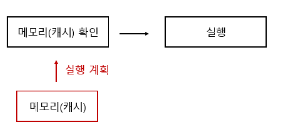
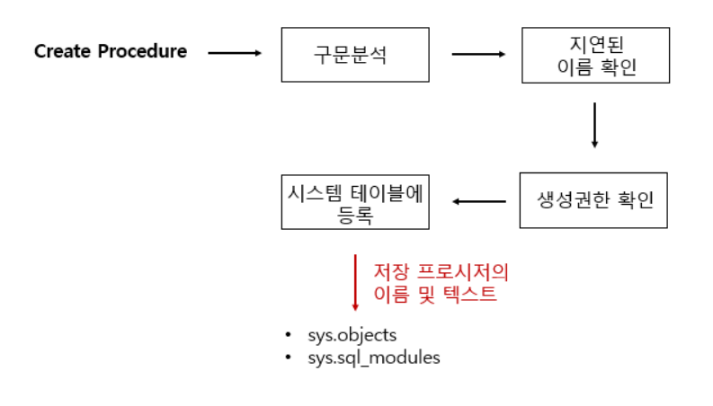
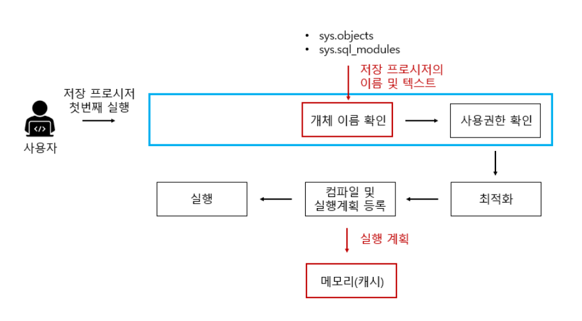

# Stroed Procedure

출처

- https://velog.io/@sweet_sumin/%EC%A0%80%EC%9E%A5-%ED%94%84%EB%A1%9C%EC%8B%9C%EC%A0%80-Stored-Procedure

- https://siahn95.tistory.com/entry/DBMSSQL-%EC%A0%80%EC%9E%A5-%ED%94%84%EB%A1%9C%EC%8B%9C%EC%A0%80Stored-Procedure%EB%9E%80

- https://devkingdom.tistory.com/323

> 1. Stored Procedure란?
> 2. sql vs stored procedure
> 3. stored procedure의 장점
> 4. stored procedure의 단점


## 1_Stored Procedure란?

> - Stored Procedure는 **일련의 쿼리**를 마치 **하나의 함수**처럼 실행하기 위한 쿼리의 집합이다
> - 데이터베이스에 대한 일련의 작업을 정리한 절차를 RDBMS에 저장한(지속성) 것으로 영구저장모듈(Persistent Stroage Module)이라고 불린다.

- 여러 쿼리를 하나의 함수로 묶은 것
- SQL Server에서 제공되는 프로그래밍 기능. 쿼리문의 집합
- 어떠한 동작을 일괄 처리하기 위한 용도로 사용
- 자주 사용되는 일반적인 쿼리를 모듈화
- 각 데이터베이스 내부에 저장


## 2_sql vs stored procedure

#### 1-1) SQL의 작동 방식


```sql
SELECT name FROM userTbl;
```

만약 위와 같은 쿼리문을 실행했다고 가정하자

**구문분석** : 

- 구문 자체에 오류가 없는지 분석을  한다. 만약 오타가 있을 경우 에러메시지를 띄운다.


**개체 이름 확인**

- userTbl이라는 테이블이 현재 데이터베이스에 있는지 확인
- 있으면 그안에 name이 있는지 확인하는 단계


**사용권한 확인**

- 사용자가 권한이 있는지 확인


**최적화**

- 해당 쿼리문이 가장 좋은 성능을 낼 수 있는 경로를 결정
- 인덱스 사용여부에 따라 경로가 결정
- 위 쿼리문은 정체 데이터를 가져옴 => 테이블 스캔 or 클러스터 인덱스 스캔이 될 것 


**컴파일 및 실행 계획 등록**

- 해당 실행계획 결과를 메모리에 등록한다.
- 컴파일 된 결과를 실행하낟.


#### 1-2) 동일한 SQL문을 실행할 경우



**메모리 캐시**

- 저장된 실행 계획을 메모리(캐시) 확인을 하게 되고 바로 실행하게 된다.


#### 2-1) Stored Prosedure 정의 작동방식



**구문 분석**

- SQL과 동일


**지연된 이름 확인 (defered name resolution)**

- stored procedure의 경우 procedure를 정의하는 시점에서 **개체(ex_ table)의 존재 여부와 상관 없이 정의가 가능**하다
  - 해당 테이블의 존재 여부를 **프로시저의 실행 시점에서 확인**하기 때문에 
    해당 테이블의 존재 여부와 상관없이 프로시저는 정의할 수 있다.
- 테이블의 열이름이 틀리면 오류가 발생된다.
- 실무에서 없는 테이블을 프로시저 정의에 사용하는 등의 실수를 할 수 있으니 주의하자


**생성권한**

- 사용자가 저장 프로시저를 생성할 권한이 있는지 확인


**테이블 등록**

- 저장 프로시저의 이름과 코드가 관련 시스템 테이블에 등록되는 과정


#### 2-2) Stored Prosedure 첫번째 실행



- 구문분석은 정의 단계에서 끝났기 때문에 구문분석을 하지 않는다

- 실제로 해당 개체가 유효한지를 개체 이름 확인 단계에서 진행
- 즉 stored procedure의 실행 시에만 해당 개체가 존재하면 된다.
- 이후 사용권한, 최적화컴파일 등등 sql과 같이 실행하게 된다.


#### 2-3) Stored Prosedure 두번째 실행


- 메모리에 있는 것을 그대로 가져와 재사용하게 되어 수행시간이 단축되게 된다.


#### 3) sql과 stored procedure의 차이점?

**sql**

```sql
SELECT * FROM userTbl WHERE name ='이승기';
SELECT * FROM userTbl WHERE name ='성시경';
SELECT * FROM userTbl WHERE name ='은지원';
```

- 해당 쿼리는 WHERE 조건의 값만 다르다
  - 하지만 일반 쿼리는 글자 하나라도 다르면 다른 쿼리라고 인식하게 된다.
  - 그렇기 때문에 매번 최적화와 컴파일을 다시 수행해야한다.


**store procedure**

```sql
CREATE PROC select_by_name
	@Name NVARCHAR(3)
AS
	SELECT * FROM userTbl WHERE name =@name;
```

```sql
EXEC select_by_name '이승기';
EXEC select_by_name '성시경';
EXEC select_by_name '은지원';
```

- 이렇게 하면 첫번째 이승기를 검색하는 과정에서만 최적화 및 컴파일을 수행하고 나머지는 메모리(캐시)에 있는 것을 사용하게 된다.
- 즉 자주 쓰는 쿼릴라면 일반 쿼리를 여러개 날리는 것 보단 stored procedure를 쓰는게 성능 적인 측면에선 효과적일 수 있다.


## 3_Store Procedure의 장점

**1) 처리 시간 감소**

- 두버째 실행부터는 캐시(메모리)에 있는 것을 가져와서 사용하기 때문에 속도가 빨라진다.


**2) 네트워크 부하 감소**

- 보통 쿼리는 네트워크를 타고 DB에 전달된다.
- 저장 프로시저를 사용하면 **단 한번의 요청으로 여러 SQL문을 실행**할 수 있으므로 네트워크에 대한 부하를 줄 일 수 있다.


**3) 데이터 무결성 유지**

- 애플리케이션 측에서 특정작업을 해주지 않아도, DB의 데이터 앞뒤가 맞게 될 수 있다. 


**4) 편리한 유지보수 및 개발 업무와의 구분**

- DB관련 작업이 필요한 일이 있을 때 해당 저장 프로시저를 수정하거나 교체만 해주면 된다.
- 수정과 교체를 통해 DB업데이트가 이루어지면 WAS를 껐다 키거나 등의 추가적인 조치 없이 바로 서버에 반영되어 편리하다.
- 또한, 저장 프로시저는 DB 서버에 저장되어 API처럼 제공된다. 따라서 애플리케이션을 구성하는 소스코드와 구분이 될 수 있다.


**5) 절차적 기능 구현 가능**

- SQL문에 IF나 WHILE과 같은 제어 문장을 사용할 수 있어서 애츨리케이션 소스 코드를 줄일 수 있다. 


## 4_stored procedure의 단점

**1) DB 확정 어려움**

- 서비스 사용자가 많아짐 => 트래픽 증가 => 서버의 수를 증가
- 하지만 stored procedure를 사용하면 그러한 DB의 수를 늘리는 것이 어려워 지고 DB교체는 더 힘들어진다. 

- 따라서 트래픽의 부하를 DB에서 다 받기 때문에 분산해주지 못해 DB서버사 죽을 위험도 있다.


**2) 단가 상승**

- 자바보다 DB를 더 잘 하는 개발자의 단가가 더 세다
- 따라서 기업입장에서는 WAS에 부하를 주고 간단한 프로세스만 DB쪽으로 주는 것이 경제적으로 이득이다.


**3) 최적화 부분에서 문제**

- 첫번째 SP를 최적화를 시키고 나서 메모리에 저장을 시킨다.
  - 즉 인덱스의 사용여부가 결정되어 버린다.
- 만약 첫번째 수행때 데이터를 몇건만 가져오도록 파라미터설정
  => 하지만 두번째 수행에서 많은 건수의 데이터를 가져오도록 파라미터가 들어간다면??
  => 다시 컴파일을 시켜주어야 성능에 문제가 없다


**4) 데이터 분석의 어려움**

- 개발된 프로시저가 여러 곳에서 사용 될 경우 수정했을 때 영향의 분석이 어렵다(별도의 Description 사용).
- 배포, 버전 관리 등에 대한 이력 관리가 힘들다.
- APP에서 SP를 호출하여 사용하는 경우 문제가 생겨도 해당 이슈에 대한 추적이 힘들다(별도의 에러 테이블 사용).


https://siahn95.tistory.com/entry/DBMSSQL-%EC%A0%80%EC%9E%A5-%ED%94%84%EB%A1%9C%EC%8B%9C%EC%A0%80Stored-Procedure%EB%9E%80

> 여러 블로그와 커뮤니티의 글들을 보며 최근에는 저장 프로시저를 점점 줄여나가는 추세인 것을 알 수 있었다.
>
> 그래도 아예 쓰지 않는 것은 아니고, 적재적소에 사용할 줄 알아야 하는 것 같다.