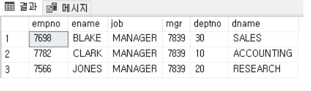
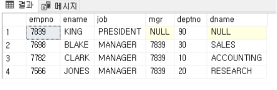

# cs_10_SQLGrammar

- https://rachel0115.tistory.com
- https://gent.tistory.com/376

> SELECT - 조회

```sql
-- USE '스키마명' SQL을 사용할 스키마를 지정할 수 있음
USE market_db

-- 컬럼명, 테이블명
SELECT member_id, name FROM member;

-- 두개는 동일한 기능
SELECT * FROM market_db.member;
SELECT * FROM member; -- USE문을 사용해줄 경우 이렇게 사용할 수 있음
```


> WHERE

```sql
-- mem_number 컬럼 값이 5이상인 데이터 조회
select * from member where mem_number >= 5;
```


> BETWEEN

```sql
-- 사이 값 가능 ==> index는 사용 불가능
select * from member where height between 160 and 165;
```


> IN ==> 여러 값 매칭

```sql
-- 밑에 같은 쿼리문이다.
select * from member where addr IN ('경기','전남','경남');
select * from member WHERE addr = '경기' AND addr = '전남' AND addr = '경남';
```

- IN연산자는 동등비교 =를 여러번 수행하는 효과를 가짐. 인덱스를 최적으로 활용할 수 있다.


> LIKE - 문자열 일부 글자 검색

```sql
-- 불로 시작하는 4글자
select * from member where mem_name like '불___';

-- 블로 시작하는 글자
select * from member where mem_name like '불%';

-- 불이 들어간 모든 데이터
select * from member where mem_name like '%불%';
```

- _ : 한글자
- %: 몇 글자든


> 서브쿼리
>
> - group by  + 서브 쿼리

```sql
-- 사람2의 키보다 큰 member
select mem_name, height
	from member
	where height > (select height from member where mem_name like '사람2');
```

```sql
-- REST_INFO 테이블에서 
-- ""음식종류별"" 로 ""즐겨찾기수가 가장 많은 식당"" 
select FOOD_TYPE,REST_ID,REST_NAME,FAVORITES
from REST_INFO
where (FOOD_TYPE,FAVORITES) in -- max인 애들 뽑았으면 그중에서 FOOD_TYPE,FAVORITES와 같은 애들
	(select FOOD_TYPE,max(FAVORITES) -- 그룹마다 max인 애를 가지고 오는 것
      	from REST_INFO
      	group by FOOD_TYPE)

-- 대여 시작일을 기준으로 2022년 8월부터 2022년 10월까지 총 대여 횟수가 5회 이상인 자동차들
select 
    month(START_DATE) as MONTH,
    CAR_ID,
    count(*) as RECORDS
    
from CAR_RENTAL_COMPANY_RENTAL_HISTORY
where (date_format(START_DATE,"%m") between 8 and 10) and
        CAR_ID in { -- 8~10에서 5회 이상인 애들 뽑는 것 ==> 걔랑 id가 같은 애들 뽑아냄
        select CAR_ID from CAR_RENTAL_COMPANY_RENTAL_HISTORY
            where (date_format(START_DATE,"%m") between 8 and 10)
        group by CAR_ID
            having count(CAR_ID)>=5
        } 
group by MONTH,CAR_ID
order by MONTH, CAR_ID desc

```

- where에 **서브쿼리 + group by**


> ORDER BY - 조회된 데이터를 정열

```sql
-- 정렬
select * from member
	where height >= 164
	order by heught desc, debut_date
```

- where 절 다음에 나와야 한다.
- ASC: 오름차순
- DESC : 내림 차순
- 콤마로 여러 정렬 조건 지정가능


> LIMIT - 출력 개수 제한

```sql
select * from member
	LIMIT 3; -- 상위 3건만 조회

select * from member
	LIMIT 3, 2;			-- 3번쨰 데이터부터 2개
	LIMIt 2 OFFSET 3;	 -- 위와 동일

-- FOOD_PRODUCT 테이블에서 가격이 제일 비싼 식품 가져오기
-- PRICE로 순서 + 상위 하나만 뽑기
select PRODUCT_ID,
        PRODUCT_NAME,
        PRODUCT_CD,
        CATEGORY,
        PRICE
from FOOD_PRODUCT
order by PRICE desc
limit 1
```


> DISTINCT - 중복 데이터 제거

```sql
select distinct addr from member
```


> GROUP BY - 그룹화
>
> \+ HAVING사용하기

```sql
-- job이 같은 데이터를 그룹으로 묶음
-- 그룹핑된 데이터를 mem_id와 amount의 합계를 구함
select job, SUM(amount) as "합계"
	from buy
	group by job
	order by job;
	
select genre, AVG(price) as "평균"
	from library
	group by genre
	
-- HAVING사용
-- USER가 재구매한 PRODICT 출력하기 
-- ==> USER_ID, PRODUCT_ID 그룹화(USER먼저 그룹화한 뒤 ==> PRODUCT그룹화 함)
-- ==> 그럼 여기서 PRODUCT COUNT해주고 2개이상인 것 출력 ==> 즉 재구매한 것
select 
    USER_ID,
    PRODUCT_ID
from ONLINE_SALE
    group by USER_ID, PRODUCT_ID
        having count(PRODUCT_ID)>=2
    order by USER_ID, PRODUCT_ID desc
```


> data_format사용하기

```sql
-- 3월인 사람 뽑아내기
where date_format(DATE_OF_BIRTH,'%m') = '03'

-- 여자, 폰번호 존재, 3월인 사람 뽑아내기
    where date_format(DATE_OF_BIRTH,'%m') = '03' and
            TLNO is not null and
            GENDER = 'W'
```


> string 부분 자르기 - left, right,mid

```sql
-- A110230 ==> A1으로 바꾸기 
-- left(PRODUCT_CODE,2) = 왼쪽의 2자리만 뽑아내기
select 
    left(PRODUCT_CODE,2) as CATEGORY,
    count (*) as PRODUCTS

from PRODUCT
group by CATEGORY
order by CATEGORY
```


> string 합치기 - **concat**

```sql 
-- 게시글 3회 이상 쓴 사람 뽑아내기
select u.USER_ID,
        u.NICKNAME,
        case
        when u.STREET_ADDRESS2 is null then concat(u.CITY,' ',u.STREET_ADDRESS1)
        else concat(u.CITY,' ',u.STREET_ADDRESS1,' ',u.STREET_ADDRESS2 ) end as' 전체주소',
        concat(left(TLNO, 3),'-', mid(TLNO, 4,4),'-', right(TLNO,4)) as '전화번호'
       	-- 윗 부분확인 concat, mid 사용
    
from USED_GOODS_BOARD as b
join USED_GOODS_USER as u
    on b.WRITER_ID = u.USER_ID
group by u.USER_ID
    having count(u.USER_ID)>=3
order by u.USER_ID desc
```


## 집계 함수

- SUM

- AVG

- MIN

- MAX

  - ```sql
    -- 코드를 입력하세요
    -- max는 1의 값을 뽑아내기 위한 방법 true
    -- max활용 방법 ==> 참거짓 사용시 1을 뽑아내는 방법으로 max를 사용할 수 있음
    select CAR_ID,
            case
            when max('2022-10-16' between START_DATE and END_DATE) then '대여중' -- 이부분
            else '대여 가능' end as 'AVAILABILITY'
    from CAR_RENTAL_COMPANY_RENTAL_HISTORY
    group by CAR_ID
    order by CAR_ID desc
    ```

- COUNT : 행의 개수를 셈
  - COUNT(*) NULL값이 포함되어 있어도 카운트
  - COUNT(phone1) phone1 값에 NULL이 있을 경우 카운트 안함

- COUNT(DISTINCT) : 행의 개수를 셈

- ROUND(값, 원하는 곳): 반올림

- TRUNCATE(값, 원하는 곳) : 버림


> HAVING - 그룹 조건

```sql
-- team_id를 기준으로 그룹화
-- 그룹화된 데이터를 기준으로 amount*price 합계가 1000이상인 그룹만 남김
-- 조건에 걸러진 그룹에서 amount*price의 합계를 조회

select SUM(amount*price) as "총 금액"
	from buy
	group by team_id
	having SUM(amount*price) >= 1000;
```


## JOIN

> - INNER JOIN : 기준 테이블과 조인 테이블 **모두 데이터가 존재해야 조회됨**
> - OUTER JOIN : **기준 테이블에만 데이터가 존재**하면 조회

> INNER JOIN

```sql
SELECT a.empno
     , a.ename
     , a.job
     , a.mgr
     , a.deptno
     , b.dname
  FROM emp AS a
 INNER JOIN dept AS b
    ON a.deptno = b.deptno 
```

- ON은 조건문
- WHERE => 추가 조건문




> LEFT OUTER

```sql
SELECT a.empno
     , a.ename
     , a.job
     , a.mgr
     , a.deptno
     , b.dname
  FROM emp AS a
  LEFT OUTER JOIN dept AS b
    ON a.deptno = b.deptno
```




## case when

> 새로운 열을 생성하는 경우

```sql
select case
		when 기존 열 = 조건1 then '값 1'
		when 기존 열 = 조건2 then '값 2'
		(else '값N')
		end as 새로운 열
	
```


> 열을 집계하는 경우 (집계함수와 함께 사용)
>
> - 집계 열에 집계함수를 적용

```sql
select 집계함수 case when 기존 열 = 조건 then 집계열 as 새로운열
```


