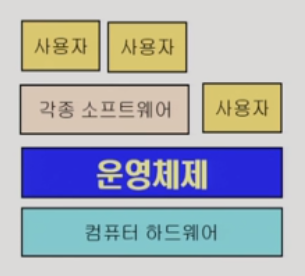
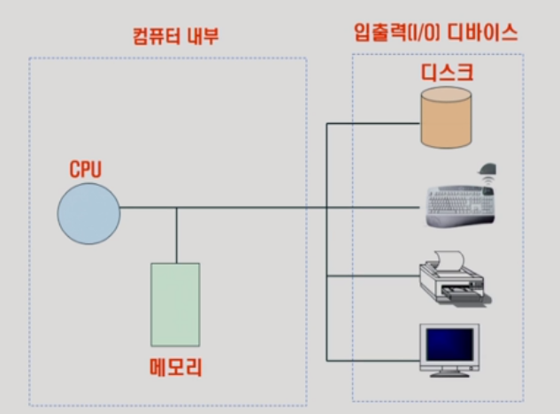
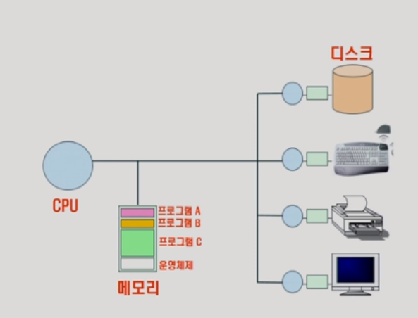
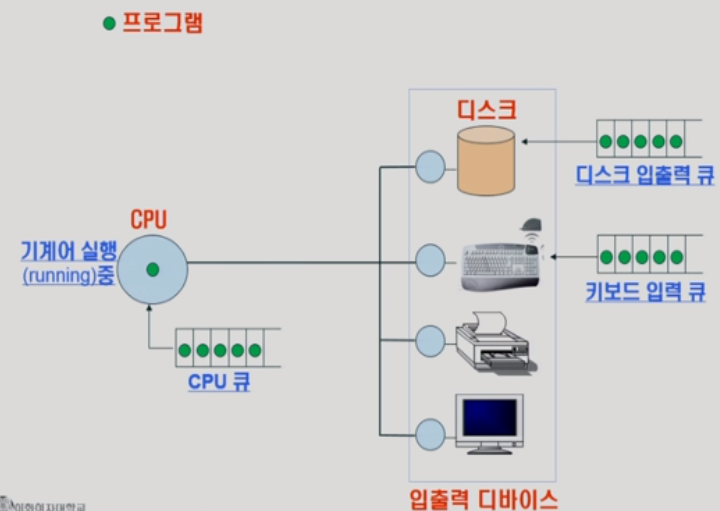

# 01. OS overview

### OS란?

- 컴퓨터 시스템 자원을 관리 ==> 효율을 높임 ==> 서비스를 제공
- 목적
  - 컴퓨터 시스템을 편리하게 사용할 수 있는 환경을 제공
    - 마치 자기 혼자 컴퓨터를 사용하게 끔 환경을 제공
    - 이유: cpu가 굉장히 빠르기 때문에(마치 동시에 처리하는 듯한 느낌을 준다)
    - 음악을 들으면서 웹서핑하면서 동영상보면서 등등을 동시에 할 수 있게끔 만든다.
  - 시스템 자원을 효율적으로 사용(resource)
    - 자원? ==> cpu , 메모리, I/O 장치(입출력 장치) 등 
      			==> 효율성, 형평성(지나친 불이익X for 사용자, 프로그램)
    - 메모리 ==> cpu에 작업 공간
      - 한정된 메모리에 프로그램이 동시에 돌아가게 되면 어떤 프로그램에게 얼만큼 메모리를 할당할 것인가? 라는 문제가 생기게 된다.
      - 얼만큼 올려야 효율적일까??
    - 

컴퓨터 구조

- 운영체제의 기능
  - 항상 실행되는 프로그램이다
  - 운영체제에서 핵심적인 부분 = kernel(메모리에 항상 상주)
  - 매 클럭마다 메모리에 있는 기계어를 읽고 실행시킨다.
  - IO는 각각을 담당하는 cup를 가지고 있다 ==> IO 컨트롤러
  - 그럼 cpu가 IO 컨트롤러에게 물어보게 된다.
  - 즉 cpu의 작업공간은 메모리 ==> 그래서 cpu가 IO에 직접 접근을 하지 않는다
  - cpu스케줄링
    - 어디에 할당을 할지
    - 일정시간이 지나면 프로그램에게 권한을 가져온다
  - 디스크 스케줄링
    - 디스크에 들어온 요청을 어떤 순서로 처리할지
  - 인터럽트, 캐싱
    - 캐싱: 메모리와 디스크사이에 속도차이가 난다
      - 똑같은 데이터를 또 불러올때 디스크까지 안가고 메모리에서 해결
    - 인터럽트: 
      - cpu은 IO controler에게 일을 부탁하고 다른 일을 하게 된다.
      - 그리고 나서 IO가 일을 다하면 cpu에게 알려주게 된다.
      - 그럼 하던일 바로 끝내고 interrupt가 있는지 확인하게 된다.
      - 그럼 다음 일이 있더라도 interrupt일을 하게 된다.

프로세스

- 실행중인 프로그램을 프로세스라고 부른다
- 운영체제는 큐를 만들어서 cpu가 어떤일을 할지 줄세워 놓는다.

