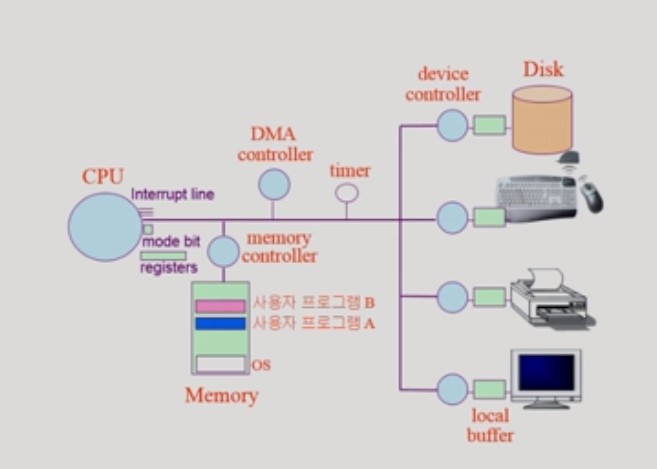

# 02 structure of computer sys

## 운영체제 의미

- 좁은 의미(커널)
  - 운영체제의 핵심 부분으로 메모리에 상주하는 부분
- 넓은 의미
  - 커널 뿐 아니라 각종 주변 시스템 유틸리티를 포함한 개념
  - ex) 파일 복사

## 운영체제의 분류

- 동시 작업 가능 여부
- 사용자의 수
- 처리방식

#### 동시작업

- 단일 작업
  - 한 명령이 끝나지 전에 다른거 수행 x
  - 지금은 없음
- 다중 작업
  - 동시에 두개  이상의 작업 처리

#### 사용자의 수

- 단일 사용자
  - MS-DOS, MS Windows

- 다중 사용자
  - Linux, UNIX, NT server

#### 처리방식

- 일괄처리(batch processing)
  - 작업 요청의 일정량 모아서 한번에 처리 ==> 요즘은 사용 안함
- 시분항(time sharing)
  - 현대에 사용한다
  - 시간을 조금씩 분할해서 쓴다.
  - interactive한 방식을 사용한다.
- 실시간(Realtime OS)
  - dead라인이 존재한다.
  - 꼭 그 시간안으로 일이 종료되어야 한다.
  - ex) 원자로/공장 제어, 미사일제어, 반도체 장비 등등
  - 종류
    - hard realtime sys
    - soft realtime sys ==> 시간을 어겨도 크게 타격이 없을 경우 약간은 봐줌

- 범용 운영체제()

- 용어
  - Multiprogramming
    - 메모리에 여러 프로그램이 동시에 올라가 있는 것
  - Multi-processor
    - CPU가 여러개 붙어 있음을 의미
    - clouding computing 등에서 사용

#### 운영체제의 예

- 유닉스(UNIX)
  - c언어
  - 최소한의 커널 구조
  - 복잡한 시스템에 맞게 확장 용이
  - 소스 코드 공개
  - 프로그램 개발에 용이

- DOS(Disk Operating System)
  - 단일작업만 가능했었음

- MS Windows

  - 여러 프로그램을 동시에 돌리려고 함

  - 따라서 초반에는 불안정하다는 단점이 있었음

  - 하지만 지금은 안정하다 어느정도?

    

### 운영체제의 구조

## System structure

#### 1. local buffer

- 각 디바이스의 작업공간

#### 2. mode bit

- 1 : 사용자 모드 : 사용자 프로그램 수행(제한된 기계어만 실행)
- 0 : 모니터 모드 : os 코드 수행

- 이렇게 나누는 이유

  - 사용자 프로그램의 잘못된 수행으로 다른 프로그램 및 운영체제에 피해가 가지 않도록 하기 위한 보호 장치이다
  - 보안을 해칠 수 있는 기계어가 있을 수 있음

  - interrupt, exception(권한이 없는 것이 넘어왔을 때)발생 ==> 하드웨어가 mode bit을 0으로 바꿈

  - 사용자 프로그램에게 cpu를 넘기기전에 mode bit을 1로 세팅한다.

#### 3. interrupt line

- interrupt가 있는지 항상 확인한다.
- 그 다음 기계어를 수행하기 전에 확인을 하게 된다.

#### 4. registers

- programe counter
  - 다음번에 실행할 메모리의 주소를 가지고 있음

#### 5. timer

- cpu에 사용권을 뺏어오는 것은 운영체제 혼자 할 수 없음
- 만약 어떤 프로그램이 cpu를 독점하게 된다면(무한루프) ==> timer가 cpu에게 인터럽트를 건다 ==> 그럼 다시 권한이 운영체제에게 넘어가게 된다. ==> 그럼 운영체제에서 어떤 프로그램을 cpu에게 넘겨줄지 결정한다.
- 일정시간 마다 interrupt를 보낸다

#### 6. I/O 디바이스

- 파일을 읽어오고 싶음

- 디스크를 관리하는 controller에게 부탁을 하게 된다

- cpu가 io에게 부탁하는 모든 것 = 특권명령으로 묶여 있다.

- 그래서 사용자 프로그램은 io한테 뭘 부탁할 수가 없음

- ##### 시스템 콜

  - 사용자 프로그램이 뭘 하고 싶음(io한테 부탁하고 싶음)
  - 근데 못함
  - 그래서 OS에게 해달라고 부탁해야함 = 시스템 콜
  - 그럼 이제 운영체제에게 cpu가 넘어가야 한다.
  - 그럼 이것을 어떻게 해야할까???
    - 프로그램이 interrupt를 걸어주면 운영체제로 권한이 넘어가면 된다.

- Device Controller

  - IO의 작은 cpu같은 것

#### 7. 인터럽트

- 현대 운영체제는 인터럽트에 의해 구동된다.

- 종류
  - 하드웨어 인터럽트 (Interrupt)
    - 하드웨어가 발생시킨 인터럽트
  - 소프트웨어 인터럽트 (Trap)
    - Exception : 프로그램이 오류를 범한 경우
      (프로그램이 이상한 짓을 한 경우)
      (즉 권한이 없는 것을 실행하려고 하는 경우)
    - System call: 프로그램이 커널 함수를 호출하는 경우

- 용어
  - 인터럽트 벡터
    - 해당 인터럽트의 처리 루틴 주소를 가지고 있음
  - 인터럽트 처리 루틴
    - 해당 인터럽트를 처리하는 커널 함수

#### 8. synchronous I/O, asynchronous I/O

- ##### synchronous I/O

  - cpu가 I/O요청을 함
  - 그리고 I/O에서 일어나는 작업과 cpu에서 일어나는 작업의 싱크가 맞아야 하는 I/O
  - I/O 요청 => I/O작업 완료 => interrupt 건다 ==> 이것이 synchronous I/O
  - 잠만 이렇게 하면 시간 오래걸리잖아??
    - 그래서 다른 프로그램에게 cpu를 주게 된다
    - 그래서 인터럽트가 걸리면 다시 그 친구에게 cpu를 주게 된다.

- ##### asynchronous I/O

  - synchronous처럼 작업이 끝날때 까지 기다리지 않음
  - 그냥 제어가 사용자 프로그램에 즉시 넘어감
  - 즉 결과를 보지 않고 일을 그냥 진행 시키는 것
  - 이게 가능??
    - 결과 몰라도 그 결과랑 무관한 일을 시작함
    - 그리고 결과 나오면 그거랑 관련된 일을 다시 시작함

#### 9. DMA(Direct Mnemory Access)

- 만약 interrput가 너무 많이 걸리면 어떻게 함??
  - 그럼 cpu한테 좀 비효율적이다
  - 아 그럼 DMA controller라는 것을 붙여 넣는다
  - 즉 interrupt가 너무 자주 거는것을 방지하기 위해서 필요함
- 그럼 DMA는 뭘 하는데??
  - 직접 메모리를 접근할 수 있는 controller
  - 즉 어느정도의 분량이 찼을때 DMA가 memory에 직접 copy를 함
  - 그다음에 interrupt를 한번 걸어준다.
  - 즉 너무 자주되면 짜증나니 한번에 모아서 세팅까지 해주고 interrupt를 걸어준다는 뜻이다

- block 단위로 인터럽트를 발생시킨다.

